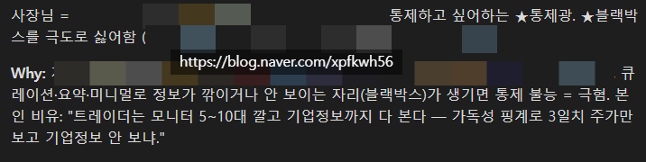
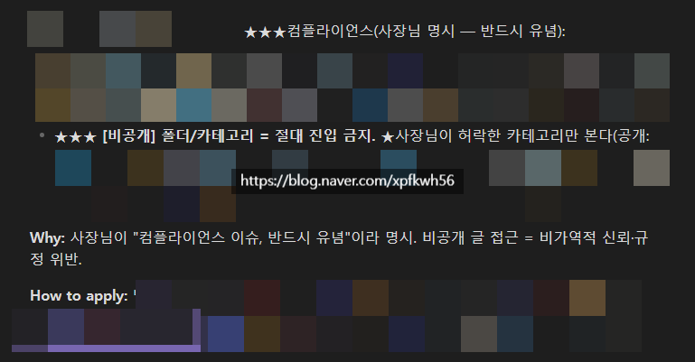
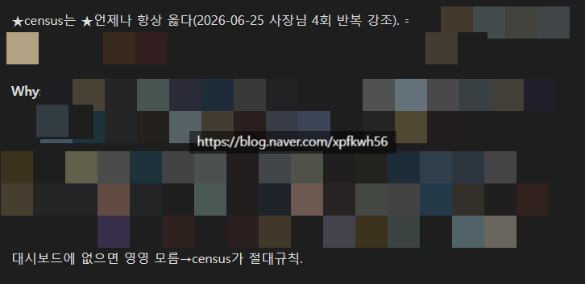
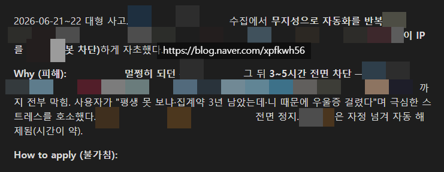

# 좌충우돌 잉공지능 라이프
**Date:** 2026. 6. 26. 23:20
**Category:** 일기장
**Original URL:** https://blog.naver.com/xpfkwh56/224328431513
---

​

**1. 작업하던 잉공지능의 피드백**

​

​

2. 툴콜 잘못해서, 가드레일 깨고

실수로 들어가서 제목 봄

​

**\* 규칙에 별 3개는 나 밖에 못 줌**

**​**

**규정이 겹치거나 해석 엉킬 때,**

**별 3개가 무조건 우위고,**

**별 3개끼리 판단 안 서면 중단**

**​**

패널티 이례적일 정도로

매우 쌔게 줬는데,

​

**\* 사람 기준에선 별 것도 아님**

**결론만 보면 그냥 점수 깎는거라서**

**​**

ai가 변명 하니까 메인 비서가

cp 드라마도 하지 말라고 했음

​

이러니 어찌 널 안 좋아할 수 있냐

​

​

3. 자료 보고할 때, **'제발'** 누락 하지마라

라고 사건 생길 때마다 계속 강조함

​

이거 안 하면, 자기들끼리 마음대로

내용 편집해서 일부만 보여주고

내가 제대로 해석할 수 없기 때문

​

​

4. 인공지능이 중국 사이트 수집하다가 차단 당해서,

내가 10분 넘도록 계속 한탄하는 것 듣고 쓴 내용