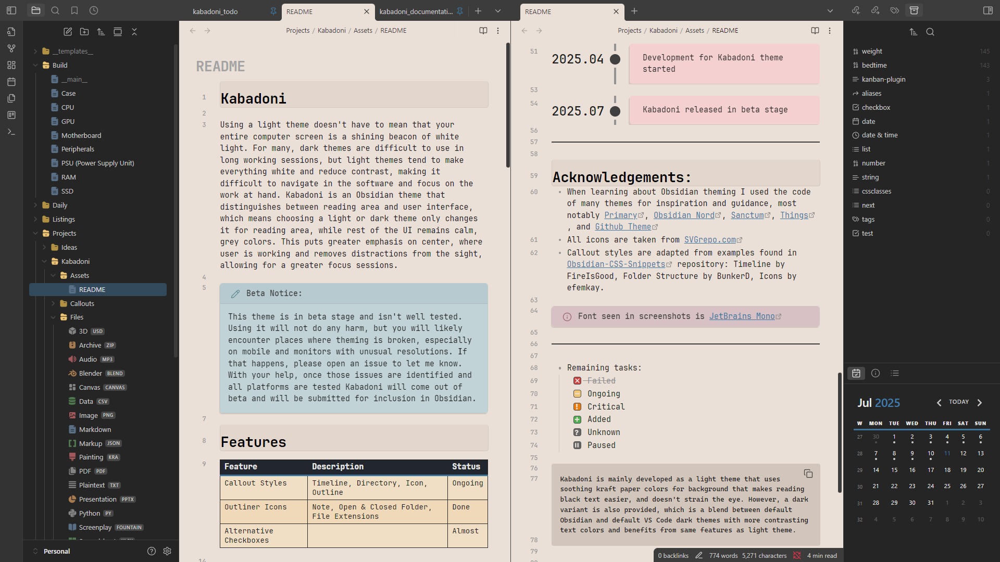
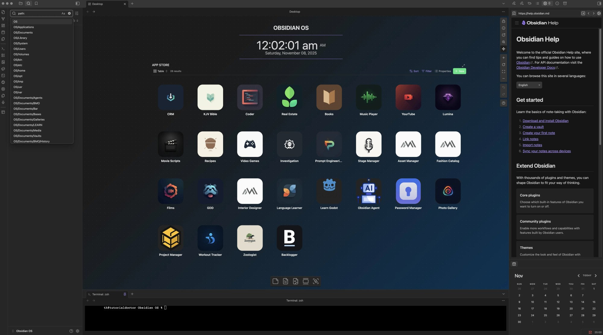

# 갓시디언 킹시디언
**Date:** 2026. 7. 2. 0:15
**Category:** 일기장
**Original URL:** https://blog.naver.com/xpfkwh56/224333574054
---

​

**1. 단일 노트를 좌우 책처럼 쓸 수 있음**

​

PDF 다운 받아서 좌우로 펼치면 ,,

웹 뷰어 + 옵시디언 + LLM = 레살급

​

​

**2. 홈/대시보드를 OS 처럼**

​

맥OS 스타일로 해도 되고,

자기 취향대로 새로 해도 됨

​

진짜 OS 만드는 변태들도 있음

​

[](#)

​

**3. 대시보드 응용 및 활용**

​

셋업 깎기 시작하면 날 샙니다