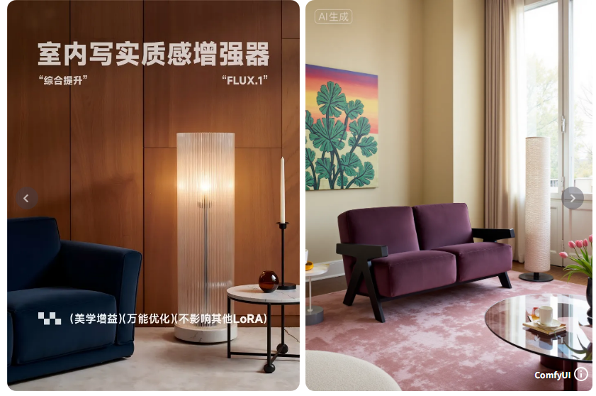
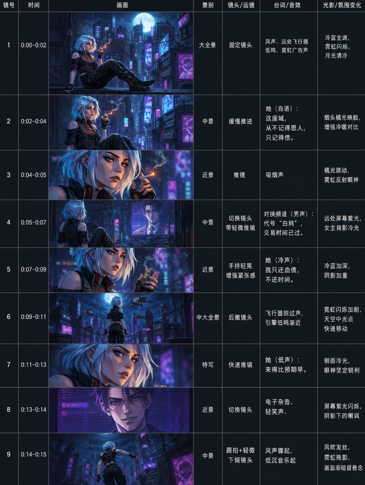
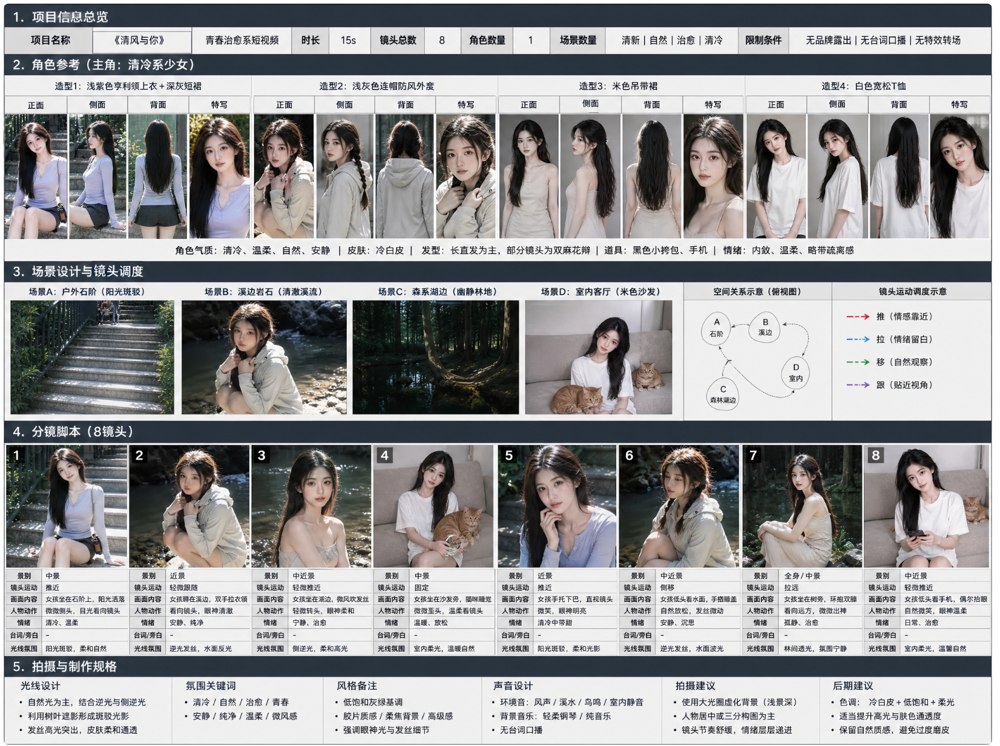

# 동양인 로라 구하는 방법
**Date:** 2026. 7. 2. 13:48
**Category:** 일기장
**Original URL:** https://blog.naver.com/xpfkwh56/224334125966
---

**\* 로라가 무엇이고, ComfyUI 를 사용할 때**

**로라가 있으면 어디에 쓸 수 있나? 는 생략함**

​

<https://civitai.com/models>

[**AI Models | Civitai**

Browse thousands of free Stable Diffusion & Flux models, LoRAs, checkpoints, and embeddings. The largest collection of AI image generation resources.

civitai.com](https://civitai.com/models)

​

**1. Civitai**

​

생성형 이미지, 특히 로컬에 관심이 많으면

한 번은 들어봤을 수밖에 없는 커뮤니티인데

현실적으로 가장 자료가 많지만 단점이 있음

​

​

1) 메인스트림이 서양권이라,

동양인 자료는 찾기 어렵다

​

**2) 너무 초보자 콘텐츠밖에 없다**

​

대강 이렇게 돌아간다, 라는 느낌을

익히기에는 좋고 소스도 많지만

​

조금만 **깊이 있게** 하려고 하면 막힘

​

동양인/서양인은 **골격** 자체가 다르고,

서양인을 만드는 것은 아주아주 쉽지만

​

동양인을 만드는 것은 **'굉장히'** 어려움

​

실상 AiMetatron 에서 제작한 것 외에는

공수하는 것이 불가능에 가깝다 봐야 됨

​

<https://www.liblib.art/>

[**LiblibAI-哩布哩布AI - 中国领先的AI创作平台**

一键使用顶尖视频/图片模型 图片模型 视频特效 发现灵感 工作流

www.liblib.art](https://www.liblib.art/)

​

**2. 그래서 리블리블을 같이 봐야 좋음**

​

1) 먼저 Civitai 에 있는 다양한 워크플로우들로

각 노드가 어떻게 작동하고, 그 원리가 무엇인가?

​

같은 일반론을 습득한 다음에, 특정 소스들을

직접 돌리면서 감을 잡되 기본적으로 로라를

중화권에 있는 것 기반으로 쓰는 것이 유리함

​

​

2) 이렇게 검색하면,

​

​

인테리어 로라도 나오고,

​

​

타임랩스 시나리오 콘티 로라도 있고,

​

​

상업용 시안도 나오고,

​

​

**시댄스** 카피한 것도 볼 수 있음

​

이걸 손으로 안 깎고, 모든 경우의 수 경로를

전부 미리 다 만들어놨으면 그게 시댄스 임

​

3) 따거들이 보통 리블리블에 있는 무료,

​

또는 유료 모델들 결제해서 그걸 실제로

도우인이나, 알리에 올려서 쓰기 때문에

​

알리 ↔ 리블리블 왔다 갔다 하면서,

저 사람이 이걸 써서 만들었구나

저걸 써서 만들었구나 역설계 가능

​

리블리블에 없으면, 대개 디코에 있는데

결제로 들어가는 것은 효율이 좋지 않고,

​

내가 **'창작자'** 지위를 얻어서,

그 그룹에 끼는 것이 가장 좋음