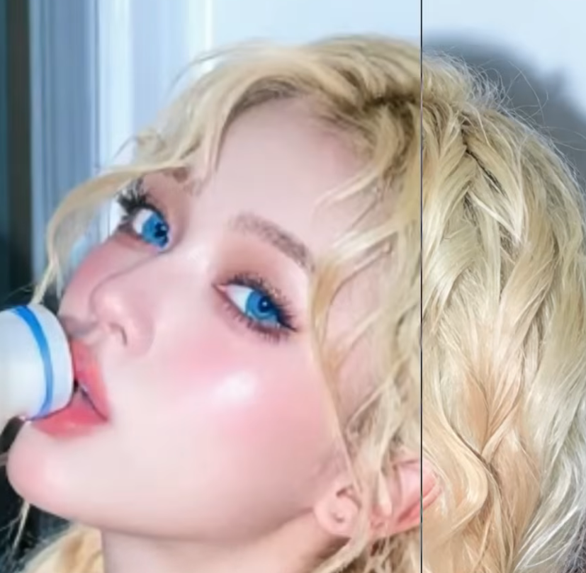
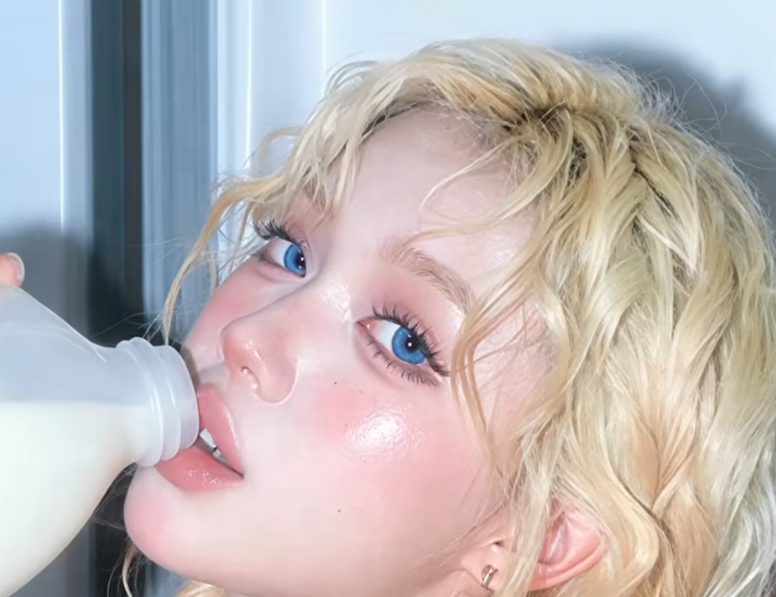

# 실용적인 ComfyUI+Vision 기술들
**Date:** 2026. 7. 2. 14:10
**Category:** 일기장
**Original URL:** https://blog.naver.com/xpfkwh56/224334151107
---

<https://youtu.be/rmp8z3svfco?si=0NtJ3NAkbVYwTOOy>

​

1. SeedVR2 라는 실상 정점에

가까운 업스케일링 기술이 있었음

​

​

왼 = 업스케일 전

오 = 업스케일 후

​

​

위에 있는 이미지를

업스케일 하면,

이 사진처럼 바뀜

​

딱 봐도 **'안 비쌀 수가 없겠죠?'**

**​**

**\* 비싼 카메라 없어도 가능**

**다만 좋은 컴퓨터가 있어야 함**

​

이미지는 SeedVR2

​

<https://youtu.be/3EA-PzOxk-0?si=4X0pJ3TgiafyZZ8Z>

​

영상은 FlashVSR 쓰면 되었음

​

스케일링 기술은 26년 2분기 기점으로

갑자기 엔비디아에서 차력쇼를 시작해서,

​

원래 몇 **'분'** 씩은 그래도 걸렸는데,

이제 이게 **'초'** 단위로 바뀌어서 격변중

​

16k 영상을 **'초'** 단위로 스케일링 함

​

<https://youtu.be/sM9uXdg9QyE?si=t-i96uxjQuXRgNcq>

​

2. **Try-On** 이라는 기술 임

​

쉽게 말하면 **옷 갈이입히기** 임

​

이미 서비스도 많이 되고 있어서,

찾으면 이거는 많이 금방 금방 나옴

​

<https://youtu.be/KDU9uXCS9SU?si=pk9MU1O2mXVzrva->

​

3. 영상 정점 모델이라고 할 수 있는 시댄스 임

​

**\* 정확히는, 저 기능이 시댄스 밖에 안 됨**

**전 세계에서 유일하게 할 수 있다 = 정점**

**​**

<https://youtu.be/0aMysJ_mSos?si=2qto17_2iHPcoez_>

​

이미지는 GPT 2.0 이 제일 좋고,

시댄스 를 직접 사용하거나 아니면

​

**\* 단, 단가가 안 나올 확률 높음**

**​**

시댄스 기술을 **매우매우** 열심히

배워서 깎고 깎으면 활용할 수 있음

​

<https://youtu.be/a6oyiY6wwDA?si=k8ERqrI33XMwjaHz>

​

이렇게 섞어버리는 경우에도 무시무시함

​

4. 생성형 영상, 이미지 기술이 있으면

대개 **어지간하면** 취업이 안 되기 어렵고,

​

아마 무엇보다 그 기술을 잘 깎아놨다면

본인이 취업을 할 생각이 없을 확률 높음