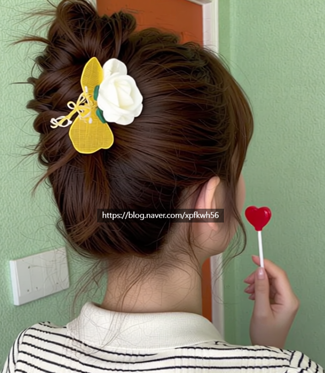
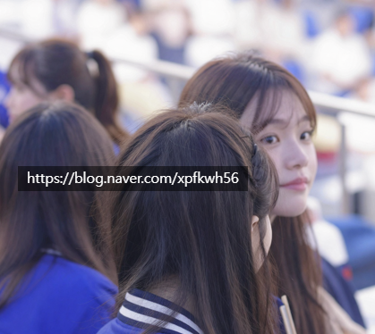
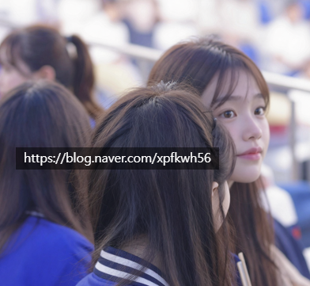
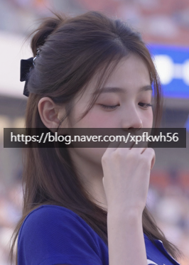
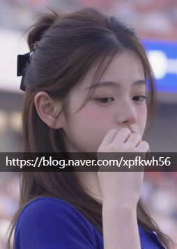
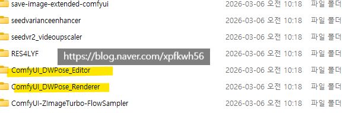

# 노상 해봐야 된다고 하는 이유
**Date:** 2026. 7. 9. 19:59
**Category:** 일기장
**Original URL:** https://blog.naver.com/xpfkwh56/224341781688
---

1. 제가 예전에 장인정신을 갖고

열심히 VLM 깎았을 때 이야기임

​

**2. 랜덤한 과일 이미지**

**100장이 있다고 가정함**

​

여기엔 수박, 사과, 메론, 딸기, 등

다양한 과일들이 섞여 있는 상태임

​

단, 1개 이미지에는 오직 1개의

과일만 있다는 것이 일단 규칙임

​

**3. 랜덤한 과일 이미지 100장을**

**사과는 사과끼리, 포도는 포도끼리**

**이렇게 묶으려면 어떻게 해야할까?**

**​**

4. 이 문제는, **'과일 문제'** 가 아님

​

**비전 임베딩 모델** 이라는 것이 있음

​

비전 임베딩 모델은 이미지를

벡터로 변환하여, 변환된 벡터들의

특정 값을 구하고, 중심점에서

거리가 너무 먼 이미지를

수학적으로 찾아내는 기계임

​

쉽게 말하면, **얼마나 비슷함?**

이라는 것을 찾게 하는 프로그램임

​

**\* 임베딩 방식도 천차만별**

​

5. 내가 VLM 로 했던 작업은 다음과 같음

​

여성의 **'외면적 아름다움'** 을

어떻게 하면 기계적으로

정밀하게 측정할 수 있을까?

​

아주 쉽게 말하면,

**'얼평 프로그램'** 을 만들고 싶었음

​

**6. 그래서 내가 처음 떠올린**

**아이디어는 다음과 같음**

​

1) 내가 **'아름답다'** 라고 인식하는

여성들의 이미지를 매우 많이 수집함

​

2) 그리고 **'내 사진'** 도 많이 수집함

​

3) 그리고 두 사진을 비교해서,

내가 아름다움에 가까운지, 아닌지

수치적으로 판단하면 된다고 생각함

​

예를 들어보겠음,

​

장원영 이미지가 1장 있음

내 이미지가 1장 있음

​

둘을 비교함

​

장원영이랑 내 싱크로율이 0점 나옴

​

그럼 장원영이 **'아름다움'**

의 벤치라고 가정할 때,

​

나는 이진적 관점에서 볼 때

아름답지 않다고 할 수 있고,

**​**

구체적으로 **'얼마나 덜 아름다운가?'**

라는 것을 수치로 판단할 수 있음

​

7. 일단 여기서 문제가 발생함

​

장원영 이미지 1장,

내 이미지 1장

​

이렇게 해서는 **믿을 수 없음**

​

가능하면 많은 이미지가 필요하고,

그 이미지가 노이즈가 없다는 가정 하에

많으면 많을수록 신뢰할 수 있을 것임

​

그래서 내가 한 작업은 다음과 같음

​

어떤 이미지가 있을 때,

정확히 **'얼굴'** 부분만 크롭함

​

**\* 아무튼 했습니다**

​

그리고 그 얼굴 부분만 크롭해서,

서로 이미지를 비교하기 시작했음

​

8. 여기서 또 문제가 발생함

​

장원영이 **'진짜'** 아름다움의

유일한 지표로 볼 수 있냔 것임

​

카리나도 예쁘고,

장원영도 예쁜데

​

장원영 싱크는 낮지만

카리나 싱크는 높다면?

​

**그럼 이 사람도 예쁜 사람임**

​

그래서 카리나 이미지도 가져오고

더 많은 사람 이미지도 가져다 비교함

​

9. 여기서 서론에 말했던 문제가 생김

​

**이미지야 어떻게든 가져온다고 치는데,**

​

대체 얘가 카리나(사과)인지,

장원영(포도)인지 나눠줘야 됨

​

그래서 내가 풀었던 문제는 다음과 같음

​

1) 임베딩은 정량적이고 빠르지만

정성적인 평가가 어렵다는 단점이 있고

​

2) VLM 모델은 비싸고 느리지만

정성적인 평가가 가능하단 장점이 있음

​

그래서 먼저 전체 이미지 100장이 있을 때,

그 이미지의 유사성만 갖고 묶음을 만들었음

​

이걸 클러스터링 이라고 하는데,

1, 2, 3개로 묶는 것이 아니라

​

**'이미지에 따라'** 동적으로 바뀌게 됨

​

만약 내가 장원영, 일반인A, B

이미지를 섞어놨으면

​

3개로 묶이고, 장원영/카리나

이렇게 섞어놨으면 2개로 묶임

​

10. 클러스터링 논리는 다음과 같음

​

**\* 결국 똑같**

**​**

1) 먼저 임베딩을 돌림

그럼 사과, 포도, 바나나

뭐 이런 식으로 묶이게 될 것임

​

근데 그게 틀렸을 수도 있음

​

사과인데 포도에 갔을 수도 있고,

포도인데 바나나에 있을 수도 있음

​

2) 그래서 2차 클러스터링을 심사함

​

100장의 이미지 중에서,

장원영 폴더에 20장 갔다고 가정함

​

그럼 20장을 서로 토너먼트 비교함

​

A vs B = A 승, 그러면 승자조

C vs D = C 승, 그러면 승자조

​

누가 가장 **'장원영'** 같은가 를 다툼

​

그렇게 해서, 가장 장원영 같은 이미지를

50% 중위값 대비 상위조, 하위조로 나누고

​

히스토그램으로 1~50% 구간까지 계산해,

가장 신뢰할 수 있는 %를 추출한 다음에

​

그 %값을 임베딩 앵커로 잡음

​

11. 그럼 상위조에서 가장 장원영 같은 값,

하위조에서 가장 덜 장원영 같은 값이 나옴

​

이걸 기준으로 하위조부터 다른 폴더와 비교함

​

**가장 장원영 같지 않은 이미지를**

**가장 카리나 같은 이미지와 비교함**

​

그럼 장원영 폴더에 있는 이미지 중,

카리나가 섞여들어올 때, 통합될 수 있음

​

임베딩은 cpu 연산이라 순식간인데,

VLM은 gpu 연산이라 더 오래 걸림

**​**

**12. 그럼 이 짓을 왜 함?**

​

100장 전체를 서로 1대1로 붙일 때 쓰는 계산식은,

모든 이미지 쌍의 수 = 조합 C(100, 2) 임

​

콜 수 = n(n−1)/2

​

C(100, 2) = 100 × 99 / 2 = 4,950

​

10장이면 45회

100장이면 4950회

1000장이면 499,500회

10000장이면 49,995,5000회

​

필요함

​

**\* 산수할 줄 알면 비용 계산할 수 있음**

**​**

5090 기준, 1회 호출에 내가 돌렸을 때

​

**\* VLM 도 지시에 따라 부담이 다름**

**가벼운 지시는 금방 끝나지만 당시 내가**

**설계한 값은 1회 호출에 약 1분 걸렸음**

​

10장이면 45분, 100장이면 4950분

이렇게 돌아가니까 숫자가 많아질수록

​

내 정의에 기준할 때,

더 **'정밀'** 해질 수는 있었겠지만

​

1천장만 되도 처리할 수가 없었음

​

그래서 가능한 **'가볍게'**, **'합의할 수 있는'**

수치를 찾아서 시도를 했던 것임

​

전체 이미지에서 얼굴을 찾는 논리랑,

얼굴에서 눈썹, 눈, 코, 입, 턱 위치 찾기,

​

같은 것은 같은 문제였기 때문에

계속 비슷한 방법론으로 접근했음

**​**

**13. 결과적으로 이걸 완성해서 뭘 했냐?**

**​**

그냥 나 혼자 재밌게 갖고 놀았음

​

크롭을 할 때도, 디테일이 있었음

​

인간 얼굴은 원형이기 때문에,

​

광선을 발사해서,

​

그 광선을 중심으로 이미지 상에서

경계값을 찾고, 그 경계값 대비로

다각형(원형태의) 모양을 크롭하게 됨

​

이 기술을 Raycast 라고 부름

​

**'경계'** 를 어디까지 잡을 것인가?

**'얼굴'** 의 규격은 어떻게 할 것인가?

​

같은 것들도 하면서 알게 된 것이고,

내가 쓴 이미지들에서는 가능했지만

​

모든 이미지에 된다곤 보장할 수 없음

​

VLM 이 얼굴을 **'읽는 방식'** 도 다름

​

무엇과 무엇이 닮았다고 할 때,

전체적인 인상으로 구분할 건지?

​

아니면 눈코입의 비율, 위치를 보는지?

색상을 보는지? 같은 값들이 다 다름

​

14. 이걸 갖고 놀다가, **나 요즘 AI 함**

​

하고 있었고 머리에 온통 그 생각 뿐이라

알음알음 수다를 떨 때 그 얘기만 했는데,

​

갑자기 번뜩, 이 생각이 들었음

​

> 이거 성형하고 싶은 사람한테
>
> 엄청 쓸모 있겠는데?

​

국내 배우, 아이돌, 연예인, 인플루언서,

연반인 이미지들이 1억장 있다고 가정함

​

거기서 나랑 가장 **'싱크가 높은'**

얼굴을 찾아서 나중에 성형을 할 때

​

그 사람을 기반으로 하게 된다면,

상담가서 **'예쁘게 해주세요'** 를 안 함

​

그리고 성형외과 의사랑 대화할 때도

3D 목업 이미지 파일로 목표값을 주면

​

훨씬 수술을 하기 전에 도움될 것 같았고,

​

내가 갖고 있었던 또 다른 기술이 있었음

​

**'로라'**

​

나는 생성형 이미지 기술이 있기 때문에,

특정 **'가상 인간'** 을 계속 만들 수 있었음

​

**여기서 두 가지 문제를 해결할 수 있었음**

​

1) 의사 입장에서는 정확한 기준이 생김

​

2) 고객 입장에서는 내가 나중에 성형하면

그래서 대충 어떤 얼굴이 되는지 볼 수 있음

​

**​**

이미 그 전부터, 실제 인간이랑

거의 비교하기 어려울 정도로

​

**\* 머리카락, 피부결,**

**안광, 이런 것들이**

**매우매우 어렵습니다**

**​**

질감을 내는 것은 할 수 있었고,

​

**\* 고주파, 저주파에 대한 이해로**

**열화하거나 올리거나 자유자재**

**​**

**​**

**Before**

**​**

​

**After**

​

​

**Before**

​

​

**After**

​

자동 보정 프로그램 같은 것도 완성해서,

​

**\* 아기 사진, 강아지 사진 찍는데**

**NICE 캡쳐가 안 찍히길래 개발했고**

**거기서 익힌 기술을 그대로 적용함**

**​**

써먹을 재료는 매우매우 많았음

​

​

15. 여러가지 있지만, 일단 하나만 설명하면

**​**

생성형 이미지는 **'비결정적'** 임

​

그래서 1도 단위로 각도 변화를 못 함

​

**\* 프롬프트 레벨로 불가**

**​**

근데 특정 이미지가 있을 때,

​

**만약 그 이미지를 온라인 게임에서**

**커스터마이징 하듯이 바꿀 수 있다면?**

​

openpose, dwpose,

SDPose, 사피엔스2

​

실상 실용성 있는 모든 모델을 다 뜯음

​

나는 당시에 ZIT 를 쓰고 있었기 때문에,

​

가장 호환성이 높은 Dwpose로

커스텀 노드를 개발해서 쓰기 시작했고,

​

**\* 노드 ↔ 에디터 통신구조**

**​**

ZIT 샘플러와 스케줄러가 개발팀에서 제시한

논문 측정치와 다르다는 것을 확인한 이후,

​

실제 개발할 때 사용한 학습 데이터 환경을

가장 정확히 반영할 수 있는 스케줄러랑

샘플러 로직을 다시 개발해서 그걸로 썼음

​

**\* 내 로라, 내 유즈 케이스에 딱 맞는**

​

**근데 아무리 해도 2차원 공간 내에서,**

**내가 구현한 에디터를 사용할 수 없었음**

​

그래서 sam3를 바탕으로

3D 모델링을 시작하게 되었음

​

이제 이미지가 있고, 내가 구현하고자

하는 기준이 있으면 그걸 바탕으로

​

머리 방향, 시선 표정, 손/손가락,

관절회전(FK) 등, 거의 대부분 됐음

​

이미지가 있으면, 그 이미지를 가지고

영상도 만들 수 있고 3D 모델도 뽑고,

​

이미지를 GUI 환경 내에서,

내가 자유롭게 편집할 수도 있었음

​

**\* Realtime Edit 아이디어 차용**

**​**

실시간으로 내가 어떤 사람 이미지 있다,

그 이미지에 점들이 찍혀있는데

​

그 점을 옮기면 그에 맞게 이미지 나오고,

버튼을 누르거나 휠을 올리면 이미지가

그 동향에 맞게 동기화 돼서 수정이 되었음

​

16. 옛날에 피부과 다닐 때, 알게 된

성형외과 의사한테 연락을 했음

​

내가 만든 것이 있는데 쓸모 있을 듯,

이라고 했는데 반응이 굉장히 좋았고

​

상담실장이랑 쪼인이 맞아서,

일부 고객들 중에 말이 통한다 싶으면

​

서로 불편할 이야기는 익스큐즈 한다는

조건 하에서 내가 서비스를 제공 해줬음

​

**\* 제가 이 이야기를 한다는 것은,**

**앞으로 그 업종을 할 일이 없단 뜻임**

​

처음부터 무얼 하려고 시작한 것이 아니라,

하다보니까 상업적인 쓰임이 떠올랐고

​

배워서 한 것이 아니라, 하면서 배워 했음

​

피차 막히기 전까진 내가 뭘 알아야 되냐

이런 것도 대부분 알 수가 없기 때문에,

​

결국 해보기 전까진 알 수가 없음

​

26년 1-2분기는 VLM 에 **매우** 집중했고,

​

**\* 사람 뿐만 아니라, 목업/캐드 응용,**

**언리얼 엔진, 게임 그래픽, UI/UX 디자인,**

**산업 디자인, 광고 디자인 분야도 다 했음**

**​**

2분기부터는 LLM 을 주로 하고 있는 중임

​

내가 로컬 AI 를 처음 접한 건, 작년 6월

그리고 컴퓨터를 장만한 것은 작년 12월임