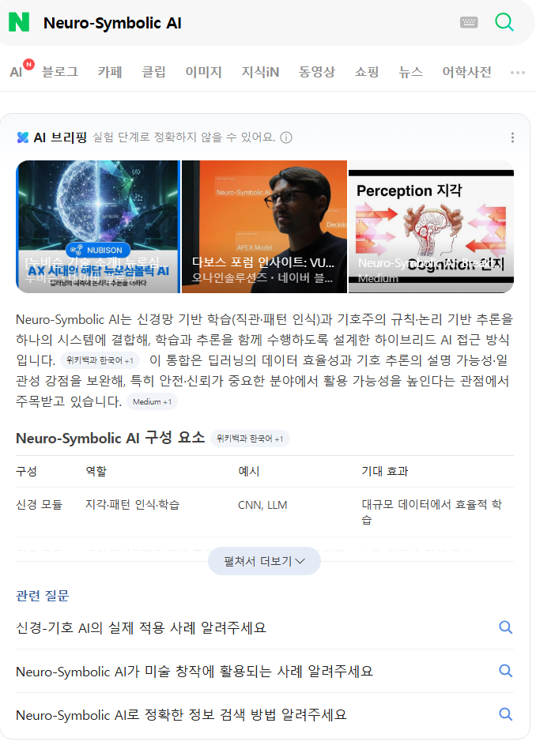

# 인공지능을 배울 수 없는 이유
**Date:** 2026. 7. 12. 0:46
**Category:** 일기장
**Original URL:** https://blog.naver.com/xpfkwh56/224343769987
---

​

26년 2분기 기준으로,

다 **모르면 안 되는** 개념인데

편하게 찾아선 알 수도 없음

​

문제는 이거에 관심 있는 사람이면

한가롭게 이거 정리할 여유가 없음 ,,

​

하루하루 발전이 쥰내 빨라 가지고

나오는 것 계속 트래킹 하기도 바쁨

​

자고 일어나면 숙제가 100장

​

유튜브, 블로그 SNS 이런 곳에서 나오는

인공지능 이야기는 대체로 재미로 보시고,

​

**진짜**는 논문을 읽고, 연구자들을 봐야 됨

​

<https://ai.meta.com/blog/introducing-muse-spark-msl/>

[**Introducing Muse Spark: Scaling Towards Personal Superintelligence**

ai.meta.com](https://ai.meta.com/blog/introducing-muse-spark-msl/)

​

얼마 전 또 메타에서 괴물을 만들어냈는데,

당연히 전부 비공개 정보고 따거만 믿는 중임

​

아직 자세하게 활용해본 것은 아니지만,

​

간단한 제 총평은

​

**아직 행동 보다 말이 앞선 상태다**

​

그럼에도 불구하고, **어케 했지?**

싶은 기술이 분명하게 발견된다

​

입니다

​

제로클릭 시대 **다음** 메타가,

**'온디멘드'** 시대임

​

제로클릭 → 네이버 로그인만 해도

내가 찾아볼 것이 미리 다 제공됨

**​**

**\* 알고리즘으로**

​

온디멘드 시대가 되면?

네이버 로그인 **조차** 필요없음

​

마트에 가지 않아도 인터넷 주문 된다

쿠팡에서 알아서 정기 배송을 해준다

​

쿠팡에서 내가 살 것 같은 것을

내가 요구한 적도 없는데

​

**'내 마음에'** 들게 가져다 주는데

심지어 그게 **최상의 선택** 이다

​

이게 지금 미래가 가고 있는 방향임

​

인공지능은 배워야 된다, 어떻게 배우자

이런 식으로 접근할 수 있는 영역이 아님

​

**\* 엣지에 있는 연구자들은 인간이 가진**

**모든 격차를 없애버리려고 하고 있음**

**​**

그냥 **흐르고 있는 필연** 임