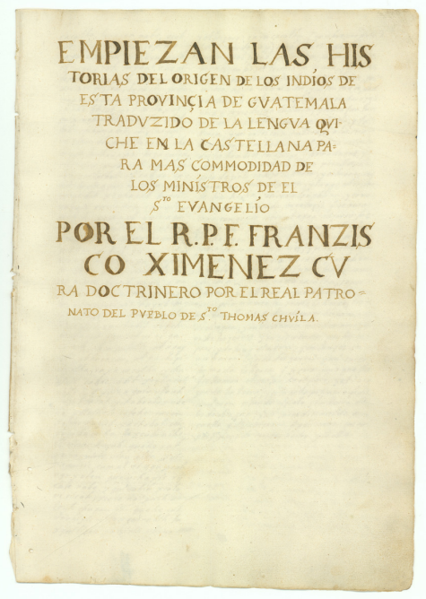
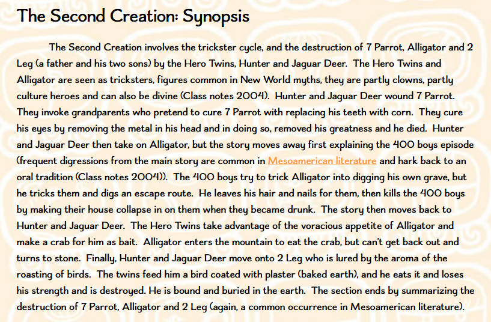

# (원피스 스포일러) 부쿱 카킥스(Vucub Caquix) 설화 원본
**Date:** 2026. 8. 4. 4:47
**Category:** 일기장
**Original URL:** https://blog.naver.com/xpfkwh56/224367345044
---

https://tile.loc.gov/storage-services/service/gdc/gdcwdl/wd/l\_/19/99/5/wdl\_19995/wdl\_19995.pdf

**​**

1. 미국 국회 도서관 디지털 버전 판본이고,

해당 설화에서 일반인이 찾을 수 있는 것 중

아마 가장 공신력, 신뢰성 높은 내용일 것임

​

https://www.mayaarchaeologist.co.uk/public-resources/papers-on-the-maya/comparing-contrasting-three-different-translations-second-creation-popul-vuh/?srsltid=AfmBOoquytfNgWKqPaUOeYST\_B2rWQMmYwHerwEopkzRmr-q-MS9XW7I

​

옛날 옛날에 금이빨과 보석 눈알의 광채를 믿고,

오만하게 굴었던 자칭 신 앵무새가 있었는데

​

**어떤 쌍둥이**가 나타나 **바람총으로 턱을 쏘고**,

떠돌이 치료사로 변장한 노부부를 사주해,

이빨과 눈알을 빼앗아서 죽였다는 얘기임

**​**

**2. 이하는 인공지능 사용해서 해석한 내용 임**

​

**\* 구글에 'POPOL VUH' 검색하면 나옴**

**​**

Ri ki xk'ub', 그들의 화덕돌들이

Chitaninik, 그들을 짓눌렀고,

Chipe pa q'aq', 불 속에서 달려 나와

Taqal chi ki jolom, 그들의 머리 위에 떨어져

K'ax xb'an chike. 그들에게 고통을 안겼다.

Anilab'ik, 그들은 달아난다,

Kemalmalijab' chik. 이제 허둥지둥 도망친다.

Keraj aq'anik chuwi' ja, 집 꼭대기에 올라가려 하지만,

Xa chiwulij ja, ketzaq uloq. 집은 그저 무너져 내려, 그들은 떨어진다.

Keraj aq'an chuwi' che', 나무 꼭대기에 오르려 하지만,

Kech'akix uloq ruma che'. 나무가 그들을 받쳐 주지 않는다.

Keraj ok pa jul, 동굴 속으로 들어가려 하지만,

Xa chiyuch jul chikiwach. 동굴은 그저 그들의 얼굴 앞에서 닫혀 버린다.

Keje' k'ut u kayojik winaq tz'aq, 이리하여 틀로 지은 사람들,

Winaq b'it. 빚어 만든 사람들의 파멸이 이루어졌다.

E tzixel, 그들은 헐렸고,

E tzalatzoxel chi winaq. 사람으로서 뒤엎어졌다.

Xma'ixik, 그들은 망가졌고,

Xq'utuxik 으깨어졌으니 —

Ki chi', 그들의 입이,

Ki wach konojel. 그들의 얼굴이 모조리.

Xcha' k'ut are' retal, 그리하여 이들이 그들의 표징이라 한다,

Ri k'oy 곧 거미원숭이들,

K'o pa k'eche'laj wakamik, 오늘날 숲속에 있는 그것들,

Are' xk'oje' wi retal. 이들이 그들의 자취로 남았다.

Rumal xa che' 그들의 살은 그저 나무로

Ki tio'jil xkojik 지어졌던 까닭이니,

Rumal Aj Tz'aq, 틀 짓는 이와

Aj B'it. 빚는 이의 손으로.

Are' k'u ri k'oy, 그리하여 이 거미원숭이들이

Keje' ri' winaq chiwachinik. 사람처럼 보이게 된 것이다.

Retal ju le' winaq tz'aq, 틀로 지어지고 빚어 만들어진

Winaq b'it. 한 세대 사람들의 자취이니,

Xa poy, 그저 허수아비요,

Xa pu ajam che'. 그저 깎아 만든 나무였을 뿐이다.

ARE k'ut xa jub'iq' saqnatanoj u wach ulew, 그때 땅의 얼굴은 겨우 조금 밝아졌을 뿐,

Maja b'i q'ij, 해는 아직 없었다.

Jun k'ut kunimarisaj rib', 그런데 하나가 스스로를 크게 여겼으니,

Wuqub' Kaqix u b'i'. 그 이름은 부쿱 카키쉬였다.

K'o nab'e kaj, 하늘이 먼저 있었고,

Ulew, 땅도 있었으나,

Xa kamoymot u wach q'ij, 해와 달의 얼굴은 그저 흐릿하기만 했다.

Ik'.

Kacha' k'u ri', 그리하여 이렇게 이른다:

Xa wi xere u saq etal winaq ri xb'utik. 그것은 그저 물에 잠긴 사람들의 밝은 표징일 뿐이었다고.

Keje' ri' nawal winaq 그의 됨됨이는

U k'oje'ik. 마법을 지닌 사람과 같았다.

"In nim, "나는 위대하다.

Kik'oje' chik chuwi' 나는 이제 틀로 지어지고 빚어 만들어진

Winaq tz'aq, 사람들의 머리 위에

Winaq b'it. 군림한다.

In u q'ij, 내가 그들의 해요,

In pu u saq, 내가 또한 그들의 빛이며,

In nay pu rik'il. 내가 또한 그들의 달이다."

Ta chuxoq. 그러니 그렇게 되게 하라.

Nim nu saqil. 나의 광채는 위대하다.

In b'inib'al, 나는 사람들이 다니는 길이요,

In pu chakab'al rumal winaq, 또한 그들이 오가는 통로이니,

Rumal puwaq. 귀한 쇠붙이 덕분이다.

U b'aq' nu wach xa katiltotik 내 눈알은 그저 반짝이며

Chi yamanik raxa k'uwal, 푸른 보석으로 빛나고,

Nay pu we', 내 이빨 또한

Rax kawakoj chi ab'aj, 푸른 돌로 눈부시니,

Keje' ri' u wa kaj. 마치 하늘의 얼굴 같도다.

Are' k'u ri nu tza'm, 그리고 이 내 부리는

Saq julujuj chi naj, 멀리서도 환히 빛나기를

Keje' ri ik'. 저 달과 같도다.

Puwaq k'ut nu q'alib'al. 내 왕좌는 귀한 쇠붙이로다.

K'a saq pak'e u wach ulew 내가 내 왕좌 앞으로 나설 때면

Ta kinel uloq 땅의 얼굴은

Chuwach nu q'alib'al. 여전히 환히 밝아진다.

Keje' k'ut in q'ij wi, 그러므로 내가 곧 해요,

In pu ik', 내가 또한 달이니,

Rumal saqil al, 여인의 자식들과

Saqil k'ajol. 사내의 아들들에게 빛이 되기 때문이다.

Ta chuxoq. 그러니 그렇게 되게 하라.

Rumal chi naj 내 눈길은

Kopon wi nu wach," cha' ri Wuqub' Kaqix. 멀리까지 미치는 까닭이다." 부쿱 카키쉬는 이렇게 말했다.

Ma k'u qitzij are' ta q'ij ri Wuqub' Kaqix, 그러나 부쿱 카키쉬가 참으로 해인 것은 아니었다.

Xere kunimarisaj rib', 그저 스스로를 크게 여겼을 뿐이니,

Ri u xik', 그의 깃털과

U puwaq. 그의 귀한 쇠붙이 때문이었다.

Xere k'ut tokol wi u wach ri chiku'b'e wi. 그의 눈길은 그가 앉은 자리에까지만 닿았다.

Ma na ronojel ta u xe' kaj kopon wi u wach 하늘 아래 온 곳에 그의 눈길이 미치지는 못했다.

Maja' k'ut qi kiloq u wach q'ij, 해와 달의 얼굴이 참으로 보이기

Ik', 그전의 일이었다.

Ch'umil, 별들의 얼굴이

Maja'oq kasaqiroq. 아직 동트기 전이었다.

Keje' k'ut kuq'ob'isaj wi rib' 그리하여 부쿱 카키쉬는

Ri Wuqub' Kaqix 스스로를 한껏 부풀렸으니,

Chi q'ijil, 날이 가고

Chi ik'il. 달이 가도록 그러하였다.

Xa maja' chik'utunoq, 해와 달의 빛이

Chiq'alajob'oq 아직 드러나지도

U saqil q'ij, 환히 밝혀지지도

Ik', 않았을 적에,

Xa xurayij nimal, 그는 그저 위대함과

Ik'owen. 남을 넘어섬을 탐하였다.

Are ta xb'anik b'utik 그때는 깎아 만든 나무 허수아비들 때문에

Kumal poy ajam che'. 홍수가 일어난 뒤였다.

Keje' k'ut xchiqab'ij chik ta xkamik Wuqub' Kaqix, 이제 우리는 부쿱 카키쉬가 어떻게 죽었는지,

Ta xch'akatajik, 어떻게 패하였는지를 이야기하리라.

Ta xb'anataj winaq 틀 짓는 이와 빚는 이의 손으로

Rumal Aj Tz'aq, 사람이 만들어지던

Aj B'it. 그 무렵의 일이다.

WA'E u xe' 이것이 그 뿌리이니,

U ch'akatajik, 부쿱 카키쉬가 패한 일이며

U yiqoxik chi puch u q'ij Wuqub' Kaqix 그의 날이 흔들려 무너진 일이다.

Kumal e kaib' k'ajolab', 두 소년의 손에 그리되었으니,

Junajpu u b'i' jun, 하나의 이름은 후나푸요,

Xb'alanke u b'i' u kab'. 둘째의 이름은 쉬발란케였다.

Xa wi e k'ab'awil. 그들은 다름 아닌 신들이었다.

Rumal itzel xkilo, 스스로를 크게 여기는 그자를

Ri nimarisay rib'. 그들은 악하게 보았던 까닭이다.

Xraj u b'an 그는 하늘의 심장 앞에서

Chuwach u K'u'x Kaj. 제 뜻을 이루려 하였다.

Xcha' k'u ri k'ajolab': 그리하여 소년들이 말하였다:

"Mawi utz ta chuxoq. "이대로 되어서는 좋지 않다.

Mawi chik'ase' winaq 사람들이 여기 땅 위에서

Waral 살아가지

Chuwach ulew. 못하게 되리라.

Keje' k'ut chiqatij wub'axik. 그러니 우리가 바람총을 쏘아 보자.

Chuwi' recha' chiqawub'aj wi. 그가 먹는 것 위에서 그를 쏘리라.

Chiri' chiqakoj wi u yab'. 거기서 그에게 병을 심으리라.

Ta k'isoq u q'inomal, 그리하면 그의 재물이 끝나리니,

U xit, 그의 옥과

U puwaq, 그의 귀한 쇠붙이와

U k'uwal, 그의 보석과

U yamanik, 그의 반짝이는 것들,

Ri kuk'ak'ab'ej. 그가 밤새워 지키는 그것들이 다하리라.

Keje' k'ut chub'ano. 그렇게 될 것이다.

Ronojel winaq mawi 모든 사람이

Are' chiwinaqir wi 이런 영화로

Q'aq'al ri', 지어지는 것은 아니니,

Xa puwaq. 그것은 그저 쇠붙이일 뿐이다.

Ta chuxoq," 그러니 그리되게 하자."

Xecha' ri k'ajolab'. 소년들이 이렇게 말하였다.

Jujun chi wub' 저마다 바람총을

Kitelen ki kab' ichal. 둘이 나란히 어깨에 메었다.

Are' k'u ri Wuqub' Kaqix, 그런데 이 부쿱 카키쉬에게는

E kaib' u k'ajol. 두 아들이 있었다.

Are' nab'e al ri Sipakna. 맏이는 시파크나요,

U kab' al chi k'ut ri Kab'raqan. 둘째는 카브라칸이었다.

Chimalmat k'ut u b'i' ki chuch, 그들의 어머니 이름은 치말마트이니,

Rixoqil ri Wuqub' Kaqix. 부쿱 카키쉬의 아내였다.

Are' k'u ri Sipakna, 그리고 이 시파크나는

Are' chirecha'j 큰 산들을

Ri nima'q juyub'-- 떠받치고 있었으니,

Ri Chi' Q'aq', 곧 불의 입과

Junajpu, 후나푸,

Pekulya', 페쿨리아,

Xkanul, 쉬카눌,

Makamob', 마카모브,

Julisnab', 훌리스나브 —

Chuchaxik u b'i' juyub' 이것이 산들의 이름이라 불리게 되었으니,

Xk'olik ta chisaqirik. 동틀 무렵 그것들이 있었다.

Xa jun aq'ab' chiwinaqirik 시파크나의 손으로

Rumal ri Sipakna. 단 하룻밤 사이에 지어진 것들이다.

Are' ri' chi k'u ri Kab'raqan chisilab' juyub', 그리고 이 카브라칸은 산들을 뒤흔들었으니,

Rumal chineb'owik, 그로 인해 산들이 떨었다.

Ch'uti juyub', 작은 산도

Nima juyub' rumal. 큰 산도 그의 손에 떨었다.

Xa wi keje' nimarisab'al kib' 부쿱 카키쉬의 아들들은 그저 이렇게

Xkib'ano u k'ajol Wuqub' Kaqix. 스스로를 크게 여겼다.

"In wa', "나로 말하면

In q'ij!" 내가 곧 해다!"

Xcha' Wuqub' Kaqix. 부쿱 카키쉬가 말하였다.

"In wa', "나로 말하면

In b'anol ulew!" 내가 땅을 짓는 자다!"

Xcha' ri Sipakna. 시파크나가 말하였다.

"In chi k'ut, "나로 말하면

Kiyojow kaj, 내가 하늘을 무너뜨리고

Chinwulij ronojel ulew," 온 땅을 허물어뜨리는 자다!"

Xcha' ri Kab'raqan. 카브라칸이 말하였다.

Xa wi u k'ajol Wuqub' Kaqix, 부쿱 카키쉬의 아들들은

Xa wi chiri' xkik'am wi ki nimal chirij ki qajaw. 그저 제 아비를 뒤따라 거기서 제 위대함을 물려받았다.

Are' k'ut itzel xkil wi k'ajolab', 그리하여 소년들은 이를 악하게 보았으니,

Maja' chib'antajoq 아직 우리 첫 어머니와 아버지가 지어지기 전의 일이었다.

Qa nab'e chuch, 우리의 첫 어머니와

Qa nab'e qajaw. 우리의 첫 아버지가 (지어지기 전이었다).

Keje' k'ut xno'jix wi ki kamik, 그리하여 소년들은 그들의 죽음과

Ki sachik kumal k'ajolab'. 그들의 멸망을 꾀하였다.

WA'E k'ute u wub'axik 이제 두 소년이 부쿱 카키쉬를

Wuqub' Kaqix kumal kaib' k'ajolab'. 바람총으로 쏜 일을 이야기하리라.

Xchiqab'ij ki ch'akatajik chi ki jujunal, 스스로를 크게 여긴 자들이 하나하나

Ri nimarisay rib'. 어떻게 패하였는지 말하리라.

Are' ri Wuqub' Kaqix, 부쿱 카키쉬에게는

Jun nima che' ri tapa'l, 난세라는 큰 나무 하나가 있었으니,

Are' k'u recha' 그것이 곧 부쿱 카키쉬의

Ri Wuqub' Kaqix. 먹이였다.

Are' chulo 그는 난세 열매를

Ri u wach tapa'l. 따서 떨어뜨리곤 하였다.

Chaq'an chuwi' che' ju ta q'ij. 날마다 그 나무 꼭대기에 올랐다.

Xiloma k'ut recha'b'al 후나푸와 쉬발란케는

Kumal ri Junajpu, 그가 먹이를 얻는 자리를

Xb'alanke. 눈여겨보아 두었다.

Kik'ak'alen chi k'ut 그리하여 그들은 부쿱 카키쉬의 나무 아래에서

Chuxe' che' ri Wuqub' Kaqix. 지켜 기다렸다.

E matzamoj ulo ri kaib' k'ajolab' 두 소년은 나뭇잎 속에

Pa xaq che'. 몸을 숨기고 있었다.

Ta xopon k'ut Wuqub' Kaqix, 이윽고 부쿱 카키쉬가 이르러

Tak'al 제 먹이인 난세 위에

Chuwi' recha', 내려앉았다.

Ri tapa'l.

K'ate k'ut ta xub'axik kumal, 그때 그들이 그를 쏘았으니,

Ri Junajpu, taqal u b'aq' wub' 후나푸의 바람총 탄알이 곧장 날아가

Chu kakate'. 그의 턱에 맞았다.

Churaquj u chi'. 그의 입이 찢어져 벌어졌다.

Ta xpe chuwi' che' 그는 나무 꼭대기에서 떨어져

Taqal chuwach ulew. 그대로 땅바닥에 곤두박혔다.

Chimalmat k'ut ri Junajpu anim xb'ek, 후나푸는 서둘러 급히 달려갔으니,

Qitzij wi xb'e u chapa'. 참으로 그를 붙잡으러 간 것이었다.

​

**K'ate k'ut ta xqupix ula 그때 부쿱 카키쉬가**

**U q'ab' ri Junajpu rumal ri Wuqub' Kaqix. 후나푸의 팔을 뜯어냈다.**

**Ju suk' xtzaq uloq, 팔은 단번에 뽑혀 나가,**

**Xmejo uloq tza'm u teleb'. 어깨 끝에서 꺾여 떨어졌다.**

**​**

Ta xutzoqopij chi k'ut Junajpu 그리하여 후나푸는

Ri Wuqub' Kaqix. 부쿱 카키쉬를 놓아주었다.

Xa wi utz xkib'ano. 그들은 그저 잘한 일이었다.

Ma nab'e ki ch'akatajik taj rumal Wuqub' Kaqix 부쿱 카키쉬가 후나푸의 팔을 가져갔다 해서

Uk'a'am chi k'ut u q'ab' ri Junajpu 그것이 곧 그들이 부쿱 카키쉬에게

Rumal ri Wuqub' Kaqix. 처음부터 패한 것은 아니었다.

Ta xb'e chi rochoch, 그는 제 집으로 돌아갔으니,

Xa chi k'u u lot'em u kakate' xoponik. 그저 턱을 두 손으로 감싸 쥔 채 이르렀다.

"Naqi pa mi xk'amow chila'?" "거기서 무엇을 가져오셨습니까?"

Xcha' k'u ri Chimalmat, 부쿱 카키쉬의 아내 치말마트가

Rixoqil Wuqub' Kaqix. 이렇게 말하였다.

"Naqi pa ri'?" "그게 무엇입니까?"

"Ri e kaib' k'axtok' mi xikiwub'aj, "두 악귀가 나를 바람총으로 쏘아

Mi xsilib'ataj nu kakate' rumal. 그 바람에 내 턱이 어긋났소.

Xa kachuywaj e we', 이가 그저 흔들거리고

Kaq'oxow chik. 이제는 쑤시기까지 하오.

Mi nab'e mi xnuk'am uloq. 그러나 내가 먼저 이것을 가져왔소.

Chuwi' q'aq' k'ut 이것은 불 위에

Chixeke wi, 걸어 두어

Chitzayab'a' 불 위에서

Chuwi' q'aq' 대롱대롱 매달려 있게 하리니,

Ta kul ki k'ama chik. 저들이 다시 찾으러 올 그때까지로다.

Qitzij chi e k'axtok'," xcha' ri Wuqub' Kaqix, 참으로 그것들은 악귀로다." 부쿱 카키쉬는 이렇게 말하며

Ta xuxekeb'a' u q'ab' ri Junajpu. 후나푸의 팔을 매달아 두었다.

Kina'ojinik chik, 후나푸와 쉬발란케는

Ri Ju Junajpu, 다시 의논하였다.

Xb'alanke.

Ta xkib'ij k'ut chirech 그리하여 그들은 한 할아버지에게

Jun Mama'. 말을 건넸다.

Qitzij saq chik 할아버지의 머리털은

Rismal wi' chi 참으로 이미

Mama'. 하얗게 세어 있었다.

Jun k'u Ati't, 또 한 할머니가 있었으니,

Qitzij kemel ati't chik. 참으로 등이 굽은 할머니였다.

Xa keluq'uq'ila' chik, 그들은 그저 허리를 굽힌 채 걸었으니,

Chi ri'jitaq winaq. 이미 늙은 사람들이었다.

Saqi Nim Aq u b'i' mama'. 할아버지의 이름은 사키 님 아크(흰 큰 멧돼지)요,

Saqi Nima Sis k'ut u b'i' ati't. 할머니의 이름은 사키 니마 시스(흰 큰 코아티)였다.

Xecha' k'u 소년들은 그 할머니와

Ri k'ajolab' chike, 할아버지에게

Ri ati't, 이렇게 말하였다:

"Kixqachb'ilaj taj. "저희가 두 분과 함께 가게 해 주십시오.

Chib'e ta k'ama qa q'ab' ruk' Wuqub' Kaqix. 부쿱 카키쉬에게 가서 저희 팔을 찾아 주십시오.

Xa kojtere 저희는 그저

Chiwij. 두 분 뒤를 따라가겠습니다.

'Q'i' ri qa mam '우리를 따라다니는 이 손자들을

Ri qachb'ilan. 참아 주시오.

Kaminaq ki chuch, 그 어미도 죽고

Ki qajaw. (어미도) 아비도 죽었소.

Keje' k'ut ketere, 그래서 이 아이들이 이렇게 따라다니며

Kotila' wi chiqij. 우리 뒤를 졸졸 쫓아다닌다오.

Ta la' keqasipaj wi, 그때 우리는 이 아이들에게 나눠 주는데,

Rumal xa elesan u chikopil e'yaj kaqab'ano,' kixcha'. 우리가 하는 일이란 그저 이빨의 벌레를 빼내는 것이오' 하고 말씀해 주십시오.

Keje' k'u ri oj ak'alab' 그러면 부쿱 카키쉬는 저희를

Chirilo ri Wuqub' Kaqix. 그저 아이들로 볼 것입니다.

Xa wi oj kojya'wik i na'oj," 저희가 두 분께 말씀드릴 바를 일러 드리겠습니다."

Xecha' ri e kaib' k'ajolab'. 두 소년이 이렇게 말하였다.

"Utz b'a la'," xecha' k'ut. "그러면 좋다." 노부부가 말하였다.

K'ate k'ut ta xeb'ek. 그리하여 그들은 길을 떠났다.

Tza'mal ku'bi' ri Wuqub' Kaqix 부쿱 카키쉬는 제 왕좌 앞

Chuwach u q'alib'al. 가장자리에 앉아 있었다.

Ta xe'ik'owik ri ati't, 할머니와 할아버지가 그 곁을 지나갔고,

Mama'.

Ke'etz'eyaj k'u 두 소년은 그 뒤에서

Ri e kaib' k'ajolab' chikij. 장난을 치며 따라갔다.

Ta xe'ik'ow 그들은 그 군주의 집

Chuxe' rochoch 아래를 지나갔다.

Ajaw.

Kuraquj k'u u chi' 부쿱 카키쉬는 이가 아파

Ri Wuqub' Kaqix rumal re'. 입을 벌리고 있었다.

Ta xril k'ut Wuqub' Kaqix ri mama', 그때 부쿱 카키쉬가 함께 가는

Ati't kachb'ilan kib'. 할아버지와 할머니를 보았다.

"Apa kixpe wi qa mam?" "어디서들 오시오, 노인장?"

Xcha' k'u ri ajaw. 군주가 이렇게 말하였다.

"Xa oj tzuqub'ey qib' lal ajaw," xecha' k'ut. "저희는 그저 입에 풀칠하며 사는 것들입니다, 군주님."

"Naqi pa i tzuqub'al? "무엇으로 입에 풀칠을 하시오?

Ma iwalk'wal ri iwachb'ilan?" 함께 온 저 아이들은 그대들 자식이오?"

"Maja b'i lal ajaw. "아닙니다, 군주님.

E qa mam 저희 손자들이지요.

Ri'.

Xere na re, 그저 그 아이들이 딱해

Kaqatoq'ob'aj ki wach. 가엾이 여길 뿐입니다.

Ri ya'axel ju pir, 저희가 얻는 것에서 한 조각,

Ch'aqa'p kaqaya' chikech lal ajaw," 한 쪽을 떼어 나눠 줍니다, 군주님."

Xecha' k'ut ri ati't, 할머니와 할아버지가 이렇게 말하였다.

Mama'.

Kutzin k'u ri ajaw 군주는 이가 아파

Rumal u q'oxom re'. 견딜 수 없는 지경이었다.

Xa k'u nima'q wa' ch'ij chik, 그저 안간힘을 다해

Kach'awik: 겨우 입을 열어 말하였다.

"In ta b'a kanij chiwech, "내 그대들에게 청하니,

Chitoq'ob'aj ta nu wach. 부디 나를 가엾이 여겨 주오.

Naqi pa ki' chib'ano? 그대들은 무슨 약을 쓰시오?

Naqi on ki' chikunaj?" 무슨 약으로 병을 고치시오?"

Xcha' k'ut 군주가 이렇게

Ajaw. 말하였다.

"Xa u chikopil e'yaj chiqelesaj. "저희는 그저 이빨의 벌레를 빼냅니다.

Xa k'u u b'aq' u wach chiqakunaj. 그저 눈알을 고치고,

Xa b'aq chiqawiqo, 그저 뼈를 맞춥니다,

Lal ajaw," 군주님."

Xecha' k'ut. 그들이 이렇게 말하였다.

"Utz b'a la', "그러면 좋소.

Chikunaj ta b'a we'. 부디 내 이를 고쳐 주오.

Qitzij kaq'oxowik ju ta q'ij. 참으로 날마다 쑤셔 대니

Mawi choq'itajik. 견딜 수가 없소.

Maja b'i nu waram rumal, 그 때문에 잠도 못 자고,

Ruk' u b'aq' nu wach. 눈알까지 그러하오.

Xa xiki'ub'aj, 두 악귀가 나를

E kaib' k'axtok'. 바람총으로 쏜 탓이오.

Ta xtikarik 그때부터

Mawi kinecha'jik rumal. 그 때문에 먹지를 못하오.

Keje' ta k'ut chitoq'ob'aj wi nu wach. 그러니 부디 나를 가엾이 여겨 주오.

Xa kachuyub' 내 턱이 그저 흔들리고

We je chik, 이가

Ri we'." 흔들거리오."

"Utz b'a la' lal ajaw. "그러시겠지요, 군주님.

Chikop b'a kaq'axuwik. 벌레가 아프게 하는 것입니다.

Xa chok u k'exel, 그저 대신할 것을 넣고

Chel ri e' la." 이를 뽑아내면 됩니다."

"Ma b'a utz lo chel ri we', "내 이를 뽑는 것은 좋지 않을 듯하오.

Rumal xere in ajaw wi. 나는 오직 군주인 까닭이오.

Nu kawub'al ri we', 내 이와 내 눈알이

Ruk' u b'aq' nu wach." 곧 내 치장이오."

"Xchiqakoj chik na k'ut "그러면 먼저 대신할 것으로

U k'exel jok'om b'aq." 갈아 만든 뼈를 넣어 드리지요."

Xchok chik are' k'ut jok'om b'aq 그런데 갈아 만든 뼈라 한 그것은

Ri xa saqi ixim. 실은 흰 옥수수 알갱이일 뿐이었다.

"Utz b'a la', chiwelesaj, chito'o' uloq," xcha' k'ut. "그러면 좋소. 뽑아내고 도와주시오." 그가 말하였다.

Ta xel k'u ri re' Wuqub' Kaqix. 그리하여 부쿱 카키쉬의 이가 뽑혀 나왔다.

Xa saqi ixim u k'exel re' xokik, 그 이를 대신해 흰 옥수수 알갱이가 들어갔으니,

Xa chi k'u saq julujuj chi ula ixim pu chi'. 그의 입에는 그저 허옇게 번들거리는 옥수수뿐이었다.

Ju su k'u xqaj u wach, 그의 얼굴은 단번에 무너져 내려

Mawi ajaw chik xwachinik. 더는 군주로 보이지 않았다.

Xk'is elik ri re', 그의 이가 모조리 뽑혀 나가니,

K'uwal rax kawakoj pu chi'. 입 안에서 푸르게 빛나던 보석들이었다.

Ta xkunax chi k'ut u b'aq' u wach Wuqub' Kaqix. 그다음에는 부쿱 카키쉬의 눈을 치료하였다.

Ta xch'olik u b'aq' u wach. 그의 눈알을 후벼 파냈다.

Xk'is elik 귀한 쇠붙이가

Ri puwaq. 남김없이 빠져나왔다.

Ma na k'ax taj xuna'o, 그는 아픔조차 느끼지 못하고

Xa wi xere kamuqunik. 그저 멍하니 바라보기만 하였다.

Ta xk'is k'u elik 그리하여 그의 자만이

Ri u nimarisab'al rib'. 남김없이 빠져나갔다.

Xa wi ki na'oj ri Junajpu, 이는 오로지 후나푸와 쉬발란케의

Xb'alanke. 계책이었다.

Ta xkam k'ut ri Wuqub' Kaqix. 그리하여 부쿱 카키쉬는 죽었다.

Ta xuk'am k'ut u q'ab' ri Junajpu. 후나푸는 제 팔을 도로 찾았다.

Xkam nay puch Chimalmat, 부쿱 카키쉬의 아내 치말마트도

Rixoqil Wuqub' Kaqix. 함께 죽었다.

Keje' k'ut u sachik u q'inomal Wuqub' Kaqix. 이리하여 부쿱 카키쉬의 재물이 사라졌다.

Ri xa aj kun xk'amowik: 그 보석과 귀한 돌들은

Ri k'uwal, 그저 의원 노릇 하던 이들이

Yamanik. 가져가 버렸다.

Xupunab'ej waral 그것들이 여기 땅 위에서

Chuwach ulew. 그를 우쭐하게 만들었던 것이다.

Nawal ati't, 마법을 지닌 할머니와

Nawal mama' xb'anowik. 할아버지가 이 일을 해냈다.

Ta xkik'am k'ut 그리하여 그들은

Ki q'ab', 팔을 도로 가져와

Xtikitax u kok, 제자리에 끼워 넣으니,

Utz chik xuxik. 다시 성하게 되었다.

Xa rumal u kamik Wuqub' Kaqix xkaj, 그들은 오직 부쿱 카키쉬의 죽음을 바랐기에

Keje' xkib'ano. 그렇게 한 것이었다.

Itzel xkilo, 스스로를 크게 여기는 짓을

Nimarisab'al ib'. 그들은 악하게 보았다.

K'ate k'ut xeb'e chik, 그리하여 두 소년은

E kaib' k'ajolab'. 다시 길을 떠났다.

Xa u tzij ri u K'u'x Kaj, 그들은 오직 하늘의 심장의 말씀을 따라

Ta xkib'ano. 그 일을 행하였다.