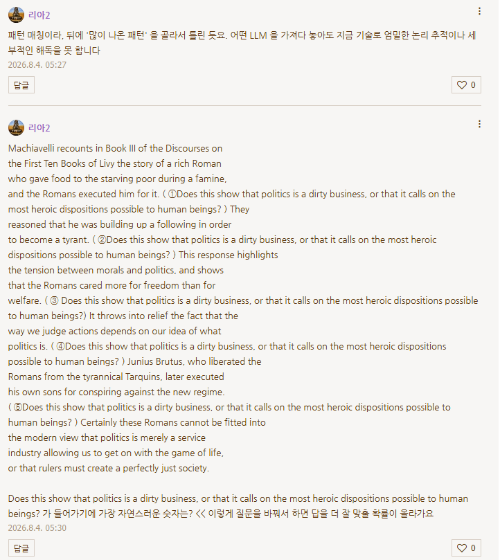

# 잉공지능한테 문제 풀게 시킬 때
**Date:** 2026. 8. 4. 5:33
**Category:** 일기장
**Original URL:** https://blog.naver.com/xpfkwh56/224367357909
---

​

자주 못 봤던 패턴을 기반으로

복합적인 판단하게 시키면 얼 타는데,

​

정답으로 가는 경로 트리 자체를

제공하면 논리 구조를 그나마 잘 그려서

더 잘 풀어낼 수 있음

**​**

**\* 연산값이 곡선에 닿을 수 있게끔**

​

최선은 [문제/답] 코퍼스를 많이 만들어서

학습할 수 있는 판단 기준을 주는 것 임

​

AI 한테는 **'물고기 잡는 법'** 을 알려주면 안 됨

​

지금 여기에 ~가 있다고 가정해보자,

​

같은 것이 사람한테는 아주 쉬운 반면에

AI 한테는 엄청난 인지/연산 부담을 일으킴