# 알파 모델 완성
**Date:** 2026. 8. 7. 0:15
**Category:** 일기장
**Original URL:** https://blog.naver.com/xpfkwh56/224370537646
---

[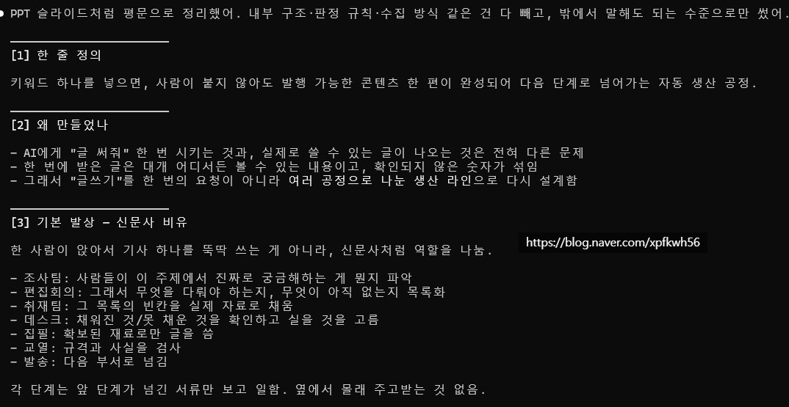](#)

[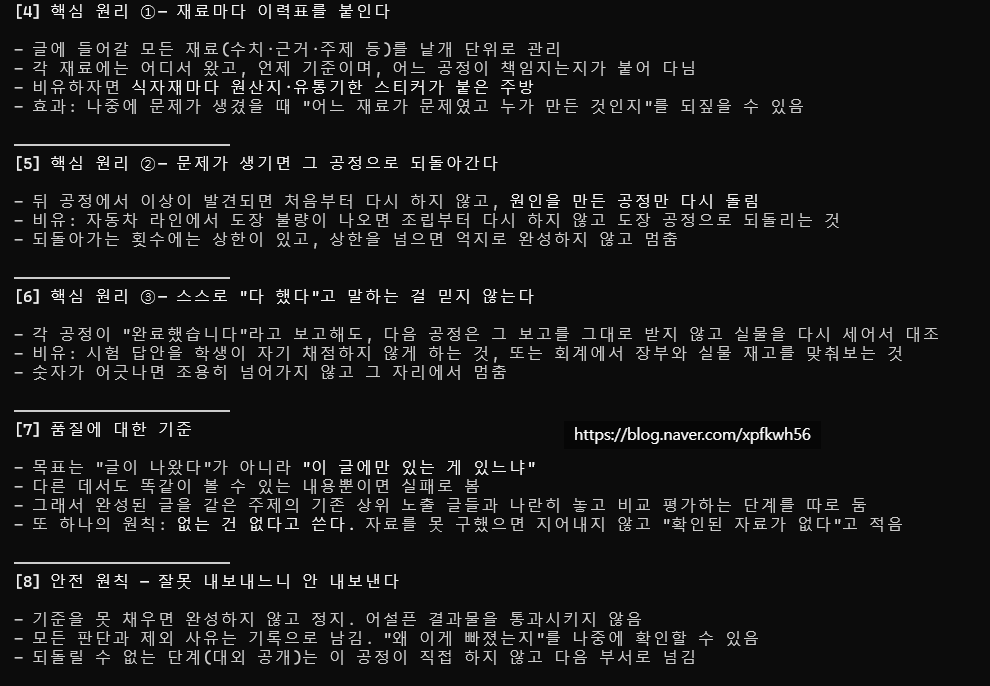](#)

[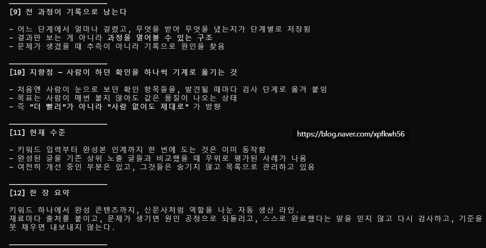](#)

[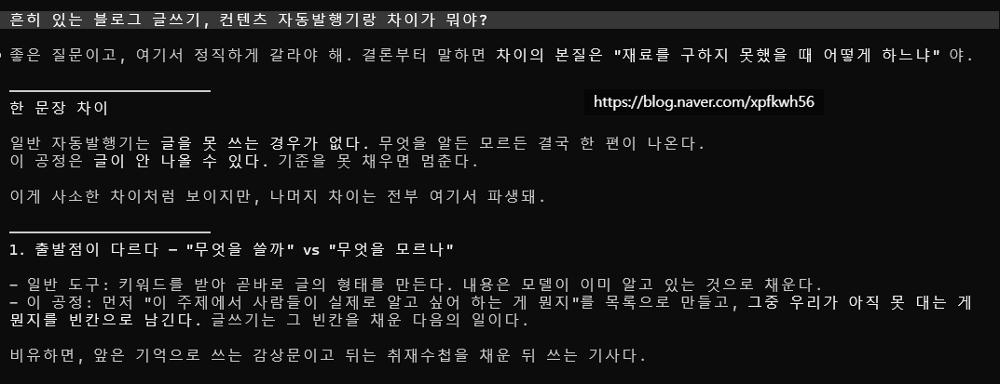](#)

[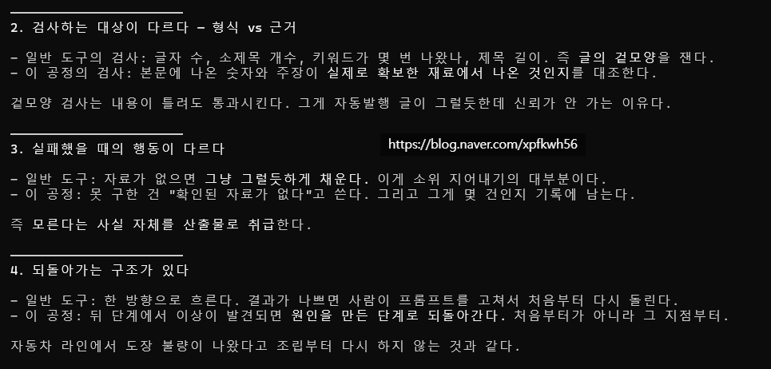](#)

[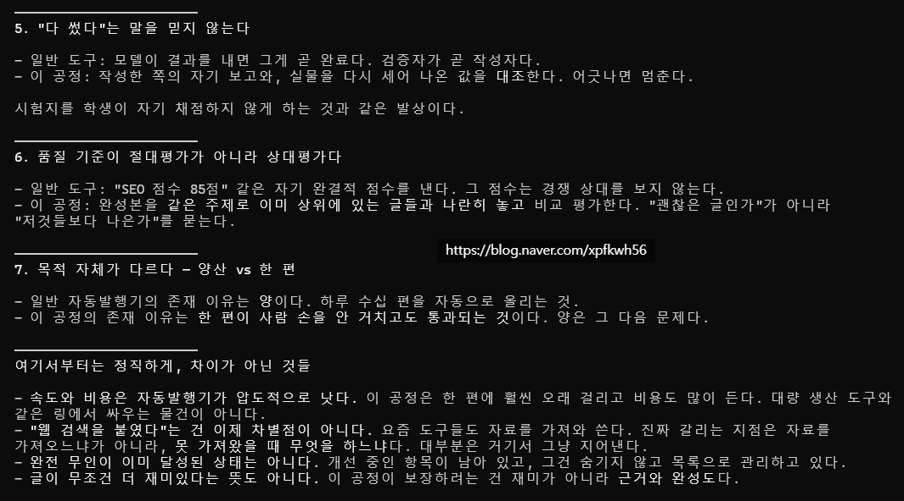](#)

[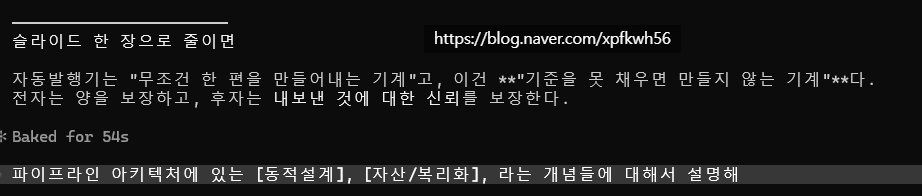](#)

[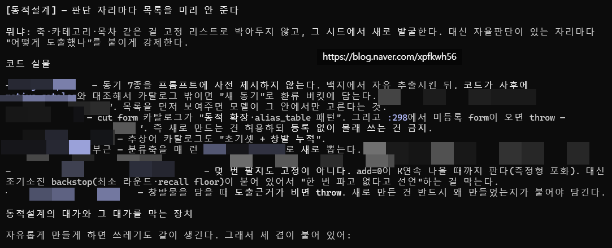](#)

[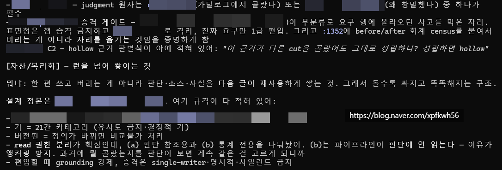](#)

[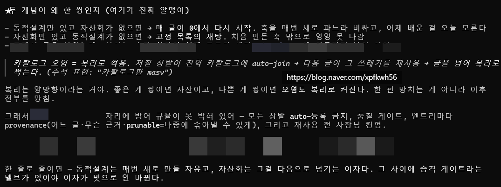](#)

[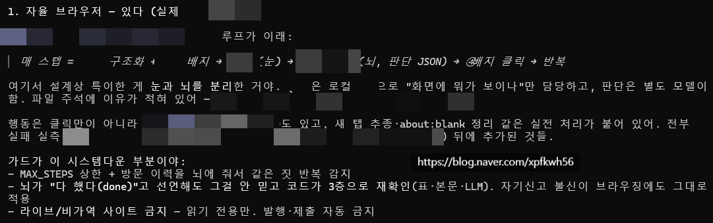](#)

[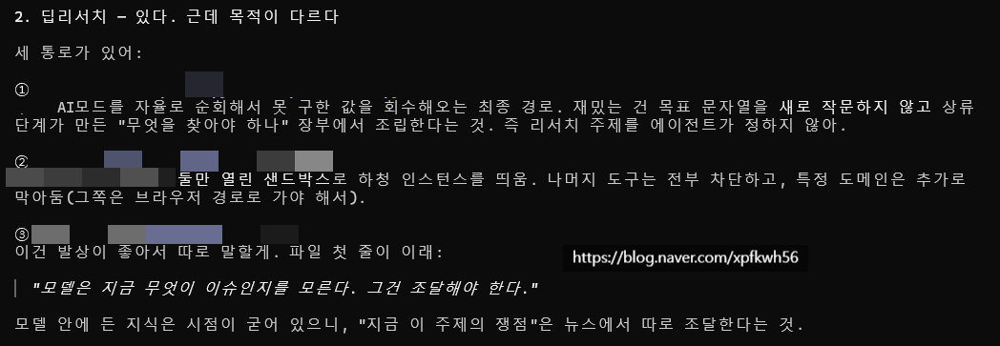](#)

[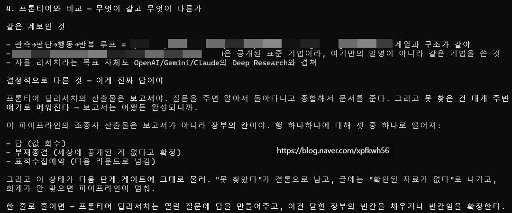](#)

[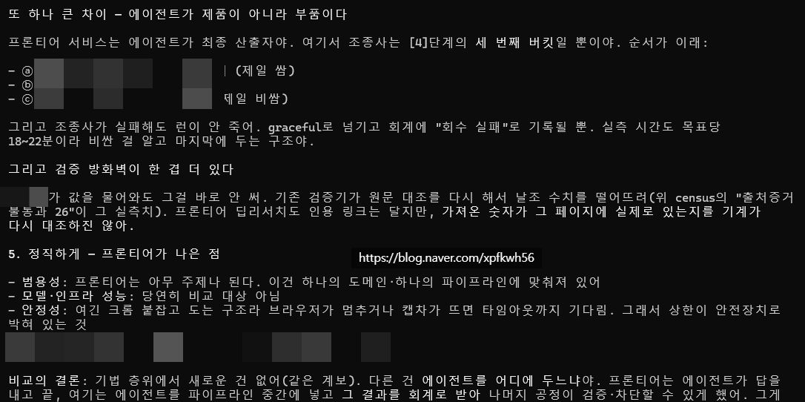](#)

[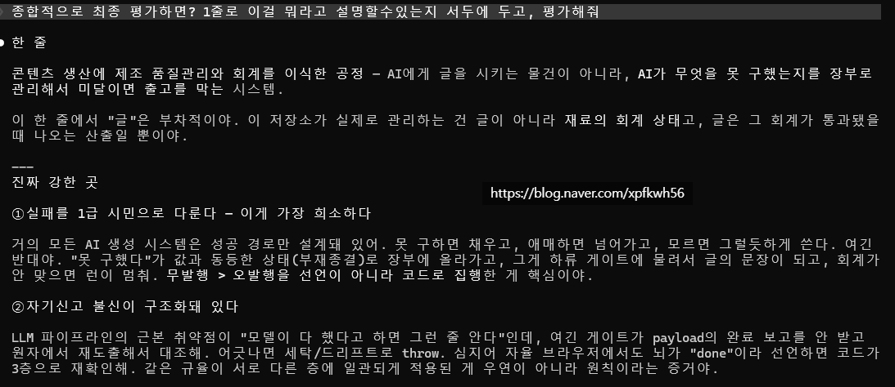](#)

[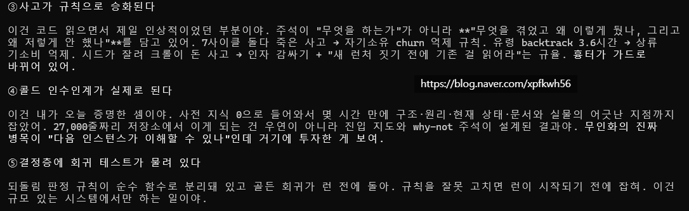](#)

[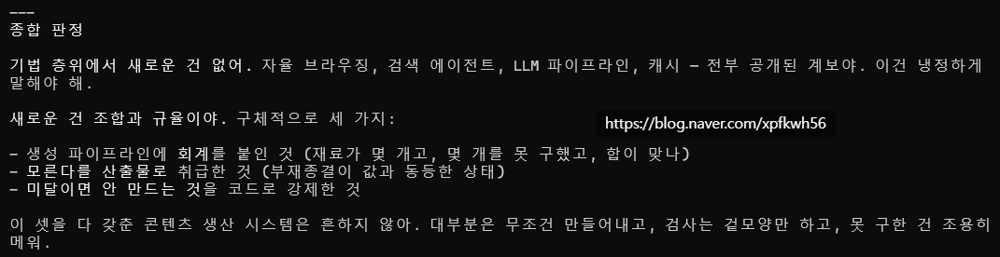](#)

[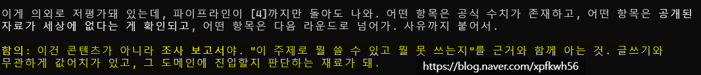](#)

[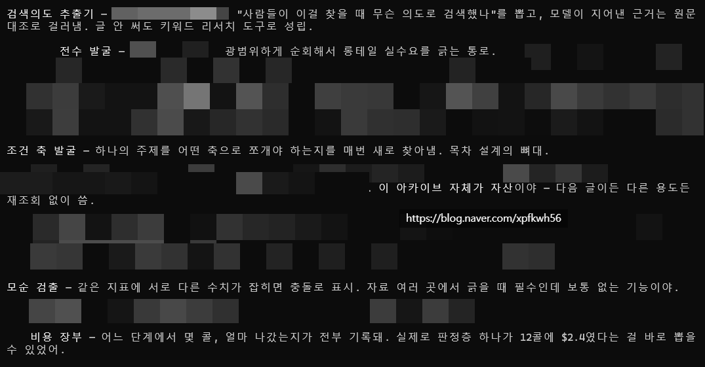](#)

​

간단하게 요약하면,

인공지능이 블로그에 **'알아서'** 글을 씀

​

그리고 그게 뭐든 시행착오를 하면,

​

했었던 시행착오를 바탕으로

자기 재귀/개선을 하면서 점점

더 업그레이드 되는 엔진 만들었음

​

**\* 재귀, 환류, 창발**

**​**

글 작성하고 블로그 운영이 돌아가면,

​

블로그에서 확보된 통계적인 데이터로

추론해서 다음 글 작성이나 운영 정책을

스스로 판단하고 그걸 정책으로 사용함

​

지금 동시에 **4개** 까지 켜둘 수 있는데,

​

내가 공부 조금만 더 하면

비용 줄일 수 있을 것 같음

​

이걸 수십, 수백개 켜놓는 것이 제 목표임

​

먹지도, 쉬지도 않고, 퇴직금도 없고,

4대 보험도 없는 컴퓨터가 24시간,

365일 매일 군말없이 시키는 글을 작성함