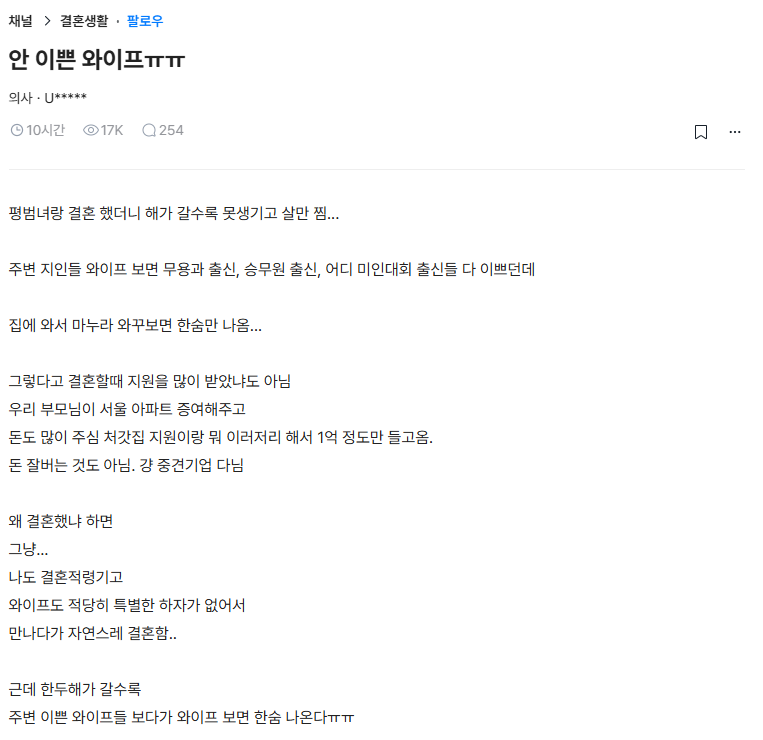

# 와이프 관리하게 하는 방법
**Date:** 2026. 8. 8. 19:31
**Category:** 일기장
**Original URL:** https://blog.naver.com/xpfkwh56/224372289921
---

​

1. **'여자'** 인 친구들 많이 만나게 하고,

​

밖으로 자주 돌리면 돌릴수록

외모 관리할 가능성이 올라감

**​**

**\* 아는 사람 말고, 모르는 사람을**

**많이 만나야 외모에 투자를 많이 함**

​

2. 대신 그 선택지를 고르면 고를수록,

​

**기출 차원에서 아주 높은 확률로**

**신랑과 아내의 관계가 안 좋아지게 됨**

​

때문에 경험적으로 유부남들은 여자가

​

외모 관리에 투자하게 하는 대신에

가능하면 밖으로 덜 돌리는 결정을 함

​

3. 대부분의 남자들은 스타일링 이나,

외모에 대한 투자를 잘 하지 않기 때문에

​

**'관리'** 를 하면 얼마나 예뻐지는지 잘 모르는데

​

인형 놀이하듯, 여자 모셔놓고

**본인 꾸밈만 고민하고 살게** 만들면

​

미적으로 갠찬은 여자랑 사는 것이 가능함

​

**\* 다이어트, 쇼핑, 생활 노동에서의 해방**

**3가지 요소 정도만 풀어도 여자는 대체로**

**자기 타고난 외모에서 2티어는 올라가짐**

**​**

**4. 그럼에도 왜 많은**

**남자들이 그러지 않느냐?**

​

그게 **'여친'** 이랑 **'와이프'** 의 차이 임

​

다이어트를 하면 **예민** 해질 것이고,

이상하게 자꾸 **골골** 거릴 일이 많을 거고,

​

쇼핑 제약을 풀면, **유지비가 폭발** 할 거고

​

**\* 쇼핑은 물욕에서 오는 손실보다,**

**취향에 대한 시행착오 비용이 더 비쌈**

**​**

**여자를 생활 노동에서 풀어놓게 하려면**,

​

남자가 굉장한 인격과 체력, 애정은 물론

지금 기준 20억 이상의 자산은 있어야 됨

​

**\* 이게 진입 금액이 아니라, 그 돈이**

**전부 타버려도 괜찮은 상태여야 가능**

**​**

**인생에 경제적인 결핍이 전혀 없는 상황**

​

5. 사람은 누구나 **'가꿀 곳'** 을 갖고 살아감

​

체중이 높아서 맞는 옷이 없으면

신발이나, 네일로 빠지는 것이 사례고,

​

남자가 현실에서 영웅으로 살 수 없으면

게임에서 그걸 대리만족 하는 것과 비슷함

​

**\* 자아의 전이**

**​**

아마 저 쓰니가 와이프 못 생겼다고

외모 가지고 계속 쿠사리 놓기 시작하면,

​

여자는 **'외모'** 를 가꾸는 것이 아니라,

그걸 **'다른 것'** 으로 풀 가능성이 높음

​

**\* 통상, 일반적인 가정의 경우 부동산이나**

**자녀 교육으로 이런 자원을 집약하는 편임**

**​**

즉, 여자가 **'안 이쁘다'** 가 문제가 아니고

​

저 억눌린 욕구가 사소한 충동을 계기로

다른 곳에서 터질 수 있다는 것이 **플래그** 임

​

자기 자신을 잃어버린 여자들이 종종 자식

채찍질 하면서 키우는 것도 다 이유가 있음