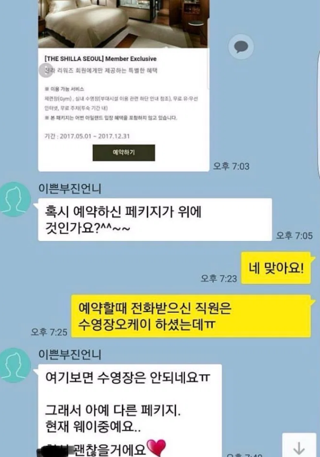
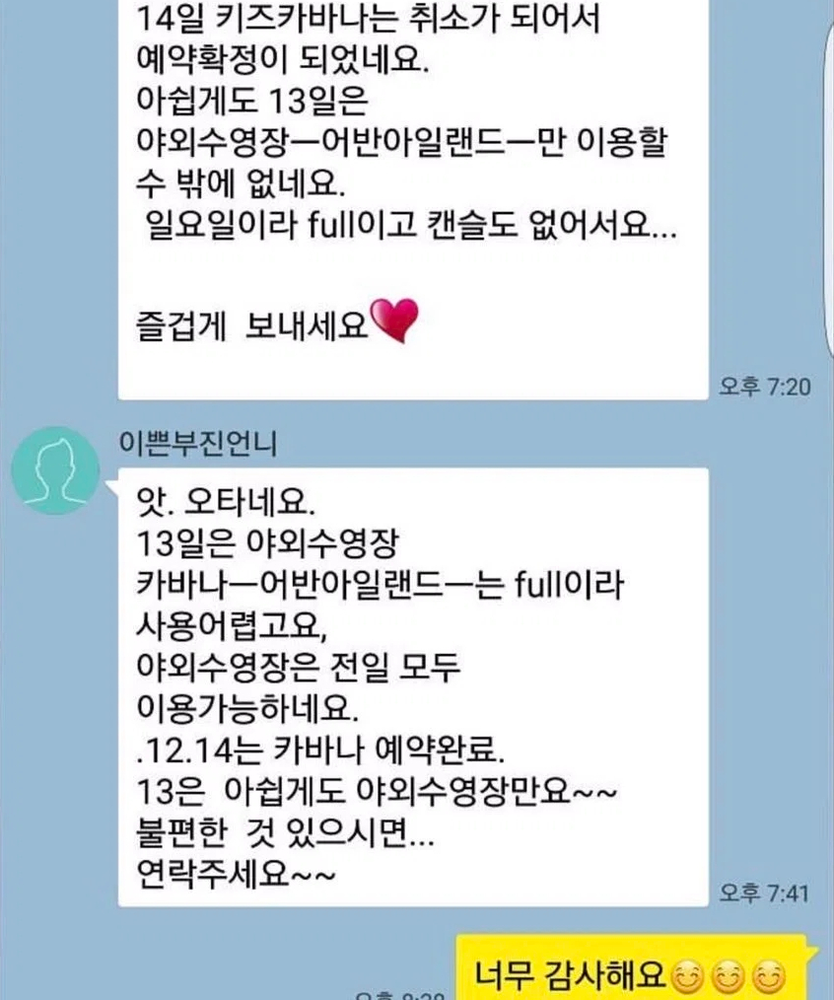
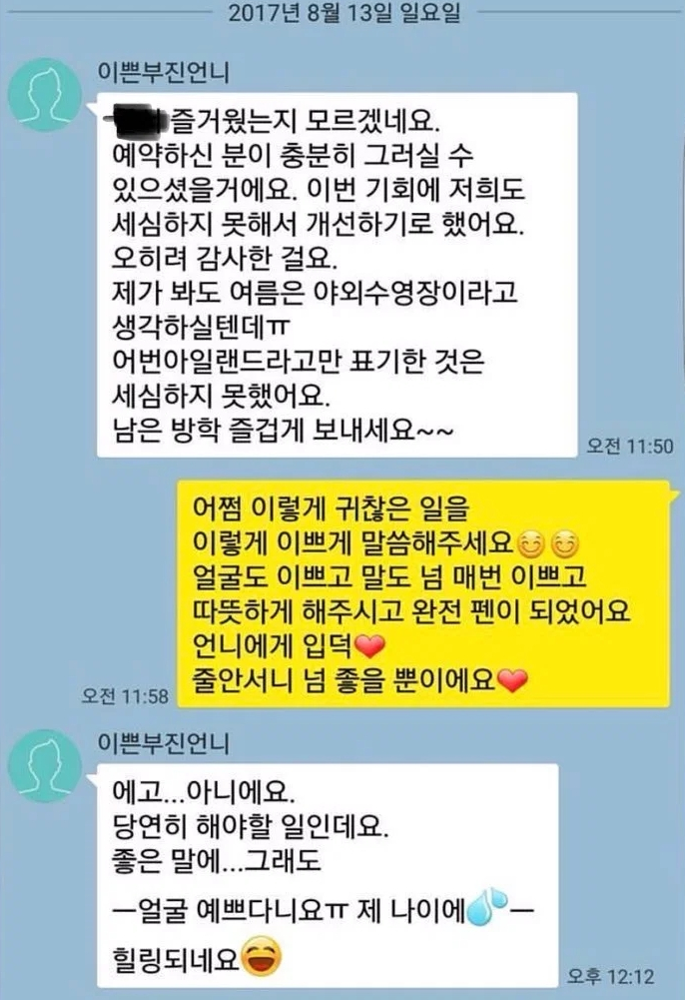

# 연애에 대한 생각
**Date:** 2026. 8. 10. 14:51
**Category:** 일기장
**Original URL:** https://blog.naver.com/xpfkwh56/224373994338
---

**1. ~한 남자 거르는 법, ~한 여자 거르는 법**

​

이런 것 달달 외우고 있어봤자,

​

실제로는 별로 쓸모도 없고

사람 볼 때 색안경만 생겨서

관계 진전이 부정적일 확률 큼

​

차라리, 어떤 갈등이나 부정적인 상황에

놓였을 때 해결하고 잘 지내는 방법 쪽으로

방향 잡고 그거를 고민하는 쪽이 더 빠름

​

​

이부진 카톡이라는데,

​

학부모 모임에 있던

아지매가 올린 톡이라고 함

​

,, 여러가지로 대단하단 생각 했음

​

이유든, 경로든 그게 무엇이든

어찌 되었던 간에 일단 내가 있는 곳이다

​

그러면 그 안에선 최선을 다 해야 되는 듯

​

**2. 여자 마음 맞추기 게임**

​

1번 못지 않게 자주 나오는 기출인데,

내 생각에는 조금 부질 없다고 생각함

​

왜냐면 니 입맛에 딱 맞는 것을

내가 제공해줄게, 라는 태도 자체가

​

별로 매력적이게 느껴지지 않음

​

1) 차라리 본인이 너무 하고 싶은 것,

너무 좋아하는 것을 하는 것이 낫고

​

2) 니가 해달란대로 다 해줬으니까

~한 대가를 내놔라, 결과에 대해서

그 책임은 오로지 너가 져야 된다,

​

같은 것들로 흘러가면 최악에 가까움

​

그냥 본인 하나가 두 발로 딱 서서,

잘 살아가고 있으면 남자는 끝 같은데

​

의외로 많이들 어려워 하는 것 같다