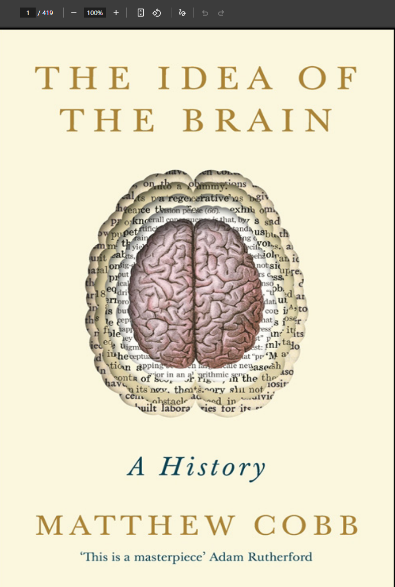

# 인공지능/육아 관련 책 추천
**Date:** 2026. 8. 14. 17:03
**Category:** 일기장
**Original URL:** https://blog.naver.com/xpfkwh56/224378675996
---

<https://ebook.nanet.go.kr/contents/detail?no=105120135>

[**서울국회도서관**

서울국회도서관

ebook.nanet.go.kr](https://ebook.nanet.go.kr/contents/detail?no=105120135)

​

1. 최근에 무척 재밌게 읽음

​

한글 출판 제목 [뇌 과학의 모든 역사]

​

무료로 지자체 도서관이나,

국회 도서관에서 볼 수 있음

​

**\* 책은 서재에 보관하지 말고,**

**머리에 느낌만 남기는 것이 좋음**

**​**

​

2. 원제는 이거임

해적 pdf 사이트 뒤지면 나옴

​

**3. 결론**

​

스타크래프트는 종족을

고르는 것도 **'실력'** 이다

​

자녀가 과학자를 하고 싶어한다면

​

**물리** 기반 공학으로 진로를

제안하는 것이 좋은 것 같음 ,,