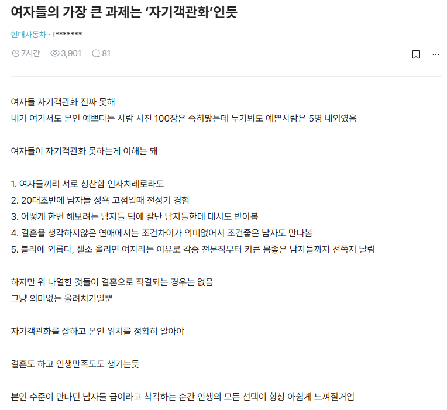

# 자기 객관화에 관하여
**Date:** 2026. 8. 14. 15:47
**Category:** 일기장
**Original URL:** https://blog.naver.com/xpfkwh56/224378592936
---

​

1. 자기 객관화가 문제가 아니고,

사실 **'기대치'** 에 대한 문제 임

​

아마? 남자도 비슷할 것 같고

대부분의 여자들은 자기 인생에 대한

애정이나 기대치가 **대체로** 높은데,

​

이런 기대치가 인생을 붙들고 사는,

**'욕심이나 동력'** 으로 발휘되기도 하고

​

무엇보다 외부에서 평가하는

**가치랑 직결하는** 경향이 있음

​

2. 남자 입장에서, 자기 객관화

잘 된 여자를 만나면 생기는 일?

​

1) 하도 풍파를 겪어서,

약한 우울증 앓고 있는 여자

​

매사에 에너지가 없어서, 나는 **몰라**

나는 **안 돼** 하고 있을 건데 어케 만남?

​

2) 인생 잘 살아보겠다는 열정이나

야망이 1도 없는 것은 차치하고,

​

남자가 뭐 해볼라치면 와 가지고

**힐링** 떠들고 있을 텐데 견딜 수 있을까?

​

1번은 이 여자가 내 아이의 엄마다,

라고 생각하면 앞이 컴컴할 것이고,

​

2번은 남자 스스로 약간 인생이

썩어간다고 느끼게 될 확률이 높음

​

3. 내가 **'예쁘다'** 라는 인식이 있어야,

​

화장품도 사서 얼굴에 치덕 거리고

옷도 사서 꾸미고 그러는 것이지,

​

**'해도 안 돼'** 라고 여기면 **'놔버림'**

​

즉, 여자의 발화를 해석함에 있어서

**'나 예쁜 편이야'** 라고 말하는 것은,

​

나는 내가 가질 수 있는 외모에 있어,

지금 최대치를 지향하고 있어,

​

라고 번역해서 본인이 읽어내야 됨

​

4. 무엇보다 여자 입장에선,

자기 **객관화** 가 도움이 안 됨

​

십중팔구 남자들한테 결혼 이란 것은,

​

가정을 꾸리고 특히 '애' 를 낳아서

사는 것을 빼먹기가 어려울 것인데,

​

대신 낳아줄 것은 아니잖음

​

**맨 정신으로 자기 부랄 찢고**

**애기가 나온다고 생각해보셈**

​

**\* 난 왜 남자로 태어났지? 싶을 걸요**

**​**

그게 객관적이고 이성적으로

할 수 있는 선택 일리가 없잖음

​

5. 여자가 기대치가 내려가려면,

현실이 녹록하지 않구나 라는 것을

​

스스로 **'수용하는 때'** 가 와야 되는데

​

이게 보기에나, 말로나 **'성장'** 이지

굉장한 고통을 수반할 확률이 높음

​

때문에 결론적으로,

​

자기 가치는 높으면서 바겐세일로

나한테는 열린 마음으로 대해주는

후려치기(자기 객관화) 잘 된 여자,

​

기대치 낮고, 가성비 좋은 여자를

찾겠다는 접근 보다는 본인의 **'선'** 에서

​

여자의 **'눈높이'** 를 채워줄 수 있는

경우를 찾아서 사는 것이 대개 유익함

​

정말 다양한 요소로,

​

**~ 하게 살고 싶다**, 라고 각각 사람마다

자기가 그리고 있는 그림들이 있는데

​

그걸 여자에게 채워주는 남자가

존경할 수 있는 남자의 상위호환 임