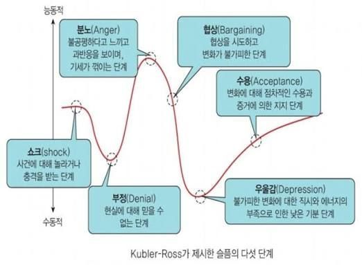

# 바닥을 한 번 찍어보면 아는 것도 있음
**Date:** 2026. 8. 16. 21:35
**Category:** 일기장
**Original URL:** https://blog.naver.com/xpfkwh56/224380555936
---

1. 크든, 작든 사람마다 각자가 갖고 있는

나름의 사연이 없는 경우는 아마 없을 것 임

​

​

2. 사람이 고통을 다루는 5단계라고 함

​

이 구조를 보면 내부적 사이클이 있고,

외부적으로 도는 사이클이 있음

​

3. 내부적 사이클은 어쨌든, 저쨌든

**'수용'** 의 단계를 한 번 겪고 나면,

​

그래 뭐 어쩌겠어, 산 사람은 살아야지

상태가 되면서 **어떻게든 살아진다는 것** 임

​

외부적으로는 저런 경험이 **몇 번** 생기면,

**어차피 수용할 것 어렵게 가지 말자** 가 됨

​

**\* 못 버티면 죽는 거고**

**​**

4. 제 경우, 계속 뭔가를 하려고 하고

자꾸 내 딴에 능력을 키우려고 하는 이유는

​

**'유능성이 내 밖에 있을 때,**

**그 사실이 얼마나 괴로운지'**

**​**

트라우마로 박혀서 그런 것 같음

​

나한테 아무 선택지도 없이 삶이 흘러가는데,

계속 안 좋은 쪽으로만 간다 싶으면 매우 힘듦

​

**\* 내 무능함에 스스로 치가 떨릴 때 가 대표적**

**​**

5. 꽤 오래 전부터, 제 삶을 나름대로

선택하고 결정할 수 있다는 것에

행복함을 느끼고 살고 있는데

​

이 행복이 **언제든** 깨질 수 있음을 아니까,

불안해서 그걸 유지하고 싶은 욕구가 큼

​

막상 진짜 턱 끝에 차서 불안하면

오히려 못할 것 같은데 그래도

​

여유가 있으니 이래저래

깔짝 거리는 것 아닐까 싶네요