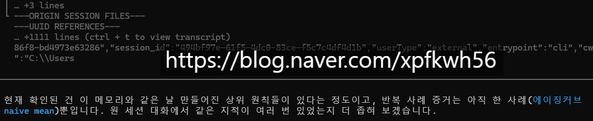
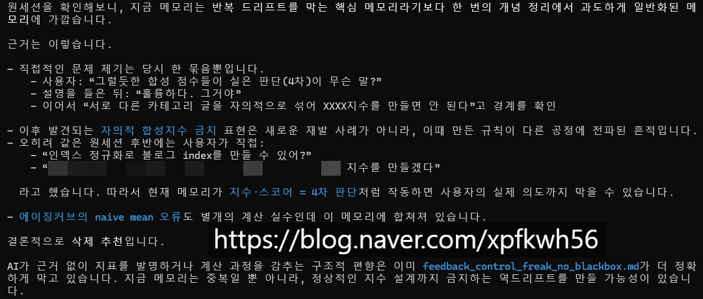

# 로칼 에이전트 데이터 관리 잡기술
**Date:** 2026. 8. 19. 22:27
**Category:** 일기장
**Original URL:** https://blog.naver.com/xpfkwh56/224383785935
---

1. 에이전트 자동화를 굴릴 때 쓰는 큰 두개의 축이 있음

​

편의상, **훅** 과 **메모리** 로 구분함

​

1) 훅

​

강제성 있는 트리거 임

​

특정 조건이 걸리면 기계적으로

결정론적으로 발동하는 것 임

​

예를 들어, LLM 이 텍스트에 중국어를 쓴다

그럼 중국어 전체를 스크립트에 넣어놓고,

​

나올 때마다 글자 별로 **'◈'** 로 바꾸게 하면

​

저게 노출될 때, 중국어 가 새 나왔구나

라고 판단해서 처리할 수 있음

​

같은 방식으로 LLM 이 특정 단어를 말한다,

특정 동작을 한다, 할 때마다 회초리 때리듯이

​

스위치 처럼 쓸 수 있는 것이 **훅** 임

​

그럼 훅 은 어디에 쓰면 좋을까?

내 경우, 어텐션 관리에 주로 사용함

​

의존성 있고, 연속적인 작업이 아니라

서로 병렬적이고 독립적인 작업을 해서

맥락이 필요 없으면 CTX 는 노이즈 임

​

이럼 용량만 먹고, 일관적이게 하나의

프로젝트를 이어나가는 것에 도움 안 됨

​

그래서 세션/콘솔이 직접 자발적으로

특정 CTX 한계치에 도달하면 알아서

​

클리어 동작을 하거나, 인수인계 해서

에이전트 간, 역할을 **'병합/분리'** 하는

구조를 짜면 효과적이게 쓸 수 있음

​

압축, 클리어, 인수인계,

​

압축이 발생하면, 기존에 대화한

트렌스크립트는 디스크로 저장하고,

​

텍스트 앞에 라인 표시를 한 다음에

​

현재 하고 있는 goal 과 연결된

토픽 클러스터 단위로만 묶어서,

​

그 정보를 나눠서 전달하는 방식 을 쓰면

compact 동작에서 어떤 정보가 유실되고

어떤 정보가 남을 수 없는지 통제할 수 없는

블랙박스를 해결하는 것이 가능하기도 함

​

2) 메모리

​

메모리는 강제성 없는 context 구조 임

​

시멘틱 그래프 안에서, 특정 규칙을 따라서

쿼리가 주입되면 그걸 읽고 수렴 시키는 거라

​

가성비가 안 나오지만, 미래의 즉각적인

동작을 훅처럼 강제할 정도가 아닌 수준,

​

그리고 훅 자체가 설계/구현이 많이 복잡해서

LLM 한테 믿고 가는 작업을 기대할 때 좋음

​

2. 문제는 메모리 라는 것이,

​

LLM 이 기억해야 될 **행동들** 인데

​

인공지능이 어떤 잘못을 할 때마다

계속 그걸 틀렸다고 하고 처리하면

​

규정 간의 모순이나 충돌,

그리고 애매한 부분들이 생김

​

**\* 말 안 듣는 아이랑 룰싸움 하듯**

​

특히 큰 문제가 **'내가'** 기억 안 날 때 임

​

저는 이걸 심플하게 해결 하는 법을 아는데,

​

​

메모리가 저장될 때 프론트메터 에

메모리를 작성한 시드값을 저장한 다음,

​

그 시드값과 연결된 상태의

트렌스크립트를 보관하는 것임

​

​

그럼 나중에 그 메모리가 어떤 배경이나,

맥락에서 생겨났고 유효한 것인지 아닌지

같은 것을 실측해서 관리하는 것이 가능함