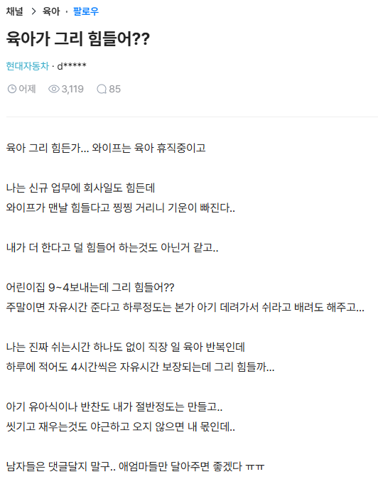

# 육아랑 살림이 어려운 이유
**Date:** 2026. 8. 24. 14:51
**Category:** 일기장
**Original URL:** https://blog.naver.com/xpfkwh56/224388516876
---

​

1. 크게 두 가지 이유 때문에 어려운데,

​

하나는 내가 **'못해질 때까지'**

게속 해야되는 구조 라는 점 이랑

​

칭찬 받긴 어렵고 욕 먹긴 쉽단 점이 그럼

​

2. 점심 메뉴를 고르는 작업 이라고 침

​

잘한다, 못한다를 측정하는

명확한 기준이 있냐?

​

딱히 없음

​

폐급은 폐급이고 S급은 S급 임

​

점심 뭐 먹을까요? 했을 때,

이거 먹읍시다 하고,

​

식당 고르는 것은 쉬운데

그 이면에 말로 다 할 수 없는

​

여러가지 작업을 결정해서

결과로 평가받는 것이 어려운 것임

​

**육아나 살림도 비슷함**

​

나는 24시간 풀자원 다 태우고 있는데,

​

**신랑도 물론 밖에서 본인 나름대로**

**본인 나름의 투쟁을 하고는 있겠지만**

​

깔짝 그 잠깐의 부분만 본 다음에,

​

집에서 여자가 하는 일의 **'전부'** 로

판단하면 분노를 참기 어려울 것 임

​

주방과 홀이 서로를 이해 못 하는 이유,

​

백오피스와 프론트오피스가

서로를 이해 하지 못하는 이유와

거의 비슷한 문제라고 봄

​

어린이집 9-4 보내는 동안 집에서

**'놀고'** 있다고 볼 수 있는데,

​

아마 그 시간이 여자가 집에서

**'피통'** 을 채우는 시간일 수도 있음

​

유독 피통이 더 작은 여자가 있기도 하고,

틱당 회복력이 적은 여자가 있기도 한데,

​

쨌든, 남자가 저렇게 굴어서 좋을 건 없음

​

3. 육아랑 살림은 잘 하는 것이 **없음**

​

먼저, **'끝'** 이란 개념이 없음

​

결국 유기물이든, 무기물이든

**먹이고, 재우고, 씻기는** 작업인데

​

오늘 먹였다고 내일 안 먹일 것도 아니고,

오늘 치웠다고 내일 안 치우는 것도 아니며,

​

사람이 집에 **'머무르는 즉시'** 오염이 발생함

​

그러니, 여자 스스로

​

**'내가 생각하는 이상적이고**

**온전한 형태'** 에서

​

벗어나면 벗어날수록 계속

스트레스 도트딜이 들어오고

​

여기서 효능감을 딱히

찾기 어려워서 힘든 것임

​

**4. 그럼 이 문제를 어떻게 풀 수 있냐?**

​

**'자산화'** 가 돼야 함

​

나는 여자들한테 **가전** 적극적으로 사고,

**미니멀리즘** 유지하고, 최대한 집 구석이

**오토**로 돌아가게 하라고 권유하는 편 임

​

한 번, 딱 1개월 정기 배송 장바구니 채우면

그 다음부터는 이게 알아서 돌아가는 거고

​

집에 상비용 제품들 구분해서,

**재고 채우는** 느낌으로 장을 보면

​

내 노하우가 쌓일수록 **'할 일'** 이 줄지만,

​

이게 안 되면, **'아는 것이 늘어날 때 마다'**,

**'내가'** 해야 될 일이 계속 늘어나게 됨

​

**\* 남편이 집안일을 도울 수는 있어도,**

**그거 뒤치닥거리 + 설계는 내가 해야 됨**

**​**

관리 비용 비싼 것은 다 버리든가,

애초에 집에다 모셔놓지를 말아야 됨

**​**

아기도 **'내가 돌봐/놀아준다'** 가 아니구,

​

상식 선에서 돌봄 레벨까진 돌보되,

지가 알아서 클 수 있게끔 비계를 잡고

​

하나씩 얘가 할 수 있게 만들어야,

**'내 숨통'** 이 틔어질 확률이 높음