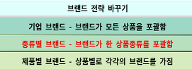

# 고민상담 답변
**Date:** 2026. 8. 27. 3:25
**Category:** 일기장
**Original URL:** https://blog.naver.com/xpfkwh56/224391512909
---

1. 넓게 보면 세상에는 두 가지 직업이 있음

​

하나는 내가 **'수요'** 를 찾아야 되는 직업이고,

하나는 내가 **'공급'** 만 잘 하면 되는 직업 임

​

구체적으로 이제 예를 들어보겠음,

​

흔히 사람들이 학생 시절이 제일 좋다고 함

공부가 제일 쉽다는 말을 하기도 하는데,

​

그 이유는 **'학생'** 은 **'수요'** 에 대해서

조금도 신경 쓸 필요가 없기 때문 임

​

공부가 어렵든, 할 것이 많든 간에

상관없이 **'주어진'** 일을 하면 되고,

​

**'공급'** 만 하면 됨

​

이런 공급자적 특성은,

제도권의 가장 큰 **근간** 이고

​

때문에 학생과 **'공무원'** 직종이

굉장히 유사한 성격을 갖는 것 임

​

전문직을 하든, 대기업을 가든,

공무원을 하든, 사업, 투자를 하든,

​

내 뿌리가 **'공급'** 이냐, **'수요'** 냐

라는 것에 따라서 향방이 달라짐

​

2. 제도권이 느끼는 스트레스의 핵심은

​

**'내가 이 새끼들을 계속 상종해야 하는가?'**

**'내가 들인 자원 대비 아웃풋은 정당한가?'**

**​**

같은 문제들일 가능성이 높음

​

왜냐면, 일단 할 **'일'** 이 있기 때문 임

​

반면에 비제도권이 느끼는 **'공포'** 의 핵심은

​

**'사회에서 내가 지워져 버리는 것 아닐까?'**

**'내가 이제 더 쓸모 없어지면 어쩌지?'** 임

​

제도권이 체감하기 제일 좋은 감정은,

​

돈이 있든 없든 365일, 24시간 동안

네거티브한 백수, 취준생 상태로 계속

살아가야 된다는 것이 야생의 단점 임

​

3. 그럼 이제 질문을 줄여볼 수 있음

**'마케팅 종사자'** 라고 해서 같지가 않음

​

주어진 막대한 업무량을 꾸준히 치면서

하는 작업과, 일감 자체를 찾아야 되는 일 중,

​

무엇이 나한테 **성향에 맞나** 따져봐야 됨

​

소위 말하는 인플루언서 테크를 탄다는 건,

​

시장에 보이지 않는 캄캄한 수요를 바탕으로

거기서 내 벌이를 찾아보겠다는 접근인 것이고

​

**\* 특채**

**​**

마케팅 부서로 갈 준비를 한다는 것은,

​

그 집단에서 요구하는 자격이나 역량,

그 외 기타 가치를 통해서 적격한 공인성을

갖고 내 커리어 자산을 쌓겠다는 얘기가 됨

​

**\* 공채**

​

자격 증빙이 자신 있으면 후자가 낫고,

​

딱히 명확한 길은 아니긴 하지만

인정 받을 자신이 있으면 전자인 것임

**​**

**4. 선택지 고민**

​

일단 1, 2 의 경우, 무엇을 고르든 간에

하나만 하지 않고 딴 길을 열어 두겠다 같고

​

베이스를 회사에 둘 것이냐?

아니면 바깥에 둘 것이냐?

​

라는 차이가 제일 큰 이슈 같음

​

회사의 큰 단점 중 하나는,

​

그 집단이 오로지 **'나'** 를

위하는 것은 아니란 것 임

​

**\* 조직과 집단의 존속이 목적이므로**

​

그래서 대체로 안정적인 곳 일수록,

​

양 극단에 위치한 특이한 경우 제외하면

눈에 잘 안 띈다는 점이 있는데,

​

내가 좀 직장에서 어려운 상황이면

주요하게 인정 받는 포지션에 있다면

본업을 열심히 하는 방향성이 낫고,

​

그게 아니라면 워라벨이 답 같긴 함

​

유튜브 할래? B2G 할래?

라고 묻는다면 전 **닥후** 고요

​

**\* SNS 채널 쪽은 돈이 늦게 되고,**

**쌓아야 되는 시간이 많이 들어감**

**​**

아마 1/2 테크를 어떻게 밟든 간에,

겸사겸사 쉬는 시간에 3을 하기 때문에

​

결혼/임출육 준비 는 생각이 있다면

의지와 관계 없이 배제되긴 어려우실 듯함

​

고로, 회사를 꾸준히 다니면서

월급 많이 주고 대우 더 괜찮은 것은

그거 대로 타진하고, 여건이 되거나

​

저거보다 이게 더 낫다 싶은 일이 있으면

그거도 기웃 거리면서, 짬짬이 시간 나면

나는 나대로 인생 사는 결론으로 가실 듯

​

나는 커리어 우먼 이야, 라고 확정을 한들

어찌 살다보면 또 상황 달라질 수 있는거고,

​

일 때려 치우고, 화끈하게 살란다 해도

그럴 여건이 안 되면 별 수 없기 때문

​

5. **인터넷 마케팅** 에도 길이 나뉘는데,

​

하나는 상품/서비스 만 파는 것이 있고,

하나는 **'나'** 를 파는 것이 있음

​

어쨌든 목적이 있고,

​

상품성 측면에서 내가 있다고 생각하면

그걸 써서 나쁠 건 없다고 보는 편인데,

​

특정한 **'페르소나'** 를 무기로 하는 경우는

그게 무너졌을 때, 뒤가 없을 확률이 높아서

​

**\* 연예인 학폭 뭐 이런 거 터지면 답도 없듯**

​

개인적으로는 괜찮나 잘 모르겠긴 합니다

​

​

캐피탈리즘2 라는 게임이 있는데,

여기 보면 광고 정책을 고를 수 있음

​

기업 브랜드로 고르면, 판매하는

모든 상품이 단일 브랜드로 돌아가서

​

가성비 좋고 범용적으로 쓸 수 있지만,

​

개별 전문성 어필이 어렵고

사고 났을 때 기업 가치가 작살나고,

​

제품별 브랜드를 고르면

각 개별 상품을 다 광고 해야 해서

​

비싸지만 문제 생겨도

깔끔히 그거만 자르면 됨

​

게임이야 리셋이 있지만, 밥그릇 깨지면

생계나 일상에 직접적인 타격이 있기 때문에

​

저는 둘을 분리하는 것이 늘 좋다고 생각함