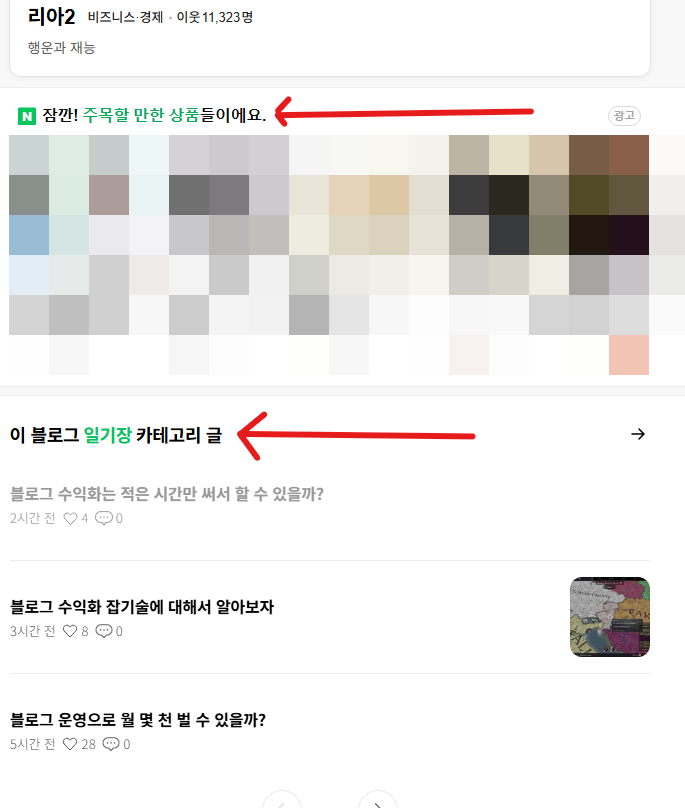

# 블로그 수익화 체류 시간은 어떻게 늘림?
**Date:** 2026. 8. 29. 2:59
**Category:** 일기장
**Original URL:** https://blog.naver.com/xpfkwh56/224393803279
---

1. 바쁘고 바쁜 현대 사회이기 때문에,

사람들이 딱 필요한 요약만 찾기를 원함

​

근데 구분할 지점이 있음

​

**'소비하는 입장'** 과

**'생산하는 입장'** 은

​

같은 정보를 봐도 달라야 된단 것 임

​

2. 요즘도 그런 줄은 모르겠는데,

​

서울에서 지하철 타고 다니다 보면

가끔 미술학원에서 그림을 걸어놓곤 함

​

지나가면서 보면 요란하기도 하고,

​

입시미술이 마치 현대미술 처럼

난해하게 느껴지는 부분도 있는데,

​

곰곰2 읽어보면 대체로 이유가 있음

​

3. 나야 붓 놓은지 한참 되었지만,

​

그림에는 **의도** 가 있어야 하고,

**'근거'** 가 있어야 하며,

​

어떤 테크닉을 썼으면

나는 이 테크닉을 압니다,

​

라는 **'명확한'** 흔적을 남겨야 됨

​

> 딱 봐서 잘 그린 그림이면 잘 그린 그림이고,
>
> 딱 봐서 별로인 그림이면 별로인 그림 아님?

​

**'소비자'** 의 입장에선 그렇지만,

**'하는'** 입장에서는 다르다는 것 임

​

4. 블로그 카더라로 유명한 것 중 하나가,

n분 정도는 보존해야 된다 같은 것인데

​

사실 **'체류시간'** 은 **'후행성 상관 지표'** 고,

숫자가 많으면 많을수록 나쁠 것은 없지만

​

그 자체만 갖고 접근해야 될 문제가 아님

​

더 구체적으로 예를 들어보겠음

​

지금 내 블로그(리아2) 같은 경우,

거진 내 일기장 이나 다름이 없음

​

체류시간이 순전히 많이 나오는 것은

​

그냥 글이 많으니까 몇 개 읽어보고

저거도 눌러보고 이거도 눌러보거나,

​

특정한 글 몇 개의 분량이 길기 때문에

그거 읽는다고 시간이 긴 경우가 많음

​

So, **'상업 블로그'** 에서도 같이 하면 될까?

​

아님

​

**5. 애포를 누르는 사람들은**

**pc 유저가 아니기 때문임**

​

이게 내가 돈 몇 푼 문제가 아니라,

이 계정에 애포를 잡은 이유이기도 한데

​

**\* 해봐야 아는 거라서**

​

계정이 있으시면 애포로 들어가서,

pc/모바일 전환율, 노출을 보시면 됨

​

**\* 제 경우, 리아2 블로그를 벤치로 삼음**

**일기장 보다 퍼포먼스가 나오냐? 아니냐?**

**​**

**무지성으로 운영하는데 결과가 안 나온다?**

**​**

**그럼 내가 뭔가 잘못 하고 있다는 뜻이고,**

**바로 그 부분이 개선 해야 될 지점인 셈**

​

**'아마'** 대부분의 수익 클릭 발생이

모바일에서 발생할 확률이 아주 높음

​

즉, 체류시간이 높다는 것은

그냥 그 블로그를 오래 켜놨다 가 아니라

​

그 블로그에서 **'할 일'** 이 많았단 것이고,

​

**'비콘텐츠'** 의 구성 을 평가할 수 있는

**'디자인 지표'** 로 역할을 한다고 볼 수 있음

​

6. 말을 더 풀어보겠음,

​

세상에 있는 대부분의 **'도서관'** 이나,

**책방** 같은 곳들은 지하에 위치하고 있음

​

**왜 why?**

​

책이 무거워서 건물 위에다가 지어놓으면

공사비가 비싸지기 때문임

​

마찬가지로, **'설계'** 에는 항상 의도가 담김

​

이런 것들을 관찰하면

인생이 한층 재밌어지는데,

​

푸드코트 같은 것은 지하 1-2층에,

영화관 같은 곳은 대체로 위에 있음

​

**'동선'** 을 구조화 해서 사용자들의

행동 반경을 기능화 하고 있는 것 임

​

7. 블로그도 **마찬가지** 임

​

​

처음에 들어왔을 때,

사람들이 보는 것은 콘텐츠 임

​

콘텐츠 최하단에 들어오면?

​

​

m.PC 로 찍어서 그런데,

​

**카테고리** 가 걸림

​

그리고 그 밑으로 계속

**무한 스크롤** 걸리면서

​

**SectionSearch** 가 나오고,

**AiRS** 페이지가 나옴

​

> **도대체 이게 무슨 말이냐?**

​

모바일 유저로 만약 한정 한다면,

​

1개의 포스팅을 읽고, 그 다음에

가장 먼저 노출될 기회는

​

**'해당 카테고리 내 최근 글'** 로 잡히고,

그 밑으로 **'유입이 빠져나간단 것'** 임

​

**\* 어렵게 데려와서 쉽게 나간다?**

**​**

**많이 버는 것보다 쉬운 것이**

**푼 돈, 나갈 돈 아끼는 것임**

**​**

그럼 **퍼널 구조** 를 이렇게 짜볼 수 있음

​

1) 내부 콘텐츠 간의 결속을 만드는 것 임

​

대표적인 방법은 **필러/브랜치 구조** 로,

​

대분류/중분류/소분류 정도로 나누는

콘텐츠 순회 채널을 설계한 다음에,

​

이걸 카테고리 별로 배치하는 것 임

​

무턱대고 그냥 아무 인기 많은 글이나

url 을 글 밑에 달아놓는 것이 아니라,

​

대/중/소 클러스터 구조를 형성하고,

​

태그로 묶어서 깔끔하게 관리하거나

포스팅 할 때마다 명세를 옵시디언이든

엑셀이든, 따로 본인이 어플리케이션 에

​

보관해서 관리하면 묶어서 처리할 수 있음

​

예를 들어, **[크킹3 설치 오류]** 라는

쿼리로 들어온 사람이 있다고 가정함

​

만약 이 글이 **'설치 오류 모음집'** 의

성격을 갖는 카테고리에 있다고 칠 때,

​

검색자는 과연 다음 글을 읽을까?

​

이게 **'배울 수 없는 것'** 임

​

**\* 내가 모르는 행동은 알 수가 없으니까**

**​**

**80대 할매가 콜라텍 가서**

**제일 먼저 할 행동은 무엇?**

**​**

**→ 그걸 어떻게 알음? 같은 느낌**

**​**

**군입대 앞둔 사람이 군부대 앞에서**

**외식을 하는 것이 나을까? 아니면**

**다른 대안을 찾아보는 것이 나을까?**

**​**

**물론 검색을 아주 열심히 잘 하면**

**찾아낼 순 있지만, 검색으로 안 나오는**

**내 시선과 시각은 찾아낼 수가 없음**

**​**

내가 크킹3 설치 오류 나왔는데,

​

뜬금없이 다른 게임 설치 오류를

해결 하는 방법에 관심 있을 리 없음

​

그러나, 크킹3 공략 이라던가,

크킹3 모드, 크킹3 스타팅 추천

​

같은 것이 연결된 URL 로 있다면

그건 더 **'누를'** 가능성이 높음

​

크킹3 스타팅 추천을 누른 사람은,

그 다음에 이제 무엇이 궁금할까?

​

같은 것을 **'연속적으로 설계해서'**

검색자가 들어와서 페이지 밖으로

​

나가는 거대한 여정을 설계하는 것이

**'체류시간'** 을 다루는 것이라 할 수 있음

​

2) 즉, 체류시간은 그 자체의

숫자로는 **'아무 쓸모도 없는 지표'** 임

​

검색자가 블로그에 들어와서

어떤 경험을 하고, 결과적으로

​

**'광고가 노출될 기회'**,

**'수익 활동'** 과 연결될 기회를

​

받을 가능성을 늘리는 것이 가치 임

​

**8. 잡기술**

​

여기서 이제 AI 가 들어가면 **우아해짐**

​

블루스텍 이라는 프로그램을 사용하면

컴퓨터 환경 내에서도 모바일 환경 처럼

​

직접 **'눈으로 보면서'** 작업 을 할 수 있음

보통 모바일 게임 하는 사람들이 쓰는 툴 임

​

이걸 어디에 쓸 수 있을까?

​

> **바로 AI 에 연결 시키는 것임**

​

AI 한테 내 블로그 페이지를 스크린샷 찍고,

안에 있는 포스팅 본문을 크롤하게 한 다음

​

내용을 읽으면서 여정을 파악하게 하고

행동할 수 있는 경우의 수를 발산 시키게 하면,

​

실제 사람이 어떻게 행동하는진 몰라도,

특정한 **'가설'**을 수립하는 것이 가능함

​

**\* 유입 통계에 내 블로그 위치에서**

**연관 링크로 들어왔으면 돌았다는 뜻**

**​**

블로그 통계에 들어가면, 내 블로그 유입자는 물론

특정 포스팅에 따른 성별/연령 데이터가 나옴

​

**그럼 이제 뭘 해볼 수 있느냐?**

​

성별/연령 데이터를 기반으로

크롬을 하나 연 다음에, 검색을 **강제함**

​

네이버에는 내가 검색한 목록을

저장하고 확인하는 기능이 있는데,

​

그 기능을 사용하면, 특정한

관심사를 가진 가상의 사람이

​

동작했을 때 나올 페이지를

proxy 할 수 있음

​

그럼 똑같이 글 1개를 쓰고도,

더 많은 노출 기회를 얻을 수 있고,

​

더 높은 전환 기회를 확보할 수 있음

​

9. 글이 수백은 커녕, 50개만 쌓여도

인간이 이걸 통제하는 건 **'불가능'** 함

​

**\* 매일 쌓이는 데이터가 너무 많아서**

​

근데 지표들 싹 다운 받은 다음에,

인공지능 한테 박으면 잘 해석해 줌

​

이게 블로그를 **'하는'** 방법 임