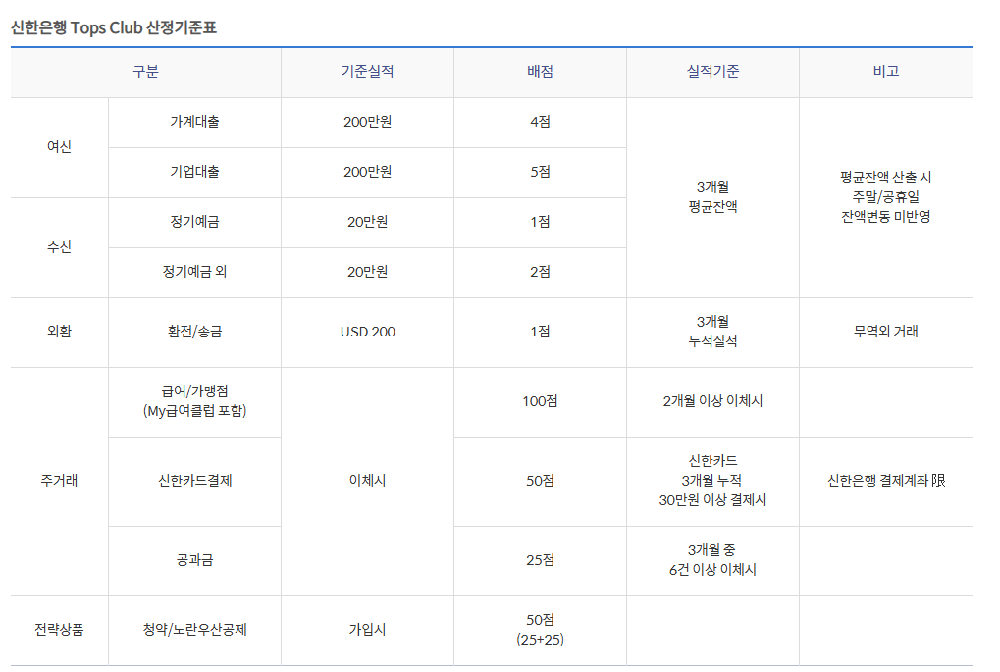

# 잘 노는 사람이 성공하기 더 좋은 이유
**Date:** 2026. 8. 30. 16:25
**Category:** 일기장
**Original URL:** https://blog.naver.com/xpfkwh56/224395070799
---

1. 비즈니스/경제 블로그 운영을 했거나,

이런 블로그들 구독을 많이 한 사람이라면

​

모를 수가 없는 대기업 블로그들이 있다

​

대체로, 충성 구독자 기반으로 전체 블로그에서

트래픽 기준, 100등 안에 블로그가 있을 것이고

​

검색 노출, 홈판 기반으로 돌아가는

대기업 블로그도 100등 이내 그룹이 있을 것임

​

**이 블로그들은 월 애포 수익이 얼마 쯤 나올까?**

**​**

정말 많이 나오면 300 정도 나올 것이고,

​

**\* 인증샷 노출한 블로그들 기반으로,**

**정말 넓게 잡아봤자 50개가 안 된다**

​

유지까지 되는 기준으로 잡는다면,

월 100-200 정도를 헐떡 거리고 있다

​

2. 그럼 컨텐츠가 구려서 그럴까?

AI 로 딸깍 딸깍 뽑기만 하니까?

​

또는 전문성이 없거나 체류 시간이 짧고,

사람들의 이목을 끌기 어려워서 그럴까?

​

전혀 그렇지 않다

​

물론 네이버에서 밀어주는 버프도 있지만

1명 1명이 거진 **1인 미디어급 파급력** 이고,

​

본인 블로그만 들고 어디 취직을 해도,

내일 바로 취직이 될 정도의 능력이 있음

​

3. 문제는?

​

**'재미'** 와 **'유입 접근성'** 임

​

예를 들어보자

​

투자와 창업은 물론이고 재테크 역시,

**가볍게** 접근해서 될 문제가 아니다

​

**'신용점수'** 라는 키워드가 있다고 치자

​

신용점수는 나이스와 KCB 점수가 다르고,

​

신용점수에 따른, **대출금리 위치** 가 다르며

​

신용등급 → 점수로 바뀌면서,

바뀐 여러가지 제도가 있고 지금 기점으론

​

대외적인 CB사 점수보다

내부에서 사용하는 **CSS** 점수가 중요하다

​

CSS 점수는 은행에서 사용하는

자체적인 신용평가 시스템인데,

​

근래 신용점수 인플레이션이 생기면서

더 이상 **'믿을 수 없게'** 되었기 때문에,

​

내부등급이 외부 CB사 등급을 대체한 상태고,

​

은행에서 쓰는 내부 신용산정 공식은

**심지어** 그 회사 다니는 사람도 모른다

​

다만, **'실용적인 추산 방법'** 은 있다

​

4대 은행 기준, 자사 금융권의

**우수 고객 기준표** 를 제시하는데,

​

은행에서 대외적으로 **'공신'** 할 수 있는

유일한 지표가 이거고, 사람들이 흔히 아는

​

**'카더라'** 스타일 대출 잘 받는 법 계열의

​

**\* 적금 가입해라, 급여이체 하나로 몰아라**

​

경험적 원천이 문서화 된 유일한 접근 경로다

​

​

즉, 신용점수 를 **'올리는 법'** 에 대한

**'검색 과업'** 은 그 쿼리로 안 나온다

​

신용점수 올리는 법 자체가

**잘못된 접근** 이기 때문이다

​

신용점수를 올려서 대출을 잘 받겠다가 아니고,

​

CSS 점수가 중요하고, 그 CSS 점수는

대외적으로 공개된 것이 아니기 때문에

​

금융사에서 신용점수를 채권 회수율과

연루하여, 신뢰할 수 있는 고객 통계를 쓰고,

​

그 통계를 기반으로 판정할 **확률**이 높으므로

​

주거래 은행을 확보하고,

​

주거래 은행에서 권장하는 규격에

맞게 끔 내 금융 기록을 남기는 것이

방법 이라는 것이 **'의도'** 클로즈 임

​

4. 일단 이건 **재미가 없고**,

​

**단기**에 해결할 수 있는 문제도 아니며,

안다고 내가 딱히 개입할 것이 있지도 않음

​

그럼에도 불구하고, **'경제, 금융, 재테크'**

계열 **'대부분'** 이 이렇게 밖에 답이 안 나옴

​

**반면에 이런 접근을 한다면 어떨까?**

​

> 남자친구랑 데이트 통장 하는데,
>
> 매번 먹고 싶은 것을 남자가 고른다

**​**

**5:5 로 하기로 했고, 총 예산은 200 인데**

**거기서 내가 20씩 3개월 연속해서 내고 있다**

​

실제 그런 줄은 모르겠지만,

관측된 결과에 따르면 이런 콘텐츠가

​

앞서 **'클러스터 도메인'** 을 요구하는 정보 대비,

트래픽과 리텐션이 **압도적으로** 더 좋다

​

삼성전자 기업 분석하는 방법이랍시고,

​

화려한 용어로 공식을 뽑아주거나

교과서 내용을 쉽게 푸는 것도 노잼임

​

근데, 삼성전자가 전 세계 기업 대비

**'얼마나 뛰어난 기업'** 인지 용비어천가 쓰기,

​

한국 반도체 시장이 국제 경쟁력이 어떻고,

대외적인 평가가 어떻고, **'일본과 중국'** 대비

얼마나 탁월한지, 같은 식으로 작성을 하면

​

**마찬가지로 기대 트래픽 값이 훨씬 더 좋다**

​

5. 이게 왜 재미가 있고, 왜 유입이 되느냐?

​

놀랍게도 그건 **'정의할 수 없다'**

​

재미있는 건 재미있는 것이고,

​

이런 감각, 센스 같은 것은

​

그냥 그 사람이 **'이거 웃긴데? 재밌는데?'**

라고 **'느껴야'** 되는 문제이기 때문이다

​

내가 **패션/미용** 을 하라고 하는 이유도 이건데,

​

1) 패션, 미용, 연예, 맛집 같은 키워드는

기본적으로 구독자층의 **기대 수준** 이 안 높고,

​

2) **'소비'** 에 대한 **개방성** 이 매우 열려있으며,

3) 콘텐츠 작성에 대한 난이도가 높지도 않음

​

6. 왜 미디어들이 **'여자들의 눈치'** 를 볼까?

​

왜 여자들은 결혼할 때, 많아야 2천 3천 있고

​

시집갈 때 **'모은 돈'** 이 아니라,

**'남은 돈'** 을 들고 가는 것일까?

​

이는 위에서 내가 제시한 키워드 쿼리를

**'누가 더 많이 소비하는가?'** 따져보면 답 나옴

​

IT 키워드 같은 경우도, 세부적인 스펙

실제 사용기, 이런 것이 별 의미는 없음

​

**그럼 뭐가 중요?**

​

딱 정확한 비교군 놔두고, 이게 이거보다 좋다

저게 저거보다 나쁘다 처럼 **'알기쉽게'**

비교해서 검색자가 선택할 수 있게 하면 됨

​

이걸 어디에 쓰면 좋고, 누가 쓰면 좋고 (x)

​

대학생이야? 이거 써

주부야? 이거 써

직장인이야? 이거 써

​

**'대신'** 판단을 내려주는 글이 실용 글,

**​**

**'정체성과 감정'** 을 자극하는 글이

대체로 홈판 관심사 네로우에 좋은 글임

​

**7. 결론**

​

사람들이 흔히 생각하는 것과 달리,

T 보다 F 가 먹고 살기에 더 좋음

​

본인이 T 라면 F 로 프레임을

**'동기화'** 하는 과정이 필요함