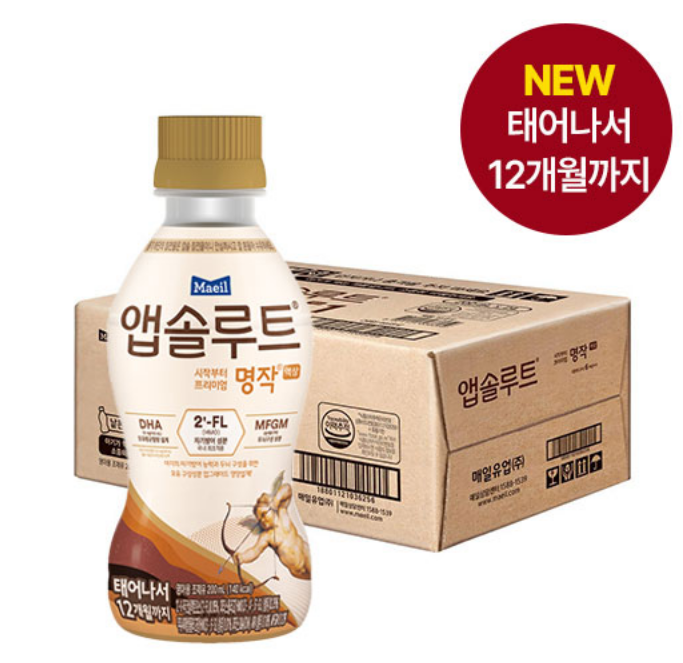
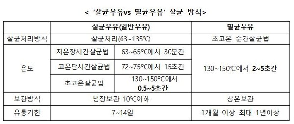
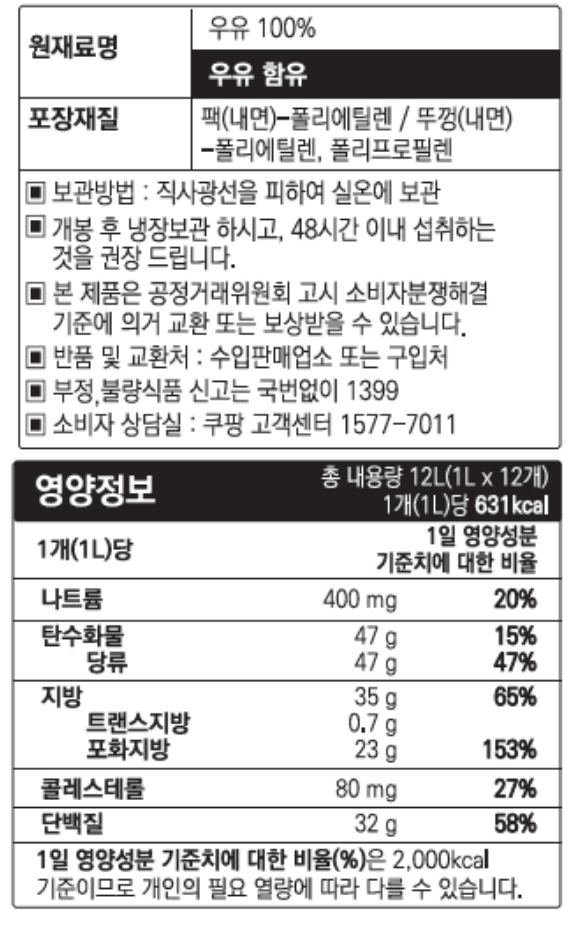
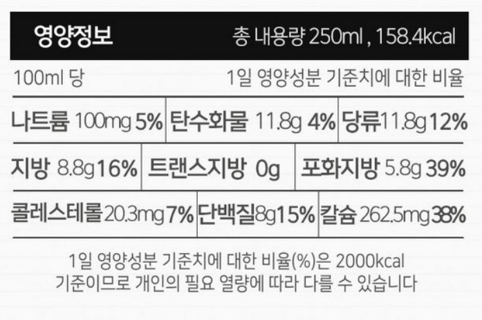
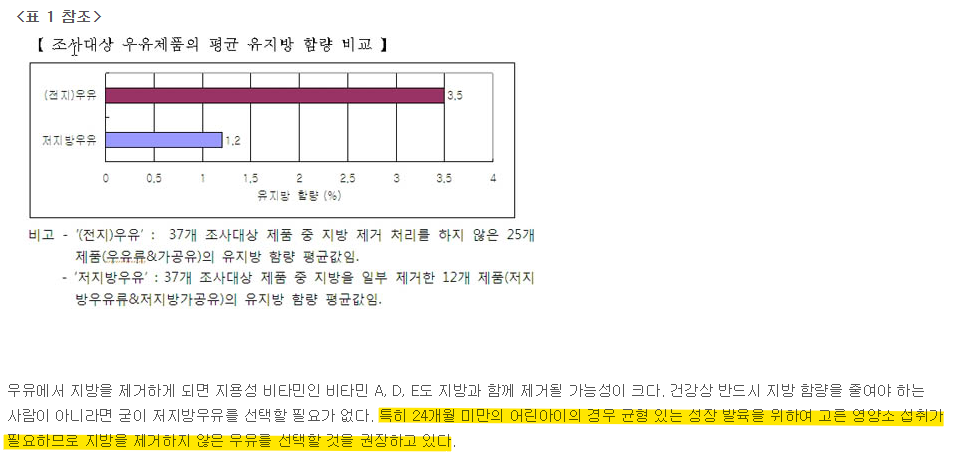
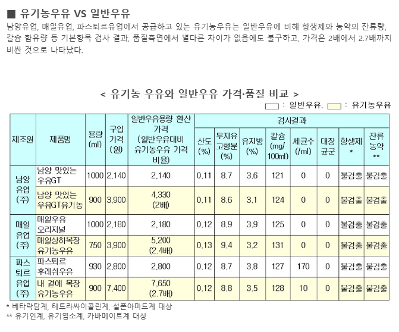
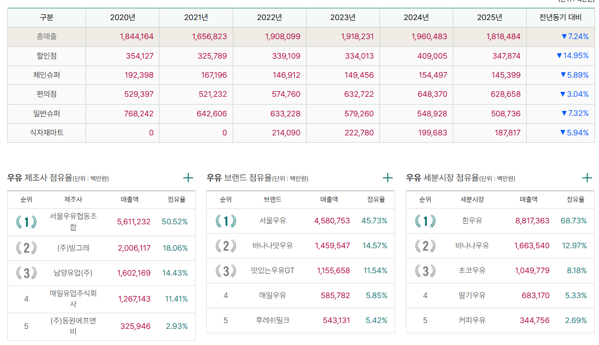
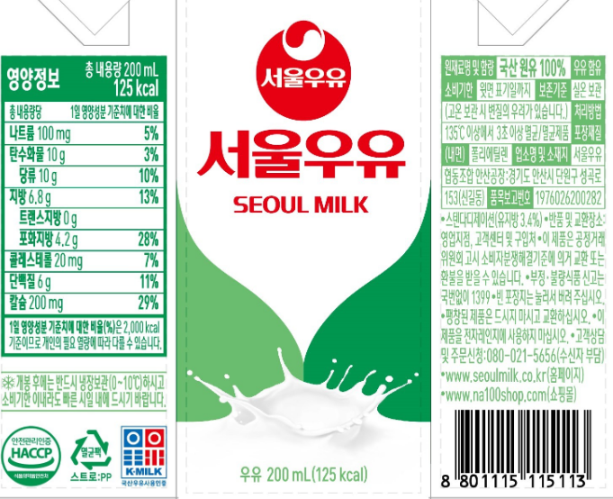
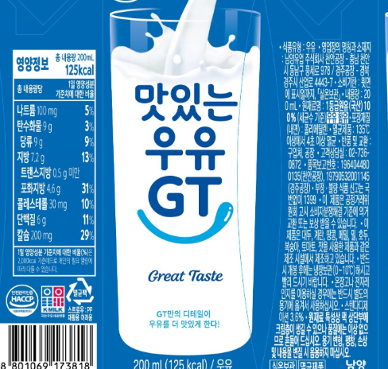
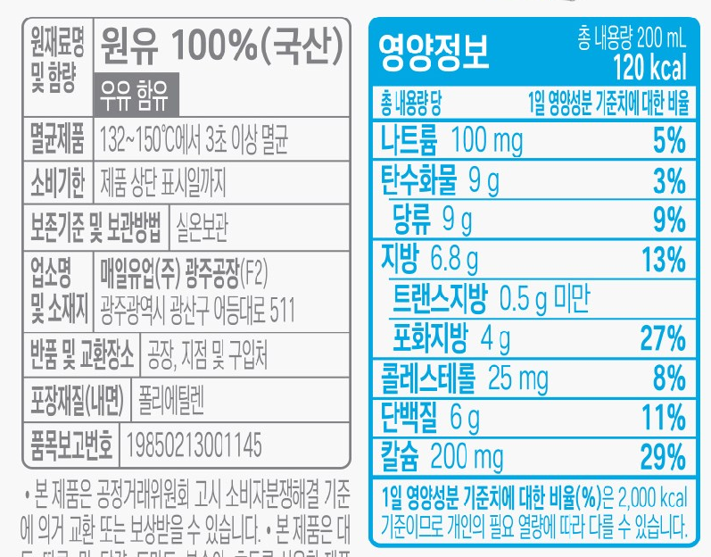

# 돌 아기 우유 결정 하는 방법과 이유
**Date:** 2026. 9. 1. 19:08
**Category:** 일기장
**Original URL:** https://blog.naver.com/xpfkwh56/224397632366
---

1. 갓 태어난 신생아의 대변을 보면,

제대로 된 대변의 형태가 나오지 않음

​

그 이유는 장이 미성숙 하기 때문에,

성인에 준하는 소화효소가 없기 때문

​

즉, 영양이 함유된 상태라는 것과

소화흡수를 할 수 있다는 것은 별개 임

​

이슈가 있다는 조건 안에서 락토프리를 먹이면,

배탈이 날 확률이 현저히 적지만

​

그냥 먹이다보면 소화효소가

생긴다는 얘기도 있음

​

**\* 생긴다는 주장과 해봤자**

**안 생긴다는 주장도 첨예함**

​

그건 보호자 선택 문제로 가는 것 같음

​

​

2. 내 경우, 태어나자마자 이걸 먹였고

​

<https://blog.naver.com/xpfkwh56/224249051570>

[**이유식 ~220일 (스압)**

98년생 네이버 공무원 지망생

blog.naver.com](https://blog.naver.com/xpfkwh56/224249051570)

​

이유식은 이렇게 먹이기 시작했음

​

영검 계측 변수 오차 감안하고,

​

**출생**

​

체중 4.1kg

신장 54cm

두위 37cm

흉위 36cm

​

**생후 1개월**

​

체중 5.3kg

신장 61cm

두위 43cm

​

**생후 약 12개월**

​

체중 11.1kg

신장 76.4cm

두위 47.2cm

​

이렇게 키웠음

​

**\* 물론, 내가 뭘 한다고 해서 된 게 아니라**

**그냥 애가 알아서 된 부분도 상당히 클 것임**

**​**

**엄마 키 160초반(163)**

**아빠 키 170후반(178)**

**​**

분유 → 이유식+분유 병행

→ 돌 이후, 분유를 이제 우유로

바꾸기 시작하는 단계가 온 것 임

​

3. 기본적으로 엄마들이 기억하면 좋은 부분은

분유를 우유로 대체하는 부분에 있어서,

​

그 역할이 **'보조적'** 이라는 것임

​

동서양 연구를 막론하고, 모든 식품 계열의

연구자들이 동의하는 정설은

​

**'골고루 균형있게 적절하게 먹기'** 로,

​

특별한 문제가 있거나 대놓고 사람들이

나쁘다고 말하는 것만 아니라면

​

여러가지 음식을 정시에 적절한 분량으로

규칙적이게 먹는 것이 가장 좋다는 것 임

​

때문에, 분유를 우유로 대체하는 과정 에서

​

우유의 역할이 식사 그 자체를 대체하거나

완전할 수 있다는 오해를 먼저 풀어야 됨

​

즉, 우유는 분유+이유식 혼용기에 있어

점점 분유를 **'떼는 과정'** 이 있다면,

​

이유식 만으로 챙기기에 부족한 부분을

우유로 보조하는 것에 불과하다는 것 임

​

영양학 관점에서, 오로지 우유를 **먹어야만**

충족할 수 있는 영양소는 거의 없다 봐도 되고,

​

각 가정에서 사용하고 있는 이유식에 따라,

​

어떤 식단은 우유가 필요할 수도 있고

어떤 식단의 경우에는 필요 없을 수도 있음

​

우유로 비교적 쉽게 채울 수 있는

대표적 영양소는 칼슘과 단백질 정도고,

​

이조차 치즈나, 요거트 같은 것으로

충분히 대체할 수 있음

​

4. 그럼에도 불구하고, **'대체로'**

아기들이 먹던 식습관 접근성 면에서

​

분유에서 우유로 **전환하는** 과정이

크게 다르지 않을 가능성 이 높고,

​

우유 라는 상품이 급여하는 입장에서도

딱히 불편할 요소가 없기 때문에,

​

사람들이 흔히 그 무렵에 권장하는 것임

​

**\* 알레르기나, 유당 불내증 같은**

**특수 이슈 빼면 당연히, 다른 식품처럼**

**아기한테 먹여서 나쁠 건 없다는 결론**

​

5. 그렇다면, 특별히 어떤 식단에서

무엇이 결핍, 과잉 되었냐를 배제하고

​

우유를 어떤 식으로 결정하면 좋을까?

라는 것이 다음 질문으로 이어질 수 있음

​

우유는 크게 두 분류로 구분할 수 있음

​

일반적으로 우리가 접하는 우유를

**'생우유'** 라고 지칭하고,

​

대체로 팩으로 나오는 우유를

**'멸균우유'** 라고 부르는 편임

​

​

생우유와 멸균 우유의 차이는

영양적으로 거의 차이가 없고,

​

**실상** 유통 관리적 측면 차이만 있음

​

또한, 일반우유(생우유/살균우유) 의 경우

유통기한이 비교적 짧기 때문에

​

수입 상품을 얻는 것이 **거의** 불가능 하고,

​

동일한 멸균 우유를 구입해서 쓴다고 하면

외산이 국내에 비해서 **낙농 경쟁력** 이 높아,

​

전체적인 스펙이 대체로 더 높은 편 임

​

어차피 **내가 먹는 것이 아니기 때문에**,

​

뭐든 처음 먹는 아기 입장에서는

그게 그거일 가능성이 높긴 하지만,

​

**\* 직접 물어볼 수가 없으니**

​

통상 우유 본연의 기호성만을 놓고 보면

생우유가 멸균우유보다 높단 평가가 많음

​

엄마들이 둘 중 무엇을 결정해야 되냐?

라고 한다면, 멸균이냐? 생이냐? 이전에,

​

**'팩'** 으로 급여할 것이냐?

아니면 **'따라서'** 급여할 것이냐?

​

라는 결정에 따른다고 볼 수 있음

​

내 경우, **팩이 더 편리하다고 판단했고**

​

결과적으로 국산 멸균우유 vs

수입 멸균우유로 나눠서 고민을 했음

​

​

가장 인지도가 높은 것이

폴란드산 수입 멸균우유 인데,

​

​

다른 것들도 찾아보면

아기 급여용으로

부담스럽게 느껴졌음

​

**\* 나는 우유가 주영양**

**목표가 아니기 때문**

**​**

그래서 국산으로 방향을 잡음

**​**

**6. 저지방, 유기농 결정하지 않은 이유**

​

**\* 선결론 = 그냥 마케팅 이다**

**​**

소비자24 컨슈머리포트

​

저지방은 나랏님이 별로라고 딱지 달아줬고,

​

​

시판 유기농 우유도 **차이 없다고** 함

​

**7. 우유 시장 점유율**

​

https://www.atfis.or.kr/home/offsales.do

​

**한국농수산식품유통공사** 에서

운영하는 우유 제조사 점유율을 보면,

​

압도적인 1위가 서울 우유 고,

그 아래로 빙그레/남양/매일이 나옴

​

흰우유 단일 상품군으로 한정하면,

​

**1황 서울우유 >> 남양/매일 양강 체제** 임

​

서울우유는 1L 기준, 100ml 355원, 팩기준 300원

매일은 1L 기준 318원, 팩 기준 343원

남양은 1L기준 324원 팩 기준 312원

​

**\* 구입 옵션에 따라 상이할 수 있음**

**​**

​

들어간 표시성분은**다 똑같음**

​

8. 그래서 쿠팡에서 서울우유

멸균으로 구입해서 급여하기로 결정함

​

먹여보고 기호성이 떨어진다 싶으면,

국내 3사 제품 시도 해보고

​

그래도 다 별로라고 하면

그제서야 수입 고려할 계획 임