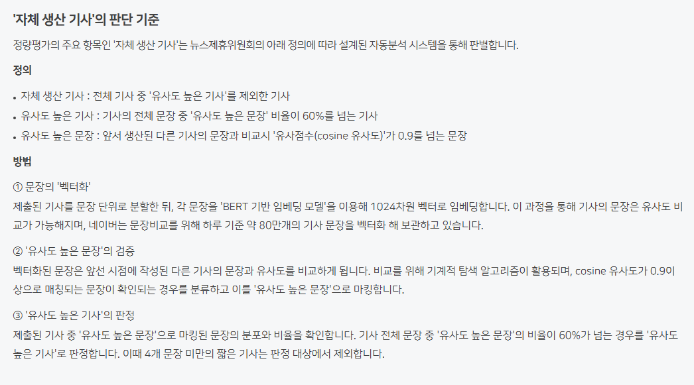

# 알면 좋고, 몰라도 그만인 네이버 콘텐츠 품질 정보
**Date:** 2026. 9. 2. 22:25
**Category:** 일기장
**Original URL:** https://blog.naver.com/xpfkwh56/224398989528
---

**첨부파일**

뉴스\_제휴\_심사\_및\_운영\_평가\_규정.pdf

[파일 다운로드](https://download.blog.naver.com/open/63f67fcfdf85875b7699f8c7ff1a6111baee17f2f7/EFsQa7dDxL3O9tleLuoSggWaFwbSq_x2cV8UKD1m_gMvEYK9V3gn6_24D4YOhn5gqy37bkf77k-n2l6jxjUa-pq3nlfRSBs/%EB%89%B4%EC%8A%A4_%EC%A0%9C%ED%9C%B4_%EC%8B%AC%EC%82%AC_%EB%B0%8F_%EC%9A%B4%EC%98%81_%ED%8F%89%EA%B0%80_%EA%B7%9C%EC%A0%95.pdf)

​

네이버는 도대체 무슨 기준을 갖고 있을까?

​

​

당연히 하나하나 읽는 것은 아니고,

​

BERT 기반 임베딩 모델 이라는 것을

사용해서 80만 개 가량의

기사 문장을 벡터화 한 다음,

​

그걸 바탕으로 문장을 비교하고

유사도 높은 문장을 검증한다고 함

​

블로그에 대해서 공식적으로 밝힌 바는 없고,

​

1차 기계검수 2차 사람 검수 라는 것이

공공연하게 사람들이 알고 있는 내용인데

​

**'아마'** 그 기계 검수 작업에 있어서,

저런 작업이 있을 가능성도 높다고 봄

​

근데 알고리즘 이거 뭐 안다고

도움이 되는가 모르겠는 점이,

​

블로그 인기글 시스템만 해도 없어져가고,

AI 브리핑도 BFS 없어져서 클릭 사라지고

​

딱히 뭘 안다고 차이가 있는 것 같지가 않음

​

예전에 제가 했던 방식이 뭐냐면,

​

AI 브리핑 하단에 있는 **'관련질문'** 탭을

자동화 해서, 질문 의도 쿼리로 결속한 다음

​

그거로 나오는 포스팅들을 크롤 해서,

공통 시멘틱 요소를 뽑는 작업을 했음

​

이렇게 한 이유는,

​

AI 브리핑 하단에 있는 질문지가

**'생성형'** 으로 생겨났기 때문인데,

​

**\* 의미 단위로만 교차됨**

​

네이버에서 자체적으로 생성 로테이션을

돌리는 어휘가, 네이버 엔진이 갖고 있는

일종의 언어 사전이라고 이해했기 때문임

​

만약, BFS 탭 내에서 안 나온다?

​

그럼 네이버에서는 다른 문장 대비 했을 때

그게 쿼리 방향이 다르다고 판정한 셈이고,

​

나온다면 그게 **우선** 된다는 의미 니까,

​

똑같은 콘텐츠를 작성해도 구성함에 있어서

이렇게 하면 AI 브리핑 인용이 더 잘 먹혔음

​

**\* 공백을 잘 잡아줌**

​

근데 얼추 1개월 갔나, 하다가 사라짐