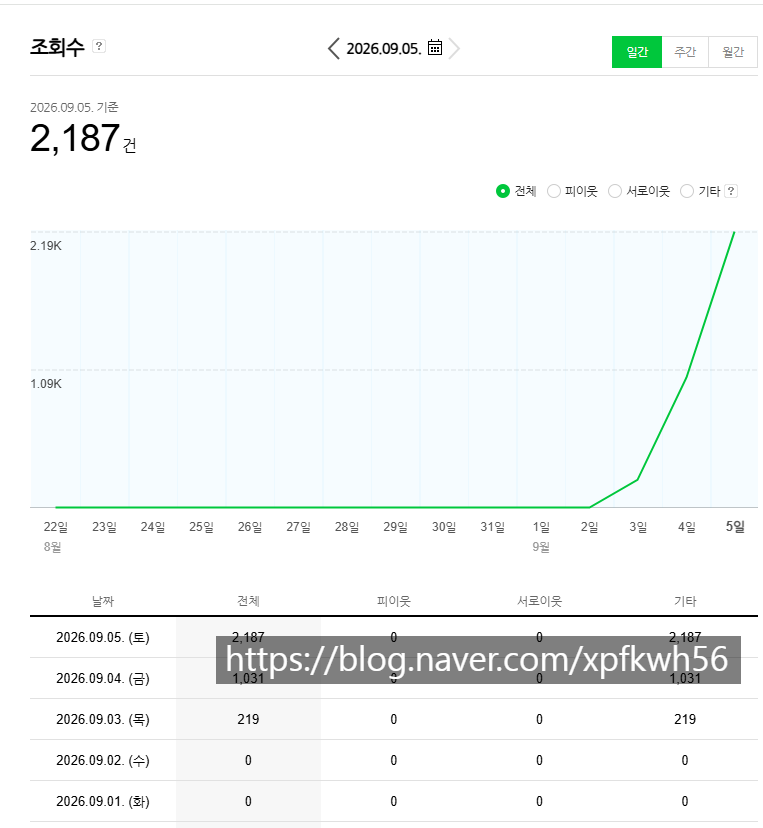
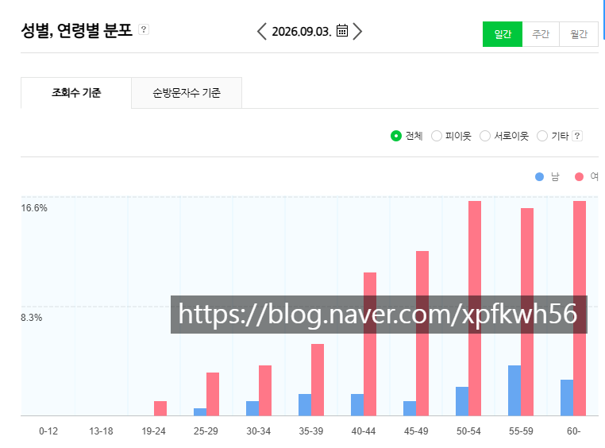
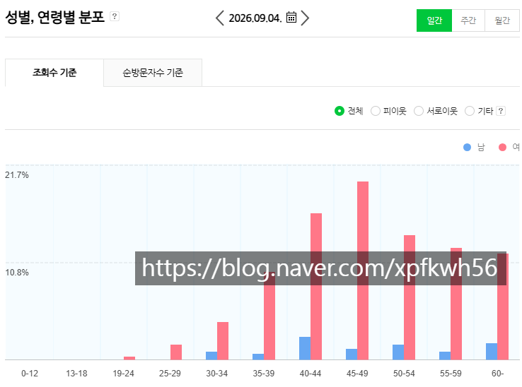
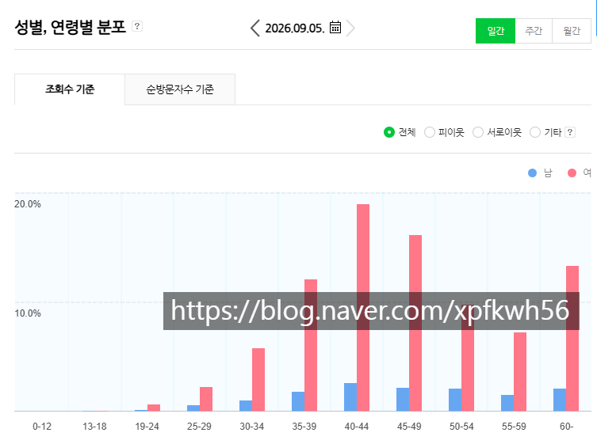

# 바닥에서 블로그 키우기는 통달한 듯
**Date:** 2026. 9. 6. 2:29
**Category:** 스냅
**Original URL:** https://blog.naver.com/xpfkwh56/224402277497
---

​

급격한 트래픽 그래프,

정확한 타겟 독자,

​

기획전략 → 명세 →

집행 → 동적 피드백

​

오프라인 영업보다

온라인 마케팅이

훨씬 더 쉬운 것 같다

​

**지금 내가 갖고 있는 기술**

​

1) 아무리 늦어도 1개월 안에 AI 인용

꽤나 높은 수치 99% 확률로 달성하기

​

2) 아무리 늦어도 1개월 안에

월 트래픽 높은 블로그 만들기

​

**알게 된 것**

​

나는 AI 브리핑 인용이

정량 수치인 줄 알았는데

메이트랑 별 관계가 없음

​

일방문자 1만 까지는 알겠는데

그 위로 갈 방향을 아직 모르겠다

​

내가 블로그에 글 6천개 쓰고,

약 4년 정도 해서 일방 2천인데

​

3일만에 찍히는 것을 보면

​

사람들이 좋아하는 것과 그냥

보는 것은 차이가 분명 있는 듯