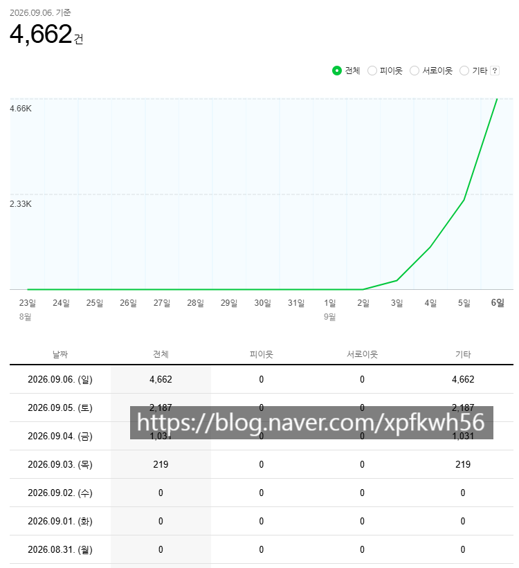
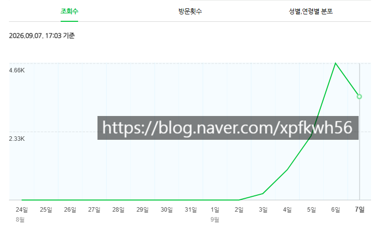

# 트래픽 수익화 블라그 이야기
**Date:** 2026. 9. 7. 17:11
**Category:** 스냅
**Original URL:** https://blog.naver.com/xpfkwh56/224403829319
---

1. **'실질적으로'** 돌아가는

블로그는 약 20만개 언저리다

​

여기서 업자 계정, 중복 계정 같은 걸 빼면

그거보다 더 낮은 사람들이 **'실제'** 하고 있다

​

2. **'유의미한'** 트래픽이 온전하게

발생하는 블로그는 그보다 적다

​

그리고 발생한 트래픽을

수익으로 바꾸는 경우는 **더** 적다

​

3. **'순수'** 자동화를 하려면

인간이 **'결정'** 하는 모든 작업을

라우팅 해야 하는데, 이걸 하려면

​

코딩을 **'읽을 순 있는'** 컴퓨터 기술,

본인이 갖고 있는 특정 **'도메인'** 요소,

​

파이프라인 설계 능력, 복구 능력,

관찰력 과 같은 특정 역량이 요구 된다

​

4. 기계화 할 수 있는 역량은

**'사람'** 이 할 수 있는 것에 한정된다

​

풀어서 말하면,

​

1) 사람이 할 수 있다

→ 직접 하면 됨, 귀찮고 붙어있어야 된다

​

2) LLM 이 할 수 있다

→ 사람이 하는 걸 맡기면 된다

도구를 깎는 과정이 필요하다

통상적으로 비쌀 가능성이 높다

​

3) 스크립트가 할 수 있다

→ 빠르고, 싸고 효율적 이지만

무인 자동 기계화는 **존나**어렵다

​

엄청나게 많은 데이터와 문서,

시행착오 경험의 거의 필수적이다

​

**5. 소결**

​

1) 내가 초보자고, 아무 정보도 없다

아무 경험치도 없는 상태인데 배워 한다

​

나는 단연코, 이걸 **'불가능'** 하다고 본다

​

배워도 그냥 조언이나 참고 정도 받는 거지

결국 본인이 **'실제'** 해보면서 **'맞춰'** 나가야 됨

**​**

**이렇게 보면, 우리는 착각을 할 수 있다**

​

수학이나 영어 같은

공부도 원래 그렇지 않나?

​

선생님이 개념 알려주고, 유형별로

문제 푸는 법 알려주고, 기출 경향을

풀어주면 그걸 기반으로 내가 문제 풀고

생각하는 시간 갖고 하는 것 이잖는가?

​

내가 항상 **'돈 버는 방법 강의'** 에

회의적인 이유가 바로 이 부분이다

​

상업화 강의에서 강사가

알려주는 것은 **목차** 다

​

집합, 명제 라는***​*****'목차'**가 있어요

​

수학 문제집을 보면 첫 페이지 에

목차가 있는데 그걸 읽으면 돼요

​

그러니, **'이게 전부라고?'**

라는 소리가 나올 확률이

​

**'굉장히'** 높고,

​

알려준다고 해도, 실제 시험에 나오는

문제보다 더 쉽거나 강사가 문제를 푸는

**'쇼'** 를 구경하는 것에 가까워지게 된다

​

6. 예를 들어보자,

​

내 경우, 26년 2분기 경 AI 브리핑이 나오고

AI 브리핑의 **'정량적 숫자'** 가 핵심이라 봤다

​

그리고 1개월 안에 AI 인용 숫자를

십만, 백만 단위로 올리는 기법을 찾았다

​

여러가지 방법이 있지만, 그 핵심 골자는

검색엔진에서 검색 쿼리를 결속해서

연결되는 BFS 그래프 알고리즘을 만들고,

​

AEO, GEO 측면에서의 콘텐츠 전략/기획,

실용적인 실제 집행과 자동화 까지 한 건데

​

그 근간에, **'관련질문'** 이 있었다

​

> 관련 질문?

​

지금은 사라진 기능 이지만, 네이버 에서는

과거 AI 브리핑 블록이 나오면 하단에

검색어와 관련된 연관 질문들이 나타났다

​

여백이 부족해, 자세히 설명할 순 없지만

결론만 말하면 그 연관 질문은 **생성형** 으로

작성된 자연어 처리 구조를 갖고 있었는데,

​

관련 질문은, 검색자의 **'의도와 과업'** 과

연결된 질문이 나올 가능성이 높다 **추론** 했고,

​

서버 호출로 재귀 트리를 만들어서,

​

관련 질문이 5개 나오면, 그 5개를 누르고

눌러서 나온 답변이 1-2 페이지 안에 있는가?

​

없다면, 왜 없는가? **'네이버 크롤 봇 모델'** 은

문서를 **의미로 어떻게 읽는가?** 를 계산 했었다

​

즉, 주식계좌 만드는 **법** 이라고 검색을 하면

​

사용자는 주식계좌를 만들고 싶고,

구체적인 그 방법과 타인이 겪은 시행착오

​

다른 사람의 경험을 레퍼런스 삼아서,

빠르고 쉽게 **'계좌 만들기'** 를 하고 싶어한다

​

하지만 그건 일반론에 지나지 않고,

실제로는 **'막히는'** 지점들이 필히 있다

​

증권사가 여럿인데 무엇을 써야?

​

키움? 미래에셋?

어떤 계좌가 **'나한테'** 맞는가?

​

UX/UI 측면에서는? 수수료는?

지금 계좌를 만들면 주는 이벤트는?

​

**'오늘'** 현실에서 사용하는 사람이

겪는 문제들이 **'관련 질문'** 에

​

나왔어야 했는데, 네이버는 아마도

그걸 다 결속하진 못 하는 것 같았고,

​

반복적으로, **'직장인, 워킹맘'** 등과 같은

ID 키워드들이 결속되는 결과가 나왔었다

​

이를 통해 알 수 있던 것은,

​

ID, 즉 상황별 대응 가이드 및 메뉴얼 이나

네이버의 주요 검색 이용자들의 Proxy 값이

​

쿼리에 맞게 최적화 된 상태가 아니란 뜻이었고,

​

나는 **네이버메이트** 가, 자기들 서버비 안 쓰고

콘텐츠 제작자들이 이걸 **'시장 논리'** 에 맞게끔

​

채워주길 바라는 것이라고 해석했다

2개월이 지났고, 그 사이에 변화가 있었다

​

먼저, 네이버메이트는 정량 지표 보다

**'정성 지표'** 를 압도적으로 많이 반영했고,

​

매우 높은 확률로 **'인간 게이트'** 가 있었다

​

또한 관련질문 서비스 자체가 삭제 되면서,

**BFS 알고리즘** 을 더 이상 사용할 수 없었다

​

그럼에도 불구하고, 나는 그 작업을 하면서

얻은 노하우를 통해 **'쿼리 연산'** 에 넣었는데,

​

이 방식은 검색자의 과업이나 의도를

복원해, 네이버에서 제공하는 각 탭들이

​

**'어떤 역할'** 을 하는 것인지

역추적하는 곳에 쓰였다

​

조금 더 풀어보자,

​

네이버 블로그 이용자가 보는 곳은

**통검** 과 **블로그 탭** 이다

​

통검은 기본적으로 작성 신원을 파악해서,

신뢰할 수 있는 키워드를 상위 노출 시키고

​

블탭은 신뢰와 별개로, 정보의 최신성 이나

관련성을 중심으로 하는 배치를 쌓아가는데

​

그 말은, 통검에서 블탭이 상위에 나타나는

오쏘리티 쿼리가 있다고 할 때,

​

그 쿼리는 블로그에 더 유리하단 뜻이 된다

​

즉,

​

**복지/정책/지원금 키워드 같은 경우,**

**언제나 최상위 노출은 정부 기관이 차지**

​

그리고 거기서 답을 찾을 수 없는 사람들이

하단으로 내려가면, in.naver 를 필두로 하는

​

네이버 공식 인플루언서 와 같은

공인들이 트래픽 위치를 선점하고,

​

그 다음이 **'공인된 카페 내에서 대중들이**

**자주 그 이야기를 하고 있는 탭'** 을 제시해,

​

검색자의 여정을 꾸리고 있다는 건데,

​

> **접두, 접미, 시멘틱 쿼리에 따라서**
>
> **블로그가 2탭이 아니라 1탭을 차지하는**
>
> **결속값이 통계적으로 관찰된다는 것이다**

​

대표적인 것이, **방문/후기 쿼리** 인데

​

맛집, 경험담, 정량적으로 지표화 할 수 없는

비결정성 키워드들은 공신력을 규정할 수 없다

​

**금곡동 당구장 댄스 무료 이벤트 방문 후기**

​

같은 경우는, 그래서 통검 상위가 **전부** 닫히고

블로그가 압도적 빈도로 상위에 배치되게 된다

​

그 말은 곧,

​

이 게임의 규칙이 롱테일 depth 키워드를 잡아서

다량 발행을 하는 것이 **'시작점'** 이란 소리고

​

depth 값에 들어갈 수 있는 인풋 트리거를

**누가 얼마나 포착하느냐?** ​게임이란 말이 된다

​

부수적인 개념을 몇 가지 생략 했지만,

**엔티티 그래프/클러스터** 개념이 들어가고

​

1명의 명확한 과업자 페르소나를 생성해,

그 사람의 반경으로 청킹될 수 있는 임베딩 값을

자체적으로 RAG 화 하면, 실상 내가 갖고 있는

​

세미 엔진이 네이버 노출기와 **'유사한'**

기대 결과값을 추측할 수 있게 되는데,

​

어차피 큰 블로그는 이미 출처 신뢰성이 잡혀서 무지성 따라해도 똑같은 결과 안 나옴

​

**그럼 이런 그래프가 나오게 된다**

​

내가 추적한 결과에 따르면 일간

트래픽이 2만 이상 발생하게 되면,

​

**\* 일방문자 1만 이상**

​

그 시점부터 블로그가 대외적으로

노출되는 빈도값이 증가하는데,

​

월 수십만, 수백만 트래픽이 찍히는

블로그를 갖고 있다면 그건 노출될 때,

​

아주 빠른 속도로 파이를 먹히게 된다

​

블로그만 그런 것은 아닌 것 같지만,

​

기본적으로 SNS 채널 자체가

a>1일 때 로그 그래프 개형을 따라,

​

초기 상승값은 높고, 일정 수준에서는

고착되지 않게 하는 흐름을 갖는데

​

나는 그게 꽤 유망한 트래픽 결과를 겪었던

사람들이 **'강의판'** 으로 가는 이유 중 하나라 본다

​

자신이 처음부터 **서브** 계정을 파서,

​

끝까지 맞추는 생산 단가 대비,

소비자에게 얻는 매출이 더 높으므로

​

7. 그렇다면, **'배우는 입장'** 에서

엣지에 머무르면서 저걸 따를 수 있을까?

​

100m 달리기 하는데 뒤에서

선풍기 바람 불어주는 정도의

도움은 아마 받을 수 있을 것이다