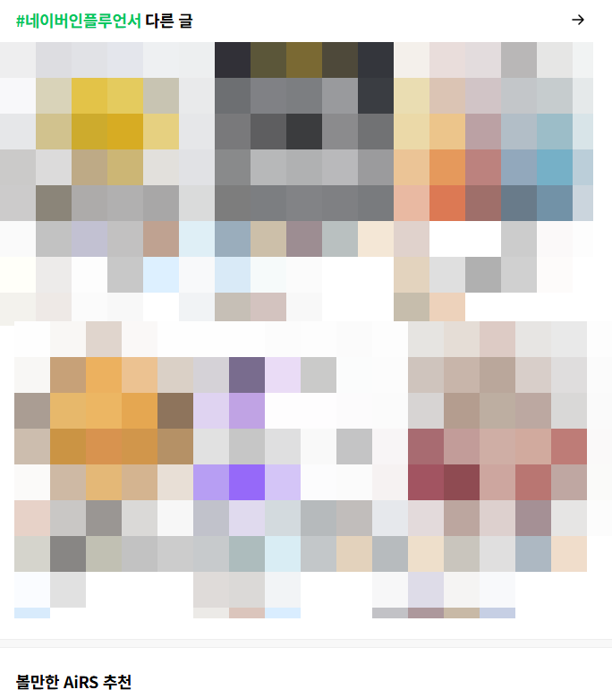

# 태그는 안 중요하다?
**Date:** 2026. 9. 13. 14:26
**Category:** 스냅
**Original URL:** https://blog.naver.com/xpfkwh56/224410131037
---

​

모바일 환경에서 스크롤 끝까지 내리면

잡히는 **'다른글'** 태그에 걸림

​

즉, 아무 태그나 막 쓰는 것이 아니고

​

1) 홈판 네이버 노출 글이 있어서

불특정 다수 외부 유입을 부르는데,

​

그 글 밑에 달려서 노출이 될 수 있을

태그를 골라서 붙이되, 그 태그가

본문의 주제 관련성 에 솎아들어가야 됨

​

이렇게 유입되면, 사이트 유입에 있어서

타 블로그 로그에 잡힘

​

2) 타 블로그 로그에 잡혔다는 것은,

​

사용자가 처음에 들어온 문서에서

무언가 충족되지 않았다는 뜻이고 (STA)

​

**기존 블로그의 점수를 깎고,**

**내 블로그의 점수를 얻을 수 있는 행위** 임

​

**퍼널 구성** 을 잘 하라는 이유가,

​

사람이 내 블로그 안에서 돌고 돌아야지

밖으로 빠져나가 좋을 것이 없기 때문 임

​

3) AiRS 는 해당 계정의 관심사

신호를 체크할 수 있는 주요 요소인데,

​

다계정 보유자면 일부 계정 들로

자기가 타깃하는 블로그 몇 개 고르고

​

이웃 추가도 하고, 공감도 찍어보고

공기계로 체류도 시켜보면서

​

알고리즘 셋팅 잡아놓은 후,

​

홈판에 나오는 글만 쭉쭉 눌러봐도

내가 역공학 할 수 있는 주제들 나옴