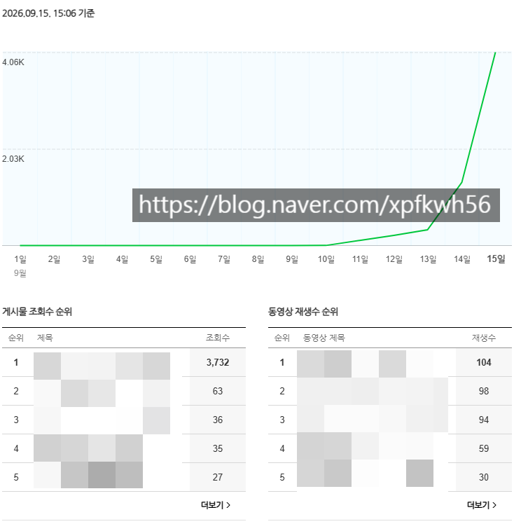

# 다계정 + 홈판이 답
**Date:** 2026. 9. 15. 15:13
**Category:** 스냅
**Original URL:** https://blog.naver.com/xpfkwh56/224412529996
---

​

1. 신규 계정 → 정말 늦어도 1개월 안에 터짐

​

최대 빨랐던 것이

3일 만에 터진 거고,

1만블 안정화

​

아무리 늦어도 2주 안에 터짐

​

홈판 노출 빈번하게 발생하기 시작하면

1조회 → 적게는 3원에서 10원 이상 나옴

​

5원 나온다 치고, 10만 터지면 50만

​

**2. 어려운 점**

​

1) 소재, 카피가 **'매우매우 중요'**

​

이 감각을 어떻게 AI 가 재현하도록

만들어 내느냐? 가 생산성의 핵심

​

일단 내 생각으론 프론티어론 **불가** 임

​

2) 단일 계정 리스크 **매우매우 큼**

​

홈판은 실상 유튭 알고리즘이랑 비슷

​

그래서 인스타/유튜브 운영을 해본 다음에

하는 사람들은 더 쉽게 갈 확률이 높고,

​

브런치, 블로그 톤이면 헤멜 확률이 높음

​

**3. 비전**

​

1) 만블 10개 키우면, 생계 걱정 없을 수 있음 ,,

복잡한 제휴 마케팅 하면 좋은데 안 해도 됨

​

2) 블로그 **'만'** 하지 말고,

'**클립'** 도 같이 하는 걸 추천

​

사람들이 귀찮아서 안 하고, 번거로워서 안 하는

그런 곳을 잘 노려야 기회를 찾기 좋을 수 있음

​

**블루오션 노리란 말인가요?**

​

아뇨, 그냥 진짜 귀찮아서 안 하는 것들요

​

가입하기 귀찮고, 읽기 귀찮고,

배우기 귀찮고, 그런 것들이 아웃풋 좋음

​

현재 까지 기준으로, 터트린 계정이

몰락하는 상황은 아직 없었는데

​

트렌드 크게 돌아서 메타 바뀔 때까진

따스한 시간을 보낼 수 있을 것 같음

​

평균 2시간 정도? 넉넉하겐 4시간 정도

1회씩 파이프라인 돌아가는 것 점검하고,

​

원고 확인하고, 작업 산출물 보고

공장에 문제 없는지 체크하는 그런 식임