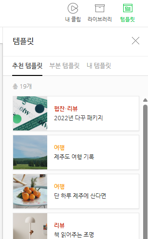
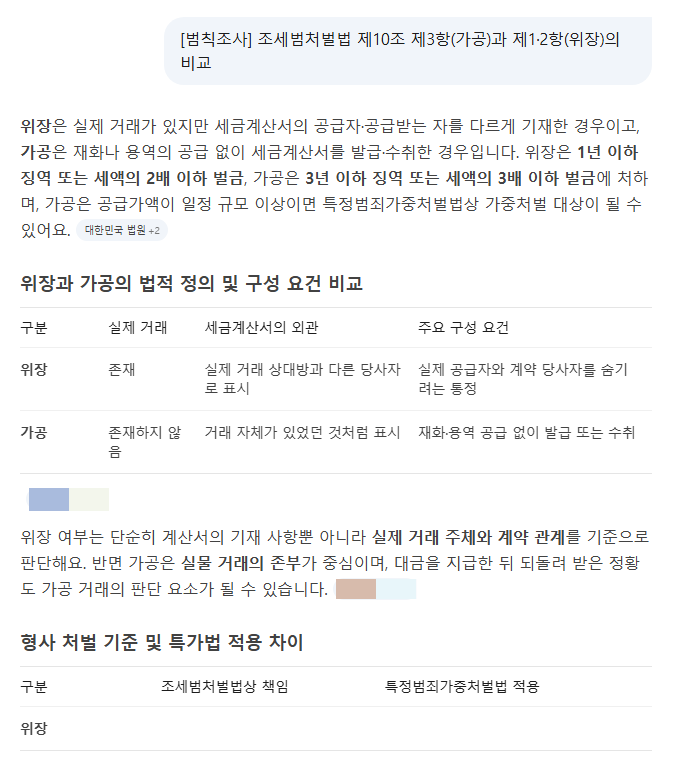
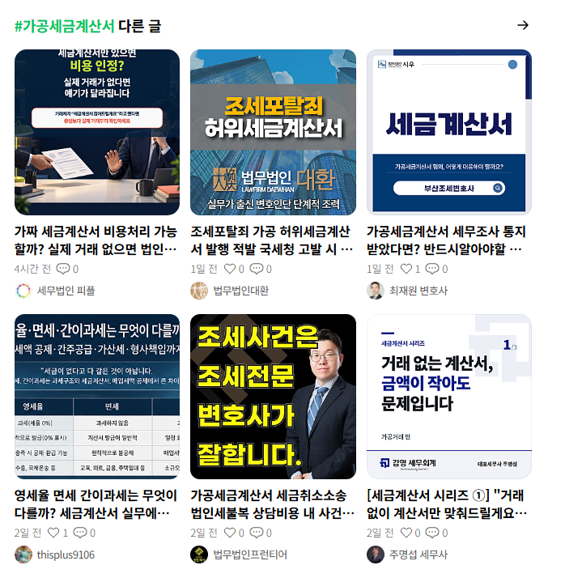
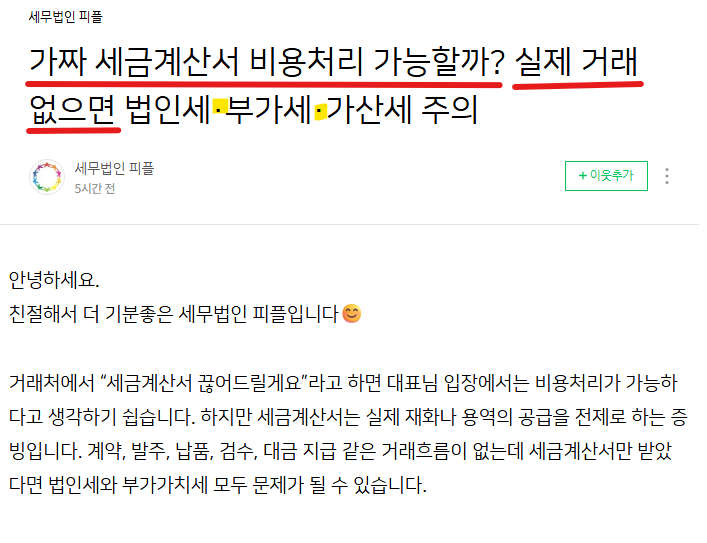
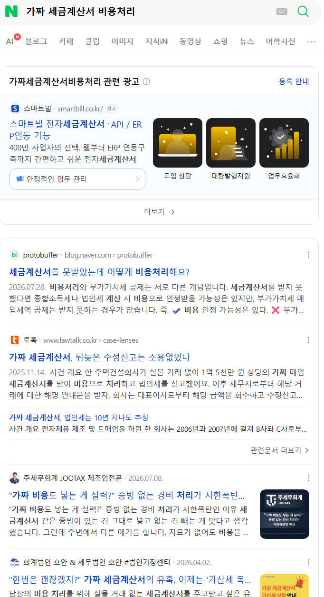
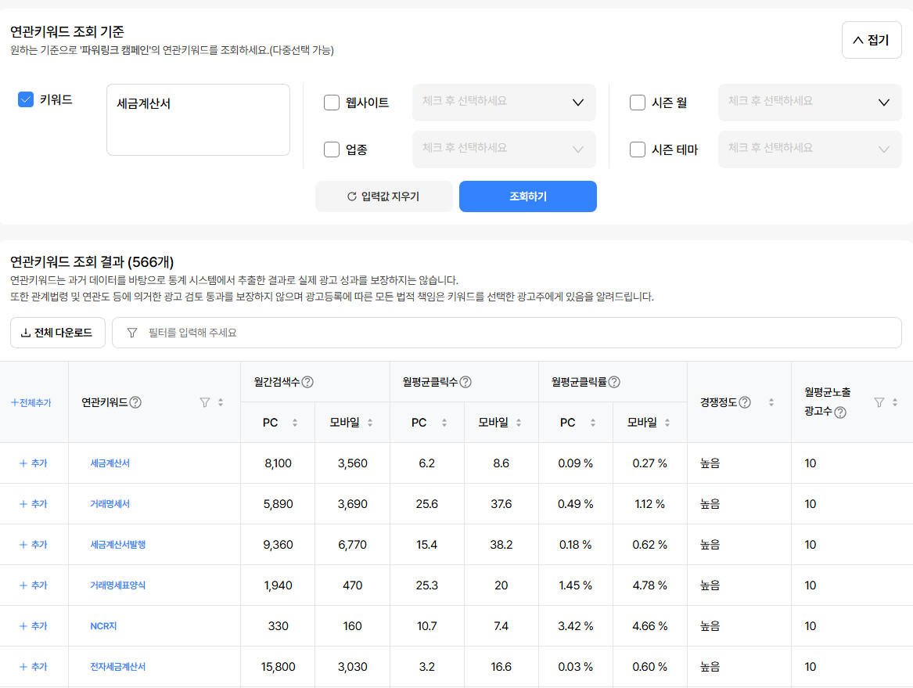
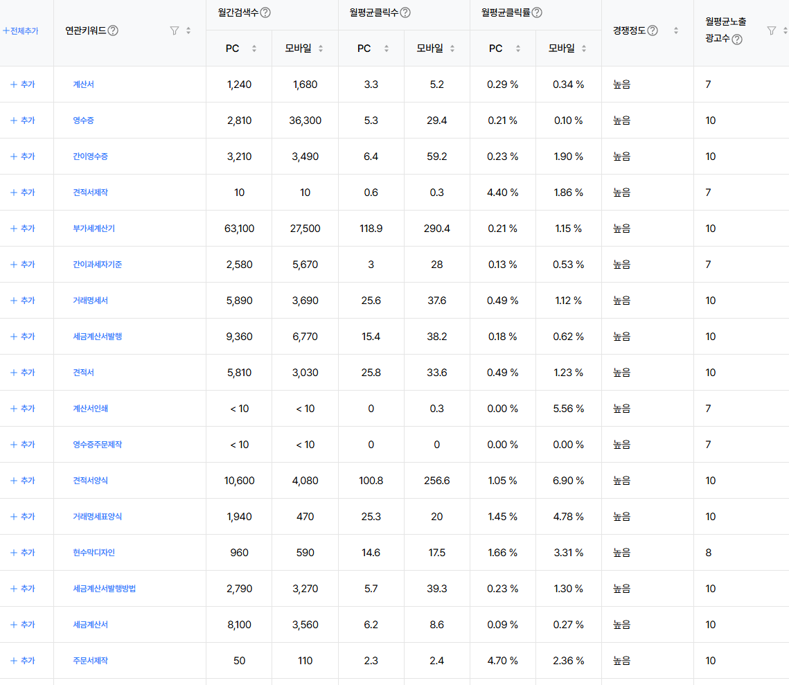
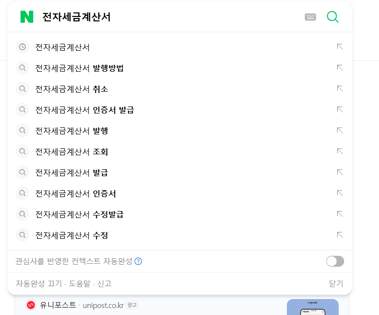
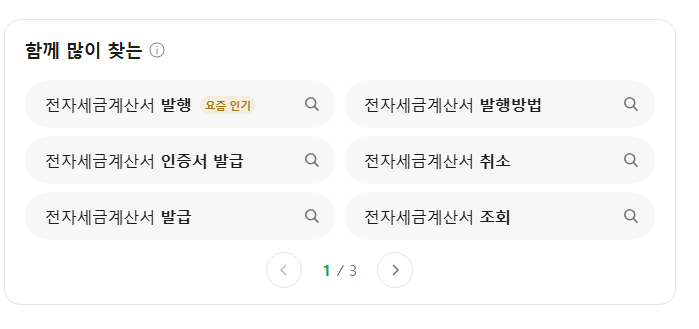

# 레이아웃과 블로그 관련성
**Date:** 2026. 9. 16. 15:37
**Category:** 스냅
**Original URL:** https://blog.naver.com/xpfkwh56/224413808085
---

1. 구글, 유튜브에 **'홈페이지형 블로그'** 검색

​

레이아웃 상단에 빈 칸 위젯 넣고,

카테고리 분화해서 주제 전문성 향상

​

**이걸 하면 좋은 이유**

해당 블로거는 **'사회적 증거'** 가 있음

​

검색엔진은 메가 데이터를 다루기 때문에,

작성자, 정보의 출처로 **휴리스틱** 을 자주 침

​

비전문가의 실제 경험기

vs 전문가의 견해

​

후자가 전자를 씹어먹음

​

**블로그 이름과 소개 글에**

**약력과 전문성을 강조하세욘**

**​**

2. 최근 포스팅 기준,

텍스트로 그냥 적으시는데

​

저렇게 하면 봇이 sb\_text 구분 못 함

​

> 소제목1

---

> 소제목2

---

> 소제목3

​

이런 식으로 컴포넌트 쓰시고,

​

​

템플릿 기능 활용해서 모듈 뜯어다 쓰세요

​

3. 제목은 파이썬 디폴트 byte 기준,

38-42자 넘지 않는 것이 좋고,

​

25자 안에 핵심 쿼리 다 담겨야 됨

​

최근에 쓰신 글 1개를 해보겠음

​

​

네이버 ai 가 읽어오는 정보는 **'저 수준'** 임

나머지는 정보의 압축/요약 되면서 다 뭉개진 것

​

1) 두괄식

​

결론, 요약, 핵심이

700자 이내에 나와야 됨

​

**\* 700자가 꼭 정량은 아니고,**

**여튼 빨리 나올수록 좋음**

**​**

2) 리드에서 **'문제를 드러낼 것'**

​

조세형사법을 찾는 사람들이 겪는 문제가

담기는 copus 쿼리를 찾아야 될 것 같은데,

​

고거슨 제가 잘 모르는 분야라

시간을 조금 써야 될 거 같읍니다

​

​

태그로 묶이는 글,

​

모바일 환경 하단에 페이지 연결로

노출되는 경우, 블로그 유입으로 잡히는데

​

#가공세금계산서 태그 쓴 다른 검색군에서

내꺼로 유입될 동인/유인 없으면 쓰나 마나 임

​

**\* 마침 6개의 블로그가 다 본인 신상을 까고 있쥬?**

**YMYL 은 저거 없으면 노출 시키기 아주 어렵습니다**

**​**

**→ 내가 여간하면 경제/비즈 하지 말라는 이유**

**​**

**경제/비즈는 경제/비즈의 탈을 쓴 가십 블/이슈 블**

**어그로 글 같은 것을 써야 블로그 성장 시킬 수 있음**

**​**

​

내용을 봅시다

​

​

앞에 있는 소개 문구는 큰 의미 X

노이즈 처리 될 겁니다 아마

​

**\* 출처 인용이 많은 경우 예외**

​

소제목 구분이 안 돼 있고,

​

CTA, 그리고 모바일 환경에서 개행이 안 돼서

벽돌글 처럼 보이는 부분이 있네요

​

체류에 도움이 안 될 확률이 높음

​

다만 제일 상단에 전형적인 SEO 글쓰기

도입 구조를 갖고 있는 것이 보입니다

​

특문을 볼 때, 지피티 확률이 높다고 봅니다

​

**\* 대시, 중앙점 같은 걸 한국인은 잘 안 씀**

​

이제​ **'뇌'** 를 빼고 읽습니다

​

행간을 읽는다, 추론한다 그런 것 없습니다

​

**갓 한글 배운 3살짜리 어린아이** 라고 생각하고,

​

**\* 존나 중요, 본인의 독해력을 1도 쓰면 안 됨**

**​**

글을 읽어보면 제목에 대한 답이 나오나요?

제 눈에는 잘 안 보입니다

​

​

최상단 광고, 이어서 하단에 웹사이트,

블로그 순서로 나오네요

​

7월, 6월 글이 보입니다

​

둘다 블로그 조회수를 보니까,

오후 3시 30분인데 매우 낮네요

​

​

데이타 분석을 해봅시다

​

​

저라면 이 키워드를 쓸 것 같습니다

​

검색 수요가 전자세금계산서가 뭔지,

수기 발행이랑차이가 뭔지,

​

컴퓨터로 어떻게 발급 받는지,

어떻게 해야 되는지 같은 얘기가 많네요

​

**4. 결론**

​

전문적이고, 실제 필드에 있는 사람들이

도움 되는 정보를 쓰면서 값을 받고 싶다

​

네이버 버리고, 유튜브가 정답

​

네이버는 지금 다루시는 화제 보다

훨-씬 더 얕아야 하고, 더 쉬워야 됨

​

**한글 배운지 6개월 된** 외국인이 궁금해 하거나,

​

그런 외국인이 이해할 수 있는 콘텐츠 아니면

순수 쌩 트래픽에는 별로 도움이 잘 안 됨