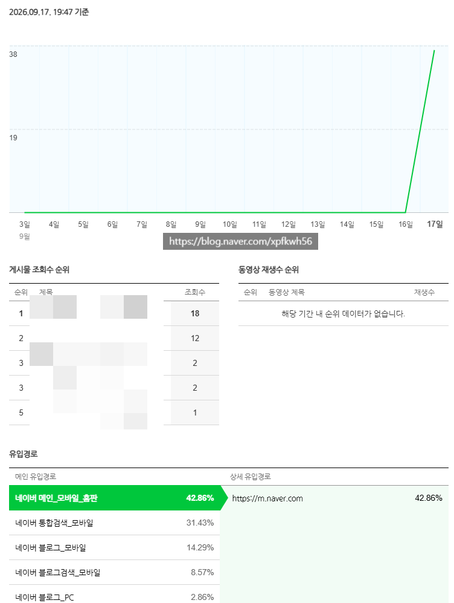
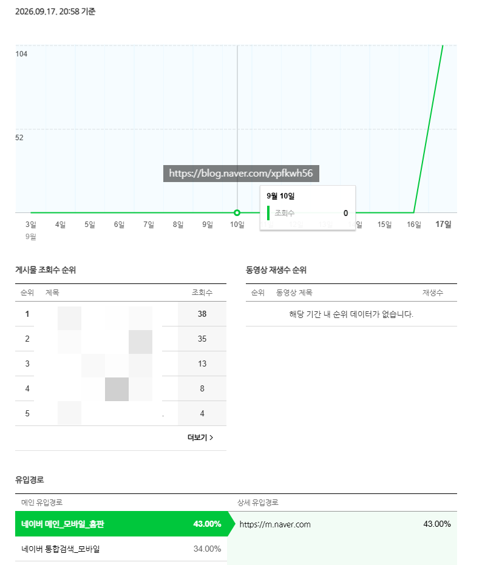

# 솔직히 방법 이랄 것은 없고
**Date:** 2026. 9. 17. 21:37
**Category:** 스냅
**Original URL:** https://blog.naver.com/xpfkwh56/224415333651
---

​

지금 인터넷 세상에 있는 사람들이

무엇을 궁금해 하고 있지?

​

라는 걸 눈치껏 빨리 봐야 되는 듯

​

저는 ai 도움 많이 받고 있는데

인프라를 갖추긴 쉽지 않을 거고,

​

갖춘다고 해도 유지보수가 딴 얘기고 ,,

​

복잡하게 설명하면 디테일 하나하나

끝도 없이 갈 수 있어서

​

편하게 하다가 마침 걸리면

​

운이 좋구나 하는 것이

현실적인 것 같기도 함

​

사돈의 팔촌, 친인척

전부 네이버 가입 시킴

​

더 벌면 좋은 거고, 제가 해보니까

월 30만 조회수 정도 꾸준히 찍어주면

​

무조건 10만원 이상은 100% 벌거든요?

조회수 1당 밴드 0.4~10 잡으시면 됨

​

**\* 평균적으로 계속 한다고 치면 1 이고**

​

왜냐면 홈판이 계속 된단 보장이 없어서

검색블이 저점 체급이 되는 경우가 많은데

​

검색은 쇼커나, 쿠파스, 제휴 원고 같은

다른 방식을 쓰지 않는 한 저기서 멈춤

​

홈판 메타나, 알고리즘이 안 바뀐단 전제 하에

또한 지금 시스템이 계속 유지된다는 가정 하에,

​

이슈 잘 잡고, 어그로 잘 끌고,

**'대중적'** 인 콘텐츠 잘 다룰 수 있으면

​

그래도 끝나기 전까지 돈 1-2천 정도는

열심히 하면 벌지 않을까 싶긴 한데 ,,

​

**\* 매우 보수적으로 잡아도**

​

저도 이게 왜 터지는지 아직 잘 모르겠음

​

1개월 안에 만블 찍은 계정이

지금 열댓개 훨씬 넘는데

​

그냥 계속 올리다 보면 되긴 됨

​

확실한 점은 배워서 한다? ,,

나는 그건 불가능 하다고 봅니다

​

**감각** 이고 **운** 이라서

배우고 말고 할 문제도 아님

​

이다해가 중국에서 30분 만에

200억 매출 터트렸고,

임테기 테스트 11개를 했다

​

이거로 무슨 수로 이야길 만들 것임?

​

어쨌든 저쨌든 사람이 클릭을 해야하고,

좋으나 싫으나 3분 읽고 나가야 되는데