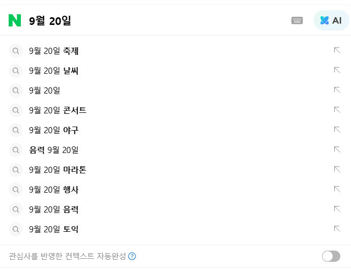
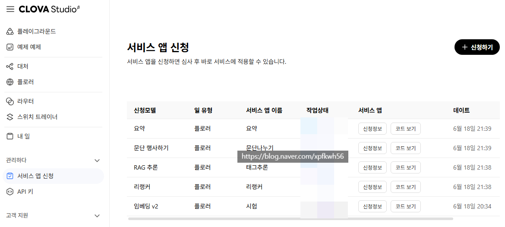

# 블라그와 기술
**Date:** 2026. 9. 20. 13:41
**Category:** 스냅
**Original URL:** https://blog.naver.com/xpfkwh56/224417688828
---

**1. 처음 해야 될 작업은 양 x 질 o**

**그리고 질이 보장되면 그걸 양치기**

​

무작정 많이 올리면 절대 안 됨

차라리 안 하는 것이 나음

​

왜냐면 안 좋은 글을 많이 쓰면 쓸수록

알고리즘은 이 블로그를 **'판단'** 해 버림

​

0 이 아니라 - 에서 시작해야 되기 때문에,

​

돌아가기가 매우 어렵고 심지어 이 상태에서

본인이 노력 까지 해버리면 돌이킬 수가 없음

​

**2. 좋은 글의 기준은 있을까?**

​

없음

​

**그럼 어떻게 해야 될까?**

​

실제 그 블로그에

들어오는 데이터가 전부 임

​

그래서 **'내 블로그로 유입 되는**

**구간과 원리'** 를 포착해야 됨

​

대표적으로 검색글과 알고리즘 글은 다름

​

검색글의 경우, 검색 영토를 넓히는 건데

오늘 만든 블로그가 상단에 노출 된다

​

**불가능** 한 일이니 기대도 안 하는 것이 낫고

​

롱테일 키워드를 쌓아가면서

주제 관련성을 잡아야 됨

​

후술하겠지만, 이 접근은 적어도

26년 시점에서는 **매우 추천하지 않음**

​

알고리즘 글은, 특정 **'관심사'** 로 좁혀진

사람과 내 글을 매칭시키게 할 목적 임

​

관심사는 인물에 대한 정보와

후속 쿼리로 이어짐

​

인공지능을 겁나 잘 쓰던가,

본인 직관 자체가 좋아야 됨

​

예를 들어 보겠음

​

오늘 날짜가 **9월 20일** 임

​

9월 20일이 소재로 들어가는 건 뭘까?

​

​

격리 계정으로 돌렸을 때, 축제랑 날씨 나옴

아래에는 콘서트, 야구, 마라톤, 행사, 음력, 토익

​

그리고 제일 밑에 토익이 나오는데,

​

이를 통해 **'추론'** 해볼 수 있는 점은

​

**'일월이 표기된 날짜 쿼리는 외부 행동'**

과 연결 될 가능성이 있다 임

​

**\* 이게 안 떠오르면 효율적인 방법은 없음**

**​**

축제, 날씨, 콘서트, 야구, 마라톤, 행사

​

네이버 네이티브로 그럼

임베딩 을 뽑아보겠음

​

네이버 네이티브는 어떻게 쓰나요?

​

​

클로바 스튜디오 들어가면 됩니다

​

하는 방법은 클로바 스튜디오

설명서 꼼꼼하게 보면 할 수 있음

​

로컬 모델 받아서, 본인이 튜닝해서 쓰면 공짜고

API 호출 하면 가격마다 다르겠지만 아마 월 10?

정도 쓰면 어지간하면 그냥 쓸 수 있을 것 임

​

예전에는 무료로 크레딧 줬는데

아직도 그런진 모르겠음

​

**네이버 네이티브가 뭔가요?**

​

네이버에서 사람이 일일히 콘텐츠를

하나하나 검수할 **'리가'** 없음

​

그래서 기계적으로 이 문서는 뭔지,

내용은 뭔지, 어떤 건지 알아야 되는데

​

그 분류하는 **'기준 모델'** 은 비공개 일 것임

​

**\* 당연**

​

공개를 해줬어도 그대로 될 리가 없고,

있다고 해도 우리가 쓸 규모가 아닐 것임

​

그러니까 대리해서 네이버에서 팔고 있는

LLM 모델의 성격을 뜯어다 테스트 하는 것임

​

지피티도 있고, 제미나이도 있고,

클로드도 있는데 왜 하필?

​

모델은 가중값에서 자기가 학습 데이터 내에

더 선호하게 된 것과 긍정적으로 연결 됨

​

그러므로 제미나이 글을 제미나이 한테

보여주면 좋은 글이라고 하고,

​

**\* 그게 수렴이 제일 잘 되니까**

​

클로바 글을 클로바한테 보여주면

그걸 제일 좋은 글이라고 기준을 잡음

​

물론 노이즈도 있고, 오라클은 아니지만

같은 돈이면 기왕지사 같은 모델 쓴다 임

​

실제로 in.naver 디스커버 탭을 보면

본문 요약을 시킬 때, 요약 커버리지 재현율이

​

**\* 표본 25만개, 타 모델 대비 10% 이상**

**​**

타 모델 대비, 클로바 모델이 더 높은데

이는 **현행** 모델이 클로바가 아닐 순 있어도

​

선조는 비슷할 가능성이 높다는 증거기도 함

​

무튼, 각 프로브 문장을 넣어보겠음

​

**\* 예시고, 실제는 많이 다릅니다**

**​**

임베딩 함수는 \_clova\_lib.clova\_embed(text, model="v2")

PCA 설명분산비 0.282 / 0.252 / 0.201

​

사잇각도 대부분 70~87°

사실상 직교에 가까움

​

centroid와의 cos 값은

행사 0.713 > 축제 0.699 > 마라톤 0.593

콘서트 0.587 > 야구 0.463 > 날씨 0.440

​

날씨는 다른 쿼리와 아예 다르단 소리고,

축제–행사 0.627 가 가장 높으니까

​

이걸 앵커로 잡으면, 기준이 나옴

​

**\* 실전은 이거보다 당연히 복잡합니다**

**​**

표로 뽑아보겠음

​

|  |  |  |  |  |
| --- | --- | --- | --- | --- |
|  | 모임, 행사 | 스포츠 | 음악 | 기상 |
| 행사 | .613 | .215 | .360 | .092 |
| 축제 | .453 | .214 | .325 | .021 |
| 콘서트 | .230 | .149 | .594 | .049 |
| 야구 | .054 | .395 | .151 | .029 |
| 마라톤 | .160 | .352 | .144 | .031 |
| 날씨 | .198 | .030 | .052 | .553 |

​

무관 명사랑 대조를 해보겠음

​

**\* 276쌍 코사인 분포**

**​**

평균 .193 표준편차 .076

​

5% .079

50% .187

95% .317

99% .397

최대 .520

​

.193 부터 무관하다고 보면 될 듯

​

근데 실제 시멘틱을 뽑아보면,

무관쌍 95% 구간까지 .317 나옴

​

**\* 이런건 직접 쿼리마다 돌려봐야 알 수 있음**

​

이런 식으로 열심히 붙들고 있다보면,

​

내가 쓰려는 어떤 글이 있을 때

그 글의 주제는 무엇인지,

​

클러스터는 어떻게 잡혀있는지,

결속되는 쿼리는 무엇인지,

​

인접축, 대조축 이런 것들이 나옴

​

지금 같은 경우, 9월 20일 쿼리는

날짜 라는 단일 명사랑 결합할 때,

행사랑 가장 밀접한 관계를 지닌다

​

그러니까 여행블 같은 곳에서

행사 정보, 축제 정보, 날짜, 같은 것이

들어가면 관련성이 높은 정보다

​

라는 것 까진 도달 할 수 있는 것 임

​

**\* 문장 쌍이 없으니 이후는 해봐야 됨**

​

태생적으로 소수의 인간들은 아마도,

어떤 글자를 듣자마자 본인 머리 안에서

​

자연 GPU, CPU 돌려서, **이 글이 팔릴 듯?**

​

하고 감각할 수 있는데

그 경우는 이런 것 안 해도 됨

​

3. 위 같은 방식으로 내 블로그에 들어올 사람들이

​

어떤 관심사, 어떤 환경, 어떤 상황, 어떤 조건에

있을 때, 무엇을 필요로 하는지 체크한 다음에

​

검색 엔진에서 연결시켜주는 글을 쓰면

알고리즘에 맞는 글을 쓰는 확률이 올라가게 됨

​

검색블 비추천 하는 이유는,

이미 고여있는 블로그를 뚫고 가야 되는데

​

솔직히 **2depth 이내** 쿼리는 답도 없고,

​

3depth 이상으로 정보글 쓴다고 해도

글 써봤자 3일에 10명 들어올까 말까 임

​

**\* 제대로 된 3depth 이상 정보글을**

**쓰려면 시간도 많이 걸립니다**

**​**

그럼 그걸 하나로 집중해서 쓰면 되냐? 놉,

​

통념과 달리, 단일된 콘텐츠를 반복해서

계속 올리면 어뷰징 걸려서 계정이 짤림

​

본인은 경제 블로그 운영한다고 생각했는데,

알고리즘은 그렇게 생각하지 않을 수도 있고

​

**\* 이 판정은, 상대평가라 다른 거랑 비교함**

​

설령 그렇게 하나를 두둑하게 가져가도,

기대한 것보다 훨씬 더 좁은 영역 전문성만 가짐

​

아예 본인이 브랜딩 된다면 또 모를까

​

**4. 내 생각**

​

유튜브 같은 곳에 보면 무슨 알고리즘이 있네,

어떤 걸로 돌아가네 같은 이야기가 많이 있음

​

근데 현재완료의 용법, 왕래발착동사

같은 **'표현'** 을 안다고 그걸 쓸 수 있냐?

​

그건 아예 다른 문제 라고 생각함

​

**5. 결론**

**​**

스잘대기 없는걸로 돈,

시간 쓰지말고 그냥 기술 배우자 ,,