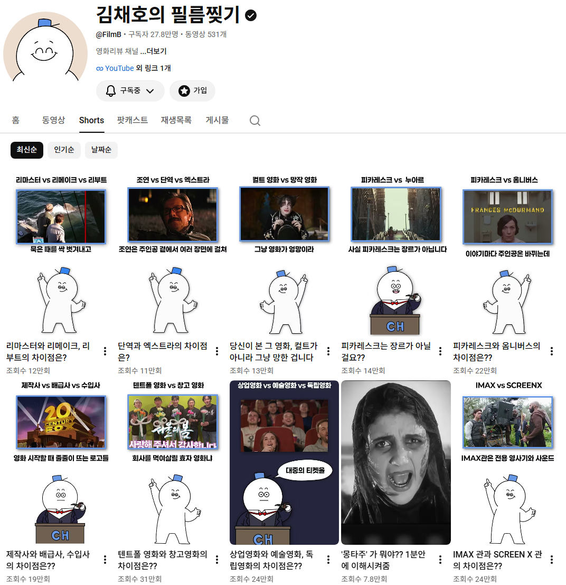

# 교육/학술 블로그에 관하여
**Date:** 2026. 9. 23. 20:10
**Category:** 스냅
**Original URL:** https://blog.naver.com/xpfkwh56/224421225060
---

앞서 말한 것처럼 저런 문제는

경제/비즈 에만 있는 것도 아님

​

네이버는 애초에 **'카테고리'** 를

무슨 생각으로 나눴나도 모르겠는데

​

교육/학문/학술 블로그가 있음

​

**이런 블로그는 어떤 걸 다루고 있을까?**

​

네이버가 보는 것과 내가 보는 건 다르겠지만,

상위 500개 고트래픽 메인 콘텐츠를 내가 추림

​

거기서 다루고 있는 정보는 다음과 같음

​

1) 취업/자격증/입시 정보

2) 학력 사대주의 갈라치기 콘텐츠

​

1번은, 성인 교육 대상 광고 깔리는 곳들 있음

잡코리아나, 리멤버 등등 같은 곳을 들어간 다음

​

공고 내용을 AI 로 싹 크롤한 다음에,

가점 주거나 지원 자격으로 걸려 있는

​

모든 대상을 표로 만들고, 그거 쓰면 됨

​

제일 잘 나오는 소재는,

**중장년 재취업 자격증** 으로

​

공공 채용과 관련 있을수록 잘 찍힘

​

이도 저도 잘 모르겠으면 그냥 이미 잘 나가는

블로그가 쓴 것 보고 살 좀 붙인 다음에

무지성으로 많이 찍어내면 노출 잘 될 것 임

​

다음은, **학력 가스라이팅 콘텐츠** 인데

​

**온갖 성공한 사람들을 다 끌어온 다음에**

그 사람들 학력 가지고 호사가 노릇 하면 됨

​

누가 어디 대학 졸업 했다더라,

​

누가 고등학교 어디 나왔고,

동창이 누구고, 그 전공이 어떻고,

​

무슨 대학 나오면 연봉이 얼마고,

사회적 대우가 어떻고, 입결이 어떻고

​

이걸 맨날 쉬지 않고 쏟아내면

트래픽 빌보드 올라갈 수 있음 ,,

​

저거 다음으로 많이 나오는 것이 **'~뜻'** 임

주로 테마성 어휘 같은 걸로 트래픽 잘 나옴

​

​

이도 저도 잘 모르겠으면, 유튜브 같은 곳에

이런 쇼츠 집중적으로 다루는 분들이 있는데

​

그거 그대로 따라해서 하면 트래픽 잘 나옴

​

교육, 학문이면 시리즈 물로 만들어서

마치 한 권의 교육 서적처럼 만들면

오히려 그게 더 도움이 될 것 같은디요?

​

**전혀**, 수요 없음

​

길어야 2분 안에 이해 안 되면 다 묻힘

​

콘텐츠를 **A4 용지 한 장 짜리**

이력서다 라고 생각하고 써야 됨

​

본인이 쓰고 싶은 걸 쓰지 말고,

사람들이 좋아하는 걸 쓰라는 말에는

정말 정말 많은 말들이 함축돼 있음