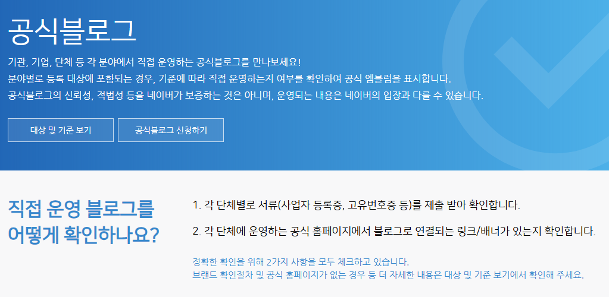

# 블로그 부업 강의에 대한 총평
**Date:** 2026. 9. 23. 23:26
**Category:** 스냅
**Original URL:** https://blog.naver.com/xpfkwh56/224421360505
---

1. 배운다고 돈을 버냐? **No**

​

월 200만원, 300만원을 벌려면

밖에 나가서 다른 일을 하는 것이 낫다

​

**2030 이면 강하게 비추,**

​

내 노동력을 사주는 곳이 있다면

이런 기술을 기웃거리지 말고,

​

같은 노력으로 기술 배우고,

취직해서 스펙을 쌓읍시다

​

일전에 몸이 안 좋거나, 외부에서

딱히 활동할 수 없는 사람이 그럼

대안이 있냐? 라고 누가 얘기했었는데

​

그거슨 ,, 내가 반박이 안 됨

​

진짜 도저히 할 것은 없는데, 난 집에서

인터넷 콘텐츠 눈팅 하는 것 좋아하고

​

이거로 내가 10만원이든 20만원이든

되든 안 되든 해보고 싶다면

그런 경우는 충분히 해봄직하다고 생각

​

2. 돈을 많이 벌 수 있냐? **Yes**

​

대신 그 조건이 **'비일반적'** 기준 임

​

활성 블로그가 **아무리 작아도** 수백만 인데,

​

전체 블로그에서 트래픽 기준

상위 1% **가뿐히** 들어가야 하고,

​

그 1% 블로그 안에서 본인이 **'팔 수 있는'**

명확한 세일즈 아이템이나, BM 있어야 됨

​

통계로 보면, 현역 정시

의대 입학이랑 확률 비슷함

​

카테고리 막론하고, 500등?

안에 들어가면 **월 300 이상** 벌 수 있음

​

**\* 거의 확실히**

**​**

근데 블로그 트래픽으로 500등 안에

들어가는 사람이면 그 사람의 존재 자체로

**하나의 1인 미디어 채널 보유자** 임

​

좋소에 취직하거나, 보험을 팔든가,

정수기를 팔든가, 어떤 직역에 종사해서

​

거기서 압도적인 퍼포먼스 뽑은 다음에

본인이 창업까지 연결하는 확률이랑,

​

블로그로 **'평균 임금'** 버는 것이 비슷함

​

그리고 **'절대'** 쉽지 않음

​

제 생각에 1만블도 보통 일이 아닌데,

​

1만블 뜨내기로만 채우면

일 발행 최소 8개씩 찍는다 칠 때,

월 10-40만원 정도 벌립니다

​

700자 이상, 1500자 이하라고 잡고

월 240편 발행해서 30만원 버는 거죠

**​**

**\* 그나마도 될지 안 될지 모르는데**

**​**

인형 눈 붙이거나, 폐지 줍는 쪽이 낫습니다

**​**

**3. 배워도 되냐?**

​

단순히 하는 법이 배워서 배운다,

라고 하면 그거야 어쩔 수 없겠지만

​

배운다고 광고에 나온 만큼 된다

그거는 **당연히** 약속할 수도 없거니와,

​

난 **솔직히** 불가능 하다고 보는 입장 임

​

이미 된 사람들은 도메인 지식이 높거나,

아니면 **인비지블 썸씽** 이 있을 것 임

​

**\* 막말로 진짜 운이 좋았든가**

​

글쓰기 재주는 필요 없다고 생각,

​

근데 **'감각'** 이 좋아야 하고

머리가 좀 **말랑말랑** 해야 됨

​

**4. 나라면?**

​

1) 내가 했던 방식

​

나는 일단 성공한 블로그, 블로그 시장,

잘 된 케이스, 그리고 그냥 블로그 하면서

​

자연스럽게 알게 된 경험들을 통해서

어렴풋하게 알고 있던 것들을 추려냈었음

​

제일 크게 영향을 줬던 것은 AI 활용,

더 구체적으로는 LLM 관련 지식이 유용했고

데이터 크롤링, 분석 툴 이용을 많이 했었음

​

젊은 사람들이라면 알 법한 커뮤니티들,

그리고 온라인에서 2차 가공하기에 앞서

​

**'재료'** 로 필요한 **'레퍼런스'** 들을

확보하는 것에 우위가 있던 것 같음

​

예를 몇 가지 들자면 이런 것임

​

뷰티 관련해서는 **룩북 인스타 계정** 이 있음

룩북 인스타 + 핀터레스트 계정 존재를 알면,

​

그거만 있어도 2차 가공 찍어내듯이 돌려서

나는 입어본 적도 없는 옷 코디 쏟아낼 수 있음

​

최근에는**ninfer** 라는 기술이 재발견 되면서,

이미지 디코딩 속도를 아주 빠르게 땡길 수 있는데

​

여기에 try-on/off 기술까지 접목하거나,

sam3 기술을 쓰면 유명인과 관련된 여러가지

협찬 정보를 아주 손쉽게 습득 해낼 수 있음

**​**

**2) 내가 이런 것이 없다고 가정**

​

벤치마크 할 수 있는 블로그 찾아내고,

그거에서 모방할 수 있는 건 싹 모방 했을 듯

​

**5. 필요한 것**

​

1) 원재료가 **무한히** 공급될 수 있는 쏘쓰

​

특정 하나의 소재로 좁히면 글 **계속** 못 씀

외부에서 영감이든, 무한히 공급 받아야 됨

​

2) 그 쏘쓰를 풀어내는 **'방법론'**

​

페미는 모든 사회 사건을 다 여성인권으로,

정치쟁이는 모든 이슈를 전부 정권으로 봄

​

그렇게 내가 갖고 있는 **'사고모델'** 을 빚어야 됨

​

3) 아주 기초적인 생태계 지식

​

https://section.blog.naver.com/OfficialBlog.nhn?categoryNo=0&currentPage=1

​

네이버 공식 블로그 리스트임

​

help center 포함해서, 네이버에서

​

블로그 이렇게 운영하세요

이런 식으로 돌아갑니다

​

라고 남긴 것 있는데, 그거만 추려서 보면

이게 어떻게 흘러간건지 내용 파악할 수 있음

​

<https://blog.naver.com/naver_search>

[**NAVER Search & Tech : 네이버 블로그**

네이버 검색의 공식 블로그입니다. 서비스의 새로운 소식과 정책에 대한 정보를 안내합니다.

blog.naver.com](https://blog.naver.com/naver_search)

​

가장 주요하게 봐야할 곳은 여기 임

​

**\* 뻔한 얘기지만, 이거라도**

**없으면 어디든 볼 내용이 없음**

​

**6. 결론**

​

1) 취미로 시작해서, **'잘 되면'** 펼치자

​

2) **어떻게든** 온라인 콘텐츠

장사로 돈을 벌고 싶으면?

​

**아예 시작부터** 트위터, 스레드, 인스타,

유튜브, 제휴마케팅 이런 쪽으로 하자

​

단, 거기라고 더 쉽고 그러지는 않음

​

7. 신박한 장사

​

1) 포스타입에서 사주 팔기

2) 이드페이퍼에서 글 팔기

​

3) 그 외, 후원/연결형 플랫폼 찾기

​

**\* 숨고 같은 것**

**​**

**8. 대안과 현실**

​

온라인 부업 자체가, 오프라인에서 다소

리스크 있고, 불확실하고, 애매한 영역에

​

있는 직종의 뼈대를 유지하면서,

**'스킨'** 만 살짝 바꾼 것들입니다

​

**1) 쿠파스, 쇼커 하면 돈 많이 번다던데?**

​

<https://www.ftc.go.kr/www/selectBizMtlvlInfoList.do?key=210&searchYr=2025>

​

같은 노력으로 다단계 하세요

제 눈에는 **솔직히** 그게 그겁니다

​

10배는 더 법니다

직접 물건 떼다 팔면 더 벌고요

​

**2) 제휴 마케팅 하면 돈 많이 번다던데?**

​

<https://www.in.or.kr/main/certification/agent/outline/procedure.do>

[**보험금융 전문인 양성기관 보험연수원에 오신것을 환영합니다. Global Leader Korea Insurance Institute[WSV]**

보험대리점의 등록요건 (보험업법 시행령 별표3) 구분 등록요건 개인보험 대리점 생명보험 대리점 다음 각 목의 어느 하나에 해당하는 사람 가. 금융위원회가 정하여 고시하는 바에 따라 생명보험 대리점에 관한 연수과정을 이수한 사람 나. 금융위원회가 정하여 고시하는 생명보험 관계 업무에 2년 이상 종사한 경력이 있는 사람      (등록신청일부터 4년 이내에 해당 업무에 종사한 사람으로 한정한다)으로서 별표4에 따른 교육을 이수한 사람 손해보험 대리점 다음 각 목의 어느 하나에 해당하는 사람 가. 금융위원회가 정하여 고시하는 바에 따라 ...

www.in.or.kr](https://www.in.or.kr/main/certification/agent/outline/procedure.do)

​

보험 파시거나, 아웃 바운딩

콜센터 들어가세요

**​**

**3) 나는 경제/주식 같은 걸로 돈 벌고 싶은데?**

​

주식 tm 하세요

​

**4) 나는 뷰티 좋아하고 돈 많이 벌고 싶은데?**

​

미용의료 관련 상담실장 하세요

​

**5) 나는 AI 활용도 배워보고 싶고,**

**그거로 부가가치 키워보고 싶은데?**

​

사무보조/재택 아르바이트 하세요

**​**

**6) 불법만 아니고 시켜만 주시면**

**돈 많이 버는 일 하고 싶은데?**

​

<https://www.hrdkorea.or.kr/1/4/2/2>

[**HRDK 한국산업인력**

HRDK 한국산업인력, 전국민과 평생을 함께하는 고용 역량 파트너입니다.

www.hrdkorea.or.kr](https://www.hrdkorea.or.kr/1/4/2/2)

​

해외 취업 하세요

​

**\* 국내에 마땅한 길 없으면 배달/대리 같은**

**운전이나 블루컬러 기공, 정도 제외하면**

**대체로 해외취업이 아웃풋 더 좋음**

**​**

**문서 잘 읽고, 정책/대리 잘 하실 수 있으면**

**아예 알선으로 잡아보시는 것도 괜찮읍니다**

**​**

**7) 나는 시니어 인데?**

​

공공근로, 시니어 재취업,

정부 지원 프로그램 쓰세요