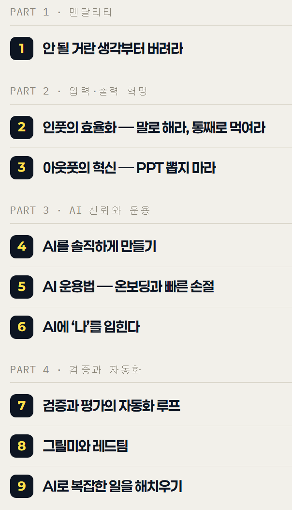

# 목차만 보고 강의 예상
**Date:** 2026. 9. 24. 3:01
**Category:** 스냅
**Original URL:** https://blog.naver.com/xpfkwh56/224421466189
---

​

1. 멘탈리티 = 안 봐도 될 얘기

​

2. 인풋의 효율화

아웃풋의 혁신 = 뭔지 모르겠음

​

설마 통째로 먹여라가, 데이터 그냥

첨부파일로 다 읽게 하라는 거라면,

​

프론티어 기준으론 택도 없는 얘기임

​

PPT 뽑지 마라도 마찬가지,

​

출력 결과물을 지시에 앞서서

정해줄 수 있는데 PPT 뽑지마라 가

딱히 무슨 소린지 모르겠음

​

**\* 무료 강의 보니까 HTML 로컬 페이지 띄우던데,**

**PPT 말고 HTML 로컬 페이지로 보란 얘긴가?**

**그냥 클로드 아티팩트 만들어달라고 하면 되는데 ,,**

**​**

**3. 아마?**

​

인풋의 효율화는 **'전처리'**

얘기일 확률이 아주 높고,

​

아웃풋의 혁신은, 미리 지시에 앞서

결과 산출물의 **규격**을 알리란 것 같은데

​

이거를 한 강에 걸쳐서

하고 계시면 **그거도 재주** 임

​

**제가 아는 지식 내 에서라면**,

​

AI 한테 지시할 때, 이렇게 하라는

소리로 귀결될 확률이 아주 높습니다

​

1) 내가 원하는 결과물의 형태

2) 그 결과물을 내기 위해 AI 가 봐야 될 것

3) AI 가 작업을 하기 전에 지켜야 될 규칙

4) 작업을 완수했음을 확인할 수 있는 측정 방식

​

**보면 아시다시피, 일반적인 경우는**

**네 가지를 안다고 될 일이 아닙니다**

​

그리고 프론티어 AI **설명서** 보면 나옵니다

​

**\* 전처리는 깎기 나름이라,**

**그야말로 하기 나름일 것 같고**

​

**4. AI 를 솔직하게 만들기**

​

LLM 기준으로 AI 는

**'솔직함'** 이란 것이 없음

​

할루지네이션 방지 말씀을 하시는 거라면,

검증 도구를 얹는 것일 것이고,

​

일반적인 방식은 교차 검증 입니다

​

**\* 맞는 말이지만 토큰이 녹습니다1**

​

5. 온보딩과 빠른 손절

​

한 번의 큐에 작업 결과 얻지 말고,

**병렬로 동시에** 여러 과제 준 다음에

​

봐서 내가 필요한 내용만 건지고

필요 없는건 버리라는 것으로 추정

​

**\* 맞는 말이지만 토큰이 녹습니다2**

​

claude.md 나 memory 사용이면

부팅 토큰 때문에 최적화 **많이** 필요하고,

​

hook 이랑 같이 써야 될건데

그걸 다루고 계실진 모르겠음 ,,

​

결론만 말하면 분석할 때 쓰는 토큰이랑,

생성할 때 쓰는 토큰이 다르기 때문에

​

**'사람'** 한테 지시하듯 하면 안 될 확률 높음

클로드만 그런건 아니고, ai 가 다 그렇습니다

​

비개발자들이 불리한 이유도 이 부분 이구요

​

6. 그릴미와 레드팀

​

**'적대검증'** 프롬프트 넣으라는 말 같네요

​

7. AI 활용을 **'배울 수'** 있을까?

​

어디에 활용하느냐, 가 안 결정되면

임변이 아니라 **누가 와도** 해결이 불가

​

8. 강의를 들어서, **저걸** 할 수 있을까?

​

프론티어 베이직 구독 결제하시고, 목차 보여주고

이 강의에서 다룰 것으로 보이는 것을 하려면

어떻게 해야 돼? 너가 해줄 수 있어? 물어보면

​

해줄 확률이 **80% 이상이라고** 추측

​

9. 서비스 만드는 것은 1시간,

디버깅 + 깎는 것은 **∞**

​

**10. 결론**

**​**

20만원짜리 굿즈 로 보입니다 ,,

​

<https://code.claude.com/docs/ko/best-practices>

[![](https://dthumb-phinf.pstatic.net/?src=%22https%3A%2F%2Fclaude-code.mintlify.app%2F_next%2Fimage%3Furl%3D%252F_mintlify%252Fapi%252Fog%253Fdivision%253DClaude%252BCode%252B%2525EC%252582%2525AC%2525EC%25259A%2525A9%2525ED%252595%252598%2525EA%2525B8%2525B0%2526title%253DClaude%252BCode%252B%2525EB%2525AA%2525A8%2525EB%2525B2%252594%252B%2525EC%252582%2525AC%2525EB%2525A1%252580%2526description%253D%2525ED%252599%252598%2525EA%2525B2%2525BD%252B%2525EA%2525B5%2525AC%2525EC%252584%2525B1%2525EB%2525B6%252580%2525ED%252584%2525B0%252B%2525EB%2525B3%252591%2525EB%2525A0%2525AC%252B%2525EC%252584%2525B8%2525EC%252585%252598%252B%2525ED%252599%252595%2525EC%25259E%2525A5%2525EA%2525B9%25258C%2525EC%2525A7%252580%252BClaude%252BCode%2525EB%2525A5%2525BC%252B%2525EC%2525B5%25259C%2525EB%25258C%252580%2525ED%252595%25259C%252B%2525ED%252599%25259C%2525EC%25259A%2525A9%2525ED%252595%252598%2525EA%2525B8%2525B0%252B%2525EC%25259C%252584%2525ED%252595%25259C%252B%2525ED%25258C%252581%2525EA%2525B3%2525BC%252B%2525ED%25258C%2525A8%2525ED%252584%2525B4%2525EC%25259E%252585%2525EB%25258B%252588%2525EB%25258B%2525A4.%2526theme%253D03628e99c753a03aec319053%26w%3D1200%26q%3D100%22&type=ff500_300)](https://code.claude.com/docs/ko/best-practices)
[**Claude Code 모범 사례 - Claude Code Docs**

환경 구성부터 병렬 세션 확장까지 Claude Code를 최대한 활용하기 위한 팁과 패턴입니다.

code.claude.com](https://code.claude.com/docs/ko/best-practices)

​

돈 쓰지 말고 이거 읽으셔요 ,,

유튜브 검색 하시거나