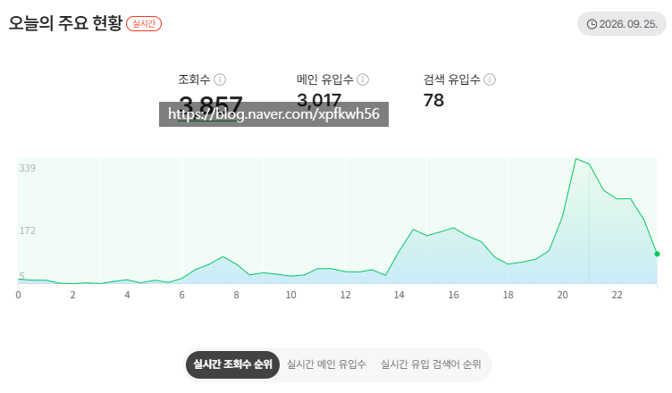

# 신규블이 키우기 더 쉽읍니다
**Date:** 2026. 9. 25. 23:58
**Category:** 스냅
**Original URL:** https://blog.naver.com/xpfkwh56/224422748015
---

​

1. 공식까진 아니지만, 하루에 적게는 8개

많으면 12~30개 사이는 찍으셔야 되긴 함

​

그렇게 최소 글 50개 정도? 쌓이고,

​

검색엔진에서 블로그 알고리즘 정렬되면

길어야 1개월 안에 만블 찍을 수 있음

​

**2. 장점과 단점**

**​**

재밌음, 계정 키우고 유지하는 재미 쏠쏠

다계정 돌리면 **교통비, 간식비는 거의 보장**

​

**\* 물론 시급 이상 나오긴 쉽지 않음**

**​**

운영에서 손 놓는 즉시, 골로 감

장기 운용이면 **'AI 필수'**

**​**

**3. 무조건 신규로 키우라고 하는 이유**

**​**

네이버가 신규 블로그를

확연하게 더 잘 밀어줍니다

​

저는 거의 공장형으로 찍고 있음

​

**4. 콘텐츠 꾸릴 때 기억할 부분**

​

**트래픽 블로그에 크게 애착 갖지 말 것**

​

전단지 뿌린단 생각으로 하고,

잘 크면 상황 따라서 굴려야 안 지침

​

만약 크게 문제 없이 하고 있으면

**1개월 안에는** 만블이 찍혀야 정상 임

​

안 찍히고 있다?

​

1) 양적으로 덜 발행 하고 있거나

2) 본인이 소재를 못 잡았거나

3) 전략적으로 문제가 있을 확률 높음