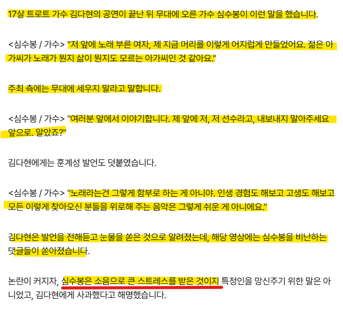
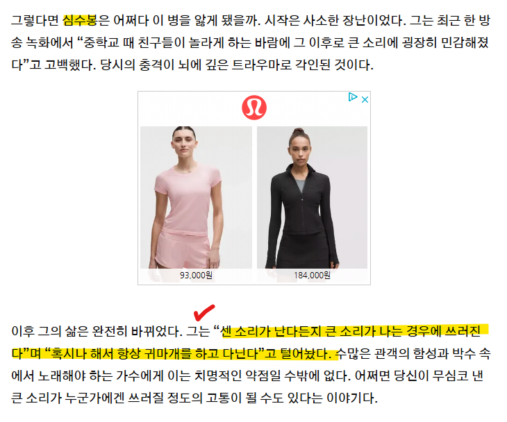

# 최근 겪고 있는 난제
**Date:** 2026. 9. 25. 16:30
**Category:** 스냅
**Original URL:** https://blog.naver.com/xpfkwh56/224422507316
---

1. 단순 트래픽은 확보하기 쉬운데

락인을 잡는 부분이 진짜 어렵네 ,,

​

그냥 그 콘텐츠 하나가 눈에 걸려서,

많이 읽고 나가게 하는 것 정돈 되지만

​

앞으로 계속 이 사람의 목소리를 듣고 싶다,

까지 이어지게 하는 일은 다른 설계를 요구함

​

**\* 그냥 사람처럼 쓰는 것과는 조금 다른 듯**

**​**

AI 생성으로 **'독자적 시각'** 을 담아주려면,

결국 난수 생성 확률에 기댈 수 밖에 없음

​

문제는 이 비결정성이 어디에 튈지 알 수 없고,

**'시각의 일관성'** 을 확보하기가 아주 까다롭다

​

이를테면,

​

<https://www.yna.co.kr/view/MYH20260922010200038>

[**심수봉 "저 선수 내보내지 마"…17세 김다현 저격 논란 | 연합뉴스**

[앵커]가수 심수봉이 무대에 올라 후배 가수를 공개적으로 비판해 논란입니다.심수봉은 뒤늦게 사과했지만, 미성년자를 향해 어른답지 않은 행동을 했...

www.yna.co.kr](https://www.yna.co.kr/view/MYH20260922010200038)

​

**최근에 심수봉 이라는 가수가 김다연 이라는**

**어린 가수를 호되게 욕을 했다고 이슈가 됐음**

​

**\* 어지간한 60대 여성들은 다 아는 이야기 임**

**​**

광고 홍보학이나, 매스 미디어 장르 문법 지켜서

헤드 카피 찍고, 규격 잡고 찍어내면 그만이다

​

근데 그거로 **충분할까?**

​

​

이 부분에 내 생각은 조금 다른데,

**'인간'** 인 나는 솔찌 저거 안 본다

​

**'걸려서'** 읽을 수는 있어도, 굳이 찾아가서

저 소식을 **소비** 하진 않을 것 같단 것이다

​

**2. 첫 번째 해석**

**​**

<https://youtube.com/shorts/rMnsj3NyRug?si=H4TinZJrcTwznlt7>

**​**

첫 가설은, 원로 고인물 가수 특유의

**'뉴비 배척'** 으로 볼 수 있다는 점이다

​

<https://youtube.com/shorts/P1juMIqRfDs?si=RQmmOleh83jQTwyS>

​

자세히는 모르겠지만, 이 **'트로트'** 라는 장르가

약간 **서편제** 감성으로 한국 사람이 느낄 수 있는

​

일종의 **애환, 한, 같은 정서** 를 전달해야 된다는

공통 질서, 규칙을 갖고 있는 것으로 보이는데

​

두 노래를 같이 틀어놓고 비교하면 다르긴 다름

​

심씨 입장에서 봤을 때, 나는 **'예술'** 을 하는데,

​

어린 여자애가 젊고 어린 여자가 트로트 불러서

​

인기 끌고 돈 벌려고 하는 걸로 보이면 아무래도

마냥 곱게 보이진 않을 수도 있겠다 싶을 수 있음

​

**3. 두 번째 해석**

​

​

심수봉은 **'특수성'** 이 있는 인물 임

​

여성을 지칭하는 대명사를 '그' 로 쓰는 것은 ai 생성기 에서 나오는 오류 중 하나 입니다

​

본인 말로는 소음 관련 트라우마가 있어서,

어떤 소리에 특히 예민하게 반응한다는데

​

그녀가 현대사에 겪었던 사건과도 결부하면

행사장에서 겪었던 어떤 특정 소음과 더불어,

​

큰 스트레스를 느낄 법 했다는 접근도 가능함

​

4. 이처럼 위와 같은 **'접근'** 이,

사람에게 있어서 **'네러티브'** 로 전달됨

​

토끼와 거북이가 달리기 시합을 했다,

라는 것과

​

토끼가 앞서 나가고 있었는데 늦잠을 자서,

거북이한테 밀리게 되었다 라는 것은

​

**'소비자'** 입장에서 전혀 다르다는 소리 임

​

5. ai 가 그저 문체만 따라 하는 것이 아니라

어떤 **'일관적인 사고모델'** 을 갖출 수 있으면,

​

좋을 것 같은데 이건 그냥 사람처럼 말하기,

계속 똑같은 사람 이미지를 뽑아내기 와 같은

문제랑은 차원이 다른 난이도를 부르는 듯함

​

**6. LLM 활용 디테일**

​

위 인터넷 기사를 나는 90% 이상 확률로

AI 가 적었다고 확신 하는데,

​

저 문제를 해결할 수 있는 방법은 다음과 같음

​

인공지능은 상황을 막론하고 언제나,

가장 **'확률이 높은 선택지'** 를 고름

​

코피, 콰미, 자와디, 말라이카

​

위에 있는 네 가지 이름 중에,

**남자**는 누구고 **여자**는 누굴까?

​

1010100100, 0010101, 11,1101,

​

심지어, 이렇게 4개의 이름이 있다면?

​

**알 수 없음**

​

그러니까 가장 높은 확률로 나타나는

**일반적인** 토큰을 출력할 수밖에 없고,

​

대부분의 LLM 은 **'He'** 를 뽑음

he 를 한국말로 번역하면? **'그'** 임

​

he 와 그 는 얼핏 같은 의미 같지만,

​

**'한국어 감각'** 에서는 중성 명사로 취급 하기보다

앞서 나온 남자를 지칭하는 **'어감'** 이 더 강함

​

그래서 전처리 단계에 패킷 단위로,

​

미리 나오는 인격 고유명사들의 성별이나

나이와 같은 정보를 먼저 제공해야 좋고

​

불가피하게 그걸 할 수 없는 상태라면

직접 후처리를 하든, 정규화를 넣어야 됨