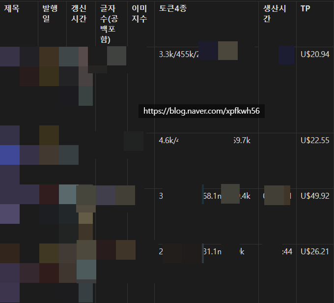
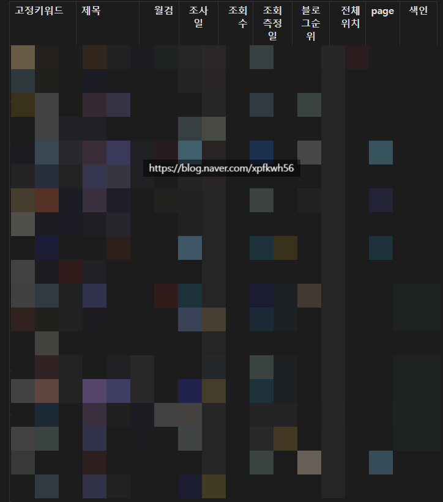
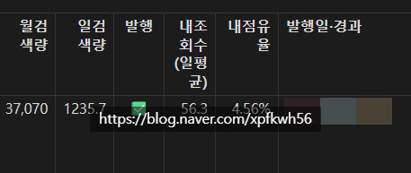

# 블로그 세련되게 운영하는 법
**Date:** 2026. 9. 27. 23:31
**Category:** 스냅
**Original URL:** https://blog.naver.com/xpfkwh56/224424215253
---

**1. 엔드포인트 모음입니다**

​

엔드포인트가 뭐임? ,,

ai 도움을 받도록 합니다

​

|  |  |  |  |  |
| --- | --- | --- | --- | --- |
| 라벨 | 엔드포인트 | dataId | 컬럼 | timeDimension |
| 조회수 | /api/blog/visit/cv | cv | date,total,etc,friend,follow | DATE |
| 순방문자수 | /api/blog/visit/uv | uv | date,total,etc,friend,follow | DATE |
| 방문횟수 | /api/blog/visit/visit | visit | date,visit | DATE |
| 평균방문횟수 | /api/blog/visit/averageVisit | averageVisit | date,total,etc,friend,follow | WEEK |
| 재방문율 | /api/blog/visit/revisit | revisit | date,total/etc/friend/follow(+\_p) | WEEK |
| 평균사용시간 | /api/blog/visit/averageDuration | averageDuration | date,total,etc,friend,follow | DATE |

|  |  |  |  |  |
| --- | --- | --- | --- | --- |
| 라벨 | 엔드포인트 | dataId | 컬럼 | 비고 |
| 조회수 순위 | /api/blog/rank/cvContentPc | rankCv | date,cv,rank,title,uri,createDate | 전체 1회 반환, 페이지네이션 불필요 |

|  |  |  |
| --- | --- | --- |
| 탭 | 엔드포인트 | 비고 |
| 조회수 분포 / 시간대별 조회수 | /api/blog/user/hour/cv | 24시간 한 번에 반환 |
| 시간대별 유입 경로 | /api/blog/user/hour/referer/total | refererTotal/refererDetail/refererTotalCount |
| 시간대별 성별·연령 | /api/blog/user/hour/demo | hour별 |
| 시간대별 조회수 순위 | /api/blog/user/hour/rankCv | hour별 |

|  |  |  |
| --- | --- | --- |
| 기준 | 엔드포인트 | dataId |
| 조회수 기준 | /api/blog/user/demoCv | demo, demoFollow, demoFriend, demoEtc |
| 순방문자 기준 | /api/blog/user/demoUv | demo, demoFollow, demoFriend, demoEtc |

|  |  |  |
| --- | --- | --- |
| 탭 | 엔드포인트 | dataId |
| 모바일 사용자분포 | /api/blog/user/device/mobile | device(pc/mobile 비율), demo |
| PC 사용자분포 | /api/blog/user/device/pc | device, demo |

|  |  |
| --- | --- |
| 부분 | 엔드포인트 |
| 유입경로 목록 + 총량 | /api/blog/user/referer/total (dataId: refererTotal — referrerDomain,cv,cv\_p,referrerSearchEngine) |
| 상세 유입경로 | /view/blog/referer/total/more?refererDomain={경로}&searchEngine={true/false}&totalRepValue={총cv}&offset={0,100,…} |

|  |  |  |
| --- | --- | --- |
| 화면 | 엔드포인트 | 응답 컬럼 |
| 조회수 | integrated-analysis/view-count | date, my(전체/피이웃/서로이웃/기타 분해) |
| 방문횟수 | integrated-analysis/visit-count (contentType=text-and-moment) | date, 값 |
| 순방문자수 | integrated-analysis/uv-count (contentType=text-and-moment) | date, 값 |
| 평균사용시간 | integrated-analysis/average-duration | date, 값(초) |
| 성별연령 | integrated-analysis/demo-distribution | 연령/성별/값 |

|  |  |  |
| --- | --- | --- |
| 화면 | 엔드포인트 | 핵심 필드 / 비고 |
| 유입경로 리스트 | inflow-analysis/referrer-domain?limit=10 | referrerDomain, isSearchEngine, ratio |
| 경로 펼침(상세 검색어) | inflow-analysis/referrer-query?referrerDomain={경로}&limit=N | 그 경로의 검색어들 |
| 유입검색어 리스트 | inflow-analysis/referrer-query-rank?limit=N | data[0].topN[] = {searchQuery, referrer, ratio}. limit 최대 100 (101↑=400, offset 없음) |
| 경쟁력지수순(일괄) | inflow-analysis/query-compare?contentType=text&limit=N | 검색어별 {query, my, totalMean, topMean} (0~1, ×100=지수). |

|  |  |  |
| --- | --- | --- |
| 블록 | 엔드포인트 | 핵심 필드 |
| 유입수 & 검색 트렌드 | inflow-analysis/inflow-search-trend?keyword= | date, searchInflow, datalabSearch(검색트렌드지수) |
| 검색 경쟁력 추이 | inflow-analysis/query-competitiveness?keyword= | date, my, totalMean, topMean |
| 이 검색어로 유입된 게시물 | inflow-analysis/popular-contents?keyword=&limit=20,20 | data + myData. 각 항목 contentId/metaUrl=blog.naver.com/{블로그ID}/{logNo}, myContent(true/false), metricValue |

|  |  |  |
| --- | --- | --- |
| 블록 | 엔드포인트 | 핵심 필드 |
| 방문 요약/추이 | integrated-analysis/content-summary?contentId=&statType=visit | date, cv, averageDuration, likeCount |
| 성별연령 | integrated-analysis/demo-distribution?contentId= | 연령/성별/값 |
| 게시물 유입경로 | inflow-analysis/referrer-domain?contentId=&limit=5 | 경로별 ratio, metricValue |
| 게시물 유입검색어 | inflow-analysis/referrer-query?contentId=&limit=11 | searchQuery, ratio, metricValue, referrer |
| 글 메타(제목 등) | meta/content-info?contentIds= | 제목 등 |

​

**2. 이걸 모아서 어디에 쓰죠?**

​

​

글자수, 이미지수, 4종 토큰 사용량,

생산시간을 구한 다음에, 프론티어 API 랑

비교하면 글 1개 뽑는 **생산원가** 나옵니다

​

​

키워드 도구로, 네이버 검색량 확인하고,

검색량 대비 내 점유율을 확인할 수 있습니다

​

​

예를 들어, 월 검색량 3-4만 정도

나오는 키워드가 있는데

​

내 블로그가 검색 했을 때,

DOM 상단에 노출된 상태고

​

클릭 유입이 들어오고 있는 상태고

일 조회수가 ~56 정도다

​

그럼 일검이 1235.7

내 조회수 일평균이 56.3 이니까

​

현재 그 검색어에 대한

내 점유율이 **4.56%** 다

​

라고 가늠할 수 있읍니다

​

SERP 조사를 통해서, 통검/블탭 에서

내가 몇 등 안에 드는지 매일 추적 됩니다

​

3. 같은 방식으로, 다음과 같이

데이터를 구성해볼 수 있읍니다

​

**제 경우, 생산 - 유통 - 도달**

**- 고객 - 품질 - 수익 체계를 씁니다**

​

Generic 저울 원장은 다음과 같습니다

​

수준, 기술통계 = 합·평균·최대/최소·분위수·누적

​

추세 = OLS, Theil-Sen(기본, robust), MK(우연 판정)

CAGR, EWMA, 노이즈 큰 블로그는 Theil-Sen 기본, OLS 보조

​

변동 = CV(raw/detrend/robust)

분포, 집중 = 지니, 로렌츠, HHI, Zipf, Hill (구성비의 쏠림 요약 짝)

​

리듬 = 요일·시간대에서 뽑을 수 있는 조합 전수

/index형(전체평균=100 대비 배율)

**​**

**\* KST 기준**

​

이상탐지 = 요일 보정 후 z, 임계 |z|≥2(판정 아니라 신호)

시간감쇠, 생존 = 반감기, KM, Cox, hazard (○ 성격 많음)

변화점 = PELT, CUSUM

​

분해, 기여도 = 성장 기여분해, 분산분해(ANOVA)

연관 = 상관(Pearson), 회귀, 탄력성, 공적분 (가드: 상관≠인과)

극단, 꼬리 = 낙폭(drawdown), VaR, 롱테일 꼬리

​

벤치마크, 상대위치 = 동종/시장 대비 percentile

인덱스 = 블로그지수(시작=100·조회가중·chain-link)

​

● 기계적(서술) = 같은 입력→같은 출력

○ 비기계(추정) = 모델 적합·확률적

​

(회귀추정, 생존곡선, KDE, 군집, Hawkes/GARCH,

베이지안, 곰페르츠, 탄력성, 토픽, Chao)

​

경계 판정: OLS 추세선 ● / Bootstrap/CI ○ / 통계검정(MK) ●

​

**1)** **글을 얼마나/어떤 규격으로/**

**얼마 들여(TP) 만들어 얼마나 쌓나?**

​

Stock/Flow = 카탈로그만 Stock(신원)

나머지 분석 전부 Flow

​

불변하면 스탁이고, 가변하면 플로우 입니다

​

조회수 = 맨날 바뀌죠? 플로우 입니다

글자수 = 안 바뀌죠? 스탁 입니다

​

카탈로그 = logNo, 제목, URL, 상위/하위카테고리,

발행일, 발행시각, 글자수, 이미지수, 표수,

소제목수, 토큰4종, 생산시간

**​**

**플로우는 네이티브 6축으로 구성 합니다**

**​**

산출 = 발행 수/일평균/누적 · Δ · 최고/최저 (얼마나 만드나)

원가 = 토큰, 생산시간 집계 → 글당 TP / 1000자당 TP = 제작 효율. *TP 규칙, disclaimer*

규격 = 글자수, 이미지(평균/분포/구간) , 표수, 소제목수 = census엔 표시 / 동종 벤치 불가(남 글 포맷 제각각)

품목 = 카테고리별 발행, 구성비, 빈 카테고리 (무엇을 만드나, 스냅샷)

재고 = 나이대 분포, 중앙/평균 나이, 카테고리별 방치 + 아래 실측 편입

수명주기 5단계 [통계] = 글별 조회 MA 크로스로 신생/성장/성숙/쇠퇴/사망(미색인) + 전일대비 단계 전환(부활/꺾임), 에버그린/디케이/라이징 스타 등 체크 목적

h-index [어드] = 조회 h 이상 글이 h개(자산 깊이)

사산율 = 평생 유입0(미색인) 글 비율

생존곡선 KM [통계] = 발행 후 t주 "아직 조회되는 글" 비율 (○)

가동 = 요일, 시각 분포, 가동일, streak, 운영일수 (라인이 규칙적으로 도나?)

**​**

**2) 내 글이 검색에 어떻게, 어디에 뜨나?**

​

색인 = 색인율, 미색인 목록, 색인잠복기(median 도달일) [통계 체크] (검색에 잡히나)

상위노출 위치 [SERP] = \_serp\_full: 블로그순위, 전체위치 = "검색결과 어디 뜨나?"

조회 경쟁력(cv share) [어드:query-compare] = my(0~1) vs topMean & totalMean = "그 검색어 조회를 얼마나 먹나" / BCG(유입비중×경쟁력 median 4분면)

검색어, 유입 = 유입검색어 [통계 offset 전수(어드 top100 캡)] , 글별 유입검색어 , 노린(고정키워드) vs 실제 유입 갭 , 검색영토 2종(핵심=query-compare 경쟁력 / 보조=referrer-query 유입쿼리 수, 별개)

채널 = 7그룹 구성 , 엔진별 유입(naver/daum/bing/nate…), 검색 비중

​

**3) 노출이 클릭돼 실제 들어온 양**

​

순방문 (몇 명, 폭) ≤ 방문 (몇 세션, 횟수) ≤ 조회 (몇 페이지, 양)

​

순방문 / 방문 / 조회 = 누적·평균·최고/최저&기간별 수집

averageVisit(방문 빈도) = 방문당 페이지/방문빈도(주별)

글당 조회(도달 효율) = 조회 ÷ 글수 (자산당 도달)

누적 자산 곡선 = cut별 누적 도달

​

코호트 vintage [통계] = 발행 빈티지(행) × 나이주(열) 평균 조회 히트맵 (신선 vs 아카이브 트래픽)

burn\_speed = 32시간 vs 7~13일 조회 잔존비(초반집중/롱테일)

R\_t(확산 재생산수) = 최근7일 ÷ 직전7일(확산 가속/감속)

낙폭(drawdown) = 고점 대비 하락 (generic 극단, 꼬리 저울)

​

**4) 누구한테 닿았고, 어디까지 락인을 잡았나?**

​

Native 2대상 (Flow)

​

A. 인구 = 성별, 연령 (그 사람이 누구)

카테고리/글별 독자 프로파일, 조회 vs 순방문 demo 차이, 독자층 이동

​

**\* 독자층 이동은 보통 악재로 인식합니다**

ex. demo floor: 순방문<100 or 조회<5면 가림 = 부재≠0

​

B. 관계, 결속 = 이웃, 재방문, 잔존 (우리에게 누구)

​

이웃 플라이휠 = 일별 add, delete, 순증감, 누적 순증곡선

신규이웃 인구 = relationDemoAdd(이웃 증가분 성별·연령)

my-buddies 3종 = totalMyBuddyCount(내가 추가), totalMeBuddyCount(나를 추가) , totalSearchBuddyCount(검색)

재방문율 = total/friend/follow/etc 구성별, 신규 vs 재방문 비율

잔존 = 코호트 잔존(플라이휠 심장) (○), DAU/MAU stickiness(당일순방문÷30일순방문)

​

5) **'글이 좋은가'** 를 직접 못 재니 독자 행동으로 역추론,

revealed quality 라고 이해하면 제일 빠릅니다

​

A. 소비 깊이 (얼마나 깊이 읽었나·수동)

​

체류 [통계] = 수준, 분포, 추이, 카테고리/글별

완독률 = 체류 ÷ 예상읽기시간. = 품질×생산 교차

셈법(실측) = 체류 ÷ (표제외 글자수 ÷ WPM400 + 이미지수×N초 + 표수×M초)

표제외=.se-main-container·<table> 분리, @@IMG, 공백 제외

​

B. 능동 반응 (어떻게 느꼈나, 상호작용)

​

좋아요, 댓글, 반응율(÷조회 normalize),

반응 획득률(침묵 다수 규모), 반응 종류 구성

​

**6) 그래서 애드포스트로 얼마 벌었냐?**

​

Native 3축 입니다

​

수준 = 총수익(일별·기간·누적)·마일스톤 [어드] (얼마 버나·도달 종속)

funnel = 조회→노출→클릭→수익 전환율, 노출률, CTR, RPM, TOC 병목, 주제별 CPC [어드]

**​**

**\* CPC(=revenue/click)는 코드 Proxy 계산**

**제가 오래 쓴 블로그 원장 기반으로 추측합니다**

​

글별 귀속 = 글별 추정수익, 글별 RPM,

카테고리별 리워드 롤업

(추정수익, 비중%, 노출, 노출비중%),

히든 (조회↓수익↑)

​

노출/클릭 기여도 =

[어드:impression-click-ranks] = 글별 비중(0~1)

​

네이버가 기여도만 제공하기 때문에, 추정치로 잡습니다

통상 중하위는 과소집계 되기 때문에, 직접 돌려봐야 됨

​

저는 그날 총액 에서 기여도 비중을 곱해서 구했었습니다

​

**4. 이거 있으면 뭘 할 수 있죠?**

​

네이버 블로그 내 전용 애널리틱스 운용 가능