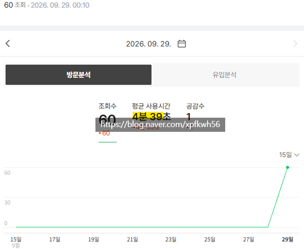

# 고체류 콘텐츠
**Date:** 2026. 9. 29. 13:47
**Category:** 스냅
**Original URL:** https://blog.naver.com/xpfkwh56/224425876856
---

​

1. 이게 약간 **감각적인** 부분 이라서,

뭐라고 정규화 하긴 참 어렵긴 한데

​

**\* 제 경우, 원고는 ai 가 쓰지만**

**최종 게이트 키퍼는 제가 합니다**

**​**

**ai = 에디터**

**나 = 편집장**

​

1) 쓸모가 있냐?

2) 알아놓고 있음 좋을 것 같냐?

3) 친구한테 공유하고 싶냐?

4) 카톡방에 나에게 보내기 할 것 같냐?

​

등등 같은 느낌으로 구성 하는 편임

​

2. 예를 들자면, 뷰티/미용 콘텐츠에서

여자들한테 **팔릴 수 밖에 없는** 것들이 있음

​

걍 여자들 자기 미모 가꾸기랑

관련되면 다 읽고 보는 거 아님?

​

당연히 아님

​

다이어트야 하고 싶지만

풀때기만 먹고 싶은 여자가 어딨음

​

맛있게 먹고 싶은 것 다 먹으면서

살은 그냥 알아서 빠지길 바라는 것임

​

그런 날도둑놈 심보가 어딨나요?

→ 대중 미디어 콘텐츠 하면 안 될 사람

​

**\* 암기를 하거나, 딴 일을 찾아봐야 됨**

​

그래서 내가 오늘 큰 노력 없이 할 수 있으면서

해서 그래서 어떻게 되는가? 라는 부분이

**'시각적'** 으로 **'증거'** 와 함께 **'실증'** 돼야 함

​

3. 그리고 **'정량적인 T 접근'** X

​

어디서 들어는 봤고, 믿음 레벨로 있어서

딱히 내가 설득하지 않아도 근거가 있는

그런 화제를 대상으로 하는 것이 좋음

​

**비대칭, 붓기** 이런 것이 **대표적** 임

​

그냥 화장품 후기 X

​

중국, 일본 뷰티 계정들 구독하면

하루가 멀다하고 어떻게 화장하면,

​

어떤 얼굴 나오는지 같은 것 나오는데

​

**\* 짜잔 메이크 오버 콘텐츠**

​

**'상품 리뷰'** 후기보다,

**'내가 인터넷 하면서 이거 봤는데 이렇던데'**

​

라는 **'후기의 후기'** 가 약 20% 정도

더 트래픽에 도움 됐었음

​

4. 뷰티가 좀 어중띠면, 게임으로 보면 됨

​

1) 남자분들 **스팀 게임 고를 때** 뭐 봄?

너무 당연히 **저거 재밌냐?** 를 볼 것 임

​

그 다음은 **내 컴퓨터에서 돌아가냐?**

를 보실 것임

​

2) 시드마이어가 구 블리자드 개발진이랑

새로 협업해서 게임을 만든다고 하면?

​

**'오, 뭐지?'** 가 됨

​

GTA6 사전구매 하면 팩을 준다는데,

그 팩을 사면 추가 에피 준다고 함

​

**'오, 뭐지?'** 가 됨

​

기다려서 사면 할인 되고, 안정화 된

상태에서 게임할 수 있는데 굳이 한사코

나오자마자 사는 사람들이 있음

​

**왜why?**

​

그래야 **'같이 하는 맛'** 이 나니까

​

1번이 여자들이 소비하는

**'뷰티 정보의 본질'** 임

​

2번이 여자들이 **'클릭'** 하는

욕망의 핵심임

​

5. 야동 같은 경우, 진짜 많아야

플롯이 10개 언저리 일건데,

​

어차피 다 똑같이 그냥

적당히 예쁜 여자 나와서

​

흔들고 움직이는 영상을

매우 신중하게 고르시잖음

​

**\* 계속 뉴페이스 찾아다니고**

**​**

그거랑 똑같음

​

뷰티블이든, 정보블이든,

어디서 스크린샷 한 장 봤는데

​

이거 품번 누구지? 배우 누구지?

같은 **'검색 수요'** 가 분명히 있고,

​

**\* 이 여자가 누구라고 알아낸다고,**

**다음에 이제 찾지 않는 것이 아니듯**

​

블로그에서 그걸 해결 하면 트래픽 찍힘