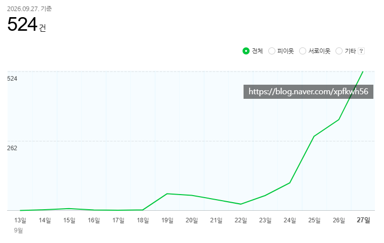
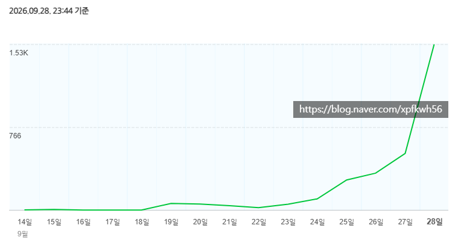
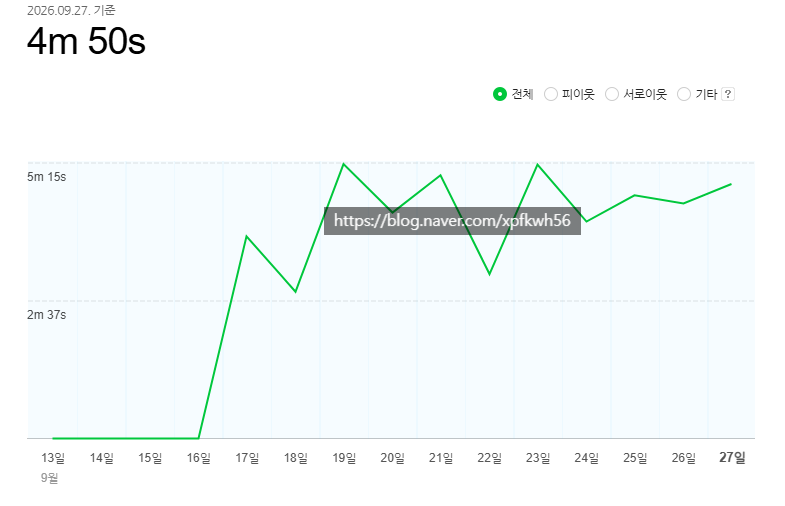

# 설계, 기획, 연출이 매우 중요함
**Date:** 2026. 9. 29. 0:07
**Category:** 스냅
**Original URL:** https://blog.naver.com/xpfkwh56/224425351162
---

​

1. 목표 독자층을 **최대한** 좁혀라

​

이건 사실 블로그 운영만이 아니라,

사업 전반에도 통용 되는 규칙인데

​

태어나서 처음 장사 라는 걸 하게 되면

욕심이 생겨서 이거저거 하고 싶어짐

​

주식할 때, 백화점 포트 짜는 것과 비슷

​

근데 그렇게 할 바엔 차라리

인덱스 사는 것이 나은 것처럼,

​

최대한 **압축** 해서 접근하는 것이 **'쉬움'**

​

2. 제일 먼저 이 글을 읽을 독자군을 분류,

그리고 내 콘텐츠를 읽히게 할 고객군을 결정,

​

마지막으로 그 사람들한테 내가 무엇을

전달할 것인가? 를 **잘** 생각하면 되는데,

​

내 경험상, 장사도 조금 그런 경향이 있지만

블로그는 **'특히나'** 자아를 지우는 것이 중요

​

내 생각에는 이게 맞는 것 같은데?

라는 생각이 들어도 절대 보이면 안 됨

​

예를 들어보겠음,

​

**'신용점수 등급표'** 라는 쿼리가 있음

​

근데 신용점수 등급표 라는 말 자체가

지금 통용되지 않는 규칙이라 쓸모가 없음

​

근데 그건 알빠가 아닌 것 임

​

**\* 고객을 가르치려 하지 마라**

​

내가 딴 나라 가서 물건 팔 생각 있으면

그 나라 문화는 그냥 접고 들어가는 것처럼

똑같이 그냥 내가 뭔가 하려고 하면 안 됨

​

신용점수 등급표 그거 쓰지도 않고,

알아봤자 실제로 아무 쓸모도 없다

​

결국 css 점수가 중요한데, css는 미공개다

그래서 proxy 로 4대 금융사 우수고객 지표 보고

주거래 은행 확보하고 거래 실적을 누적해라

​

이런 소리 하고 싶으면? 유튜브 하면 됨

아니면 혼자 취미블 운영 하던가

​

**\* 가급적 신규 블로그 운영 하라는 이유**

​

3. 딱 **'1명'** 의 독자부터 잡고 시작하기

​

내가 장사를 하는 방식은 큰 시장이 아님,

이건 제 취향이라 가려들을 부분이 있는데

​

먼저 이 사람이 해야 할 이유를 전달 하고,

하지 않을 이유를 해소 하는 식으로 접근함

​

즉, 블로그로 이 내용을 전이 한다면

​

**1) 이 콘텐츠를 읽을 이유**

**2) 읽지 않을 이유 가 있어야 됨**

​

네이버는 기본적으로

시니어 플랫폼? 같은데,

​

할 생각이 있으면 **무조건**

잡을 독자층이 30-59 임

​

**\* 20대는 그냥 버리세요**

**​**

**남자** → 신자유주의 보수성향 TK DNA

정치/사회/시사/경제에 관심 많고,

골프/자동차/스포츠 좋아하는 고객군

​

어떤 콘텐츠를 소비하는 주요 동인은,

​

내가 유능해지는 느낌, 과시할 수 있는 정보,

오피셜/전문성에 대한 높은 신뢰도,

핵심 장점 1개를 확실하게 전달, 같은 것들임

​

**여자** → 서울/경인 DNA, 휴머니즘 선호,

연예/미용/쇼핑에 주로 관심이 많고

워킹맘/전업주부/학부모가 주요 고객군

​

내 인생을 가꾸는 느낌 중요하고,

​

지긋지긋한 내 인생에서 새로운

어떤 활기가 도는 동기/계기 중요,

​

동성 사회집단에게 보여줄 수 있는 요소 중요,

타인의 경험 기반 정보에 대해 선호도 높음

​

**\* 특히 타인의 시행착오가 성공담보다 클릭율 높음**

​

자잘한 장점 병렬적으로 제공하고

셜록홈즈가 추리하는 것처럼 단점이 있는데

그 단점이 특정 요인으로

깨지는 것이 있을 때 카타르시스 반응,

​

등등, 본인이 이해 할 수 있는 속성들이

많으면 많을수록 더 그걸 잘 다룰 수 있음

​

남자한테 전문성은,

**'내 능력이 공인되는 경험'** 이고,

​

**\* 나는 전문가가 아니지만,**

**전문가가 나를 인정 했거나**

**내가 전문가를 이해할 수 있다**

**​**

여자한테 전문성은, **'신뢰의 부분'** 임

​

**\* 내 일을 맡길 수 있는 사람이다**

**이 사람은 내 문제를 책임질 수 있다**

​

4. 트래픽 욕심 있어도

커버리지 늘리지 말고,

​

1명만 붙어서 읽어줄 수 있는 사람 정하고,

​

1명이 겪고 있는 치명적인

**문제** 해결할 수 있으면,

​

AI 로 쓰든, 수제로 쓰든 트래픽은 늘어남

근데 이 **'감'** 이 오기가 다소 어려울 것 같음

​

위에 있는 블로그는 중장/노년층 대상으로

크루즈 여행만 계속 소개하는 블로그 임

​

이 소재를 찾은 건, 트렌드 데이터로 찾았고

​

블로그 돌리다보니까 55세 이상 연령군 에서

유의미하게 **체류시간** 데이터가 높은 걸 확인 함

​

그래서 이 독자군은, **'긴 글도 읽는다'**

​

라고 가설 세워서 기왕지사 여행을 하거나

여가 활동을 할 때 어떻게 하면 효율적인지,

​

피해야 될 문제는 뭔지 같은 것들을 쓰고 있음

​

5. 같은 방식으로, 트래픽이

나오기 쉽지 않은 쪽은 어딜까?

​

**워킹맘 대상으로 육아 콘텐츠 다룰 때**, 임

​

근거를 주절주절 떠드는 것보다

확실한 것 1개를 심플하고 빠르게 전달해

**선택지를 줄여 주는 것이 여기 문법** 임

​

즉, 이 게임은 보이지 않는 남의 생각을 추론해서

필요로 **'할 것 같은 것'** 을 잘 서빙 해주는 게임 임