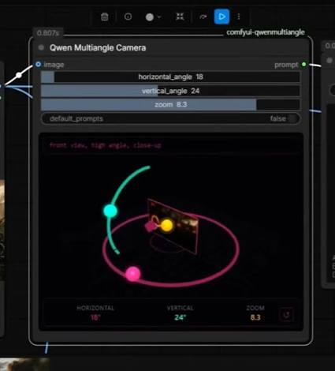
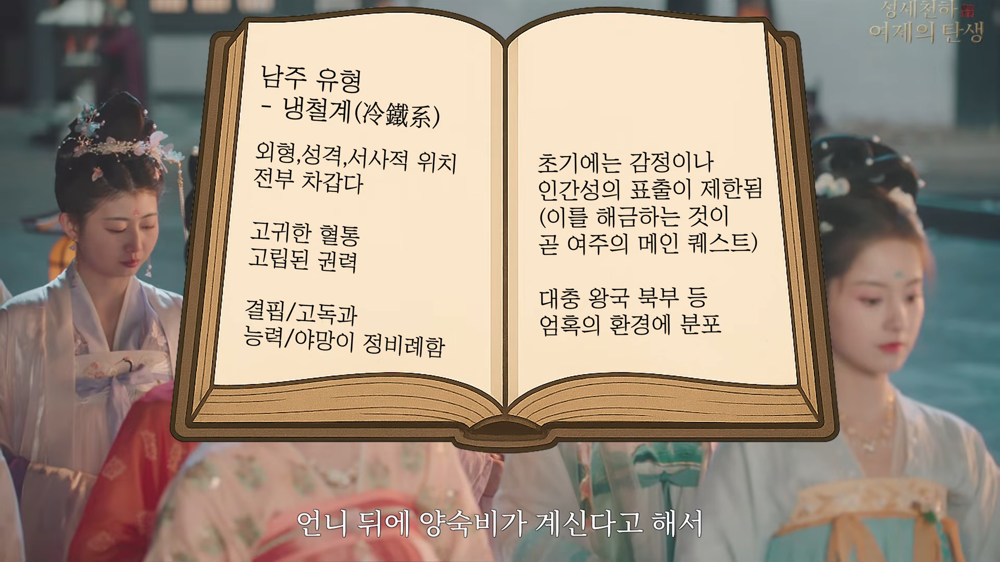
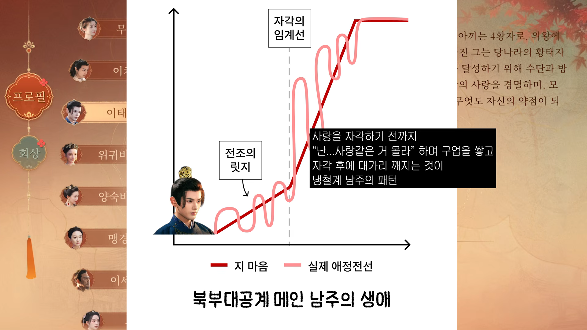
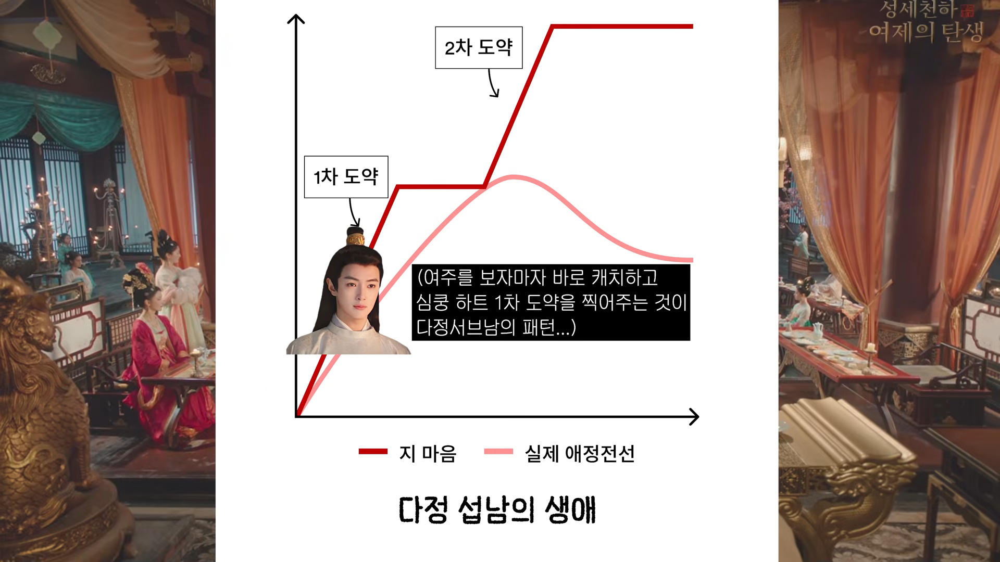
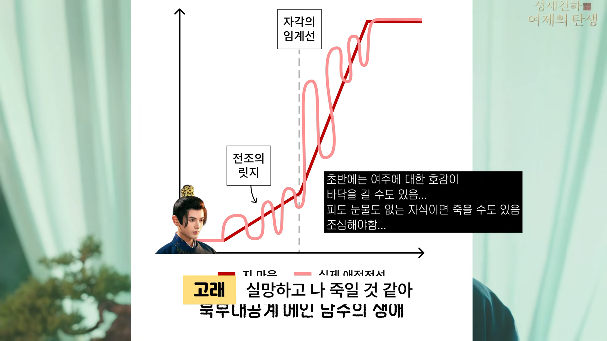

# 인공지능으로 웹 소설을 쓸 수 있나요?
**Date:** 2026. 9. 29. 3:03
**Category:** 스냅
**Original URL:** https://blog.naver.com/xpfkwh56/224425428175
---

1. 가능한데, 지피티한테 해달라고 하면

뚝딱 나오는 방식은 **'당연하게도'** 아닙니다

​

2. 저는 1호기의 장래에 별 관심이 없긴 하지만

만약 본인이 의지가 있다면 둘 정도는 나름대로

열심히 가르쳐 봐야겠다고 생각을 하는 쪽인데,

​

그 두 가지는 다음과 같습니다

​

1) **'컴퓨터'** 를 사용해서 문제를 **'해결'** 하는 것

2) **'추상'** 과제를 수행할 수 있는 **'사고력'**

​

먼저 1번의 경우, 간단한 이야기 입니다

​

정보가 필요하면 검색을 하고,

검색을 해서 안 나오면 이런 방법,

저런 방법을 해서 열심히 해본다

​

그림을 그리고 싶으면 손으로도 그려보고,

그걸 그대로 **'컴퓨터 그래픽스'** 로도 해본다

​

글자 그대로, **'컴퓨터'** 를

활용 해보는 것이죠

​

그게 엑셀이 될지, PPT 가 될진 몰라도,

여하튼 기계를 써서 더 나은 방법이 있다면

최대한 많이 경험하게 할 생각 입니다

​

또한, 이 부분은 **'우리 세대'** 에도

일전에 말이 나왔던 것들일 겁니다

​

우리 부모님 세대에서 관심 있는 분들은

애들 컴퓨터 학원 보내고, 워드 따게 시키고

뭐 이랬던 시절이 있기는 있었으니까요

​

3. 복잡한 것은 **2번 축** 입니다

​

ai 를 **'상업적'** 으로 다루는 사람들이

입을 모아 하는 소리가 있읍니다

​

**'무엇을'** 해야 할 것인지만 결정하면

**'어떻게'** 하는 것은 너무 쉽다 이거죠

​

후자는 대가리를 한참 박고 있으면

결국 시간이 해결해줄 수 있는 문제지만,

​

방향 자체가 틀어져 있으면

그 부분은 정말 **답이 없습니다**

​

​

일례로, qwen 멀티 앵글 카메라

라고 하는 comfyUI 노드가 있는데요

​

수직, 수평, 줌 을 마음대로 바꾸면서

이미지를 조작할 수 있는 AI 기술 입니다

​

**\* 눈 바꿈이지, 세밀하게 하려면**

**그 이상의 다양한 잡기술을 요구함**

​

<https://youtu.be/5faivT1Wp3E?si=A6IctuG9TQWNNWpO>

​

이게 무려 **1년 전, 기술** 인데요

​

내가 **'어떤'** 영상을 뽑겠다 마음만 먹으면

​

5090 정도 스펙으로 꽤

괜찮게 구현할 수 있었습니다

​

그럼 저 기술이 나왔을 때, 순식간에

영상들이 마구 쏟아져 나왔을까요?

​

기술은 있었는데, **'뭘'** 만들어야 될지 모르고

**'사람의 발상'** 을 온전히 담을 수가 없어서,

​

**시댄스 시나리오 콘티 기술** 의 해자가

충분히 풀린 뒤에야, 가능 해졌습니다

​

**\* 중국 정가 기준, 10초 영상에 7만원 정도**

**작년 기준으론 10초 영상에 20만원 넘었음**

​

로컬로 열심히 깎으면 공짜로 되긴 하는데,

​

그나마도 돈이 있어도 못 만드는

사람이 한 트럭이기도 하고요

​

4. 카메라 **'기술'** 이 있어도,

**'연출'** 방법을 모르면 쓸모가 없고

​

연출을 익히려면, 관찰력이 아주 좋든가

아니면 **전통적 고등 지식** 을 얻어야 됩니다

​

뉴스 기사 같은 경우, ai 썸네일을 쓰니까

그냥 뚝딱 뽑을 수 있지 않나 싶지만,

​

뜯어보면 헤드라인 카피를 만드는 기술,

그리고 안에 들어가는 이미지를 선별하는

기준과 기술 같은 것들이 규칙이 있음요

​

그런 이해가 있으면 상관이 없는데,

​

없으면 순전히 **본인 재능** 으로 채워야 하고

그럴 수 있는 사람의 숫자가 많진 않습니다

​

5. 인공지능은 단순한 **'툴'** 에 불과 해서,

​

아직 **'사람에게 지시를 내릴 정도'** 의

수행 능력은 갖추지 않은 상태 입니다

​

또한, LLM 의 구동 원리 한계 때문에

​

1) 발견의 논리와

2) 적용의 논리가 **따로** 돌아갑니다

​

마치 사람이 그런 것처럼,

​

자료가 있을 때 분석은 잘 할 수 있어도

그 분석을 바탕으로 어딘가에 써 먹거나

하는 것이 똑바로 잘 안 되고, 훈수만 잘 둘 뿐

​

실제 시켜보면 **말도 안 되는**

결과가 나온다 이거죠

​

6. 그래서 필요한 역량이,

​

**'명세'** 를 줄 수 있을 정도로

**'과업'** 을 **'환원'** 시킬 수 있냐 입니다

​

라이온킹 이라는 만화가 있읍니다

​

아들 사자가 작은 아빠 사자를 상대로

아빠 사자의 복수이자, 왕위 찬탈을

도모 한다는 줄거리를 가진 이야긴데,

​

이 내용이 햄릿 이랑 아주 비슷합니다

​

스타워즈랑도 비슷합니다

​

주인공이 아버지에 대한 진실을 모르고 살다가,

사령, 또는 멘토의 조력을 통해 진실과 사명을 얻고

번민 하다가 자신의 길을 찾아가는 이야기 입니다

​

사람은 **'어지간하면'** 이걸 들으면 **'감'** 을 잡습니다

​

스타워즈, 햄릿, 라이온킹은

​

덴마크 궁정과 우주,

독백과 광선검, 비극과 모험 이라는

전혀 다른 껍질을 갖고 있지만,

​

그 **'뼈대'** 를 공유하고 있는데,

​

LLM 입장에서는 사자 나오면 되나보다,

덴마크 배경이어야 되나보다, 광선검만

나오면 다 스타워즈 풍으로 보이나보다,

​

정도로 **'얄팍하게'** 알 수 밖에 없읍니다

​

그래서 인공지능이 지닐 수 **'없는'**,

사고력을 인간이 **'부여'** 시켜야 하고,

​

그걸 기계가 이해할 수 있는 형태의

언어로 전달해서 지시해내야 합니다

​

**\* 자연어 처리 존나 어렵읍니다**

​

7. 애초에 관찰이 안 되고,

구조를 보는 것 자체가 안 되면?

​

**시작도 할 수 없겠지요**

​

프론티어 모델 붙들고 소설 쓰게 시켰더니,

​

뻔한 서사, 뻔한 전개, 뻔한 멘트, 뻔한 인물이

계속 반복해서 나오는 이유는 **'당연한'** 겁니다

​

**\* 영상 편집을 AI 로 하든, 직접 하든,**

**리센느 PD 가 만든 영상 같은 것 안 나옴**

**​**

LLM 은 다음에 나올 수 있는

**'가장 높은 확률'** 로 수렴하니까요

​

그리고 프론티어 LLM 자체가,

자기들이 상정한 가장 **'범용적인'** 쓰임을

​

전제하고 있기 때문에 이와 같은

특수한 목적으로 사용하려고 하면,

​

아마? 절대 해결할 수 없을 확률이 높읍니다

​

**AI 에게 글을 쓰게 하는 건 쉽읍니다**

​

근데 그 결과물이 **'어떤 형태'** 일지

모르는 상태라면, 작업을 지속할 수 없고

​

어떤 형태인지 내가 알기 위해서는,

구성하고 있는 요소를 알아야 됨니다

​

북부 대공이 잘 팔린다고 해서,

머리만 시커멓고 띠껍게 구는 남캐를

무작정 만든다고 팔릴 리가 없듯이

​

무엇이 그걸 **'이루는 것'** 인가,

를 내가 깨닫든 찾든 해내야 됨

​

https://youtu.be/Y0F1suwn\_Yc?si=EIIV6BYXJwJezzjH

​

**매우 강하게 추천하는 건,**

​

1) 찐 오타쿠 취향가들의 담론 읽기

2) 그리고 **'걸스토크'** 열심히 보기 임

​

근래 제가 트래픽 블라그 운영을

하면서 더 더 더 크게 느끼는데,

​

여자들끼리 **'수다 떠는'** 마디 마디를

잘 관찰하면 정말 많은 걸 익힐 수 있음

​

특히, **'지금 태어난 노답 저성장 시대'** 입장에선

​

현 30대 90년대 막차층 소비를 잡냐, 못 잡냐 가

팔자를 바꾸냐, 마냐의 기로가 될 확률이 높음