# 구글 아르곤
**Date:** 20시간 전
**Category:** 스냅
**Original URL:** https://blog.naver.com/xpfkwh56/224430041816
---

[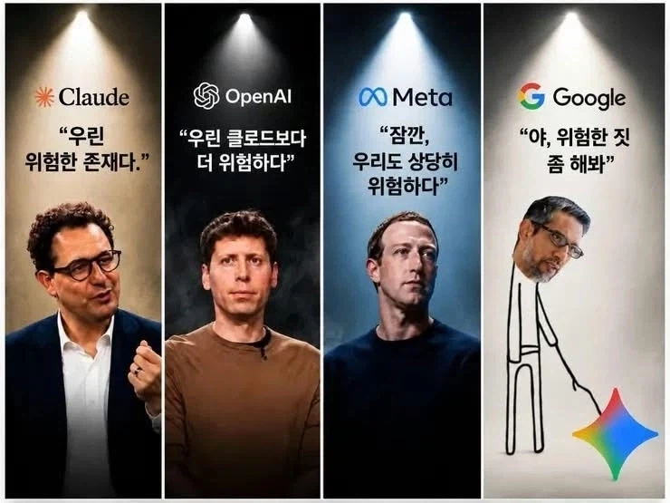](#)

​

1. 인공지능 인프라는

진즉 아마존이 먹었고,

​

애플은 아무나 싸워서 이겨라,

**이기는 팀이 우리편** 이란 입장 임

​

제일 박터지는 시장이

프론티어 AI 라고 부르는,

​

우리가 흔히 쓰는 AI SW 인데

대표적으로 4개 업체가 경쟁중 임

​

**\* 그록은 왜 빠졌나요?**

**거긴 주가 방어만으로도 벅찹니다**

​

2. 메타도 요즘 주목 받고 있지만,

​

엄밀히 따지면 지피티 vs 클로드

양강 체제 라고 볼 수 있는데

​

초보자용 내지, 제일 만만하다고

평가 받고 있던 구글에서

**아르곤** 이란 새로운 모델을 띄움

​

여느 때처럼, 언론에서 매우

호들갑을 떨고 있는데

​

피차 구경도 못 할 모델이니

광고 방식에 대해 다루어 보겠음

​

**3. 인공지능 모델은 겁나 많음**

​

우리가 쉽게 이해하기 위해서는, 마치

김치 담구는 것과 비슷하다 보면 되는데

​

똑같은 김치라도 집집마다 맛이

미묘하게 다르듯, 전체적으론 비슷한데

​

​

디테일하게 따지면 실상

뭐 하나 똑같은 모델이 없음

​

이런 어마어마한 선택지는

인간이라면 누구라도 진입장벽으로

크게 작용할 수 밖에 없기 때문에,

​

[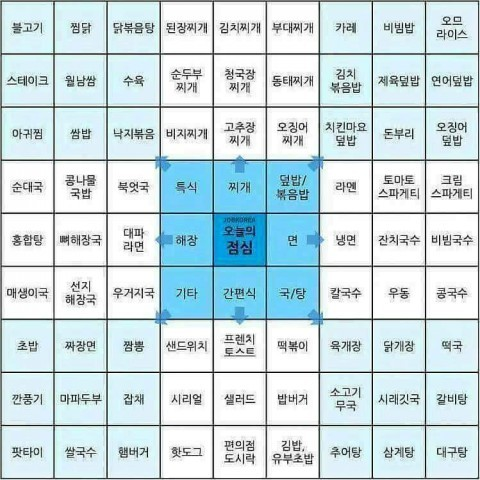](#)

​

용도에 맞는 목적을 찾으려고 하거나,

​

​

누렁이밥처럼 다 섞여있는 걸 고르거나,

​

[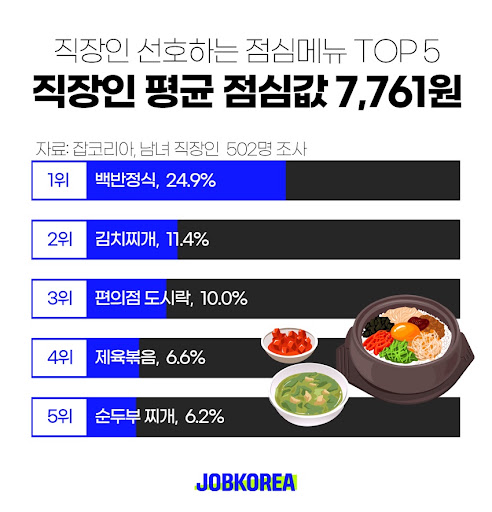](#)

​

그냥 제일 무난하고 남들이 좋다고

말하는 것을 골라서 사용하는 편 임

​

AI 바닥에도 이런 것이 있는데,

그게 바로 **'벤치 점수'** 임

​

[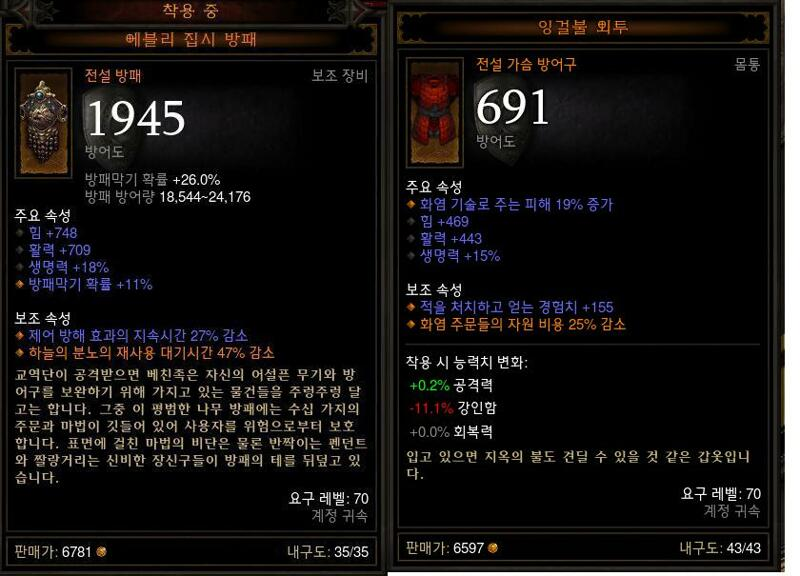](#)

​

단일 지표로 한 눈에 비교할 수 있어서,

이런 벤치 점수는 직관적으로 이해 잘 됨

​

​

문제는 무언가를 **'평가'** 한다는 행위가

생각보다 **아주 심오한 장르** 라는 점이고,

​

[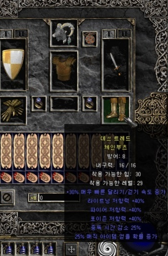](#)

​

경우에 따라선 별 것 없어보이는데,

아주아주 대단한 수치일 수도 있고

​

[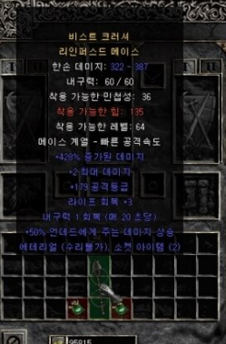](#)

​

반대로 그럴싸하게 떠들고들 있지만

거의 가치가 없는 경우가 있을 수도 있음

​

4. 가장 먼저 풀어야 할 오해 하나는,

가장 좋은 AI 같은 것이 **'없다는 것'** 임

​

> ?

​

**아스트라** 가 **루나** 보다 당연히 좋고,

**페이블** 이 **하이쿠** 보다 당연 좋은 것 아님?

​

​

그건 **싸움 1짱 동물이 누구냐?**

를 따지는 것과 똑같음

​

물에서 싸우냐, 공중에서 싸우냐,

늪에서 싸우냐, 밀림에서 싸우냐 등

​

조건이나 상황 마다 전부 다르고,

​

**'범용'** 이라는 걸 상정하는 것 자체가

어떤 관점으로는 의미가 없는 짓임

​

​

기술 발전도 워낙 빠르기 때문에,

모든 전 영역에서 전부 1등을 하는

​

꿈 같은 모델은 여태까지도 없었고

아마 앞으로도 존재하지 않을 것 임

​

5. 그럼 **고성능** 모델이라는 것은 뭐임?

인공지능 모델의 성능은 딱 둘이 **좌우** 함

​

하나는 **깡성능** 이고,

하나는 **출력성능** 임

​

예를 들어보겠음

​

​

여기 프리더가 있음

​

프리더가 갖고 있는

전체 전투력,

​

저게 깡성능 이고

​

풀파워로 쓰면 출력성능,

일부만 떼어 쓰면 낮춰 쓰는 것 임

​

**일단 이렇게 느낌만 잡고 가보면 됨**

​

인공지능 모델은 기본적으로 학습과

추론 이라는 과정으로 완성이 됨

​

[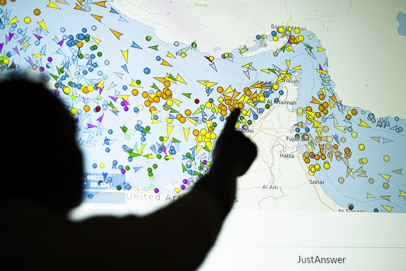](#)

​

어디에서 출발해서,

어디에 도착할 것인가?

​

이게 **학습** 임

​

서울에서 출발해서 대전을 간다,

대구를 간다, 전주를 간다, 부산을 간다

​

어떻게 학습 시키느냐에 따라서,

걔가 **'도착할 위치'** 가 결정 되게 됨

​

통상, 깡성능이 좋은 모델 일수록

**출발지/도착지** 로 찍힌 **좌표가 많음**

​

​

낮은 성능의 모델은,

​

강남구 가주세요

같은 지시는 알 수 있어도

​

신사동 가주세요

같은 지시는 모를 수 있음

​

위와 같이 어떤 **'도착점'** 에

도달하는 것을 **'수렴'** 이라 하는데,

​

[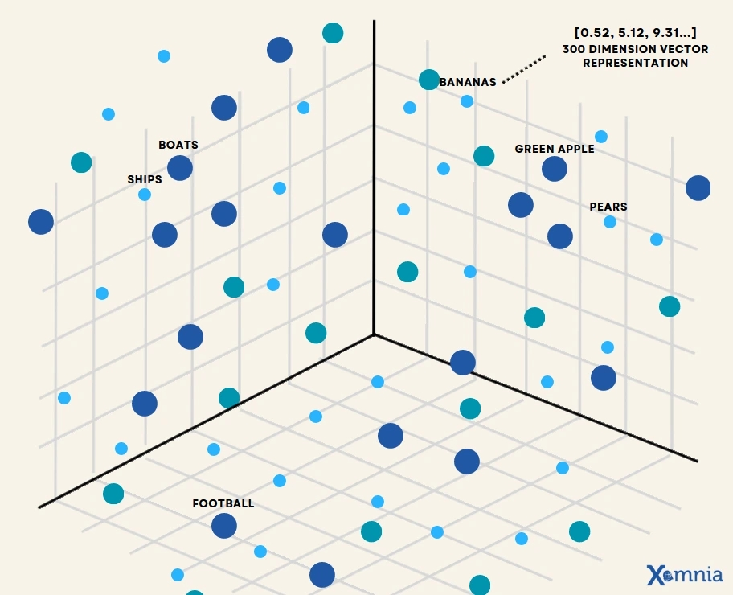](#)

​

다차원 벡터 공간 안에서

출력될 값 하나로 수렴한 결과가,

​

우리가 인공지능을 통해서

얻을 수 있는 것 임

​

**\* 내가 집 밖으로 나갈 일이 없는데,**

**우리집 화장실 위치는 모르지만**

**뉴욕시 전역을 머리에 꿰고 있다면?**

**​**

**성능은 높지만 실사용이 별로인 것**

**​**

출력 성능은 **'몇 걸음'** 까지 걸어가서

도착지에 도달할 것인가? 를 결정함

​

1걸음 가는 것보다 10걸음 가는 것이

대체로 **'꼼꼼하게'** 갈 확률이 높을 것임

​

근데 똑같이 10걸음을 걷는다고 할 때,

​

어떤 모델은 1걸음 걷고, 지도 보고,

1걸음 걷고, 지도 보면서 갈 수도 있고

​

또 다른 모델은 2걸음 마다 볼 수도 있고,

​

지도가 아니라 가면서 주변에 만나는

사람한테 물어보면서 갈 수도 있고,

​

다양한 방식으로 도착할 수 있을 것 임

​

이게 각 AI 모델 기술사들이

갖고 있는 **'영업 기밀 중 하나'** 고,

​

10만번, 100만번 애들을 걷게 시켰더니

쟤네가 걷는 패턴이 이런 것 같다,

​

라는 것이 남의 기술을

쌔비는 방법 중 하나 임

​

지도를 많이 본다고 더 좋은 것도 아니고,

주변 지형으로 예측한다고 좋은 것도 아니고,

​

대충 도시는 이렇게 생겼다,

산은 이렇게 생겼다 패턴 익혀놓고

거기서 예측하면서 통밥 치는 것도

​

언제나 좋은 것은 아니기 때문에,

​

상업 모델들은 대부분

**​**

**'가장 많은 사용자'** 들이

**'가장 많이 사용하는'** 패턴을

지향하는 경우가 많고,

​

여기에서 이제 **주권 이슈** 가 생김

​

6. 선생님이 시험을 내는데,

​

답지를 외워서 학생이 오면

올바른 평가를 할 수 없을 것 임

​

[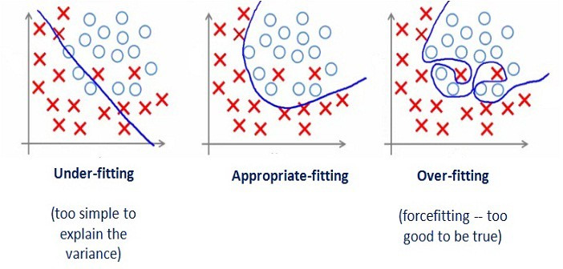](#)

​

답을 맞추는 것이 **'수렴'** 이라고 할 때,

​

애초에 공부를 안 해서

성적이 안 나오면 언더핏

​

**\* 덧셈이 뭔지 그냥 모름**

**​**

이해 없이 그냥 문제랑 답만

무지성으로 외웠으면 오버핏 임

​

**\* 1+1 = 2 만 외워서,**

**1+2 = ? 이걸 풀 수 없음**

​

물론, 전부 그런 것은 아니겠지만

​

특히 **중국산 모델들** 의 경우에는

벤치를 조작한다고 많이 알려져 있고,

​

실제 사람들이 이 점수를 많이 보고,

높은 성적이 나오면 뉴스가 되니까

​

눈치껏 벤치에 맞는 과제에 맞게끔

살-짝 오버핏 하는 것이 **트렌드** 임

​

그래서 내가 알기론, 아마 작년 부턴가

사람들이 벤치를 **'아예'** 안 믿게 되었고,

​

실사용, 블라인드 A/B 같은 것만

그나마 신뢰 하는 분위기 가 생겼음

​

<https://arena.ai/leaderboard/text>

[**LLM Leaderboard - Best Text & Chat AI Models Compared**

Compare and explore Text models ranked by overall performance.

arena.ai](https://arena.ai/leaderboard/text)

​

그게 **'아레나'** 리더보드 임

​

[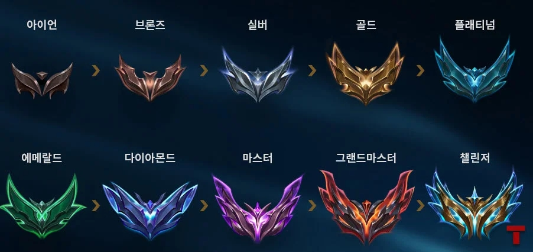](#)

​

인공지능이 어떤 결과를 내면,

그 두 결과 중 하나 고르게 시키고

​

이기는 애는 승점을 주고,

지는 애는 점수를 뺏어서

​

누가 누가 더 높나? 경쟁을 시킴

​

물론 이조차, 거대 자본 겐세이가

있다고 보는 사람들도 있긴 하지만

​

아예 안 볼 순 없는 노릇 이니

구경은 해보는 분위기가 있는데

​

[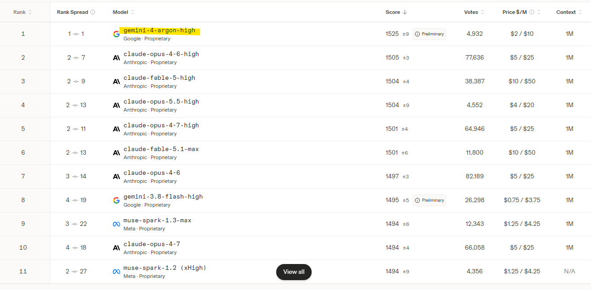](#)

​

텍스트 벤치에서 구글 아르곤이

클로드 모델을 **깔끔히** 닦아버렸음

​

스코어 20점 차이라고 해봐야 **사실**,

​

​

**얘네 넷 중에 누가 제일 롤 잘 함?**

같은 질문이라 큰 의미는 없긴 한데,

​

**\* 1등과 10등 차이가 20점 내외**

**2등과 1등 차이가 10점 내외면,**

**그냥 아예 차이 없다고 봐도 무관**

**​**

그래도 1등을 찍었다고 하니까

​

이걸 쓰면 뭐 다르긴 다르려나?

하는 생각이 들 수도 있을 것 임

​

결론만 말하면, **다른 동네 얘기** 임

​

**7. 텍스트 리더보드는**

**영어권 화자 중심이다**

​

[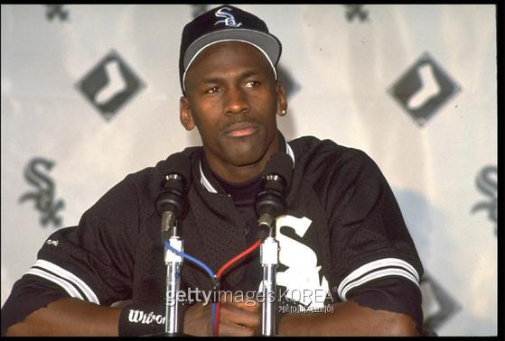](#)

​

마이클 조던은 농구 올타임 레전드 지만,

야구에서는 그냥저냥 정도의 수준 이었음

​

마찬가지로, 특정 언어권 LLM 의 경우

비주력 언어권 LLM 이 쓰면 들었던 것에

비해서 터무니 없는 성능을 볼 수 있는데,

​

**\* 프론티어 모델로 시, 소설, 에세이,**

**같은 것을 써달라고 요청 해보면 실감함**

​

한국어 이용자의 숫자는 세계 범위 에서

아주 아주 작은 그룹에 지나지 않고,

​

특히 우리처럼 **'맥락어'** 를 쓰는 입장에선

​

글로벌 환경에서 느끼는 명성과 다르게

이게 그 정돈가? 라는 생각을 하기 쉬움

​

[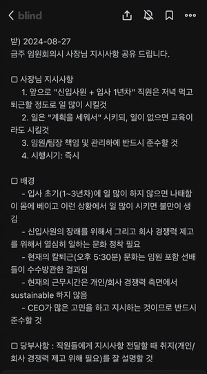](#)

​

**8. 이용자 마다 입력하는**

**프롬프트가 전혀 다르다**

​

현재 인공지능이 모델 성능 관계없이

대체로 잘 하는 것으로 유명한 작업은,

​

수학/코딩/논리 문제 풀기 같은 것임

​

그럼 국민 AI 라고 할 수 있는

GPT 모델에서 **'코딩'** 을 쓰는

사람의 비율은 몇 퍼센트 쯤 일까?

​

25년 기준으로, **'4%'** 정도 임

​

국내 기준으로 자료는 조사마다 다른데

​

제일 많이 사용하는 용도가 고민 상담,

그 다음이 검색 엔진, 과제 같은 것들 임

​

그 말인즉슨,

​

내가 사용하는 용도 목적이

다수의 사람들이 **'선호 하는'**

정렬값과 동일하면 좋겠지만,

​

그게 아니라면 나한테는 그다지 별로

필요가 없는 점수 일 수도 있단 얘기가 됨

​

[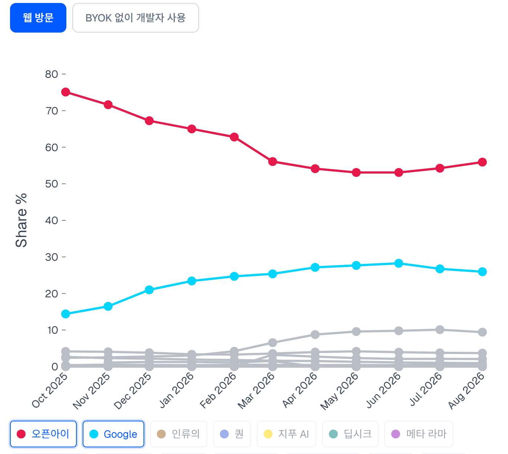](#)

​

해외에서도 이런 용처는 **비슷비슷** 해서,

​

영어권 국가 이용자들이 수다 떨거나,

​

궁금한 것 여러가지 물어보는 용도로

**불특정 다수의 지시** 를 소화하는 경우라,

​

숫자만 보고 성능을 단정하기도 어려움

​

9. 기사 보니까, **롱 칸텍스트** 라면서

**긴 대화도 알아서 쏙쏙** 다 들어간다는데?

​

인간의 기억력 한계는,

입력에 있는 것이 아니고

출력에 있다고 하는데

​

LLM 모델의 작업도 동일함

​

단순히 긴 문맥을 넣어놓기만 하는 건,

20B 내외 짤짤이 로컬도 되는 수준이고

​

어려운 것은, 긴 문맥이 들어왔을 때

​

지금 대화에서 **'무엇을 골라다가'**,

**'어디에 갖다 붙이느냐'**,

​

그러니까 **어텐션** 을

어떻게 입히냐? 인데,

​

이건 그냥 천재 하나 나와서

대단한 혁신 만들기 전 까지는

​

사람들이 직접 본인이 깎고,

갈아서 만드는 것 외엔 답이 없음

​

그럼에도 낙관적이게 볼 수 있는 지점은,

​

[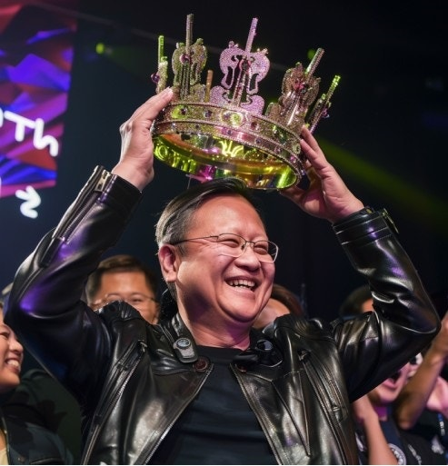](#)

​

선도 업체들이 경쟁 환경에 놓이게 되면서

단가를 맘대로 올릴 수 없는 분위기란 건데,

​

투자 하는 입장에선 속 탈 수 있는 일이지만

사용하는 입장에서는 호재라 볼 수 있을 듯함

​

**10. 결론**

**​**

1) 여기서 더 뭐 안 나와도 ,,

이미 있는 모델만 해도 떡을 친다

​

벤치점수 98점 99점 차이는

같은 문제 풀었을 때 맞출 확률이

1% 차이 난다는 소리다

​

그냥 98점 짜리 쓰면서,

틀리면 한번 더 돌리면 된다

​

2) 기업 입장에서도 성능 투자보다,

비용에 민감하게 작용할 수 있어서

​

여기서 더 좋은 모델 나온다고 해봤자

너도 나도 딱히 좋아할 사람이 별로 없다

​

3) 신기술 나와서 기계 문명이

인류를 파멸 시킬 것이라는 얘기를

좋아하는 사람은 딱 세 부류 밖에 없다

​

주주, 음모론자, 특이점 주의자