# 국민성장펀드의 설계적 결함
**Date:** 20시간 전
**Category:** 다이어리
**Original URL:** https://blog.naver.com/xpfkwh56/224294798828
---

1. 적어도 우리 남조선에서

정치와 경제를 떼놓을 순 없음

​

각 정권이 무엇을 대표하였는가 를

알고 싶으면 슬로건을 보면 간단함

​

이명박은 경제 대통령,

박근혜는 창조경제,

문재인은 소득주도성장

​

얼핏 기억나는 단어들을 붙이면,

무엇을 하려던 사람들인지 보임

​

2. 말년이 썩 좋지는 않으시지만,

​

이명박의 경우, **'경제 대통령'**

슬로건이 **'진짜'** 이기도 했음

​

해낸 것이든, 살아온 인생이든

경제적 요소들과 매우 가까웠다,

​

정도는 그 개인의 호감도와 별개로

대체로 동의할 수 있는 부분일 것임

​

3. 문재인 역시, 말이야 많지만

**​**

**돈을 상당히 뿌렸다는 것** 하나는

반박할 수 있는 사람이 적을 것임

​

그럼 남는 인물이 하나 생기는데,

**'창조경제'** 가 **그래서 무엇이냐?** 임

​

박근혜의 창조경제 와

안철수의 새정치 가

​

무엇인지 아는 사람이

지구상에 존재하긴 하냐는

농담이 있기도 했음

​

이제와, 굳이 그 의미를 풀어서 해석한다면

창조 경제의 의미는 다음과 같이 볼 수 있음

​

**정부와 기업이 주도하는 기존 경제 질서 안에서**

**개인의 경쟁력으로 독자적 시장을 개척하게 한다**

​

구체적인 예시를 들겠음

​

4. 작가가 되려면, 신춘문예를 뚫고

등단을 해서 문학계 에 편입 해야 됨

​

웹소설을 씀 → 대박이 남

​

**창조경제** 임

​

원래 방송을 하려면, 공채를 봐서

PD 가 되든, 작가를 하든, 뭘 해서든

주류 언론 네트워크에 들어가야 됨

​

유튜브를 함 → 대박이 남

​

**창조경제** 임

​

제조업을 하려면 돈이 많아야 됨

공장도 있어야 되고, 손이 많이 감

​

OEM 으로 주문함 → 대박이 남

​

**창조경제** 임

​

물건을 판매하려면 매장이 있어야 됨

상가는 유독 비싸고, 마땅한 아이템이

없는 사람이면 그냥 프랜차이즈 해야 됨

​

온라인 비즈니스 함 → 대박이 남

프차 안 하고 창업 함 → 대박이 남

​

**창조경제** 임

​

이렇게 들으니까, 그럴법 한데?

라는 생각이 드는 부분도 있음

​

문제는,

​

**'한다고 되는 일'** 이

아니라는 것에 있음

​

남들이 생각이 닿지 않아서,

바보라서 기득권 줄을 안 잡고

​

밖에 나와 개고생 하는 것이 아니고,

**'그거 말곤 할 수 있는 일이 없으니'**

​

그 놀라운 **차력쇼** 를 하는 건데,

​

하루 아침에 시켜만 준다고

혁신이 되고, 개인의 창조성이

​

바로 산업적 부가가치로 연결되는

기적 같은 일이 생길 리가 만무하니,

​

어설프게 규제/가이드 만 없어지고,

헛돈만 날아가면서 사기꾼이 양산됨

​

5. 윤석열은 내가 잘 몰라서 모르겠고,

​

**\* 굳이 변호하자면 생각이 있어도**

**그걸 정책적으로 하실 수가 없었고**

**​**

이재명 정부 들어서는

또렷한 슬로건을 하나로

집약해서 하진 않는 듯함

​

공정, 상식, 균형, 같은 추상적인

대의를 배제하고, 단어를 찾으면

​

이재명 한테는 **'생산적 금융'**

이라는 글자가 당장 눈에 보임

​

**그렇다면, 생산적 금융은 무엇이냐?**

​

1) 일을 하는 사람이

돈을 벌어야 된다

​

2) 정당한 부가 정당한 사람에게

분배되는 것이 바람직 하다

​

**마찬가지로 예를 들어보겠음**

​

어떤 사람이 건물주 임

이 사람은 땅 투기로 돈을 벌었음

​

이건 **'생산적 금융'** 이 아님

​

어떤 사람이 대출업자 임

생활비를 빌려주고, 이자를 먹음

​

마찬가지로 **'생산적 금융'** 이 아님

​

똑같은 건물주인데, 이 사람은

디벨로퍼라서 지역 개발을 해냈음

​

얘는 **'생산적 금융'** 을 한 것 임

​

똑같은 대출업자인데, 이 사람은

사업 투자금을 빌려줬고 이자를 받음

​

얘는 **'생산적 금융'** 을 한 것 임

​

6. 어떤 사람이 돈을 벌었음

​

그렇게 번 돈을 아파트에 넣었음

아파트값이 올라갔고, 이사를 감

​

갭투자, 갈아타기 2-3번 하니까

10억, 20억, 40억 뻠삥이 걸림

​

**생산적 금융이 아님**

**​**

어떤 사람은 돈이 있으면,

그걸 은행에 가만히 묵혀놓고

저리 이자만 먹으며 살고 있음

​

**생산적 금융이 아님**

​

서울은 확실한 메가 시티 니까,

믿고 가는 맛으로 자원을 집약함

​

**생산적 금융이 아님**

​

부동산에 묶인 돈을 기업 투자로 돌리고,

자금의 순환을 자본 시장 투자로 옮기고,

​

언제까지 백날 서울만

보고 있을 것이 아니고,

​

**'당장'** 은 아니더라도 미래 에는

개성 있는 특성화된 도시들을

미리 만들어놔야 된다 라는 것이,

​

**'아마'** 이재명의 아이디어인 듯함

​

[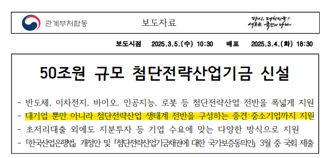](#)

​

7. 25년, 50조원 규모의

첨단전략산업기금이 신설되었고,

​

[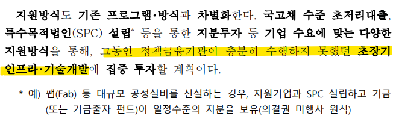](#)

​

단기 결과에 **일희일비** 하지 않을 테니까,

고부가 가치 산업을 하라고 밀어주게 됨

​

[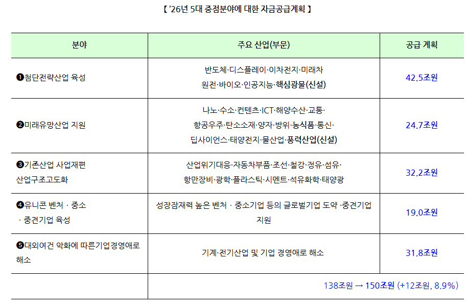](#)

​

조 단위로 들어가는 돈이라,

**'이런 것이 있었음?'** 싶지만

​

얼마나 **'드라이빙'** 을 거냐 문제지,

​

정권을 좌파가 잡든, 우파가 잡든

누가 대권을 잡든 늘 하던 일이긴 함

​

[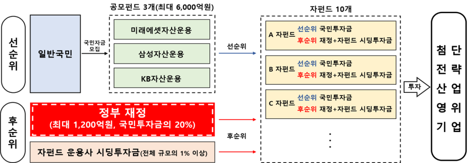](#)

​

차이라면, 과거에 있던

**'테마성'** 펀드 들과 달리

​

**\* 녹색/통일/뉴딜 펀드**

​

국가주도 전략사업들을 중심으로

투자를 한다는 점이 **있기는 한데**,

​

**몇 가지 챙겨봐야 될 부분이 있음**

​

> 1) 수익성을 **'알 수 없다'**

​

**'미래'**, **'가능성'** 을 보고하는 투자

라는 말은 듣기에 실로 당연한 말 임

​

[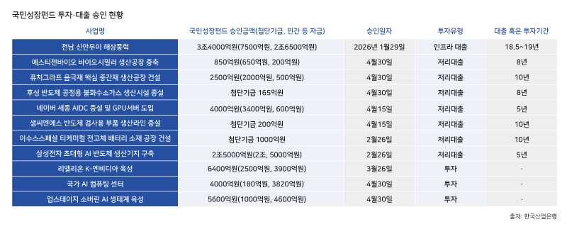](#)

​

근데 **'알 수 없다는 지점'** 때문에,

깜깜이로 돌아갈 여지가 **'농후'** 함

​

내가 알기론, **'솔직히'**

유명무실하긴 해도

​

신보나 기보의 경우 기금이 들어가면

주기적으로 수익이 제대로 나고 있는지?

​

장사는 잘 돌아가고 있는지? 실사를 함

​

그럼 **'가능성'** 있는 사업 쪽에는 어떨까?

​

**검증할 수 있는 방법이 없음**

​

우리는 이 비전이 옳다고 생각합니다,

하면 그냥 **믿고 가야 되는** 지점이 있음

​

**'아마'** 내가 감히 추측하자면,

​

이게 정부 상품이 아니라 민간이면

아무리 보험 멘트들을 붙여놓더라도

​

**'굉장히'** 빡빡하게

팔았어야 했을 것이다

​

**왜 why?**

​

본디, 우리 민족은 통장 비밀번호를

통장 제일 앞 페이지에 적는 민족이고

​

엄마 친구가 보험 가입 하라고 하면,

​

열심히 계약서와 약관을 읽기보다

**'믿고'** 가는 것을 좋아해서 그렇다

​

내가 본들 보면 알아?

알아서 자-알 해줬겠지

​

그에 비해, 지금 판매되는 상품은

**'위험성 고지'**가 너무나 헐겁다

​

태극기 휘날리며 라는 영화에 보면,

​

영신도 보리쌀 준다니까

보도연맹 가입했는데

​

비슷한 결과가 없길 바랄 뿐이다

​

> 2) 데이터 센터가 **'진짜'**필요해요?

​

내가 트레킹 했던 산업이, 독파모로

대표되는 AI 쪽이니 그거만 보겠음

​

**\* 신재생, 음극재, 이런 건 알지도 못하고**

**​**

일전에 썼던 포스팅 내용처럼,

​

데이터 센터는 AI 주권이니

인프라니 포장되는데

​

아주 쉽게 비유하면 **'항공모함'** 임

​

짓는다고 끝도 아니고, 냉각 설비부터

엄청난 유지비를 **'퍼먹는 괴물'** 이고,

​

거기에 들어가는 부품 특성상,

**'감가'** 가 굉장히 빠르게 발생함

​

**'감가'** 라?

​

엔비디아 GPU 를 사례로 들어보겠음

​

Hopper(2022)

Blackwell(2024)

Rubin(2026 E)

Rubin Ultra(2027 E)

​

약속을 지킬 줄은 모르겠지만,

​

짧게는 1년, 길게는 2년 마다

**신제품** 이 계속 나오게 되고,

​

차세대 모델이 나오면, 구형 모델은

전자 제품 특성이 **'고스란히'** 반영 됨

​

데이터센터에서 쓰는 그래픽카드는,

**'채굴용 글카'** 랑 똑같다고 봐야 됨

​

같은 차종 같은 연식이라도

​

5만 키로 뛴 1인 운행 차량과

200만 키로 운행한 택시 차량은

​

가격 차이가 당연히 발생하는데,

​

당연하게도 **'가격'** 만

차이 나는 것은 아님

​

> 3) **'공공'** AI 인프라가 맞긴 해요?

​

빅테크, 더 정확히는 구글이

인공지능 산업에 뛰어드는 이유는

​

**'AI'** 가 **미래 광고 시장의 핵심** 이라 그럼

​

<https://blog.naver.com/xpfkwh56/224288744088>

[**네이버 홈판, 일확천금 홈판 고시의 시대**

1. 프리비어슬리, 인터넷 이라는 업종에만 속해 있어도 상상키 어려운 투자를 받을 수 있었고, 서비스의 품...

blog.naver.com](https://blog.naver.com/xpfkwh56/224288744088)

​

우리가 쓰는 네이버도

사용자의 의도에 맞는,

​

검색 결과를 찾아주고

​

그거랑 매칭되는 광고를 달아

광고주와 고객을 연결 시켜줌

​

그거랑 **미래 광고 시장** 이랑 무슨 상관?

​

네이버, 구글에 검색해서

AI 가 작성한 글만 읽다 보면,

​

**'에휴 이럴 바에'** 라는 생각이 듦

​

**그럼 그 사람이 어디로 갈까?**

​

GPT, 제미나이, 클로드, 그록 한테

**'내가 궁금한 것'** 을 물어보게 될 것이고,

​

LLM 은 아주 친절하게도

**'맞춤형 정보'** 를 제공할 것임

​

오늘 점심에 뭐 먹을까? 라고 질문함

​

> GPS 로 확인해 드릴게요~
>
> 근처에 ○○ 라는 곳이 있는데,
>
> ​
>
> 최근에 ☆☆ 먹고 좋아하셨잖아요?
>
> ​
>
> 지난 1개월 간의 데이터에 의하면,
>
> 지금 이 식당을 좋아하실 확률은 97% 입니다!
>
> ​
>
> 혹시 마음에 들지 않으실 수도 있으니,
>
> 대안으로 A, B, C 도 같이 알아봤어요

​

**포털이 이 광고판을 이길 수 있을까?**

​

[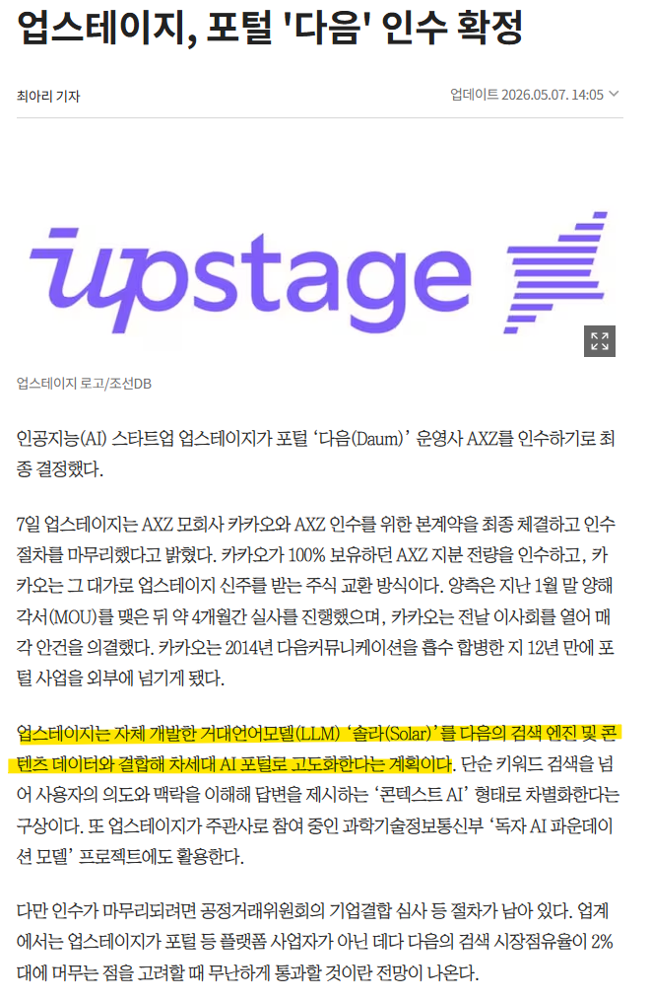](#)

​

업스테이지는, 간판만 남은 다음을 인수했고

​

[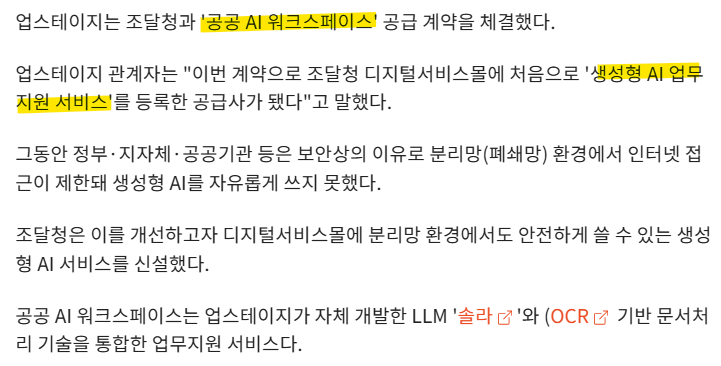](#)

​

조달청에 공공 AI 워크스페이스

공급계약을 체결한 업체고,

​

[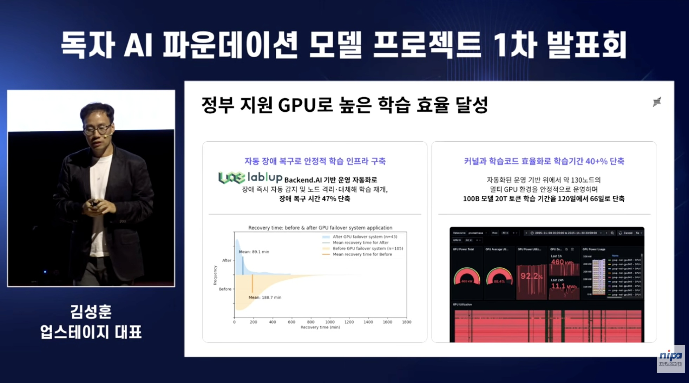](#)

​

독파모 프로젝트 에서

​

유일하게 선정된

중소 기업 이기도 함

​

[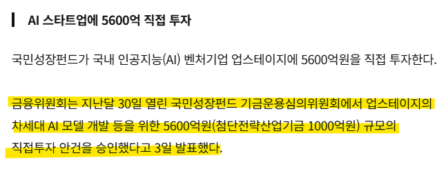](#)

​

당연히 젊은 사람들이 혁신적이고,

창조적인 생태계 조성 환경 속에서

​

도움받을 것은 받고, 할 일은 하고

사업하는 것은 지적할 일이 아닌데,

​

[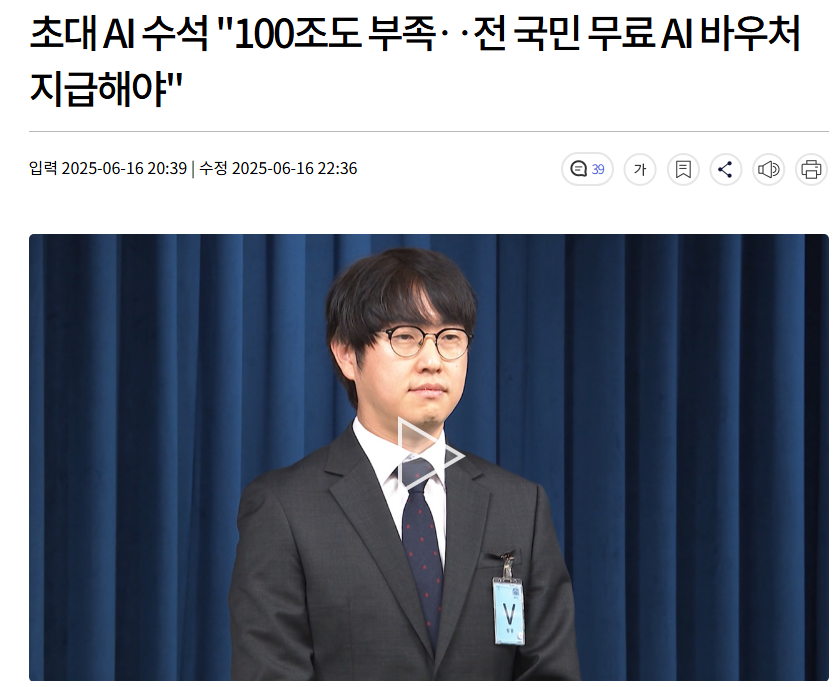](#)

​

하정우 AI 수석이 업스테이지 출신이고,

​

[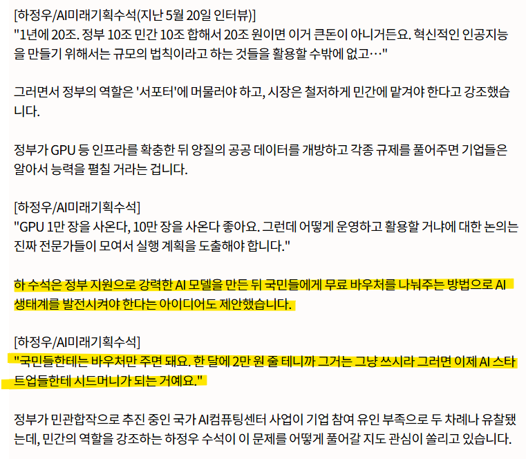](#)

​

**전국민 AI 바우처 지원 사업** 에 대해서

굉장히 적극적인 의견을 갖고 계신 분 임

​

이하는, 그냥 내 상상에 불과하므로

**'이럴 수도 있지 않나?'** 정도로 보심 됨

​

특정 AI 기업이 있는데,

허깅페이스/깃허브 에서

​

스타 찍고 인지도가 생겼고,

​

그거를 바탕으로 B2B, **'B2G'** 로

매출을 발생 시키면서 사세를 넓힘

​

국정 사업 중에, **'이해는 할 수 없지만'**

​

**반드시 토종 우리기술로만** AI 를 만들어서

**'AI 주권'** 을 지켜야 되는 정책이 생겼고,

​

거기에 딱 하나 있는 중소기업이 있는데,

업스테이지 출신이고, 아주 유능한 사람이라

​

**AI 미래기획수석** 으로

정부 부처에 들어가게 됨

​

그렇게 만든 AI 는 LLM 중심 모델로,

GPT 같은 것을 만들 예정에 있는데

​

세금으로 만든 서비스를 **'유료로'**

팔 수는 없으니까, 무료로 할 것이고

​

LLM 모델이 있는 업스테이지 는

**'포털사이트 다음'** 을 인수했고,

​

하정우 수석은 강력한 AI 모델을 만든 후,

​

국민들이 **'AI 바우처 사업'** 으로 받은

지원금으로 결제하게 하면 된다고 하심

​

?

​

그럼 그냥 나랏돈으로

장사한다는 소리 아님?

​

> 4) **'첨단 사업'** 과 **'분리 배당 및 세제지원'**

​

금융위 에서 발표한 자료에 따르면,

​

[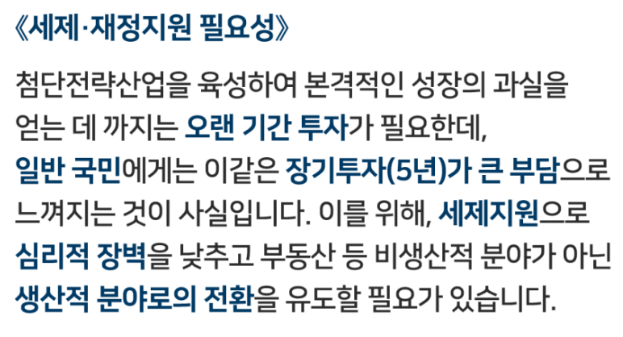](#)

​

해당 사업들은 다 **'장기투자'** 사업들이고,

**'첨단 전략산업'** 장르에 속한다고 하셨음

​

엔비디아의 배당 수익률은 0.46%,

분기별 배당금은 0.25 달러 정도 임

​

아니 상식적으로 반도체, 바이오 이런 회사가

주주한테 배당금을 **풍성하게** 준다는 것 자체가

​

**\* 분리 배당이 유의미할 정도로**

​

**자기들 사업이 조졌다는 증명**이기도 함

​

어느 부모가 의대 갈 자식을, 밖에 나가서

쿠팡 뛰고 배달 해서 돈 벌어오라고 하겠음

​

그 시간에 책 한 자 더 보고,

문제 하나 더 풀어서,

​

성적 올리라고 하는 것이 **'상식'** 임

​

[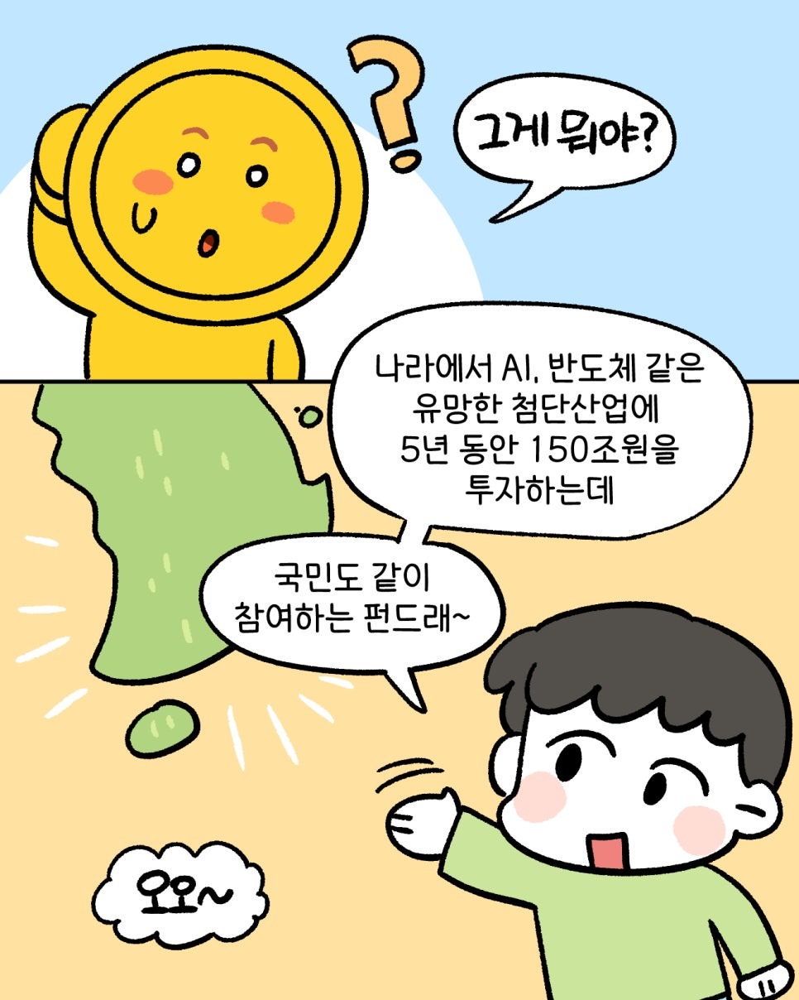](#)

​

마찬가지로 금융위 공식 홍보자료 인데,

​

ISA 에 IRP 에,

연저펀 에

국민연금 까지,

​

공적 연금 채널에만 넣어도

공제가 모자랄 일은 거의 없음

​

**\* 불과 국민연금만 해도**

**추납 보험료 전액 공젠데?**

​

비상장, 기술특례, 메자닌 중심의

고위험 펀드에다가, 5년 묶이고,

​

운용/판매 관련 보수는

오프라인 기준 **1.2%**

​

**\* 온라인 기준 1.0%**

​

총 보수는, 연간 **0.6%** 내외

라고 고지하고 있는 상태인데,

​

S&P 500 ETF (VOO)의

연간 운용 보수는 **0.03%**,

​

SPY는 **0.09%** 정도다

​

물론 항공모함이 필요할만 하니까 사는건데,

​

그걸 연비가 낮다고 하면 어떻게 하냐고 하면

그에 대해서 답할 수 있는 말은 없긴 하겠다

​

**\* 애국 하려고 가입한 사람보다,**

**재테크 목적으로 가입한 사람이**

**많다는 것이 문제 라면 문제겠지만**

**​**

**8. 그렇다면 정리를 해보자**

​

1) 무지성으로 그냥 돈을 맡겨놓고,

알아서 시장 추종 수익을 얻고 싶다

​

라는 사람이라면 **인덱스 전략** 이 낫다

​

2) 나는 소득 공제를

받고 싶은 사람이라면,

**​**

**'정보를 더 검색하는 쪽'** 이 낫다

​

**\* 적어도 일반적인 직장인 수익에서**

**있는 공제도 다 챙겨 먹는 것이 불가능**

​

3) 안정적으로 배당도 받으면서,

세제 혜택도 누리고 싶은 사람이면

​

**애초에 이런 테마를 고르면 안 된다**

​

4) 5년 동안 **'끈덕지게'** 장투로,

​

한국 최첨단 혁신 사업에 대해서

믿는 비전이 있는 사람이라면,

​

**'코스닥 ETF'** 를 사는 것이 낫다

​

**\* 성장펀드 가입하면**

**수익률 상한이 있으니까**

​

5) 20% 는 나라에서 보증하니까,

**'안전하다고'** 생각되는 사람이라면

​

**지금이라도 하루 빨리**

**투자판을 떠나는 것이 낫다**

​

[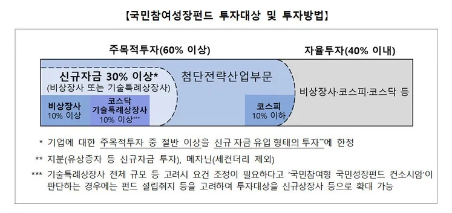](#)

밑에 있는 \*, \*\*, \*\*\* 을 잘 읽어야 됨

​

6) 비상장사 투자는 증권사 방문하면

PB 채널로 **얼마든지** 찾아서 살 수 있고,

​

[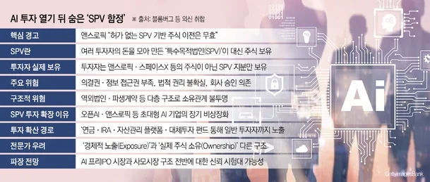](#)

​

비상장 투자 자체가, 인스타 광고 보고

물건 사는 것과 다를 바 없는 **'야생'** 인데

​

이걸 앞다퉈, 오픈런 하고 매진이 터지는

일이 나로서는 이럴 수 있나? 싶기도 함

​

필요한 사람이, 필요한 이유를 알고,

필요한 수준의 예측 범위 내에서,

​

나한테 맞는 것 같다면 별 문제도 아니겠지만

그게 아닌 경우라면, 생각을 좀 해봐야 될 듯

​

9. 예전에 어떤 일이 있었냐면,

​

전 국민적인 지지세를 갖고 있던

**유명한 요식업 사업가** 가 있었는데

​

**'상장'** 을 기점으로 피곤한 일이

여러 가지로 많이 생기신 적 있음

​

정보 비대칭이 극단적인 금융 상품을

국가 신뢰도를 업고 **'선의로'** 판매했다

​

**너무 공격 당하기 좋은 주제 아닌가?**

**​**

돈 잃은 사람이 내 편이 될 리도 없고

딴 사람은 딴 사람대로 아쉽고,

​

못 먹은 사람은 못 먹은 사람대로

정략적 이익이 하나도 없는 것 같다

​

**누가 칼로 협박을 했어?**

**니 손가락으로 가서 했잖아**

**​**

할 수도 없고 말이다

​

[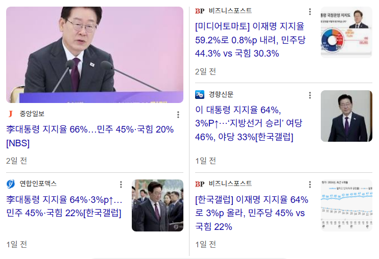](#)

​

대통령 지지율이 높다고 알고 있는데,

국민성장펀드가 목을 조를 수도 있을 듯