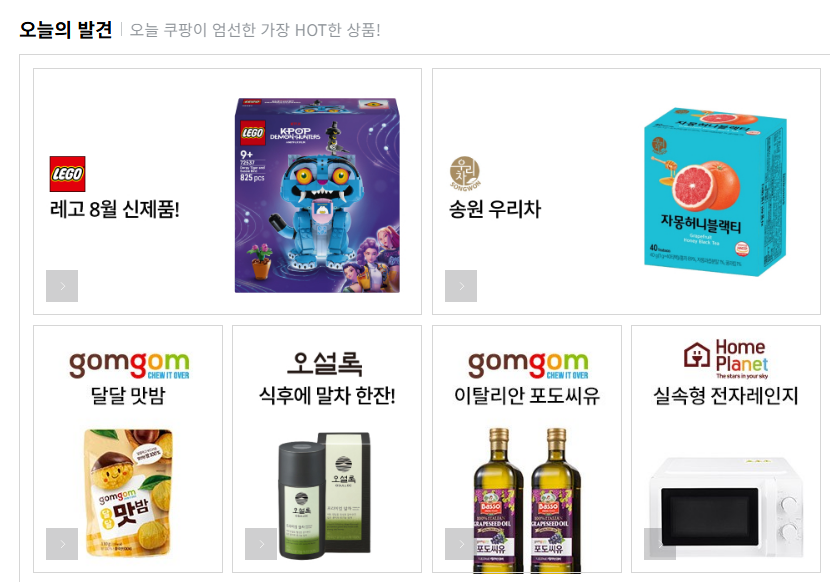
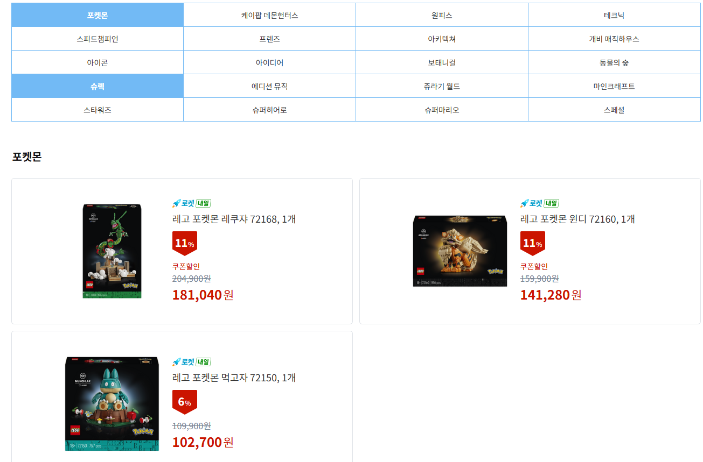
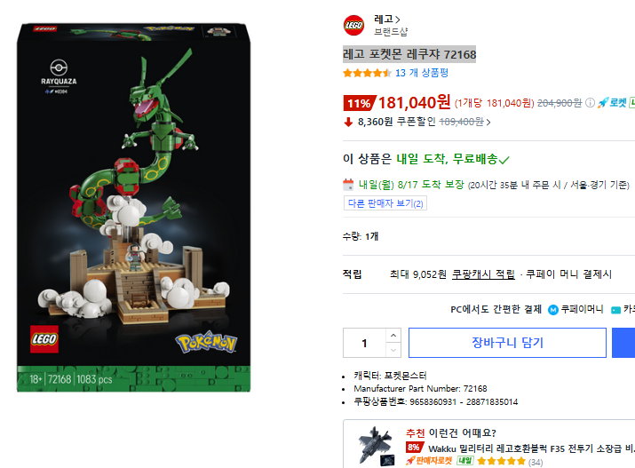
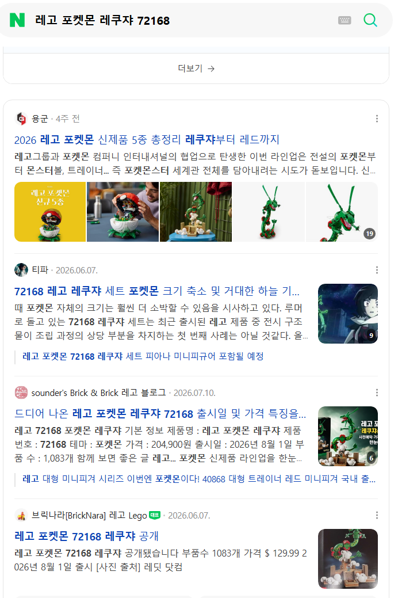
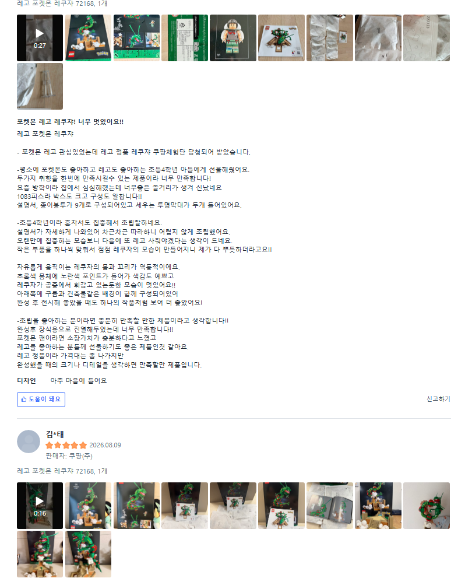
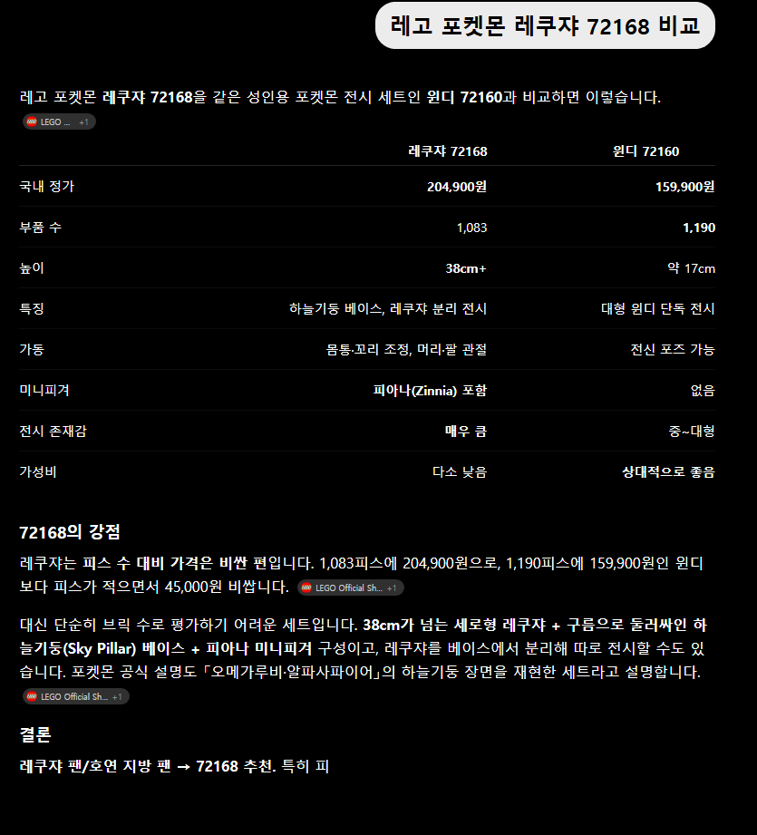
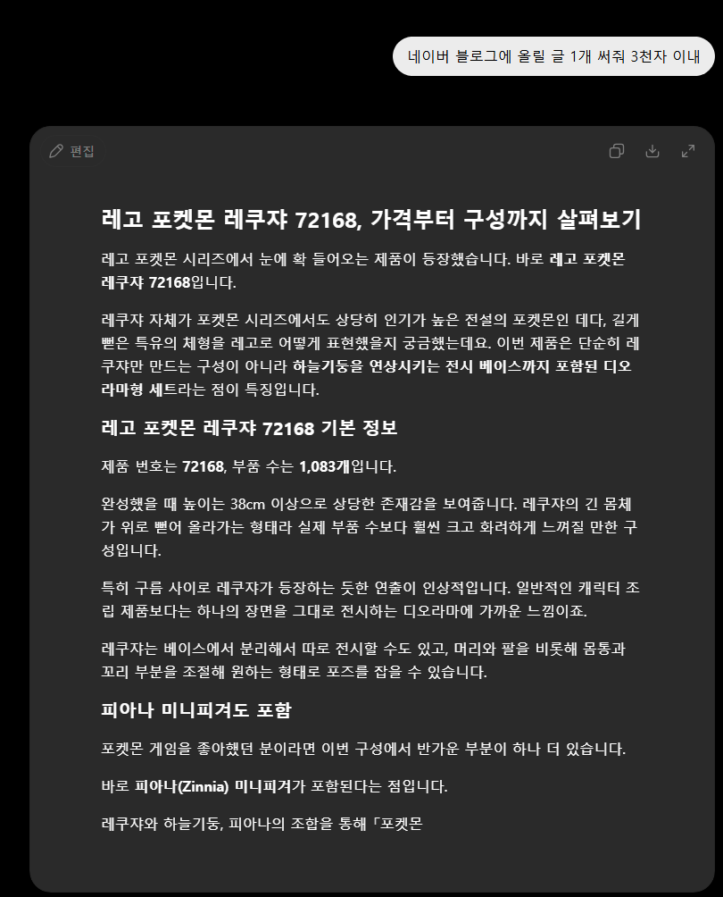
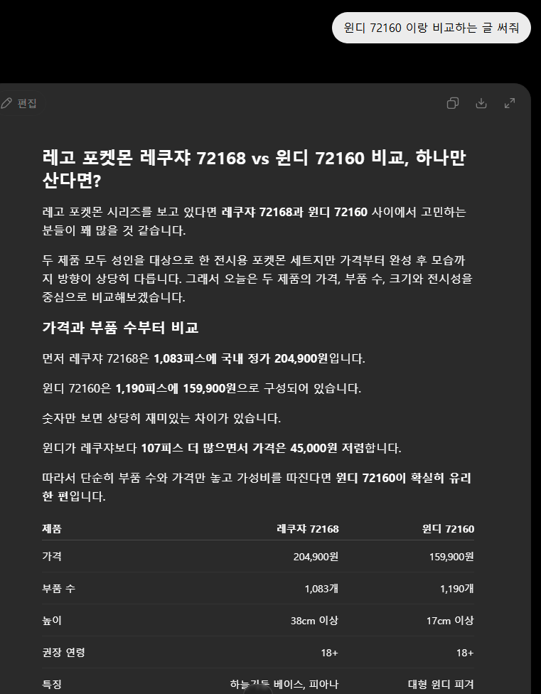

# 네이버 블로그로 날로 먹기
**Date:** 20시간 전
**Category:** 일기장
**Original URL:** https://blog.naver.com/xpfkwh56/224379942282
---

​

1. 쿠팡 접속

​

**\* 쿠팡 말고 아무 커머스 다 괜찮**

**​**

​

2. 아무거나 클릭

​

​

3. 상품명 복사

​

​

4. 네이버 검색

​

​

5. 리뷰로 올라온 사진 우라까이

​

​

6. 복붙 하고, 비교/후기 같은 접미사 입력

​

**\* 지피티는 무료 입니다**

**​**

아무렇게나 써도 되고, 그냥 프롬프트 짧기만 하면 됨

​

7. 복붙

​

​

8. 취향껏 바꿔도 무관

​

9. 블로그에 올린다 끝

​

할루지 체크도 필요 없음

엔진이 검수 안 하니까

​

10. 네이버가 병신 이라

이렇게 해도 되고, 심지어

이걸 하라고 권장하고 있음

​

11. 주의사항

​

부캐 블로그 파서 하셔야 됨

​

본인이 쓰던 메인 블로그나,

일기장 쓰던 곳에 엮어서

관리하려고 하면 불이익 받음

​

잡블이랑 단일 주제 블로그는

부스팅 차이 크게 납니다