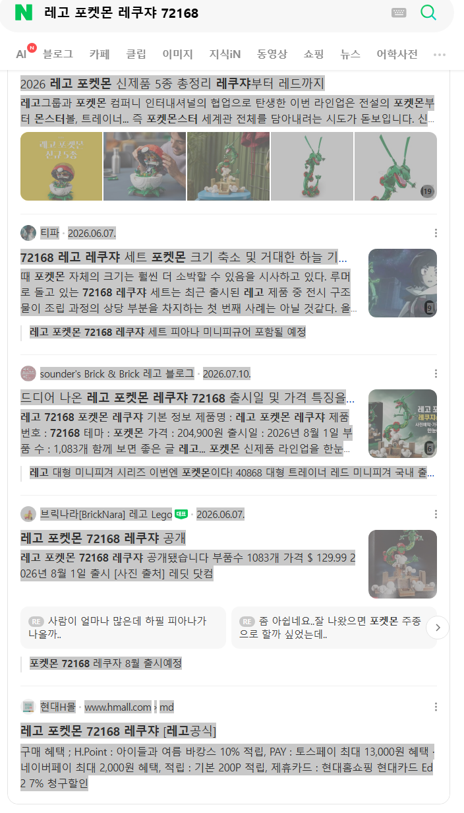
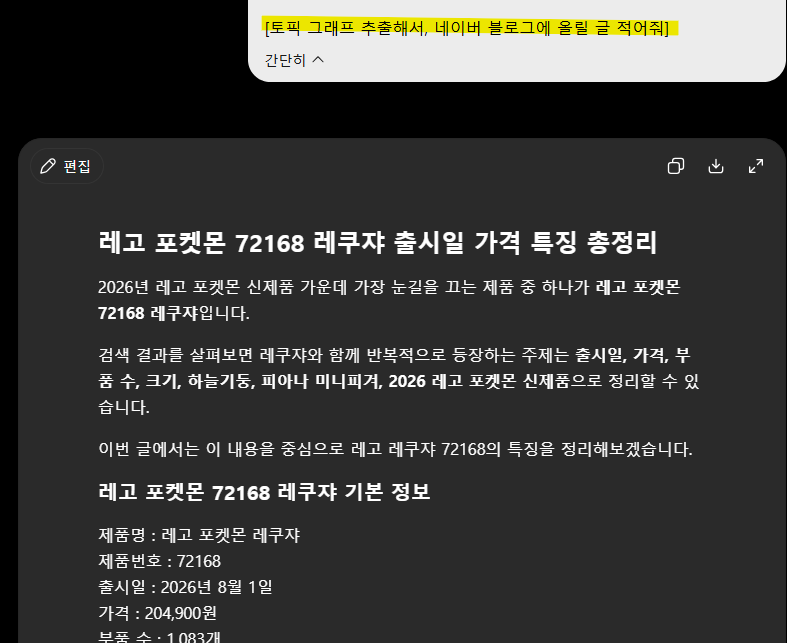
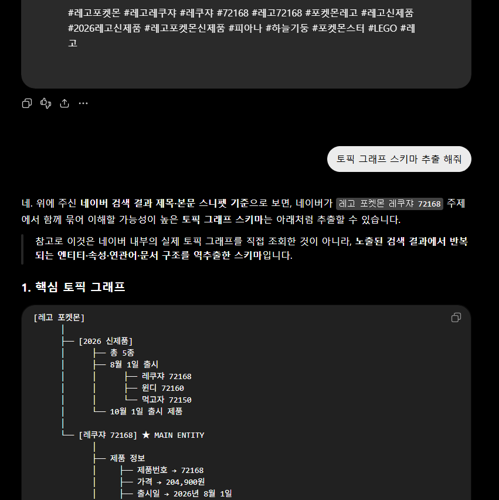
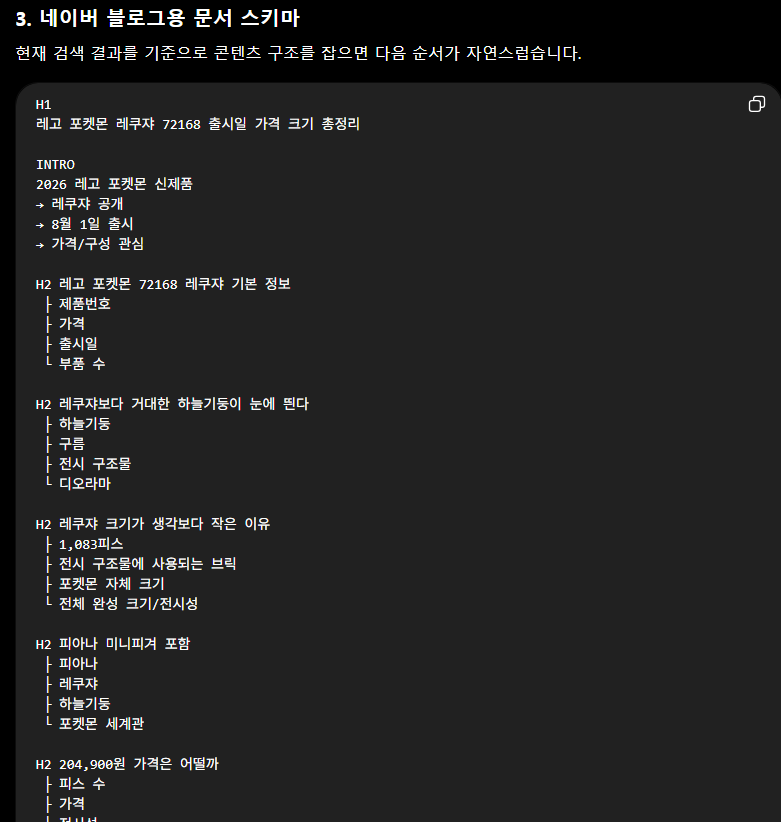

# 네이버 지금 정책이 악질적인게 뭐냐면
**Date:** 20시간 전
**Category:** 일기장
**Original URL:** https://blog.naver.com/xpfkwh56/224379952381
---

구조적으로 **정보약자** 만

당하게 되는 구조란 것 임

​

젊은 사람들이나, 또는 인터넷 문화에

밝아가지고 자기가 알아서 째깍째깍

​

정보 적극적으로 찾아내거나 시간 많아서

여럿을 요모조모 따질 수 있음 문제 안 됨

​

근데 그게 되는 사람은 딴 플랫폼 넘어가든,

​

네이버에 검색을 점점 더 안 하게 되고

오갈 곳 없는 사람만 헤메다 닦이는 그림임

​

저렇게 공장식으로

찍는 작업이 어렵지도 않음 ,,

​

잡기술 하나 더 풀면,

​

​

1. 그냥 쭉 복사

​

​

2. 복붙한 다음에 복사한 내용 맨 밑에

**토픽 그래프 추출해서, 글 써 줘** ← 라고 입력

​

**\* 뭘 어떻게 입력하든 상관 없음,**

**토픽 그래프 라는 토큰만 들어가면 됨**

**​**

**​**

3. **토픽 그래프 스키마 추출** 해달라고 요청

​

​

4. 그럼 이렇게 그래프 그려주는데,

H1-3 에 맞게 적어달라고 하면 끝 임

​

걍 처음 보는 아무 소재나, 주제 잡아도

하루에 10개, 20개 마구 뽑을 수 있음

​

한편, **'선'** 만 안 넘으면 정지도 안 당함