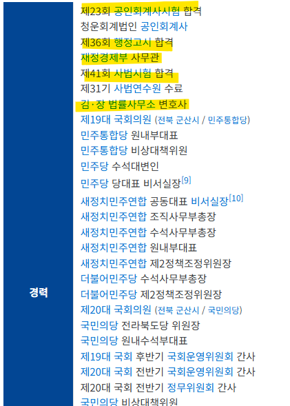
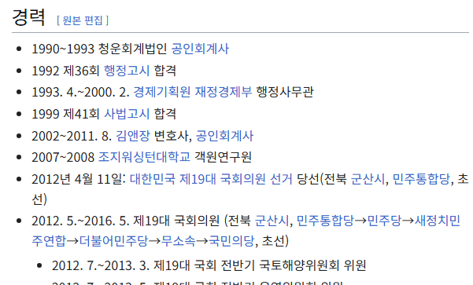

# 최악의 직업이 정치인 같다
**Date:** 20시간 전
**Category:** 다이어리
**Original URL:** https://blog.naver.com/xpfkwh56/224239010918
---

​

언론에 문제가 된 김관영 도지사,

이 사람 인생의 약력을 한 번 보자

​

​

**인간이 아니다**

​

​

69년생인데, **90년에** 회계사로 일했고

**'92년'** 에 행정고시를 패스한다

​

회계사 출신 사무관으로

재경부에서 일을 하다가,

​

99년에 사시 패스하고

​

회계사 출신의 사무관 출신의

변호사로 김앤장에서 일 했음

​

아무리 젊은 시절, 한 끗발로

평생 먹고 살 수야 없다지만

​

반박불가한 **고시형 인간** 에다가

​

**\* 고시류 공부에 도가 튼**

**특출난 인간이 아닌 이상,**

**저런 스펙은 가질 수가 없다**

​

남들은 1개만 있어도 먹고 사는

라이센스를 3개나 들고 있음

​

만약 나였으면? 죽어도 정치 안 함

​

세상에서 제일 안 좋은 직업이

내 생각에는 **대중을 대하는** 일 임

​

같은 공무원을 해도 국가직이 낫고,

똑같은 사업을 해도 B2B가 낫고,

​

연예인, 인플, 정치인 이런 직업은

시켜줘도 하면 안 되는 직업 같음