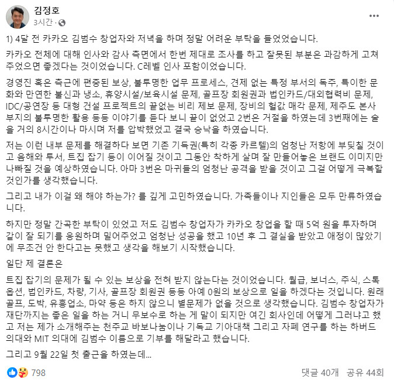
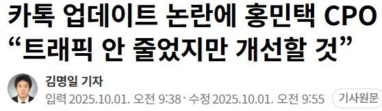

# 칼의 최후
**Date:** 20시간 전
**Category:** 다이어리
**Original URL:** https://blog.naver.com/xpfkwh56/224250190665
---

1. 약 3년 전, 카카오톡 에서는

**거창한 인적 쇄신** 을 목적으로

외부 인사를 수혈했던 적이 있음

​

김범수 대표가 데려왔던 인사는

​

**'김정호'** 라는 인물로,

​

오늘 네이버를 만든 인물이자

굉장한 약력을 가진 엘리트 임

​

​

김정호는 위와 같은 배경에 기반하여,

​

카카오 CA협의체 경영지원총괄 직위를

받고, 내부에서 칼춤을 휘두르기 시작함

​

여러가지 내용이 나왔지만,

​

카카오에서는 **'사실무근'** 으로 일축했고,

김정호는 6개월 만에 회사에서 짤리게 됨

​

나야, 대기업 나으리들이 뭔 일을 하나

도무지 정확한 진실을 알 방법은 없지만,

​

**1천억대 자산가** 이자, 사회적 사업을 하는

김정호 라는 사람이 자신의 **사욕** 이나 또는

​

불온한 목적으로 저런 일을 했다고는

솔직히 크게 와닿지가 않는 것 같았음

​

그냥 **'처세'** 에서 밀렸구나 라는 생각 뿐

​

김범수 대표의 진의는 아무도 알 수 없음,

그러나 역사적으로는 이런 기출이 있음

​

중종은 조광조를 전폭적으로 밀어주면서

자신의 의지를 대리하다가, 사약을 먹였고

​

숙종과 송시열의 관계에서 보이는 것처럼,

​

권력의 의지에 반하는 **'수단'** 은

언제나 늘 배척 당하기 마련이었음

​

좋소든, 대기업이든 사람이 모이는 곳은

대체로 다 이런 일들이 빈번하게 있는데,

​

내 손에 피를 묻히기는 애매한 상황일 때,

​

나를 대신해 칼춤을 출 수 있는 망나니를

데려다가 칼잽이로 알차게 잘 써먹은 후,

​

팽 하는 것은 딱히 누가 가르치지 않아도

우리네 인생에 자주 관찰할 수 있는 일 임

​

23년에 인적쇄신을 논하던 카카오는,

​

​

25년 들어서, 고객과 **'기싸움'** 을 한다는

소식으로 언론에 슬슬 나오기 시작했고,

​

인스타그램 같은 소셜 미디어 채널로

혁신 하려는 액션을 보이고는 있는데,

​

그게 아직 잘 되어가는지는 **미지수** 임

​

뭐 그 사이에 어떻게 되었는진 모르겠지만,

​

카톡이라는 메신저 자체의 경험만 본다면

인적쇄신 이라는 것은 **아마** 잘 안 된 것 같음

​

애초에 그런 것이 가능한 일인지도 모르겠음