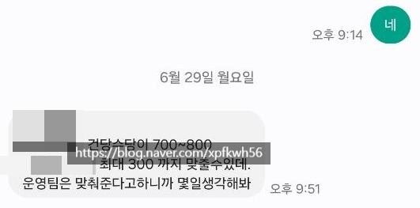

# 휴 그리고
**Date:** 20시간 전
**Category:** 일기장
**Original URL:** https://blog.naver.com/xpfkwh56/224331312034
---

1. 리아2 블로그에 글 쓰실 때,

인공지능으로 쓰시고 계신가요?

​

**아뇨**

​

2. 제가 블라깅 하는데 바쁘고

시간 없으면 차라리 안 쓰고 말지

​

먼 취미생활 하는데 봇을 돌리겠음 ,,

아예 기준값이 다른 경우라면 몰라도

​

뭐가 밤낮없이 올라오는건

원래 밤낮없이 살아서 그렇고

​

원래 임시 저장한 글이 되게 많아서

​

그냥 제가 썼던 글에서 글감 찾거나

생각나면 마저 마무리하는 그런 식임

​

3. 최근에 메이트 업데이트 되면서

그건 그거대로 제가 **보이는** 것이 있어,

​

하고 있는데 요 블로그랑 아예 별개임

​

그럼 거기에 뭘 쓰냐? 쓰긴 뭘 쓰겠음요

요즘 설계/개발 고민만 맨날 하고 있는데

​

내가 네이버 라면, **'인간 블로거'** 없이

어떻게 내 사업을 운영할까? 가 제 **시선** 임

​

**\* 네이버 블로그 숫자는 약 3천만,**

**즉 1명이 1천만을 대체하면 3명만**

**있으면 공급망 시스템 없어져도 됨**

**​**

찍히는 레코드는 그냥 **점수** 일 뿐이구요

​

4. 네이버로 트래픽 찍히고 이런다고,

와아 하면서 제가 막 좋아 죽는 것도 아님

​

걍 시간 여유나 더 생기고, 실력 키워서

구글로 넘어가고 싶은 마음만 있을 뿐 임

​

구글로 그럼 왜 가고 싶냐?

나두 메이저랑 경쟁 해보고 싶어서

​

나 잉공지능 이거 잘 하는 것 같은데,

내가 가진 천장이 어디까진지 궁금해서

​

​

5. 글구 제가 자주, 다 얘길 안 해서 그렇지

​

자본, 인력, 투자, 등 다 해줄 수 있으니까

하기만 해달라는 제안 심심찮게 받고 있음

​

**\* 단가만 놓고보면 저 혼자 해도 저건 됨**

**​**

주식이든, 부동산이든, 그게 무엇이든 간에

**먹고 사는** 문제는 진짜 진작에 졸업 끝났음

​

아직 건강하고 부지런한데,

산 입에 거미줄 치겠읍니까 ,,

​

모로 가든 밥만 안 굶으면 돼죠