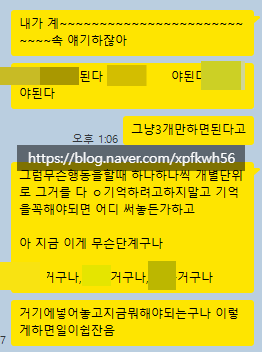
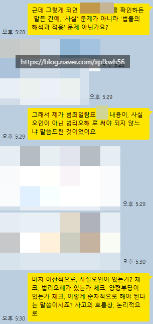

# 가치를 규정하는 방법
**Date:** 21시간 전
**Category:** 다이어리
**Original URL:** https://blog.naver.com/xpfkwh56/224288638348
---

1. 일전에 적었던 내용이기는 한데,

​

이모님이 좋냐? 나쁘냐? 에도 대체로

똑같이 써먹을 수 있는 **프레임 워크** 임

​

**\* 프레임워크 = 작업 처리구조**

**​**

2. 어떤 무엇이 좋냐, 나쁘냐,

그걸 하는 것이 옳으냐, 그르냐,

​

이익이냐, 손해냐 같은 것을

알기 위해서는 기준이 있어야 됨

​

3. 약속된 기준이 없으면,

​

굴절이 발생하고 굴절이 발생하면

**같은 것은 같게, 다른 것은 다르게**

그건 그거, 이건 이거 를 논할 수 있는

​

제일 기본적 원칙을 잃기 때문 임

​

​

4. 제가 근래에 유독

재미를 보고 있는 것은,

​

잉공지능 AI 그래픽 모델을

응용하여, 산업적인 쓰임을

찾아, 거기에 접목하는 것 임

​

**하나만 풀어보겠음니다**

​

남조선에서 **집을 보러 가실 때** 보면,

보통 **'텅텅 빈 상태'** 로 보시게 될 것임

​

**왜 why?**

​

공간이 어떻게 잘 빠졌나,

들어가서 어떻게 살아야 되나,

​

이런 것들을 **'바닐라 상태'** 일 때,

확인하기가 더 쉽기 때문 임

​

**문제는 모다?**

​

아직 남조선이야 먹고살기 좋아서,

​

집꾸도 하고, 재주가 되면 잘 살고 있다

본인이 직접 인테리어 까지 하는 반면

​

해외의 일부 지역, 일부 문화권에서는

**'빈 집'** 에 들어간다는 것 자체가 낯설음

​

우리가 그렇듯, 내 집 마련 같은 단어를

어렵게 여기는데 남조선은 기회라도 있지

​

외국 일부는 그냥 아예 **답이 없음**

​

위와 같은 이유로, **'수요'** 가 형성 되는데

​

가능한 저렴한 돈으로 제일 좋은 집을

**'사겠다'** 가 아니라 **'지내 보겠다'** 가 그럼

​

어차피 궁궐 같은 집이 **'언감생심'** 이면

​

작은 집이라도, 내 **'보금자리'** 처럼

지내고 싶다는 수요자의 니즈에 맞게

​

가능한 **'보기 좋은'** 옵션을 갖추는 것이

임대인들에게도 좋은 요구가 되고 있는데

​

문제는 **집꾸** 가 **'매우 비싼 작업'** 이란 것임

​

잉공지능은 모를 해준다?

​

비싸고, 어렵고, 복잡한 작업을

저렴하고, 쉽고, 간단하게 해준다

​

[](#)

​

비싸다 → 병목 → 인공지능 도입

→ **저렴하게 바꿀 수 있다** (o)

​

> 지금 시장에 있는 모 서비스는 실질 가치보다 가격이 더 높다
>
> 이 왜곡의 중심에는 특정 비용이 전가되었기 때문인데,
>
> 내가 요거를 개입해서 들어가면 시장을 깨뜨릴 수 있다

​

제가 **'학습곡선'** 이 완만한 이유는

​

금방금방 제가 익히는 여러 가지들이

저한테는 **'똑같은 것'** 들이라 그럼

​

아동학, 미술학, 경영학, 기하학,

컴퓨터 과학, 이렇게만 적어놓으면

​

서로 **전혀 다른 것들로만** 보이는데

​

**'필요에 의해'** 접근을 하려고 하면,

글자만 다르지 대개 비슷한 얘길 함

​

이게 제가 **'쉽게'** 배울 수 있는 것을

여태까지 **'쉽게'** 배워 왔었던 이유 임

​

제 사건은 아닙니다

​

법률 도메인과 이산수학 도메인은

겉으로는 아예 **'전혀 다른 영역'** 임

​

근데 컴파일러 파싱 트리랑 **'똑같고'**

​

편의상 예를 들어, 폭행 이라고 잡으면

​

(사람∧신체∧폭행행위∧고의) →

(징역≤2년)∨(벌금≤500만원)∨구류 등

​

그냥 그래프나, 구조에 스킨만 달라짐

​

심지어 과학으로 넘어가도 똑같음,

​

온도를 논함에 표준 대기압을 상정하냐

아니면 우주 같은 특수 환경을 기준하냐,

​

콘크리트가 굳는 현상을 모델링 할 때,

도대체 몇 개의 변수를 넣느냐 같은 것은

​

RPG 게임에서 PvP, PvE,

마뎀 비율, 물뎀 비율, 저항력

같은 수치를 넣는 것과 동일

​

**\* 기사가 마법사랑 PvP 할 때는,**

**~한 점이 유리하지만, 다르게 보면**

**​**

**사냥 효율은 어떤가, 다른 클래스와**

**싸울 때는 어떤 트레이드 오프가 있나**

**여러 매개 변수들을 고려해야 된다 나,**

**​**

**일반 사냥터에서는 A 무기가 좋지만,**

**속성 사냥터에서는 B 무기가 좋고,**

**​**

**C 무기는 당장 대미지가 좋지만,**

**에테리얼 이라 수리가 안 되니까**

**반영구적으로 사용할 수 없다 등**

**​**

즉, **훨씬 인지 자원을 덜 쓸 수 있음**

​

5. 다시 이모님 이야기로 돌아가서,

​

이모님이 좋은가, 나쁜가?

라는 것을 평하기 위해서는

​

무엇이 있을 때, **'좋다'** 라고 기준하고

어떨 때, **'나쁘다'** 라고 규정하느냐?

​

라는 문제를 풀어야, 해답이 나오게 됨

​

만약, 제가 **'나는 항상 좋은 것을 고른다'**

라는 명제를 기준으로 판단을 한다고 치면,

​

**'내가 고르지 않는 것은 나쁜 것이다'**

라고 바로 이어지는 결론이 나올 것이고,

​

1) 나는 좋은 것만을 선택한다

2) 나는 이모님을 선택하지 않았다

3) 이모님은 내게 나쁜 것이다

​

라는 **깔끔한** 식이 떨어지게 되는 것임

​

**\* 논리적으로 완결성이 있다고 해도,**

**그게 통용될 진리가 될 수 없음도 자명**

​

6. 때문에 중요한 것은, **'앞단'** 임

​

좋냐? 나쁘냐? 가 아니라,

​

1) 사용한 기준이 무엇인가?

2) 그 기준은 정합한가?

3) 기준은 목적에 부합하는가?

​

라는 문제를 따져야 된다는 것 임

​

7. 우선 저한테는 육아가 **'깎는'** 과정임

​

저는 실무에 대한 집착이 강한 편인데,

​

편의점 매장 2개를 당장

들고 있는 사장이 있다 침

​

내가 일을 하면 → 인건비가 절약

직원이 일을 하면 → 시간을 번다

​

라고 하면, 매상이 잘 나와가지고

사람 하나 박아도 굴러 갈 때, 쓰면 됨

​

근데 이렇게 되면 **놓치는** 것도 생김

​

**'내가 일을 모르게 됨'**

​

가끔 우리는 어떤 일을 부가가치가 높다,

낮다 라는 것을 갖고 판단할 때가 많은데

​

그 부가가치의 시점이 언제인지도 봐야 됨

​

현장의 공기를 느끼고, 냄새를 맡으면서

내 관찰력을 최대치로 예민하게 잡은 채로,

​

이게 **'어떻게 돌아가는 것인지'** 알수록,

​

**'특히'** 좋소 업계에서는

사장의 눈과 직원의 눈이,

​

아빠의 기저귀 채움과 엄마의

기저귀 채움 디테일 수준 만큼

​

매우 매우 다르기 때문에,

​

같은 일도 내가 하면

더 잘 보일 수 있음

​

제 아들, **'1호기 양육 이해도'** 는

압도적으로 지구에서 제가 1위임

​

위에 있는 도구를 바로 써보죠,

양육 이해도가 1위 니까

​

제가 내리는 결정도 결과값이

언제나 1위일 수 있을까요?

​

그런 것 임니다

​

**\* 같은 것은 같게, 다른 것은 다르게**

**​**

8. 다음으로는 제 **'기준'** 의 문제 임

​

​

제가 실무를 못 놓는 이유가 **이게** 안 됨

​

그럼 하는 입장에서는, 평소처럼 그냥

하는 만큼 했는데 그 사람 딴에는 노력하고

괜히 제 평가 못 받는 문제가 생기게 되고,

​

저는 저대로 돈만 쓰고 만족도가 떨어짐

​

돈을 **'많-이'** 주고

시키면 되지 않나요?

​

그럴 정도로 돈이 많지도 않고

​

**\* 과연 내가 남이라면, 얼마를 줄 때**

**내 성에 차게끔 일을 해줄 수 있을까?**

**​**

한편, 줘서 될 일 또한 아닙니다