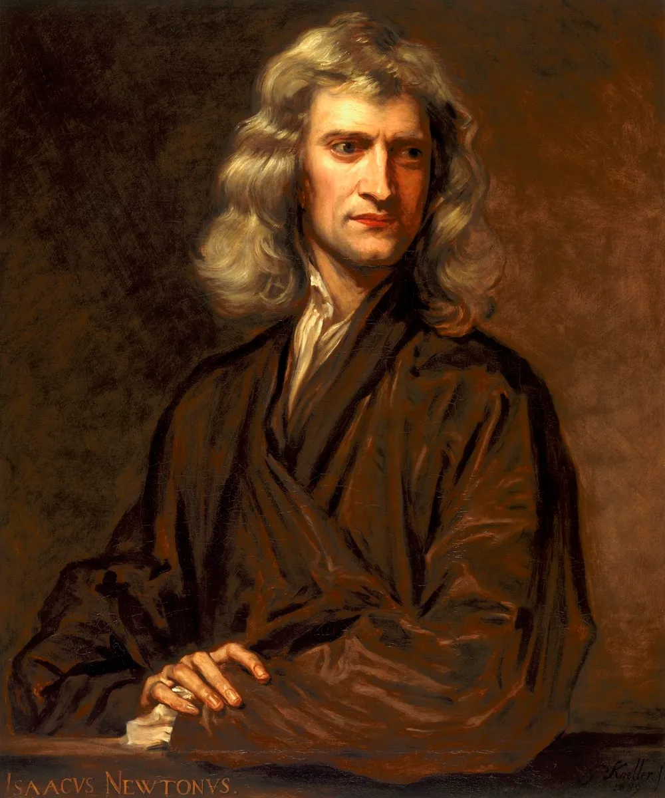
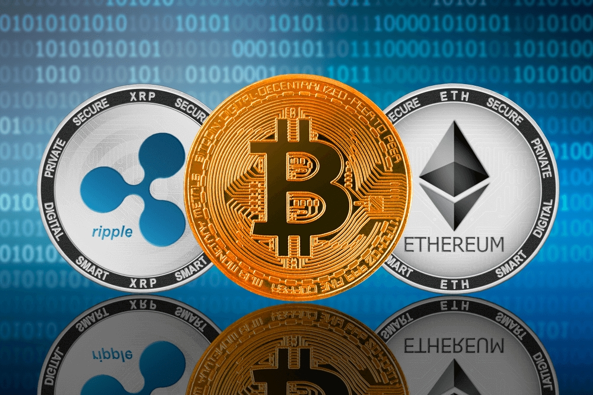
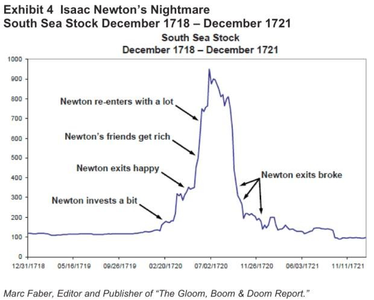
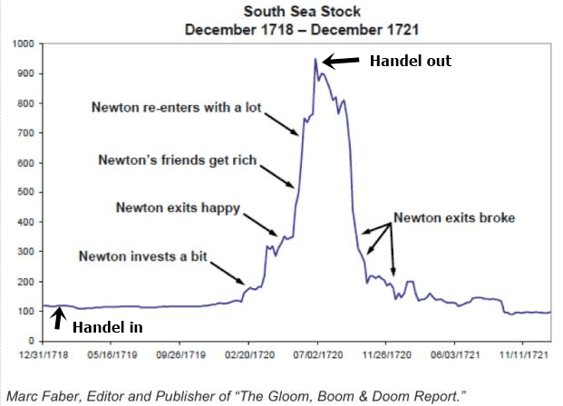
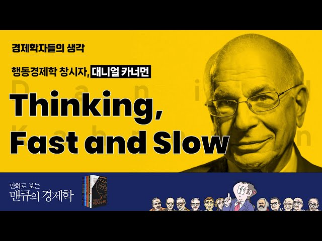
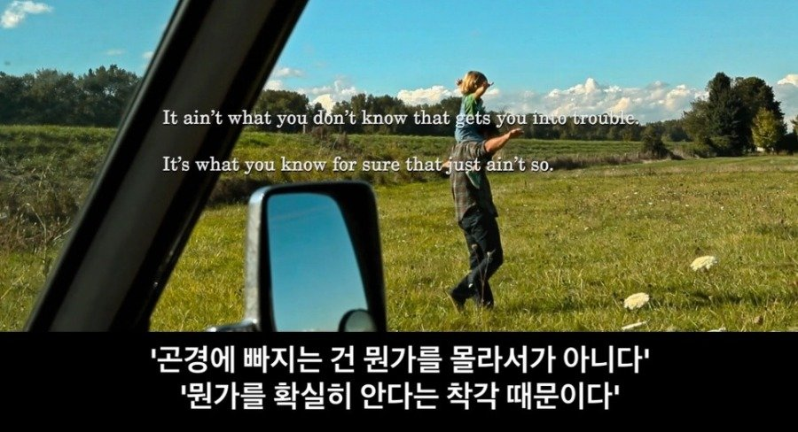

# 뉴턴과 남해회사
**Date:** 21시간 전
**Category:** 다이어리
**Original URL:** https://blog.naver.com/xpfkwh56/224267447056
---

​

1. 뉴턴은 근대 과학의 기틀을 닦은 인물로,

​

인류 역사상 손꼽히는 천재로 여겨지는데

이런 지성도 차마 해결할 수 없던 것이 있음

​

> 나는 천체의 움직임은 계산할 수 있으나,
>
> 인간의 광기는 도저히 계산할 수 없다

​

바로 **'주식'** 임

​

주식 무서운 것이야, 오늘도 아는 얘긴데

도대체 **뭘, 왜, 어떻게 했길래** 그랬을까?

​

안전의 '대명사'

​

2. 남해회사는 일종의 **'공기업'** 이었는데,

얘네들이 써먹었던 재주가 예사롭지 않음

​

먼저 남해회사는 영국 정부로부터

3천만 파운드의 국채를 매입했는데,

​

이 국채를 주식으로 전환해

3150만 파운드의 유상증자를 통해

일반에 매각해도 된다는 **허가**를 받음

​

여기서 전환비율이 고정되지

않았다는 점이 핵심 인데,

​

주가가 100파운드일 때는,

국채 100파운드를 가진 사람에게

그냥 주식 1주를 주면 땡이지만

​

주가가 200파운드로 바뀌면

발행한 신주 1주에

국채를 0.5주만 줘도 되므로

​

앉은 자리에서 100파운드의

현찰을 먹는 것이 가능했음

​

**'장사가 아니라 진짜 주식을 팔아서,**

**합법 차익을 챙길 수 있었다는 것'** 임

​

이 과정에서 의회의 동의가 필요했는데,

빠따가 커서 막대한 뇌물로 해결했고

​

남미 원자재 독점 무역권,

노예 사업권 등등, 알짜 사업들이

​

재료로 나오면서 급속도로

시세가 튀어 오르기 시작했음

​

처음에야 뭐 이유가 있긴 있었겠지만

시장이 과열되면서 찌라시가 난립하며

​

청약 1시간 만에 **주당 300파운드** 에

200만주가 번개처럼 팔려나갔음

​

논리적으로 생각하면 할수록,

이 주식은 안 살 이유가 없었음

​

**왜 why?**

​

1) 주가가 오르면 오를수록

회사에 들어올 돈이 늘어남

​

2) 소득의 주체가 **'국채'** 임

​

3) 의회에서 재무 장관을 비롯해,

권력자/귀족들이 남해회사 주식을

​

미리 많이 갖고 있었기 때문에

가격이 내릴 유인도 딱히 없었음

​

**\* 쉽고, 빠르고, 눈에 보인다!**

**​**

**시대적인 타이밍** 도 좋았는데,

​

1700년대 초, 런던에는 이미 주식을 하면

막대한 돈을 벌 수 있다고 알려져서

​

​

3개 밖에 없던 주식회사가

​

​

30년 사이에 200개로

크게 늘어난 상태였고,

​

자고 일어나면 계속 주가가 오르고,

모든 언론에서 다 주목하고 있어서

​

**FOMO** 를 견디기 아주 어려웠음

​

**\* 남들 다 버는데, 나만 거지 된 느낌**

​

​

3. 뉴턴이 심지어 못 번 것도 아닌데,

​

첫 진입에서 솔찮게 수익을 거두고

재진입을 했다가 제대로 망한 것임

​

사료에 따라 다르지만 추측건대,

첫 진입에서는 지금 **7-8억** 쯤 땄고

​

남해회사 투자로 뉴턴이 잃은 돈은

지금 기준으로 하면 **30억 정도** 쯤 됨

​

​

같은 시기, 헨델도 투자를 했는데

저점에 잡아서 고점에 다 털고 나와

**​**

**평생의 염원이었던**

**왕립 아카데미** 를 설립함

​

이제와 보면 헨델 인들

뭘 알고 한 것은 아닐 것임

​

**4. 뉴턴의 실수**

​

뉴턴이 왜 광기를 계산할 수 없었는가? 를

논하기 앞서, 어째서 천체의 움직임을

**계산할 수 있었나?** 를 먼저 다룰 필요가 있음

​

뉴턴이 태어나기 전, 이미 요하네스 케플러는

세 가지 행성 운동 법칙을 발견했음

​

행성들이 타원 궤도를 돌고, 면적이 일정하며,

공전 주기가 세제곱에 비례한다는 것이

​

충분히 진리로 주류 과학에 편입된 상태라

뉴턴은 그에 대한 원인만 설명해도 충분했음

​

관성의 원리, 자유낙하 실험, 또한

갈릴레이 역학으로 확립된 상태였고,

​

데카르트의 좌표 기하학이나

고대 그리스부터 이어진 기하론,

​

무한의 원시적 개념도

충분히 통용된 지식이었음

​

관측 기록은 브라헤가

이미 다 만들어두었으며,

​

**'거인의 어깨'** 위에 올라타서

바라보면 되는 작업 이었음

​

**\* 다만 그게 말처럼 아무나**

**할 수 있는 일이 아니었을 뿐**

​

**5. 소인배의 어깨**

​

1720년 남해회사 거품 당시에는,

**'현금 흐름'** 이라는 개념이 없었음

​

CFO, CFI, CFF 라는

3분법 분류가 자리 잡은 것은

​

아무리 짧게 잡아도 **'1987년'** 이고,

​

현금흐름표 라는 아이디어 조차

고작 1-200년 전, 1863년에 나옴

​

오늘날 CFO 는 거의 없는데,

CFF 만 잔뜩 부풀려 있다?

​

스캠이네, 하고 끝날 문제지만

​

**관측할 도구 자체가 없으니까**

**누구도 이걸 파악할 수 없었음**

​

**\* 변수가 정의조차 안 된 상태**

​

아담 스미스의 국부론이 1776년이고,

얘는 자기가 **경제학자 인지도 몰랐음**

​

남해 버블로부터 56년이 지나서야,

​

**'경제학'** 이라고 지칭할 수 있는

뭐가 생기기라도 한 것이고,

​

**\* Economics 자체가 1890년**

**​**

현대 포트폴리오 이론은 1950년대,

행동경제학은 1974년 이후에나 등장함

​

뉴턴만 남해 버블로 망한 것도 아니고,

​

**보험 통계수학** 역사를 썼다고 평가받는

확률 마스터 수학자 **드 무아브르** 도

뉴턴처럼 남해 버블로 돈을 날렸음

​

**\* 특정 사건이 일어날 확률이 얼만지**

**계산하는 학문을 만든 사람 중 하나임**

​

​

19세기에 들어서,

​

인간의 비이성적 군중심리,

집단 사고로 생긴 문제들이

체계적으로 조망되었고

​

그나마도 **'도덕적 타락'** 이다

라는 정도의 결론만 나왔음

​

​

뉴턴 **'사후'** 250년 정도가 지나서야

​

데니얼 카너먼과 에이모스 트버스키가

인지 편향을 과학적 실험을 통해

**'최초로'** 증명하는 것에 성공했고

​

1979년에 전망 이론을 발표해

비합리적 의사결정의

수학모델을 **'최초로'** 제시했음

​

26년을 살고 있는 현대인 입장에서는

조금만 찾아봐도 알 수 있는 것이지만,

​

그 전까지 이건 인류에게

**'없던'** 툴이고, **'없던'** 정보 였음

​

6. 손익 계산서 조차 **19세기 후반,**

​

어빙피셔의 DCF 는

**1930년**에 처음 나왔고,

​

재무상태표 표준화는 **1934년 이후,**

GAAP는 **1939년,**

​

실무 보급은 **빨라야 50년대,**

**1960년대 이후**,

​

CAPM은 **1964년**,

​

**\* 어떤 한 자산의 기대 수익률은**

**그 자산의 위험(베타) 에 비례한다**

​

효율적 시장 가설이 **1970년**,

​

VaR(Value at Risk) 는 90년대

**'JP 모건'** 이 개발한 것이 처음이고,

​

**\* 이 포트폴리오가 특정 확률로**

**하루에 잃을 수 있는 최대 금액은?**

**​**

ETF 조차 **1993년** SPDR이 시작임

IFRS 는? **'2001년'** 부터 임

​

뉴턴만 그런 것이 아니고,

​

**'안다는 것'** 이 오히려

신기한 바닥이 증시 임

​

1720년 남해 버블 당시에는,

​

**'나는 이걸 꿰뚫었다'**

라는 사람이 없었을까

​

나는 이게 거품인 줄 알지만 더 멍청한 놈이 더 비싸게 사줄 거다

​

그 당시 시대에 내가 있어보진 않았지만

있다, 없다 를 걸라면 있다 쪽에 걸겠음

​

투자는, 특히 금융투자는

​

본질적으로 불완전한 정보를 가지고

미래를 예측하는 작업에 가깝다고 봄

​

인류가 그걸 분석할 도구를 만든 것도

불과 잘 쳐줘야 100년 남짓이고,

행동을 분석한 지는 50년밖에 안 됨

​

그나마도 완성된 것보다

미완성된 것이 훨씬 많고,

​

우리 또한, 뉴턴이 그랬듯

여전히 **'찾고 있는 중'** 임