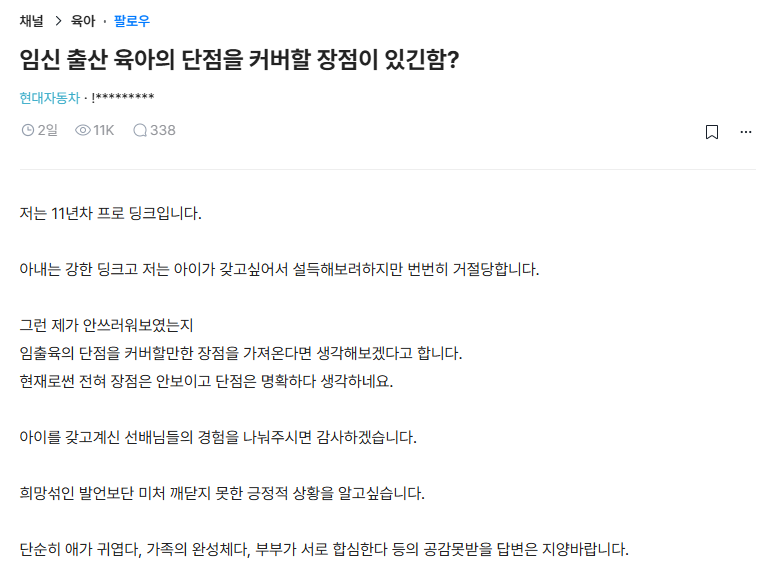
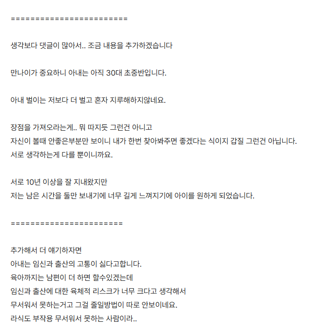

# 딩크 와이프 설득하는 방법
**Date:** 21시간 전
**Category:** 다이어리
**Original URL:** https://blog.naver.com/xpfkwh56/224260694860
---

​

1. 아예 다른 이야기를 한 번 해보겠음

​

**결혼** 이라는 것은 적어도 남조선 사회에서

어떤 과업 처럼 여겨지는 경우가 많은데,

​

그렇다 보니 여자들이 눈이 높다,

남자들이 능력이 없다 라는 식의

담론으로 흘러가는 경우들이 꽤 잦음

​

근데 내 생각에는 둘 다 틀렸다고 봄

​

적어도, 내가 관찰한 바에 의하면

​

<https://youtu.be/RQ-JB7thqyU?si=6lJ6c1uunzYbkpTe>

​

남자 자체가 **'자신의 월등한 능력'** 으로

여성에게 **'인정'** 받는 경험 자체를 즐김

​

이건 사실 판 밖에서 보면 당연한 얘긴데,

​

여자 입장에서 남자가 자신의

**'외모'** 만 보고 좋아한다면 X 지만,

​

**'못 생겨서 경쟁이 쉬울 것 같으니'**

골랐다는 것은 굉장한 무례에 가까움

​

**즉, 사람은 기본적으로 자신이 정확히**

**무엇을 원하는 것인지 모른다고 생각함**

​

그걸 성찰 하고자 하는 노력이

없다면 더욱 더 그럴 확률이 큼

​

2. 본문에서 와이프는 딩크를 하면서,

임출육이 **'왜'** 좋은지 이유를 묻고 있음

​

남편은 거기서, 심지어 **'왜'** 이유가

있는지 커뮤니티에 묻고 있는 상탠데

​

정확한 내부 사정은 알 수가 없으나,

​

남자의 상황 지배력이 그리 높진 않다

라는 것은 충분히 유추 해봄직한 것임

​

그럼 다시 본문으로 돌아가서,

​

저 여자분은 왜 임출육에 대해

부정적으로 인지하고, 가능하면

​

그런 부분에 있어서 꺼리는

가치관을 갖게 되었을까?

​

3. **'보호 받지 않는다'** 라고

느껴서 그럴 확률이 높다 생각

​

저걸 설득하고 있을 것이 아니구,

​

여자가 인생에 **여유가 넘쳐가지고**

애나 하나 낳아볼까? 라는 정도의

​

객기가 들 정도의 상황이 되지 않으면

키케로가 살아 돌아와도 설득 안 될 것임