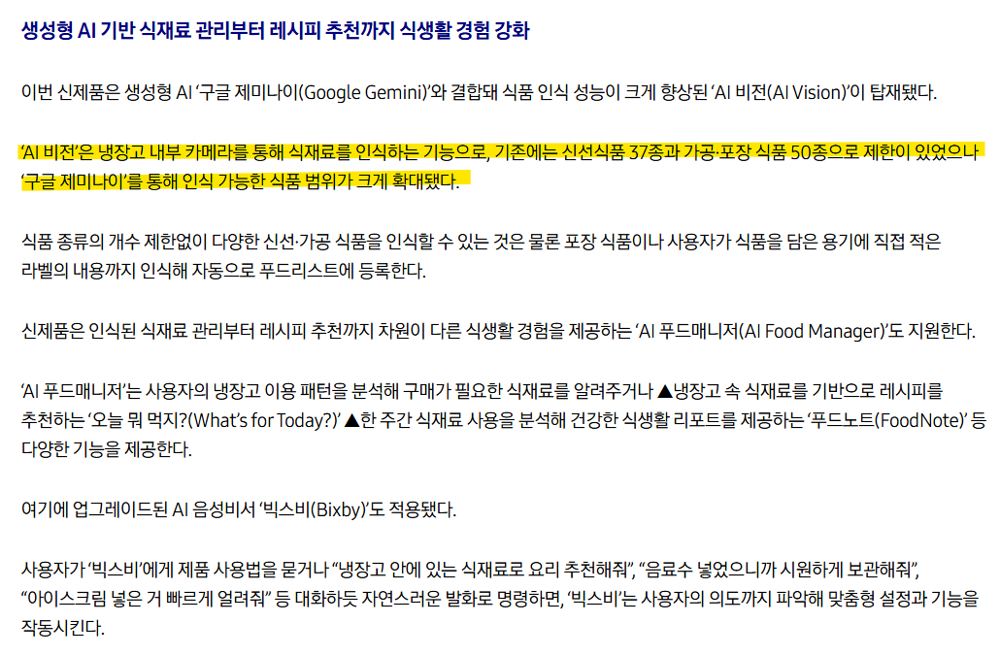
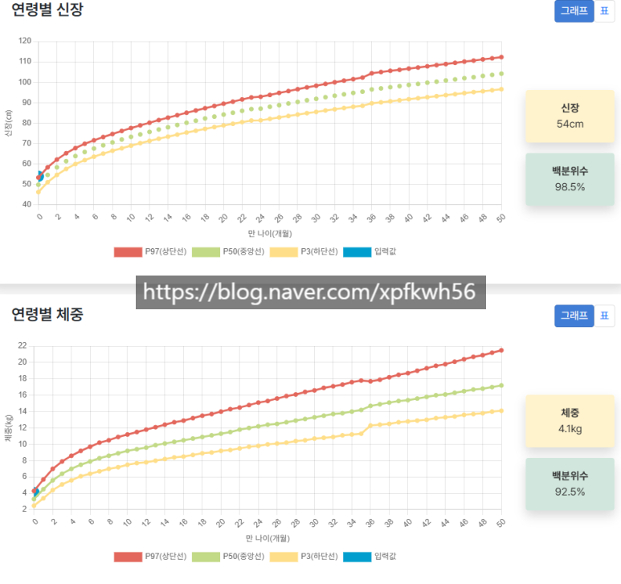
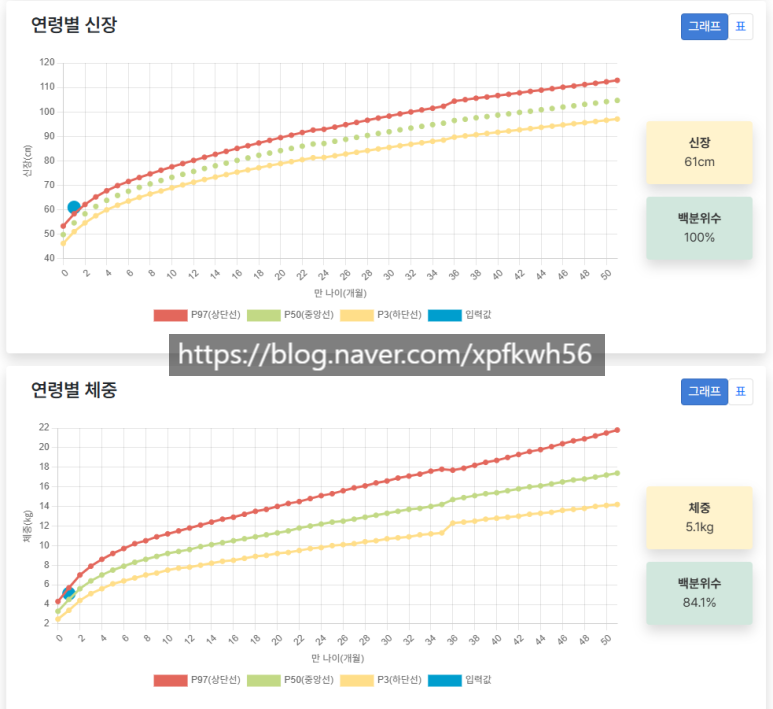

# 세그먼트 기술은 어디까지 왔을까?
**Date:** 21시간 전
**Category:** 다이어리
**Original URL:** https://blog.naver.com/xpfkwh56/224264370896
---

<https://arxiv.org/abs/2304.02643>

[**Segment Anything**

We introduce the Segment Anything (SA) project: a new task, model, and dataset for image segmentation. Using our efficient model in a data collection loop, we built the largest segmentation dataset to date (by far), with over 1 billion masks on 11M licensed and privacy respecting images. The model i...

arxiv.org](https://arxiv.org/abs/2304.02643)

<https://arxiv.org/abs/2408.00714>

[**SAM 2: Segment Anything in Images and Videos**

We present Segment Anything Model 2 (SAM 2), a foundation model towards solving promptable visual segmentation in images and videos. We build a data engine, which improves model and data via user interaction, to collect the largest video segmentation dataset to date. Our model is a simple transforme...

arxiv.org](https://arxiv.org/abs/2408.00714)

<https://ai.meta.com/research/publications/sam-3d-3dfy-anything-in-images/>

[**SAM 3D: 3Dfy Anything in Images | Research - AI at Meta**

COMPUTER VISION SAM 3D: 3Dfy Anything in Images November 19, 2025 Abstract We present SAM 3D, a generative model for visually grounded 3D object reconstruction, predicting geometry, texture, and layout from a single image. SAM 3D excels in natural images, where occlusion and scene clutter are common...

ai.meta.com](https://ai.meta.com/research/publications/sam-3d-3dfy-anything-in-images/)

**​**

1. Sam3 까지는 25년 말부터

26년 초까지로 성능은 **종결** 했고,

​

특정 유즈 케이스에 한해서,

다른 모델이 더 나을 순 있는데

​

세그먼트 라는 분야 안에서는

아예 안 쓸 수는 없는 표준 임

​

2. Sam3 으로 3D 오브젝트 뽑고,

거기에 매시 붙여서 가공한 다음에

​

공간 렌더링 해서, 앵글 모델 붙이구

​

고정된 무대 안에서 피사체가

자유롭게 움직이게 하는 것이

내가 아는 선에서 Sota 모델임

​

**3. 응, 다 알았고 그래서 sam3이 뭔데?**

​

먼저, 세그먼트 기술에 대해 설명하면

​

이미지에서 특정 영역, 사물을

구분해서 추출하는 기술을 말함

​

**\* 영상은 이미지의 연속체이므로,**

**본질적으로 크게 차이가 있진 않음**

**​**

고양이 있고, 상자 안에 있으면

​

상자와 고양이의 경계를 나눈 다음,

고양이 같으면 고양이로 체크하고

​

상자 같으면 상자로 체크한다 라는 것이

가장 기본적인 아이디어라고 보면 됨

​

이미지 전체에서 구분하는 기술이 sam1

​

이미지 전체 내에서, 영역을 구분해서

​

(a.b), (c.d), (e.f), (g.h) 로 구분되는

작은 박스 안에 있는 오브젝트를 다시

연산해서 더 정확하게 하는 것이 sam2

​

박스를 만들어서, 체크하는 것이 아니라

자연어 레벨에서의 마스킹 기술이 sam3임

​

예를 들어,

​

축구장에서 어떤 사람이 공을 차고 있음

​

그럼 sam1 은 매우 많은 데이터를

바탕으로 사람, 공, 잔디 같은 것을

알아서 구분해서 서로 다른 색깔로

​

구분 처리 하고, 그걸 사용자가 알아서

육안으로 구분해서 쓸 수 있는 구조였음

​

sam2 는 이미지 전체를 읽어내거나

또는 사용자가 특정 영역을 가이드 주면

그 가이드 된 공간 안에서 구분을 읽어냄

​

전체 이미지에서 사람이 중앙에 있고,

발밑쯤에 공이 있다고 가정하면

​

그 부분만 box 처리해서, 구분해라

라고 했을 때 정밀도가 크게 늘어남

​

sam3 은 자질구레한 과정이 다 없음

​

person 하면 알아서 사람 찾아내고,

ball 하면 알아서 그림에서 공을 찾아냄

​

text 하면 텍스트만 다 찾아낼 수도 있음

​

렌더링 이미지인데, 그게 글자인지

아닌지 컴퓨터가 뭔 수로 구분을 함?

​

그걸 할 수 있게 만들었으니,

​

메타 AI 연구/기술 팀장

연봉이 수백/수천억인 것

​

**4. 그럼 이 기술을 어디에 쓸 수 있음?**

​

냉장고 내부를 찍은 이미지가 있다고 침,

​

거기엔 과일도 있고 음료도 있고

온갖 식음료들이 다양하게 있을 건데

​

sam3 때려서, food 하면

음식/비음식 구분 잡아줄 수 있고

​

drink 하면 음료/비음료 구분 잡아줌

​

냉장고 뒤에 홈캠을 설치하신 다음에,

open/close로 냉장고를 연다, 닫는다

분기로 처리하고 이미지 읽게 시키고

​

음료가 없다, 과일이 없다 라고 하면

​

냉장고 비워있으니 채우라고 알람을

넣거나, 쿠팡에서 주문하게 처리하면 됨

​

https://news.samsung.com/kr/%EC%82%BC%EC%84%B1%EC%A0%84%EC%9E%90-ai-%EC%8B%9D%EC%9E%AC%EB%A3%8C-%EA%B4%80%EB%A6%AC-%EA%B0%95%ED%99%94%ED%95%9C-2026%EB%85%84%ED%98%95-%EB%B9%84%EC%8A%A4%ED%8F%AC%ED%81%AC-ai-%ED%8C%A8%EB%B0%80

​

이걸 IOT 영역으로 정밀하게 깎으면

삼성에서 파는 AI 비스포크 냉장고 됨

​

**5. 아동 발달에서도 쓸 수 있음**

​

아기를 욕조에 넣고, 움직이는 장면을

영상으로 촬영한 다음에 비디오로 바꿈

​

그리고 프레임 단위로 이미지를 자르고,

시계열 추론이 되는 VLM 에 담거나

​

**\* video url 읽어주는 모델**

**​**

또는 타임 프레임을 이미지 구석에

박아서 시간 순으로 어떤 움직임을

보이고 있는지 스켈레톤 뺄 수 있음

​

**\* openpose, dwpose,**

**sdpose,** **sapiens 등등**

​

수영을 하는데, 오늘 발차기를

몇 번 했다, 그 강도는 어느정도다

​

물 안에서 무엇과 어떻게 상호작용을

했고, 전체적인 발달 추이는 어떻다

​

같은 정보를 갖고 있으면 그걸 바탕으로

대근육 발달 마일스톤 대비 얼마인지,

​

정량적으로 분석하는 것이 가능 해짐

​

거실에 있는 홈캠 정도 화질만 있어도,

아기가 기어다니고, 걸어 다닐 때

​

집 안에서 어디에 관심을 많이 보였냐

같은 세밀한 정보를 얻어낼 수 있는데,

​

**\* 소파 근처에 오래 있냐,**

**창문 근처에 오래 있냐,**

**바닥에 오래 머무르냐 등등**

**​**

그걸 바탕으로 부모님이 의사결정 하면

더 효율적이고, 정밀한 환경 구성 가능함

​

**이걸 외주로 맡긴다면, 얼마 쯤 될까요?**

​

**\* 외주로 맡겨도 engagement 는**

**직접 주도하는 것보다 낮을 확률 높음**

**​**

AI 다룰 줄 알면 **'공짜'** 임니다

​

https://blog.naver.com/xpfkwh56/224029769154

​

아빠 키 170 후반,

엄마 키 160 초반에

​

거대아로 태어나긴 했지만

신체 발달 촉진 과정에 있어서

​

제가 했던 작업들이 **'아마?'**

아무 의미가 없진 않았을 것임

​

**\* 태어난 직후 부터,**

**발달영역 전 영역 최우수**

**​**

최소한 **'해'** 가 되진 않았다고 생각