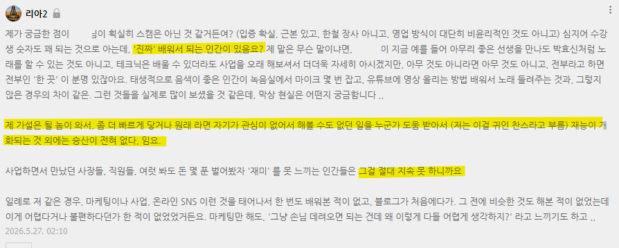
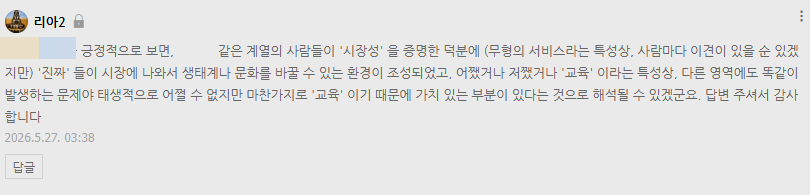
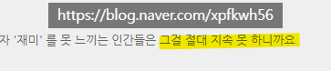

# 옛날 이야기
**Date:** 21시간 전
**Category:** 다이어리
**Original URL:** https://blog.naver.com/xpfkwh56/224297491885
---

​

1. 저는 **'무형의 서비스'** 를

파는 것에 대해서 굉장히

색안경 이 강한 사람임

​

어쩌면 제 그런 성향 때문에

**'유형적인 사업'** 을 제가 할 때,

​

따로 배운 적이 없었지만

마치 배워본 적이 있는 사람처럼

익숙하게 느꼈던 것일 수도 있음

​

**\* 실제로 저는 보이는 것을**

**하는 장사에 자신감이 높음**

​

2. 지금은 싹 정리하고 미국 가셨지만,

​

즈이 아버지는 농사를 오래 지으셨고

**'생업'** 목적으로 팔 것은 아니었지만

​

집에 가만히 계시면

정신이 병드는 것 같다고,

​

자식들이 꾸려준 일도 하시고,

​

농사꾼 기준으로 **'작게'** 과일도 하고,

이래저래 하던 업을 하셨던 적이 있음

​

3. 저는 화(火)속성 딸 이라서,

​

우리 아빠가 하는 것이니까 내가 대신

팔거나 주변 지인들 대상으로 장사하자

​

**이런 생각 자체를 아예 하지 않음**

​

즈이 아버지는 약간 **'유통 센스'**,

**'비즈니스 감각'** 쪽에 취약할 뿐

​

**\* 내 기준, 장사를 하면 안 되는 사람**

**공무원 이나 취직 해야 되는 사람 이심**

**​**

단순히 맛있는 작물을 잘 길러낸다,

라는 관점에선 **'굉장히'** 실력이 좋음

​

4. 저도 제 앞가림에 놀고먹기 바쁘다고,

매번 늘 도움을 드리거나 이런 적은 없는데

​

한 열댓번 정도는 개입을 했던 적이 있음

​

이건 **'수확물 시장'** 에 대한

배경지식이 있어야 얘기가 됨

​

1) 농사는 뭘까?

​

목가적인 환경에서, 낭만적이게

열심히 땀을 흘려서 버는 일 아님?

​

**아님**

​

극단적 레버리지 파생 상품임과 동시에,

​

**\* 애초에 파생 상품, 옵션의 존재가 도대체**

**어디서부터 시작되었는가를 따져보면 빠르다**

​

자연에 대항하는 인간의 투쟁 그 자체 임

​

다른 일이 그런 것처럼, 내 생각엔 농사를

**지을 수 있는** 인간이 있고 **아닌** 인간이 있음

​

나는 그 노동 강도를 가까이서 자주 봤는데,

쿠팡 상하차 이런 것은 **장난** 이라고 보면 됨

​

보상은?

​

터지면, 로또 맞는 것 이고

고꾸라지면 답 없는 수렁에 빠짐

​

**1년 내내, 허리도 못 펴고 일을 했는데**

**적자만 1억, 2억 이렇게 될 수도 있음**

​

2) 그럼 **'좋은'** 농산물이란 뭘까?

​

착한 식당처럼, 깔끔하게 주방 잘 청소하고

정당한 재료로 정당하게 요리하는 것처럼

성실하게 농사를 지으면 성실하게 나올까?

​

마찬가지로 **아님**

​

나도 매우 자세히 알고 있는 건 아니지만,

​

내가 **'보고 들은 바'** 에 의하면

국내에서 가장 상품적 관점에서

​

좋다고 평가할 수 있는 **'모든'** 수확물은

**무조건** 강남에 있는 백화점 먼저 들어감

​

**\* 더 정확히는 백화점 공급 체인에 들어감**

**​**

우리 아빠의 경우, **시골 토박이** 이기도 하고

​

친구랄 사람들이 다 소, 돼지 키우고 있거나

농사를 평생 업으로 삼고 살고 있기 때문에,

​

비슷비슷한 사람들이 많은데,

​

제가 별 생각 없이 과일 먹고 싶어서

나중에 혼자 매장 가서 샀다가 **깜짝** 놀람

​

> 이걸 돈 주고 팔고
>
> 이걸 돈 주고 산다고?

​

바로 설탕 잔뜩 넣고, 다 갈아서 먹었음

​

시골 사람들이 먹는 것은 **'진짜 다른데'**,

그게 다른 이유는 경제적 구조 때문에 그럼

​

농사에 **'노하우'** 차이가 물론 있긴 하지만

이게 까보기 전까진 **'아무도'** 모르는 일이라,

​

질적으로 신경을 쓰는 것은 쓰는 일이고,

결국 수확을 할 때, **'나누는 과정'** 을 거침

​

A = 100개를 수확함

S급이 10개 나옴

​

그럼 S급을 그 가격을 쳐주는 곳에 팔고,

나머지 A, B, C 급을 알아서 처분하게 됨

​

B = 1억개를 수확함

S급이 1천개 나옴

​

똑같이 확률이 **'10%'** 인데도

납품하는 양 자체가 다르니까,

​

**'수요 채널'** 입장에서는

크게 하고, **잘 나올 확률** 이 높은

​

쪽과 장기적인 계약을

맺고 처리하고 싶어 함

​

**'공급 채널'** 입장에서는

​

납품할 수 있는 **'양'** 을

꾸준히 지켜야 되는데,

​

본인도 이게 상품성이 좋게 나올지,

안 좋게 나올지 알 수가 없기 때문에

​

**\* 농사는 1년 동안 근무를 하면,**

**1년 뒤에 연봉을 계약가/시가에 맞게**

**한 방에 정산 받는 도라이 시스템**

**​**

**계약가로 정하면 안정적이지만**

**비싼 것을 싸게 팔아야 될 수 있고,**

**​**

**시가로 정하면 불안정 하지만**

**매우 매우 크게 고점을 칠 수 있음**

​

마음을 졸여야 되는 것은 같은 입장 임

​

사람 키우듯, 내가 열심히 잘 키운다고

**'물리적인'** 속도를 초월하는 것은 안 됨

​

피차 1년 뒤에, 시장에 나올 수량은

**대체로** 정해져 있기 마련인 것이고,

​

그게 많든, 즉든 간에 부족한 사람은

항상 부족하고, 남는 사람은 매번 남음

​

5. 우리 아빠를 포함해서,

부모님 지인들 중에는

​

S급 납품처에 납품을 하다가

​

**'매번 증명해야 되는 것'** 에 지쳤거나

**'더 이상 증명할 수 없는'** 사람이 되면서

​

거기서 밀려난 사람의 숫자가 꽤 있음

​

그래서 딸기나, 수박, 포도 등등

종종 내가 받아서 먹어볼 때가 되면,

​

이걸 뭔 **말이 안 되는 가격** 에다가

아도 쳐서 한 방에 넘길 때가 있는데,

​

그런 경우가 생기면,

그냥 내가 일괄로 싹 사서

​

주변 지인들한테 선물도 해보고

나도 나대로 공부하고는 했었음

​

6. 상품성이 그렇게 좋다는데,

그걸 왜 주변 지인들한테 뿌려요?

​

바로 가져다가 팔아야 되는 것 아님?

​

**그렇게 볼 수도 있고,**

**실제로 그렇기도 함**

​

내가 지인들한테 뿌렸던 과일은

**'공짜로 받아서'** 소비되는 것이 아니라,

​

정상적인 미각을 가진 인간이라면

그 누구라도 **'못 팔 수가 없는'** 물건 임

​

**\* 걍 먹어 보라고 맛보기 과일만 깔아놓고,**

**동네 좌판에만 깔아도 하루면 다 팔릴 정도**

**​**

근데 내가 그걸 바로 갖다 안 판 이유는,

물건이 명품 이어도, 팔고 있는 내가

​

**'팔 수 있는 인간'** 이 아니라면,

**'팔아서는 안 된다'** 여겼기 때문 임

​

그게 제 기본적인 **경영 철학** 임

​

내가 그걸 실제로 전달을 시켜보고,

보관을 해보고, 어떤 과정을 통해서

​

어떻게 가치가 전달되는가? 고민하고,

​

개선할 점을 찾아내고, 병목을 개선하고,

이건 내가 **'잘 한다'** 라는 확신이 들면

​

저는 비로소 그때, 이 게임의 **'점수'** 를

딸 목적으로 랭겜 버튼 누르는 그런 식임

​

**\* 예습 없이 실전 하는 것을 싫어함**

**지는 것은 더더욱 싫어하고**

​

예전에 장사 하면서 제가 최고로

스트레스 받았던 것도 이 부분인데,

​

새벽에 전화가 뜬금없이 오거나,

업무의 강도가 없거나 이게 아니고

​

**'나는 하나도 모르겠는데, 당장 빨리**

**타임 어택으로 정답을 내라고 할 때'**

​

토할 것 같은 스트레스를 받았음

​

**\* 장사는 시시각각 시험 범위가 바뀜**

​

7. 이런 **'제 가치관'** 과 별개로,

​

저는 저와 다르게 사는 사람들을

관심 갖고 지켜보는 것을 좋아함

​

제 블라그를 쫌 보신 분들은 아시다시피

물론 남조선에 좌파/우파 구분 무의미하나

​

적어도 **'사회적 분배'** 에 대해

저는 많이 열려있는 사람임

​

정부가 더 많이 개입해야 된다고 **'믿고'**,

​

현실이 평등하지 않더라도 궁극적으로는

모두가 평등해져야 된다고 **'믿는'** 사람 임

​

**\* 그럼 니 전재산 기부해라 하면 할 말 없고요**

​

제가 구독하는 이웃분들은 물론,

​

장사를 하면서 알게 된 분들 중에서도

저랑 **'상반된 가치관'** 을 가진 분들 많음

​

근데 저는 나랑 다르다고 해가지고,

자세히 알아보지도 않고 무조건 저거는

​

잘못된 것이다, 라고 싸잡지 않는 것이

건전한 정신에 부합한다고 생각을 함

​

그게 보기에 옳고, 그름을 떠나,

내가 그걸 어떻게 생각함을 떠나

​

일정의 **'선'** 이 있으면 나는 당연히

**'내'** 생각이 있으니까 그걸 지키지만

​

굳이 상대를 바꾸려곤 하지 않는단 것임

​

**\* 나도 내 생각을 말하거나 할 뿐,**

**​**

**매우 특별한 경우가 아니라면**

**굳이 개입할 이유가 없기도 하고**

**​**

8. 저 댓글창의 주인도 그런 분인데,

​

무형의 지식 서비스 산업 종사자고

​

제가 한 1-2년? 은 생각 날 때마다

찾을 만큼은 찾아서 본 것 같은데,

​

반박불가 로 수십억 자산을

갖고 있는 영 앤 리치 임

​

**\* 공적 증빙, 적격 증빙 다 확인 되고,**

**원 히트 원더도 아니고 속인 것도 없음**

**​**

**돈만 번 것도 아니고 추적하면 아는데,**

**​**

**물론 운도 따라야 가능한 이야기지만**

**실력이 없으면 할 수가 없는 영역이고**

**​**

**오늘 잘 한다고 내일도 알아서**

**돌아가는 그런 일도 당연히 아님**

**​**

​

그래서 **'실제'** 하는 사람은

그렇구나 라는 이야기를 들음

​

9. 그럼 저 분은 **'진짜'** 실력자 인데도,

왜 님은 여전히 똑같은 생각을 가지나요?

​

1) 국내에 **'대부중개업'** 이란 장르가 있음

​

대출이 나가면 = 대부업

돈을 유통하면 = 대부중개업

​

지금에야 앓는 소리 많이 할 분야인데,

​

제가 과거 **'금융업'** 에 종사했을 때는,

​

**\* 제가 대부, 대부중개 했단 건 아니고**

​

저 업계에 계시던 분이 상황이 좋았음

​

사업에서 제일 중요한 것이 **'시장'** 이면,

그 다음으로 중요한 것이 **'쯩'** 임

​

디지털 노마드 메타에서야,

정보가 돈이 되는 경우가 많지만

​

**특히**, 전통적인 시장이나 현실에서

역사가 조금 있는 장르들로 넘어가면

​

정보 문제가 아니라, **'쯩'** 문제가 큼

​

고인물 장사꾼들이야, 무수리 모드로

자기를 태우는 것은 **'아무렇지도 않아서'**

​

정보 같은 것은, 메이저 로 가면 갈수록

그다지 의미를 못 주는 경우가 많기도 함

​

남들 눈에야, 돈 많으면 빌딩 하나 짓고

불로소득으로 호의호식 하는 걸로 보이나,

​

그런 사람들은 머지않아 다 시장에

**'참교육'** 당하는 일들이 비일비재 함

​

대부중개는 과거 기준,

**'쯩'** 의 문턱이 낮았음

​

그리고 점진적으로 **'꿀통'** 이라서

그 문턱이 높아지기 시작 했는데,

​

이런저런 대외적인 악재가 생기고,

​

**\* 내 비즈니스의 경쟁자가**

**대기업도 아니고 무려 정부**

​

**'1천만원'** 짜리 진입 장벽이

**'3천만원'** 이상 진입 장벽으로

​

바뀐 후에는, **'신규 진입자'** 도

과거와 비교도 안 될 정도로 줄음

​

예전에 블라그에서 대부 창업을

알던 분이 계셨던 걸로 기억하는데,

​

적어도 그 시절에 배웠던 이야기는

많이 **'옛날'** 이야기로 바뀌었을 것임

​

**\* 꾸준히 트래킹 하고 있었다면 몰라도**

**​**

**2) 때는, 박근혜 정부 창조경제 시절**

​

뉴미디어 콘텐츠 산업이 인기를 끌었고,

​

전문직 지인 1명만 잘 붙들고 있으면

투자공제로 1억씩 숨풍숨풍 받아 가면서

​

팔자를 바꿀 수 있는 기회가 많이 생겼음

​

하나는 **'현재 진행형'** 이라

굳이 이야기하지 않겠지만,

​

**\* 일종의 다단계 사업이 합법화 되고,**

**박근혜 정부 타이밍에 그게 확 노출 됨**

​

플랫폼 을 만들면 재벌이 된다 라는 인식과,

​

요즘 일부 사람들이 **'대체로'** 갖고 있는

스타트업 이미지가 저 시절부터 완성 됨

​

그럼 그 시절에, **'뉴미디어 칸텐츠'** 산업을

뛰어든 아해들은 도대체 무엇을 했었는가?

​

네이버는 과열된 블로그 환경 에서

자신들의 알고리즘으로 답을 못 찾았고,

​

사업자들을 대상으로 하는 **'1부 리그'** 를

개설해 처리하겠다는 마음을 갖게 되었음

​

그게 **'네이버 포스트'** 임

​

네이버 포스트는 블로그와 달리,

​

오늘날 마치 홈판처럼 네이버 메인에

턱 하고 걸리는 기회에 더 잘 노출 되었음

​

네이버 메인에 걸리는

경제적 가치가 얼마일까?

​

최근에는 제가 확인을 안 했는데,

마지막 기준 **'1시간'** 에 **3천만원** 임

​

**\* 피크타임**

​

그럼 질문을 바꿔볼 수 있겠음

​

네이버에 3천만원 주고 피크타임에

메인 올릴래? 아니면 100만원 주고,

​

메인 걸린 애한테 광고 맡길래? 하면

상식적으로 당연히 후자에게 맡길 것임

​

그래서, 뉴미디어 업체 중에서

자기 자리를 못 찾은 **상당한** 숫자가,

​

여기서 활로를 모색했던 적이 있음

​

**10. 두 가지 비밀**

​

1) 저도 직접 제가 당시 해본 것은 아니고,

​

당시에 그걸 하고 살았던 사람에게 듣거나

과거에 남은 흔적들로 찾아낸 것이라

​

과장/왜곡된 정보일 수는 있음

​

피차 지금은 안 되니까

옛날 이야기 듣듯이

그냥 재미로 들어보심 됨

​

네이버 포스트는 **'자동'** 이 아니었음

​

> ?

​

담당자가 있고, 이메일이 있는데

​

거기에 자기가 올린 게시물 링크로

판촉을 하면 간택 받는 구조로 갔음

​

그래서 **'담당자'** 이메일을 알고 있으면

그 경로를 통해서 경쟁할 수 있었는데,

​

이 **'방식'** 자체가 일반적인 경우는

미지의 세계 라서 먹는 놈만 먹었음

​

이권의 규모는 **'어느 정도'** 였을까?

​

적으면 월 100 단위에서 많은 경우는,

월 300-500 단위 까지 올라갔었는데

​

고객들은 이런 것이 있다는 것도 몰라서

**1개월 맡겨서 딱 하루라도 메인 노출되면**

​

네이버에 맡기는 것보다 타산 좋으니 행복,

​

업체는 1개월치 받은 다음에,

광고가 걸릴지 안 걸릴진 모르지만

​

우린 몇 번 올라간 적 있다 라는 것으로

편리하게 팔아먹을 수 있으니 행복 으로

​

누이 좋고, 매부 좋은 시장이 형성될 수 있었음

​

2) 이제 이게 재밌어지는 부분인데,

​

과거, 네이버 메인에 있던 **시스템** 중에서

소모임을 운영하고, 관리하는 기능 있었음

​

그걸 도대체 누가 써먹나? 있긴 있나?

라는 생각을 가진 사람이 많을 것 인데,

​

실제로 **'쓰는 사람'** 이 없어서, 개설만 하면

**'단독 지면'** 을 받으면서 모객을 할 수 있었음

​

> ???????????????????

​

**적게는 50명, 많게는 300명, 1천명씩**

1원도 안 쓰고 사람을 모을 수가 있었고,

​

이거로 대기업 행사 모임, 박람회, 등등

​

말도 안 되는 봉이 김선달 놀이를

실제로 하셨던 사장님이 계셨음

​

**\* 온라인에서 알게 된 분은 아닙니다**

​

그럼 저 분을 나는 어쩌다 만났을까?

​

돈을 빨리, 편하게, 많이 벌었던 사장님은

2-3년 정도를 **'영화 주인공'** 처럼 사셨고,

​

주식 투자로 그 모든 돈을 날리신 후에,

**'또 그런 기회'** 를 찾는데 시간을 쓰고 계셨음

​

​

인생은?

​

[https://youtu.be/qo\_A5W-Lzvk?si=GaPQIxtV0KVqc3IF&t=1667](https://youtu.be/qo_A5W-Lzvk?si=GaPQIxtV0KVqc3IF&t=726)

​

행운과 재능