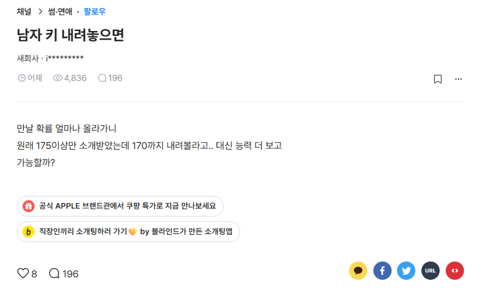

# 우문
**Date:** 21시간 전
**Category:** 다이어리
**Original URL:** https://blog.naver.com/xpfkwh56/224260696847
---

​

1. 기혼 게임이랑

미혼 게임이 **'많이'** 다른데,

​

뭐가 더 높다, 낮다 차원이 아니고

그냥 경험의 폭이나 서로 겪었던

뷰가 달라서 오는 차이에 가까움

​

2. 일전에 댓글로 이런 질문을 받음

​

리아님은 남편 분 연령이 꽤 있는데,

​

연하녀를 잡은 것 보니

능력이 되시는 것 같다

​

자기 스펙 줄줄 말씀 하시면서,

요러면 통상 연하녀들한테 어필이 좀

될 수 있냐고 물어보시길래,

​

나는 **어려울 확률** 이 높다고 답변함

​

3. 스펙이 낮아서?

조건이 애매해서?

​

아님

​

그리 접근하면, 나는 시집 가기 전에도

남자 **골라서 만나서 놀기엔** 차고 넘쳤고,

​

생계도 최소한 내 한 몸 건사하기에는

**조금의 불편도** 없었던 상황이었단 말임

​

4. 아예 영향이 하나도 없었다

라고 말하긴 어렵지만

​

어쨌건 **'좋아하고 보니까'**

이 사람이니 만난 것이지

​

이건 Ok, 저건 Ng 하면서 추리진 않았고

그렇게 추릴 생각이 있는 사람이라고 해도,

​

막상 그 상황 되면 저러기가 쉽지가 않음

​

5. 본문 같은 경우, 여자분이 스스로

가치관 측면에서 175 이상이다 박았고,

​

5cm 타협하는 대신, 능력을 볼까?

라고 규정하는 순간 높은 확률로

그 인연이 **수월하게** 풀릴 가능성 낮음

​

정말 쪼-금만 생각해보면

만날 남한테도 못할 짓이고요

​

나 말고도 쟤를 **좋아할** 사람이 있는데,

마음에도 없는 남자 데려다 만나 뭐함?